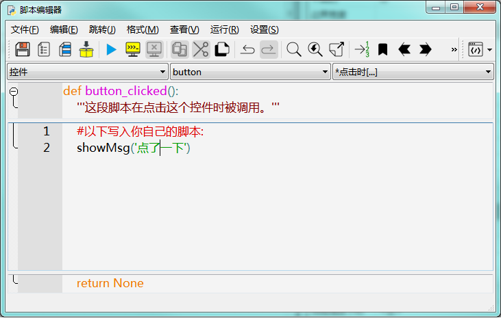

# 表单的公共模块

biForm 中每个表单都有一个“公共模块”脚本。在这里可以定义表单级的函数、类、变量，之后可以在表单的其它脚本中加以使用。

## 表单级的公用函数

比如我们定义一个函数，弹出消息对话框：


在表单的其它地方就可以调用这个函数，比如在控件 button 的 “点击时”脚本中：



## 表单级的公用变量

也可以在“公共模块”中定义公共变量，如下定义一个名为msg的公共变量：


在其它脚本中就可以引用这个变量，注意引用前要用global申明一下，如下例：


## 表单级的类定义

我们也可以表单的“公共模块”中进行类的定义，比如：


在按钮 button 中可以使用这些类：


## 其它

“公共模块”在表单加载时，会直接执行其中的语句，所以也可以在“公共模块”里直接写一些希望在表单加载前就执行的语句。比如比较常用的，连接信号和槽，做一些初始化设置等等，具体要写些什么可以在熟悉表单中脚本的执行模式后，按需要进行脚本的编写。

需要注意的是，“公共模块”中的语句是在运行表单的“加载前”脚本时，就会被调用。我们通过 biForm 中“查看所有脚本”的功能，查看上例中整个表单完整的脚本：

``` python 

# -*- coding: cp936 -*-
import logging
import base64
import codecs, sys
pub = sys.modules.get('__main__').pub
log = sys.modules.get('__main__').log
# ----------------------------------- -----------------------------------
class formclass_newform(object):
	'''表单类：newform 版本：1'''
	record=None
	def __init__(self,formobj):
		self.form = formobj
		self.button = formobj.object('button')
	def vscrollto(self,x):
		return self.form.vscrollto(x)
	def hscrollto(self,x):
		return self.form.hscrollto(x)

# ----------------------------------- -----------------------------------
this = formclass_newform(newform)
# ----------------------------------- -----------------------------------
def form_beforeload():
	'''这段脚本将在加载这个表单之前被调用。返回 True 表示允许加载，否则表单将不会被加载。'''
	result = True
	log.info('#form:Before load')
	#--*<debugtag>*-- 0;form;Before load
	#以下写入你自己的脚本:
	print('加载前')
	return result

# ----------------------------------- -----------------------------------
def button_clicked():
	'''这段脚本在点击这个控件时被调用。'''
	log.info('#button:Clicked')
	#--*<debugtag>*-- 1;button;Clicked
	#以下写入你自己的脚本:
	dog = Dog('旺才')
	dog.greet()
	return None

# ----------------------------------- -----------------------------------
#newform 的公共模块
#用这段脚本定义公用的变量和函数.
log.info('* 开始加载表单：newform')
log.info('newform::Public module')
#--*<debugtag>*-- 0;form;:Public module
#以下写入你自己的脚本:
class Animal(object):
    def __init__(self, name):
        self.name = name
    def greet(self):
        this.form.showSplashMsg('你好，我是 %s.' % self.name)
 
class Dog(Animal):
    def greet(self):
        super().greet()
        this.form.showSplashMsg('旺旺~~~')

```

这个表单在运行时，会先执行这个完整的脚本，其中只是定义了表单的“加载前”函数（def form_beforeload()），但并没有调用它，而表单的“公共模块”中写的脚本，直接就被执行了。上面这段脚本执行完后，表单的运行时引擎才会再调用 form_beforeload 函数去执行“加载前”脚本。所以在写这两处脚本时，需要注意它们之间的先后关系。


