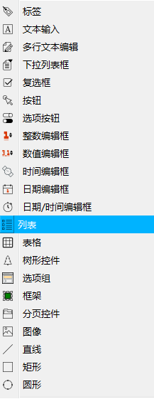

# 第一章 biForm开发基础 - 使用Qt库

biForm 本身是用 Qt 开发的，biForm 使用 Python 做为编程语言，biForm 发布时将 Qt 的一部分基础库一起发布了，开发者可以通过 Python 脚本调用 Qt 库。

biForm 提供了标准控件和界面设计器等开发工具，很多应用的开发，其实并一定需要直接使用 Qt 库。也就是说，即使没有 Qt 开发基础，只需要熟悉  Python 就可以使用 biForm 进行开发。

---

<h2 id="category">目录</h2>

- [biForm 和 Qt 的关系](#biForm_和_Qt_的关系)

- [给不熟悉 Qt 的开发者的建议](#给不熟悉-Qt-的开发者的建议)

- [biForm 中 Python 和 Qt 是什么关系？](#biForm-中-Python-和-Qt-是什么关系？)
 - [1. 如何调用 Qt 库](#_1-如何调用-Qt-库)
 - [2. 数据类型的转换](#_2-数据类型的转换)
 - [3. 创建 Qt 类的实例](#_3-创建-Qt-类的实例)
 - [4. 对象的使用](#_4-对象的使用)

- [信号和槽](#信号和槽)
 - [1. 连接信号和槽](#_1-连接信号和槽)
 - [2. 发出信号](#_2-发出信号)
 - [3. methods 和 slots 都可以当做槽函数一样地使用](#_3-methods-和-slots-都可以当做槽函数一样地使用)

- [biForm 标准控件和 Qt 控件](#biForm-标准控件和-Qt-控件)
- [面向对象：继承和重载](#面向对象：继承和重载)
- [Qt参考资料](#Qt参考资料)

---

## biForm 和 Qt 的关系

[返回目录](#category)

概括地讲，biForm 和 Qt 的关系体现在以下几个方面：

- biForm 是用 Qt 开发的，局部使用了一些 Python 脚本。目前 V3.1 使用的是 Qt5.11.1

- biForm 提供了可视化的界面设计器，用户可以以“所见即所得”的方式设计一个图形化界面。界面设计器上所有控件，都是继承自 QWidget 和 QObject，接口做了些封装，与 Qt 中的基类略有不同

- 用户可以通过脚本直接使用 Qt 库中的类和控件。目前发布的 biForm V3.1 中包含了'QtCore', 'QtGui', 'QtMultimedia', 'QtNetwork', 'QtOpenGL', 'QtSql', 'QtSvg', 'QtUiTools', 'QtXml', 'QtXmlPatterns' ,'Qt namespace','QtWidget' 这些模块

- biForm 开发的应用通过 Python 脚本来调用 Qt 库，也可以通过 Python 的面向对象的语法创建 Qt 类的实例，也可以通过继承 Qt 基类，使用重载和重写实现更复杂的面向对象编程

## 给不熟悉 Qt 的开发者的建议

[返回目录](#category)

很多初次使用 biForm 的开发者会担心不了解 Qt 就无法使用 biForm ，其实完全不用担心这一点。biForm 提供了标准控件和界面设计器等开发工具，对 Qt 库做了很多封装，完全可以不直接使用 Qt 库进行开发。在我们十几年的开发实践中，只有很少的场合会需要直接使用 Qt 库。这当然取决于开发者想要开发什么要的应用，有些应用用 Qt 库实现更容易，但很多功能，用 Python 或 Python 的第三方库也都可以实现，开发者可以按自己对这些库的熟悉程度来进行选择。

我们提供了三种库，供开发者使用：

1. biForm 提供的标准控件、内置对象、公用函数等
2. Python 基础库及Python第三方库
3. Qt 库

即使没有 Qt 开发基础，只需要熟悉 Python 和 biForm 的开发模式，就可以使用 biForm 进行开发。

Qt 库虽然很强大，但一般来讲，用它开发代码量较大，程序结构也会比较复杂，学习和掌握 Qt 各个库的用法，也需要更多的时间，即使是使用与C++相比更简洁更易上手的 Python 来调用，这一点也没有很大改变。所以，尽量选用合适的 Python 库是更快速便捷的开发方案。Qt 库只需要视应用开发的需要，做为备用和进阶开发的方案。

但对于没有 Qt 基础的开发者来说，有一些与 Qt 相关的基础知识是需要事先了解的。因为 biForm 本身是用 Qt 开发的，所以在 biForm 提供的开发接口中会使用到一些 Qt 的基础类，用于传入参数或返回值。这些类的接口还是需要了解一下，以便在程序中更方便地使用它们。

|       类        |          说明           |                                 参考文档                                  |
| --------------- | ---------------------- | ------------------------------------------------------------------------ |
| QVariant        | 可变数据                | [Qt在线文档-QVariant](https://doc.qt.io/qt-5/qvariant.html)               |
| QString         | 字符串                  | [Qt在线文档-QString](https://doc.qt.io/qt-5/qstring.html)                 |
| QIcon           | 图标                    | [Qt在线文档-QIcon](https://doc.qt.io/qt-5/qicon.html)                     |
| QPixmap         | 图像                    | [Qt在线文档-QPixmap](https://doc.qt.io/qt-5/qpixmap.html)                 |
| QChar           | 字符                    | [Qt在线文档-QChar](https://doc.qt.io/qt-5/qchar.html)                     |
| QStringList     | 字符串列表              | [Qt在线文档-QStringList](https://doc.qt.io/qt-5/qstringlist.html)         |
| QVariantList    | 可变数据列表            | [Qt在线文档-QVariantList](https://doc.qt.io/qt-5/qvariantlist.html)       |
| QFont           | 字体                    | [Qt在线文档-QFont](https://doc.qt.io/qt-5/qfont.html)                     |
| QColor          | 颜色                    | [Qt在线文档-QColor](https://doc.qt.io/qt-5/qcolor.html)                   |
| QSize           | 尺寸                    | [Qt在线文档-QSize](https://doc.qt.io/qt-5/qsize.html)                     |
| QRect           | 矩形区域                | [Qt在线文档-QRect](https://doc.qt.io/qt-5/qrect.html)                     |
| QPoint          | 点                     | [Qt在线文档-QPoint](https://doc.qt.io/qt-5/qpoint.html)                   |
| QSizePolicy     | 尺寸调整规则            | [Qt在线文档-QSizePolicy](https://doc.qt.io/qt-5/qsizepolicy.html)         |
| QPalette        | 调色板                  | [Qt在线文档-QPalette](https://doc.qt.io/qt-5/qpalette.html)               |
| QMovie          | 动态图片                | [Qt在线文档-QMovie](https://doc.qt.io/qt-5/qmovie.html)                   |
| QTextCharFormat | 文本字符格式（不常用）   | [Qt在线文档-QTextCharFormat](https://doc.qt.io/qt-5/qtextcharformat.html) |
| QDate           | 日期                    | [Qt在线文档-QDate](https://doc.qt.io/qt-5/qdate.html)                     |
| QTime           | 时间                    | [Qt在线文档-QTime](https://doc.qt.io/qt-5/qtime.html)                     |
| QDateTime       | 日期和时间              | [Qt在线文档-QDateTime](https://doc.qt.io/qt-5/qdatetime.html)             |
| QImage          | 图像（不常用）          | [Qt在线文档-QImage](https://doc.qt.io/qt-5/qimage.html)                   |
| QIODevice       | 输入输出设备(不常用）    | [Qt在线文档-QIODevice](https://doc.qt.io/qt-5/qiodevice.html)             |
| QList<int>      | 列表（整数型）（不常用） | [Qt在线文档-QList](https://doc.qt.io/qt-5/qlist.html)                     |

## biForm 中 Python 和 Qt 是什么关系？

[返回目录](#category)

用 biForm 开发是通过 Python 语句来调用 Qt 库 的，从以下几个方面进行介绍：

### 1. 如何调用 Qt 库

[返回目录](#category)

biForm 将 Qt 库都封装在 PythonQt 模块中供 Python 程序调用。在程序中象导入其它 Python 库一样导入 PythonQt 模块（```import PythonQt```）就可以使用了。

示例：

``` python
>>> import PythonQt
>>> dir(PythonQt)
['BoolResult', 'Debug', 'Qt', 'QtCore', 'QtGui', 'QtMultimedia', 'QtNetwork', 'QtOpenGL', 'QtSql', 'QtSvg', 'QtUiTools', 'QtXml', 'QtXmlPatterns', '__doc__', '__loader__', '__name__', '__package__', '__spec__', 'private']
```

我们可以看到 PythonQt 模块中包含了'Qt', 'QtCore', 'QtGui', 'QtMultimedia', 'QtNetwork', 'QtOpenGL', 'QtSql', 'QtSvg', 'QtUiTools', 'QtXml', 'QtXmlPatterns'这些模块。其中 'PythonQt.Qt' 模块对应 [QtWidget](https://doc.qt.io/qt-5/qtwidgets-index.html) ，'PythonQt.Qt.Qt' 对应 [Qt Namespace](https://doc.qt.io/qt-5/qt.html#AlignmentFlag-enum)。用dir()看看这些模块里都有些什么。

``` python
>>> dir(PythonQt.Qt)
['QAbstractAnimation', 'QAbstractAudioDeviceInfo', 'QAbstractAudioInput', 'QAbstractAudioOutput', 'QAbstractButton', 'QAbstractGraphicsShapeItem', 'QAbstractItemDelegate', 'QAbstractItemModel', 
......
'QCheckBox', 'QChildEvent', 'QClipboard', 'QCloseEvent', 'QCollator', 'QCollatorSortKey', 'QColor', 'QColorDialog', 'QColumnView', 'QComboBox', 'QCommandLineOption', 'QCommandLineParser', 'QOpenGLBuffer', 'QOpenGLContext', 'QOpenGLContextGroup', 'QOpenGLFramebufferObject', 
......
 'Qt', 'QtCriticalMsg', 'QtDebugMsg', 'QtFatalMsg', 'QtSystemMsg', 'QtWarningMsg', 'SIGNAL', 'SLOT', '__doc__', '__loader__', '__name__', '__package__', '__spec__', 'qAbs', 'qBound', 'qCritical', 'qDebug', 'qFatal', 'qFuzzyCompare', 'qMax', 'qMin', 'qRound', 'qRound64', 'qVersion', 'qWarning', 'qrand', 'qsrand']

>>> dir(PythonQt.Qt.Qt)
['AA_AttributeCount', 'AA_CompressHighFrequencyEvents', 'AA_CompressTabletEvents', 'AA_DisableHighDpiScaling', 'AA_DisableShaderDiskCache', 'AA_DisableWindowContextHelpButton', 'AA_DontCheckOpenGLContextThreadAffinity', 'AA_DontCreateNativeWidgetSiblings',
......
'ActiveWindowFocusReason', 'AddToSelection', 'AlignAbsolute', 'AlignBaseline', 'AlignBottom', 'AlignCenter', 'AlignHCenter', 'AlignHorizontal_Mask', 'AlignJustify', 'AlignLeading', 'AlignLeft',
......
]
```

如果我们想创建一个 QLineEdit 控件，并修改它的内容，在biForm里就可以这样写：

``` python
import PythonQt
lineedit=PythonQt.Qt.QLineEdit()
lineedit.text ='Hello,world!'
```

或者
``` python
from PythonQt.Qt import QLineEdit
lineedit=QLineEdit()
lineedit.text ='Hello,world!'
```

### 2. 数据类型的转换

[返回目录](#category)

从上面例子中的```lineedit.text ='Hello,world!'```这句我们可以看到， 'Hello,world!'这是一个 Python 中的 str 常量， lineedit 是一个 QLineEdit 对象，text 是 lineedit 的一个属性。显然这段代码要能执行的话，是需要将 Python 中的常量转换为 C++ 的常量才行。

这就要讲到 Python 和 Qt 的数据类型之间的转换了。

我们知道，Python 中的数据类型肯定和 Qt 支持的数据类型是不同的，如果需要用 Python 语句调用Qt对象和接口，必须要解决数据类型转换的问题，否则无法将 Python 中的数据做为传入参数，也无法用 Python 处理调用 Qt 接口的返回值。这种转换是由 biForm 底层完成的，开发者并不需要知道一切细节，但需要了解转换的规则，以便在调用API时使用合适的数据类型。

下面的表格是它们之间的对应关系。

<table>
	<tr>
		<th>Qt数据类型</th>
		<th>Python数据类型</th>
		<th>说明</th>
	</tr>
	<tr>
		<td>void</td>
		<td>None</td>
		<td>如果一个Qt函数返回 void，在 Python 中对应 None</td>
	</tr>
	<tr>
		<td>QMetaType::Char QMetaType::UChar QMetaType::Short QMetaType::UShort QMetaType::Long QMetaType::ULong QMetaType::Int QMetaType::UInt QMetaType::QChar QMetaType::LongLong QMetaType::ULongLong</td> 
		<td>int</td>
		<td></td>
	</tr>
	<tr>
		<td>QMetaType::Bool</td>
		<td>bool</td>
		<td></td>
	</tr>
	<tr>
		<td>QMetaType::Float QMetaType::Double</td>
		<td>float</td>
		<td></td>
	</tr>
	<tr>
		<td>QMetaType::QVariantHash QMetaType::QVariantMap</td>
		<td>dict</td>
		<td></td>
	</tr>
	<tr>
		<td>QMetaType::QVariantList</td>
		<td>tuple</td>
		<td></td>
	</tr>
	<tr>
		<td>QMetaType::QString</td>
		<td>str</td>
		<td></td>
	</tr>
	<tr>
		<td>QMetaType::QStringList</td>
		<td>tuple</td>
		<td></td>
	</tr>
	<tr>
		<td>QMetaType::QVariant</td>
		<td>None 或 按数据类型进行转换</td>
		<td>如果 isValid() 为 False ，转换为None。isValid() 为 True 时，尝试按判断变量类型进行转换。 </td>
	</tr>
	<tr>
		<td>QMetaType::QObjectStar</td>
		<td>PyObject</td>
		<td>创建一个 Python 对象连接到 Qt 对象，返回这个 Python 对象</td>
	</tr>
	<tr>
		<td>其它类型</td>
		<td>PyObject 或报错</td>
		<td>尝试创建一个 Python 对象连接到 Qt 对象并返回这个 Python 对象，如果是无法识别的类型，报错</td>
	</tr>
</table>

在通过 Python 语句调用 Qt 接口时，返回值将会按这个规则转换为 Python 中对应的数据类型。在需要将 Python 数据做为传入参数调用 Qt 接口时，按接口规定的参数类型尝试对传入的 Python 数据进行转换，如果转换不了会报错。

###  3. 创建 Qt 类的实例

[返回目录](#category)

在 biForm 中要创建一个 Qt 类的实例，有以下几种情况。

QString、QVariant、QList、QHash、QMap、QMultiMap、QPair、QVariantList、QStringList 等，直接用 Python 语句来创建与之相对的对象，并不需要显式地在脚本中申明它们对应的 Qt 类，所以实际上，只需要在 Python 中创建 str、tuple、 dict 等就可以了。在 Qt 接口需要使用这些对象时，biForm 会按照参数类型和转换规则自动进行转换。

比如用```a='text'```，a 其实是一个 Python 的 str 类型的变量。在调用需要以QString为参数的函数或方法时直接使用变量a就可以了，比如```button.setCaption(a)```。在 biForm 中不能以 ```a=QString()``` 这种语法创建一个新的实例。

如果不清楚哪些类型符合这一规则，可以通过 dir(PythonQt.Qt) 查看该类型是否在清单中，如果没有，就是不能做这样创建操作。比如在 dir(PythonQt.Qt)是没有QString这一项的。

其它 Qt 类，比如 QColor、QSize、QPushButton 等，调用构造函数就可以创建新的实例。通过 Python 语句创建后，它们其实都会被转换为 PyObject。但与其它 Python 调用方式不同的是，对这类构造函数的调用，不支持以关键字方式传入参数。

我们用以下的命令试试：

``` Python
>>> from PythonQt import Qt
>>> a=Qt.QColor(10,10,10)
>>> type(a)
<class 'PythonQt.QtGui.QColor'>

>>> dir(a)
['Cmyk', 'HexArgb', 'HexRgb', 'Hsl', 'Hsv', 'Invalid', 'NameFormat', 'Rgb', 'Spec', '__bool__', '__class__', '__delattr__', '__dict__', '__dir__', '__doc__', '__eq__', '__format__', '__ge__', '__getattribute__', '__gt__', '__hash__', '__init__', '__init_subclass__', '__le__', '__lt__', '__module__', '__ne__', '__new__', '__nonzero__', '__reduce__', '__reduce_ex__', '__repr__', '__setattr__', '__sizeof__', '__str__', '__subclasshook__', '__weakref__', 'alpha', 'alphaF', 'black', 'blackF', 'blue', 'blueF', 'className', 'colorNames', 'convertTo', 'cyan', 'cyanF', 'darker', 'delete', 'fromCmyk', 'fromCmykF', 'fromHsl', 'fromHslF', 'fromHsv', 'fromHsvF', 'fromRgb', 'fromRgbF', 'fromRgba', 'fromRgba64', 'getHsl', 'getHslF', 'green', 'greenF', 'help', 'hslHue', 'hslHueF', 'hslSaturation', 'hslSaturationF', 'hsvHue', 'hsvHueF', 'hsvSaturation', 'hsvSaturationF', 'hue', 'hueF', 'inherits', 'isValid', 'isValidColor', 'lighter', 'lightness', 'lightnessF', 'magenta', 'magentaF', 'name', 'readFrom', 'red', 'redF', 'rgb', 'rgba', 'rgba64', 'saturation', 'saturationF', 'setAlpha', 'setAlphaF', 'setBlue', 'setBlueF', 'setCmyk', 'setCmykF', 'setGreen', 'setGreenF', 'setHsl', 'setHslF', 'setHsv', 'setHsvF', 'setNamedColor', 'setRed', 'setRedF', 'setRgb', 'setRgbF', 'setRgba', 'setRgba64', 'spec', 'toCmyk', 'toHsl', 'toHsv', 'toRgb', 'value', 'valueF', 'writeTo', 'yellow', 'yellowF']

>>> b=Qt.QColor(r=10,g=10,b=10)
Traceback (most recent call last):
  File "<string>", line 1, in <module>
ValueError: Called QColor() -> QColor with keyword arguments, but called slot does not support kwargs.
```

可以看到使用```Qt.QColor(10,10,10)```就可以创建一个 QColor 对象实例，但使用```Qt.QColor(r=10,g=10,b=10)```会报错。因为 biForm 中的 Python 接口不支持以关键字方式传入参数来调用Qt接口。

总结一下，我们在使用 biForm 写 Python 语句时，Python 中有的对象类型，直接创建就可以。基于这些对象的各类操作，比如切片操作等，也都直接通过 Python 语法来进行处理就行了，我们其实是用不到 Qt 中 QString/QList 等的接口的，与它们同类型的对象，都使用 Python 提供的功能来处理。只有在需要调用 Qt 独有的类和接口时，才需要导入 PythonQt 模块。调用 PythonQt 模块中的接口时，biForm 底层会自动进行转换处理。

### 4. 对象的使用

[返回目录](#category)

我们用 ```obj=Qt.QLineEdit()``` 创建一个 QLineEdit 控件，用 ```print(obj.help())``` 来看看：

``` python
>>> print(obj.help())
--- QLineEdit ---
Properties:   #------------------- QLineEdit 的属性
objectName (QString )
modal (bool )
windowModality (Qt::WindowModality )
enabled (bool )
geometry (QRect )
frameGeometry (QRect )
normalGeometry (QRect )
x (int )
y (int )
pos (QPoint )
frameSize (QSize )
size (QSize )
width (int )
height (int )
rect (QRect )
childrenRect (QRect )
childrenRegion (QRegion )
sizePolicy (QSizePolicy )
minimumSize (QSize )
maximumSize (QSize )
minimumWidth (int )
minimumHeight (int )
maximumWidth (int )
maximumHeight (int )
sizeIncrement (QSize )
baseSize (QSize )
palette (QPalette )
font (QFont )
cursor (QCursor )
mouseTracking (bool )
tabletTracking (bool )
isActiveWindow (bool )
focusPolicy (Qt::FocusPolicy )
focus (bool )
contextMenuPolicy (Qt::ContextMenuPolicy )
updatesEnabled (bool )
visible (bool )
minimized (bool )
maximized (bool )
fullScreen (bool )
sizeHint (QSize )
minimumSizeHint (QSize )
acceptDrops (bool )
windowTitle (QString )
windowIcon (QIcon )
windowIconText (QString )
windowOpacity (double )
windowModified (bool )
toolTip (QString )
toolTipDuration (int )
statusTip (QString )
whatsThis (QString )
accessibleName (QString )
accessibleDescription (QString )
layoutDirection (Qt::LayoutDirection )
autoFillBackground (bool )
styleSheet (QString )
locale (QLocale )
windowFilePath (QString )
inputMethodHints (Qt::InputMethodHints )
inputMask (QString )
text (QString )
maxLength (int )
frame (bool )
echoMode (EchoMode )
displayText (QString )
cursorPosition (int )
alignment (Qt::Alignment )
modified (bool )
hasSelectedText (bool )
selectedText (QString )
dragEnabled (bool )
readOnly (bool )
undoAvailable (bool )
redoAvailable (bool )
acceptableInput (bool )
placeholderText (QString )
cursorMoveStyle (Qt::CursorMoveStyle )
clearButtonEnabled (bool )

Constructors:    #------------------- QLineEdit 的构造函数
QLineEdit(QWidget parent) -> QLineEdit
QLineEdit(QString arg__1) -> QLineEdit
QLineEdit(QString arg__1, QWidget parent) -> QLineEdit
QLineEdit() -> QLineEdit

Slots:    #------------------- QLineEdit 的方法和槽
QString help()
QString className()
deleteLater() -> void
setEnabled(bool) -> void
setDisabled(bool) -> void
setWindowModified(bool) -> void
setWindowTitle(QString) -> void
setStyleSheet(QString styleSheet) -> void
setFocus() -> void
update() -> void
repaint() -> void
setVisible(bool visible) -> void
setHidden(bool hidden) -> void
show() -> void
hide() -> void
showMinimized() -> void
showMaximized() -> void
showFullScreen() -> void
showNormal() -> void
close() -> bool
raise() -> void
lower() -> void
grab(QRect rectangle) -> QPixmap
grab() -> QPixmap
setText(QString) -> void
clear() -> void
selectAll() -> void
undo() -> void
redo() -> void
cut() -> void
copy() -> void
paste() -> void
inputMethodQuery(Qt::InputMethodQuery property, QVariant argument) -> QVariant

Enums:    #------------------- QLineEdit 的枚举类型
ActionPosition {LeadingPosition, TrailingPosition }
EchoMode {Normal, NoEcho, Password, PasswordEchoOnEdit }

Signals:    #------------------- QLineEdit 的信号
destroyed(QObject*)
destroyed()
objectNameChanged(QString)
windowTitleChanged(QString)
windowIconChanged(QIcon)
windowIconTextChanged(QString)
customContextMenuRequested(QPoint)
textChanged(QString)
textEdited(QString)
cursorPositionChanged(int,int)
returnPressed()
editingFinished()
selectionChanged()
```

我们可以看到 QLineEdit 的接口分成了几大类：属性、函数（槽）、枚举、构造函数、信号。

用 Python 语句调用的方法参考以下表格：

<table>
	<tr>
	<th>操作</th>
	<th>语句</th>
	<th>语句示例</th>
	</tr>
	<tr>
	<td>读属性</td>
	<td>对象.属性名</td>
	<td>obj.text</td>
	</tr>
	<tr>
	<td>写属性</td>
	<td>对象.属性名=值</td>
	<td>obj.text='hello'</td>
	</tr>
	<tr>
	<td>构造函数</td>
	<td>对象=类名(参数)</td>
	<td>obj=QLineEdit('hello')</td>
	</tr>
	<tr>
	<td>方法和槽</td>
	<td>对象.方法或槽(传入参数)</td>
	<td>obj.setEnabled(False)</td>
	</tr>
	<tr>
	<td>枚举类型</td>
	<td>对象.枚举变量</td>
	<td>obj.LeadingPosition</td>
	</tr>
	<tr>
	<tr>
	<td>信号</td>
	<td>对象.信号(参数)</td>
	<td>obj.textChanged('new text')</td>
	</tr>
	<tr>
</table>

需要注意的是：

- 在 help() 中，类的 methods 是和 slots 列在一起的

- 有些基类才有的方法、信号、槽在 help 中是不会列出来，如果需要完整的清单，要用 dir() 函数

- 在 biForm 中 Qt 对象的 methods 和 slots 可以一样当做槽来使用。有关信号和槽的使用，在后面章节会再详细讲解。

## 信号和槽

[返回目录](#category)

用过 Qt 的朋友对 Qt 中的信号和槽一定不会陌生，信号和槽的设计可以说是 Qt 框架中的一大亮点，在 biForm 中自然也继承了这一用法。对这个特性不太熟悉的朋友，可以参考 [Qt 中的信号和槽](https://doc.qt.io/qt-5/signalsandslots.html) 先了解一下。

### 1. 连接信号和槽

[返回目录](#category)

c++ 中我们通常是这样写：

``` c++
QLabel *label = new QLabel;
QScrollBar *scrollBar = new QScrollBar;
QObject::connect(scrollBar, SIGNAL(valueChanged(int)),label,  SLOT(setNum(int)));
```

在 biForm 中用 Python 语句这样写：

``` Python
from PythonQt.Qt import QLabel,QScrollBar
label=QLabel()
scrollBar=QScrollBar()
scrollBar.connect('valueChanged(int)',label,'setNum(int)')
```

需要注意的是connect的参数中，如果是使用 Qt对象的信号和槽，需要以字符串变量的形式传入。

我们还可以将信号连接到一个 Python 函数。比如：

``` Python
def showValue(v):
	log.debug(v)

scrollBar.connect('valueChanged(int)',showValue)
```

这里 showValue 是一个自定义 Python 函数，在 connect 中直接用函数名就可以了，不能用字符串形式，也不需要指定参数的类型。Python 在执行的时候，会自动对参数进行对应。

当然，我们也可以连接信号和信号，写法和上面的连接信号和槽一样。

要注意的是以上的连接语句，如果被重复调用，是会产生重复的连接的，重复的连接会在信号发出后多次调用被连接上的槽函数。可以在 Qt 中搜索关于 Qt::UniqueConnection 的用法来避免重复连接。在 biForm 中，如果要避免连接的话，一般把 connect 写在表单的”公共模块”里，这样随着表单的初始化，它只会被执行一次，不需要使用 Qt::UniqueConnection 也不会发生重复连接的情况。或者在使用 connect 时多加一个参数，比如 ```scrollBar.connect('valueChanged(int)',label,'setNum(int)'),Qt.AutoConnection | Qt.UniqueConnection)```

也可以用 disconnect 断开连接，语法与 connect 一样。

在 Python 中 调用 connect 是有返回值的，如果连接成功会返回 True，否则返回 False。这一点与 C++ 中的用法稍有区别。

以上只是举例说明，在 biForm 中，一共有三种调用 connect 的方式：

- bool connect( const QByteArray& signal, PyObject* callable) 用于连接发送方的信号和某个 Python 函数

- bool connect(const QByteArray& signal, QObject* receiver, const QByteArray& slot,  Qt::ConnectionType type = Qt::AutoConnection) 发送方调用，连接到接收方的槽函数，可指定连接类型

- bool connect(QObject* sender, const QByteArray& signal, const QByteArray& slot,  Qt::ConnectionType type = Qt::AutoConnection) 接收方调用，连接到发送方的信号和自己的槽函数，可指定连接类型

有两种调用 distconnect 的方式：

- bool disconnect(const QByteArray& signal, PyObject* callable = NULL) 发送方调用，断开信号和 Python 函数的连接

- bool disconnect(const QByteArray& signal, QObject* receiver, const QByteArray& slot) 发送方调用，断开信号和某个接收方和其槽函数的连接

### 2. 发出信号

[返回目录](#category)

C++ 中 ``` emit someSignal(args)``` 或 ``` someSignal(args)``` 发出信号。

在 biForm 中，在类定义外用 ```obj.someSignal(args)``` 发出信号，在类定义体内，可以用 ```self.someSignal(args)``` 发出信号。

### 3. methods 和 slots 都可以当做槽函数一样地使用

[返回目录](#category)

在 biForm 中 QObject 子类的 methods 可以和 slots 一样使用。

比如 setToolTip 在用 C++ 时，并不能把它当做槽来使用，如果用 connect 连接 setToolTip 是会报错的，但在 biForm 中可以。

## biForm 标准控件和 Qt 控件

[返回目录](#category)

biForm 有自己专有的一些标准控件，用于设计表单界面。目前可以使用的控件有：

 

这些控件都是继承自 QWidget ，biForm 对它们进行了一些封装，所以和 QWidget 中同类控件，接口会稍有些不同，具体参考更详细的API。

需要注意的是，在 biForm 中目前不支持以调用构造函数的方式用 Python 脚本创建这些控件的新实例，只能在表单设计器上通过拖曳方式添加这一类控件。但可以使用脚本在表单上添加 QtWidgets 中的控件。

## 面向对象：继承和重载

[返回目录](#category)

除了使用 biForm 提供的控件，我们也可以使用 Qt 中其它控件。可以直接使用这些Qt中的类，也可以通过 Python 面向对象的语法定义一个 class 继承这些类。

比如以下这段脚本就是继承了 QWidget ，并通过重写 paintEvent 、timerEvent 、keyPressEvent、mousePressEvent 实现特殊的事件响应算法。

```
from PythonQt import *
from PythonQt.QtGui import *
from PythonQt.QtCore import *

class Squiggly(QWidget):
	def __init__(self, parent=None):
		super(Squiggly, self).__init__(parent)
		font = self.font
		font.setPointSize(font.pointSize() + 20)
		self.setFont(font)
		self.text = "Squiggly"
		self.step = 0;
		self.setWindowTitle("Squiggly")
		self.resize(360, 150)
		self.timer = QBasicTimer()
		self.timer.start(60, self)
		
	def timerEvent(self, event):
		if (event.timerId() == self.timer.timerId()):
			self.step += 1
			self.update()
		else:
			super(Squiggly, self).timerEvent(event)
			
	def paintEvent(self, event):
		sines = (0, 38, 71, 92, 100, 92, 71, 38, 0, -38, -71, -92, -100, -92, -71, -38)
		fm = QFontMetrics(self.font)
		x = (self.width - fm.width(self.text)) / 2
		y = (self.height + fm.ascent() - fm.descent()) / 2
		color = QColor()
		painter = QPainter(self)
		for i in range(len(self.text)):
			index = (self.step + i) % 16
			color.setHsv((15 - index) * 16, 255, 191)
			painter.setPen(color)
			painter.drawText(x, y - ((sines[index] * fm.height()) / 400), self.text[i])
			x += fm.width(self.text[i])
			
	def keyPressEvent(self, event):
		if event.key() in (Qt.Key_Q, Qt.Key_X, Qt.Key_Escape):
			self.close()
		else:
			super(Squiggly, self).keyPressEvent(event)
			
	def mousePressEvent(self, event):
		text= QInputDialog.getText(self, "Squiggly - 设置文本", "文本:",QLineEdit.Normal, self.text)
		if not len(text)==0:
			self.text = text
			self.update()
			afterTextChanged(self.text)
```

可以下载这个 [QWidget继承示例](https://raw.githubusercontent.com/icevivi/staticpages/master/docs/biform_py/qwidget_demo.zip) 查看如何继承和使用 QWidget 。

## Qt参考资料

[返回目录](#category)

关于 Qt 库的使用，请参考：[Qt在线帮助手册：Qt Assistant Manual](https://doc.qt.io/qt-5/qtassistant-index.html)
