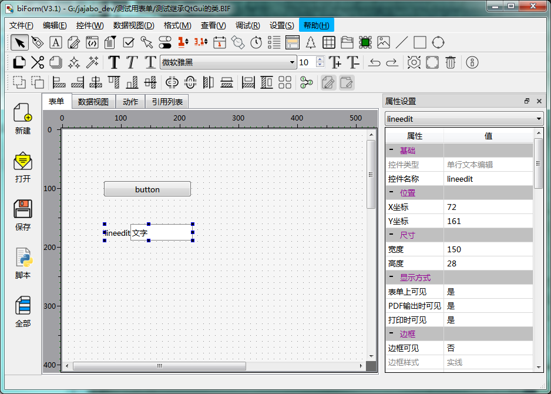
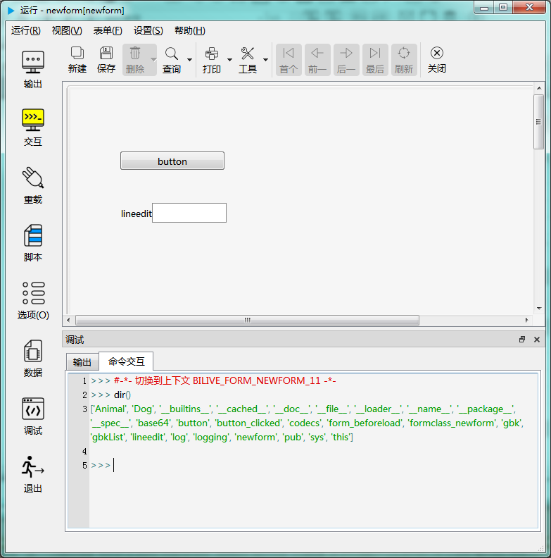
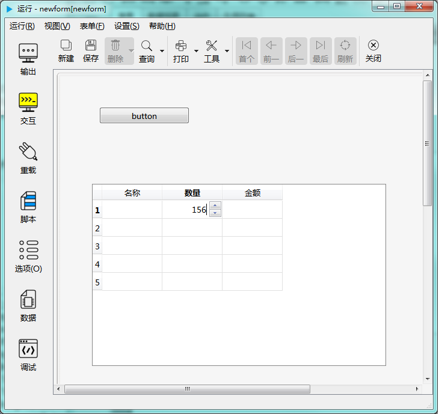
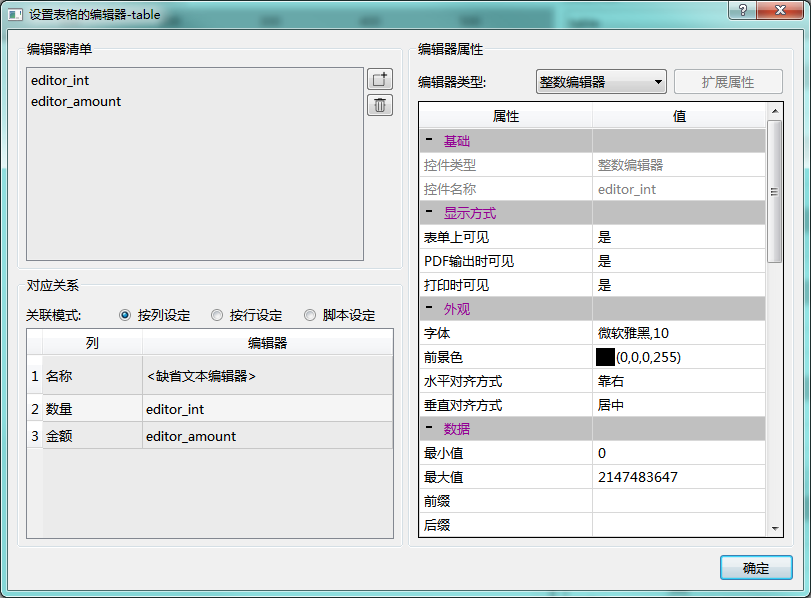

# 第一章 biForm开发基础 - 标准控件

biForm 主要是为图形化应用程序设计的，biForm提供了多种标准控件，通过 Python 脚本可以访问这些控件，并调用它们的属性和方法。

## 表单上的控件

我们在表单上添加两个控件，一个按钮（缺省生成的控件名称是 button），一个单行文本编辑器（缺省生成的控件名称是 lineedit），如下图：



试运行这个表单，在命令交互窗口输入 dir() 查看表单当前模块所有对象、变量和类的定义等。如下图，我们可以得到这样的结果：



``` python 

>>> #-*- 切换到上下文 BILIVE_FORM_NEWFORM_11 -*-
>>> dir()
['Animal', 'Dog', '__builtins__', '__cached__', '__doc__', '__file__', '__loader__', '__name__', '__package__', '__spec__', 'base64', 'button', 'button_clicked', 'codecs', 'form_beforeload', 'formclass_newform', 'lineedit', 'log', 'logging', 'newform', 'pub', 'sys', 'this']

```

?> **BILIVE_FORM_NEWFORM_11** 是当前表单运行时状态下所在的模块名，也即 “__name__” 的值。

dir()返回的结果中有我们之前的例子中定义的类 Animal 和 Dog ，还有我们在表单上添加的两个控件 button 和 lineedit，还有一个对象 this ，我们用下面的命令看一下它的属性和方法有些什么：

``` python 

>>> dir(this)
['__class__', '__delattr__', '__dict__', '__dir__', '__doc__', '__eq__', '__format__', '__ge__', '__getattribute__', '__gt__', '__hash__', '__init__', '__init_subclass__', '__le__', '__lt__', '__module__', '__ne__', '__new__', '__reduce__', '__reduce_ex__', '__repr__', '__setattr__', '__sizeof__', '__str__', '__subclasshook__', '__weakref__', 'button', 'form', 'hscrollto', 'lineedit', 'record', 'vscrollto']

```

看到 this 的属性里也有 button 和 lineedit。我们分别调用一下：

``` python 

>>> button
buttonDelegate (buttonDelegate at: 0x0A3CD838)

>>> this.button
buttonDelegate (buttonDelegate at: 0x0A3CD838)

>>> lineedit
lineEditDelegate (lineEditDelegate at: 0x132C7308)

>>> this.lineedit
lineEditDelegate (lineEditDelegate at: 0x132C7308)

```

可以看到 button 和 this.button 是指向同一个 buttonDelegate 对象。所以这两种方法都可以用来引用表单上的控件对象。我们一般建议使用 this.button，因为在代码调试时，有 this. 开头，很容易一眼看出是对表单上某个控件的引用，可以明显与其它变量名称区别开来，更方便进行调试。

## 另一种控件：表格的编辑器

以上这类控件是将表单做为上级容器的，可以用以上的方法加以引用。还有一类控件只在使用时临时创建，用完即销毁，不能通过这种方法引用，那就是表格中的编辑器，比如下图中修改“数量”时使用的整数编辑器：



我们看一下表格的“设置表格的编辑器”界面：



从上图可以看出，“数量”这一列使用的编辑器名称为“editor_int”，我们如果要调用这个编辑器控件，就使用 ```this.table.editor('editor_int')```。但我们需要注意的是，如果现在这个表格并没有在编辑单元格的状态下，使用这个语句返回的是 None，因为表格的编辑器是在进入单元格的编辑状态时才会临时创建，结束编辑后，就会被删除，所以只在进入编辑状态下后才可以通过这样的调用方式来访问它。比如我们可以在 editor_int 的 “创建编辑器后”使用 ```obj = this.table.editor('editor_int')``` 返回的就不会是None了。它的接口的调用方式和其它类型的控件是一样的。

## 读写控件的属性

我们再看 button 有哪些属性和方法：

``` python 

>>> dir(button)
['__bool__', '__class__', '__delattr__', '__dict__', '__dir__', '__doc__', '__eq__', '__format__', '__ge__', '__getattribute__', '__gt__', '__hash__', '__init__', '__init_subclass__', '__le__', '__lt__', '__module__', '__ne__', '__new__', '__reduce__', '__reduce_ex__', '__repr__', '__setattr__', '__sizeof__', '__str__', '__subclasshook__', '__weakref__', 'acceptDrops', 'blockSignals', 'caption', 'childEvent', 'children', 'className', 'click', 'clicked', 'connect', 'customEvent', 'delete', 'deleteLater', 'destroyed', 'disconnect', 'dragEnabled', 'dumpObjectInfo', 'dumpObjectTree', 'dynamicPropertyNames', 'enabled', 'event', 'eventFilter', 'findChild', 'findChildren', 'focus', 'font', 'foreground', 'geometry', 'grab', 'hAlign', 'height', 'help', 'hide', 'hideBalloon', 'icon', 'iconSize', 'inherits', 'installEventFilter', 'isFlat', 'isNull', 'isSignalConnected', 'isWidgetType', 'isWindowType', 'killAllTimer', 'killTimer', 'lower', 'maxheight', 'maxwidth', 'metaObject', 'minheight', 'minwidth', 'moveToThread', 'objectName', 'objectNameChanged', 'parent', 'pos', 'pressed', 'property', 'quitFullScreen', 'raise', 'rect', 'released', 'reloadWhenCreateNew', 'removeEventFilter', 'repaint', 'sender', 'senderSignalIndex', 'setAcceptDrops', 'setBackground', 'setBorderColor', 'setBorderStyle', 'setBorderWidth', 'setCaption', 'setDisabled', 'setDragEnabled', 'setEnabled', 'setFillStyle', 'setFlat', 'setFocus', 'setFont', 'setForeground', 'setFullScreen', 'setGeometry', 'setHAlign', 'setHeight', 'setIcon', 'setIconSize', 'setMaxHeight', 'setMaxWidth', 'setMinHeight', 'setMinWidth', 'setObjectName', 'setParent', 'setPos', 'setProperty', 'setReloadWhenCreateNew', 'setShortcut', 'setShowBorder', 'setShowInForm', 'setShowInPDF', 'setShowInPrinter', 'setShowType', 'setSize', 'setSizePolicy', 'setStatusTip', 'setStyleSheet', 'setToolTip', 'setUpdatesEnabled', 'setVAlign', 'setVisible', 'setWhatsThis', 'setWidth', 'setX', 'setY', 'show', 'showBalloon', 'showInForm', 'showInPDF', 'showInPrinter', 'showType', 'showValidBalloon', 'signalsBlocked', 'size', 'startSingleShot', 'startTimer', 'statusTip', 'tabOrder', 'tag', 'thread', 'timerEvent', 'timers', 'toBottom', 'toTop', 'toolTip', 'tr', 'updatesEnabled', 'vAlign', 'visible', 'whatsThis', 'width', 'x', 'y']

```

在 Python 中读取属性值是用 button.width ，修改属性的值用 button.width = 100 这种方式。但上面返回的结果我们不太能分辨得清哪些是属性哪些是函数，我们除了参考API文档，也可以使用以下的方法来寻求帮助：

``` python

>>> print(button.help())
--- buttonDelegate ---  #-------------对象类型
Properties:#---------------------------属性
objectName (QString )
showType (int )
tabOrder (int )
visible (bool )
geometry (QRect )
x (int )
y (int )
pos (QPoint )
size (QSize )
width (int )
height (int )
...
iconSize (int )

Slots:        #---------------------------成员函数（槽函数）
QString help()
QString className()
...
setShortcut(int k1) -> void

Signals:     #---------------------------信号
destroyed(QObject*)
setMaxWidth(int v) -> void
setMaxHeight(int v) -> void
setMinWidth(int v) -> void
setMinHeight(int v) -> void
...
released()

```

其中对属性、方法和信号进行了分类显示，这样更容易判断要如何调用它们。

## 调用控件的成员函数（槽函数）

Python 中调用对象的成员函数用 button.setMaxWidth(200) 这种方式。

在 biForm 中对象的成员函数也可以称为槽，这一定义继承自 Qt 。对于初次接触 Qt 和 biForm 的开发者来说，槽（或称槽函数）是一个比较特别的定义。它本质上也是对象的一种成员函数，可以通过连接不同对象的信号与槽轻松地完成一些事件的响应，在 biForm 的开发过程中，经常会用到它。

比如，我们在按 button 这个控件时（只是按下鼠标，并没有完成点击），希望在 lineedit 这个控件中显示当前时间，在放开鼠标时清除刚才显示的时间，我们可以连接 button 的 pressed 信号和一个自定义函数 showTime 显示时间，连接 button 的 released 信号和一个自定义函数 clearTime 清除时间：

``` python 

#这段代码写在表单的“公共模块”里

def showTime(): 
	this.lineedit.text = pub.currentTime()

def clearTime():
	this.lineedit.text = ''

#连接信号和槽
this.button.connect('pressed()',showTime)
this.button.connect('released()',clearTime)

```

## 控件的创建、删除和销毁

biForm界面设计器中可用的标准控件，目前版本（V3.1）不支持使用 Python 脚本创建、删除和销毁。这个原则主要会影响以下几个方面：

- 不支持用 Python 脚本动态创建标准控件，如果需要动态添加控件，可以调用 Qt 接口往表单上添加QWidget及其子类的实例。

- 因为不支持创建，所以也不支持对已有控件进行克隆。

- 虽然控件的接口中有delete函数，但这个只是从QObject继承来的通用的接口。虽然可以调用它，但这个并不能真的删除掉表单上这个控件。这个函数只是删除了 Python 中指向控件的指针，虽然删除这个指针不会造成程序崩溃，但删除之后就不能再恢复，因此会影响程序正常运行，所以不建议开发者调用这类接口。PFF的运行时引擎会自动处理这些对象的销毁和指针的清理，开发者不需要进行额外的处理。但通过 Qt 接口创建的控件，需要注意判断是否要进行销毁处理，如果需要，可以在表单的“关闭前”脚本中进行处理。
