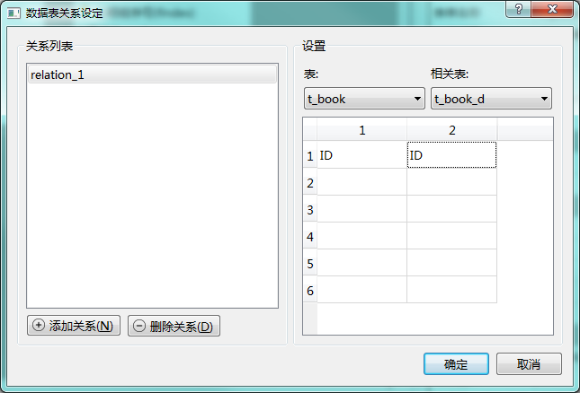

# 表单的可编程函数

biForm 中每个表单都有开放几个可编程函数。用于处理表单加载、运行、关闭等各种事务的处理。

除了“公共模块”没有函数名之外，其它都有对应的函数名。在表单后台的脚本中可以直接通过这些函数名调用这些函数，但一般不建议这样做，这种调用也只会执行函数体中的脚本，并不会影响表单对事件的响应。

## 目录

|    可编程函数    |                              函数名                               |
| --------------- | ---------------------------------------------------------------- |
| 公共模块        | 提供表单级的函数、变量、类定义等<br>参考[表单的公共模块](1-1-public) |
| 加载前          | [form_beforeload](#beforeload)                                    |
| 加载后          | [form_afterload](afterload)                                      |
| 新建空白表单前   | [form_beforecreatenew](beforecreatenew)                          |
| 新建空白表单后   | [form_aftercreatenew](aftercreatenew)                            |
| 保存前          | [form_beforesave](beforesave)                                    |
| 保存后          | [form_aftersave](aftersave)                                      |
| 删除前          | [form_beforedelete](beforedelete)                                |
| 删除后          | [form_afterdelete](afterdelete)                                  |
| 加载数据时       | [form_loaddata](loaddata)                                        |
| 打印前          | [form_before_print](before_print)                                |
| 打印后          | [form_after_print](after_print)                                  |
| 打印参数        | [form_print_args](print_args)                                    |
| 记录别名        | [form_alias](alias)                                              |
| 编号规则        | [form_number](number)                                            |
| 关闭前          | [form_beforeclose](beforeclose)                                  |
| 关闭后          | [form_afterclose](afterclose)                                    |
| 单次定时器超时时 | [form_singleshot](singleshot)                                    |
| 定时器超时时     | [form_timeout](timeout)                                          |
| 全程过滤条件     | [form_filter](filter)                                            |
| 关联记录        | [form_relativerecord](relativerecord)                            |

- ### beforeload

**可编程函数：加载前** 

[返回目录](#目录)

|      内容       |                                   说明                                    |
| --------------- | ------------------------------------------------------------------------- |
| 函数名          | form_beforeload                                                           |
| 传入参数        | 无                                                                        |
| 返回值          | 是否允许表单加载                                                           |
| 建议的返回值类型 | 布尔型                                                                    |
| 使用规则        | 加载这个表单之前被调用。如果返回值为 True 表示允许加载，否则表单将不会被加载。 |
|                 | 在调用这个函数前，表单上控件、数据库等都可以访问。                           |
|                | 缺省的返回值是 True 。 不添加自己的脚本的话，返回值也是 True。               |
|                 | 所有类型的表单都会使用这个可编程函数。                                       |

- ### afterload

**可编程函数：加载后** 

[返回目录](#目录)

|      内容       |                                                说明                                                 |
| --------------- | -------------------------------------------------------------------------------------------------- |
| 函数名          | form_afterload                                                                                     |
| 传入参数        | 无                                                                                                  |
| 返回值          | 加载后转到空白记录状态还是转到查询状态                                                                |
| 建议的返回值类型 | 布尔型                                                                                              |
| 使用规则        | 加载这个表单之后被调用。如果返回值为 True 表示加载后创建一条空白记录，否则表单会转到查询现有记录的状态。  |
|                 | 查询状态时缺省是不带过滤条件查询列出所有记录，但只会缓存显示最前一部分记录，排序规则可以在表单选项中设置。 |
|                | 缺省的返回值是 True 。 不添加自己的脚本的话，返回值也是 True。                                         |
|                 | 所有类型的表单都会使用这个可编程函数。                                                                |

- ### beforecreatenew

**可编程函数：新建空白表单前** 

[返回目录](#目录)

|      内容       |                                                                                                         说明                                                                                                          |
| --------------- | -------------------------------------------------------------------------------------------------------------------------------------------------------------------------------------------------------------------- |
| 函数名          | form_beforecreatenew                                                                                                                                                                                                 |
| 传入参数        | 无                                                                                                                                                                                                                   |
| 返回值          | 是否允许表单创建新的空白记录                                                                                                                                                                                           |
| 建议的返回值类型 | 布尔型                                                                                                                                                                                                                |
| 使用规则        | 在创建新的空白表单前被调用。如果返回值为 True 表示允许创建空白记录，表单上各控件将恢复为缺省值，否则表单将保持现有状态。                                                                                                     |
|                | 缺省的返回值是 True 。 不添加自己的脚本的话，返回值也是 True。                                                                                                                                                           |
|                 | 所有类型的表单都会使用这个可编程函数，即使不是用于数据录入的表单。                                                                                                                                                        |
|                 | 但如果非表单的“允许创建空白表单”设为“否”，则不允许用户点击“新建”按钮，也不能通过 this.form.createNew() 来调用这个函数。|
||但可以直接调用 form_createnew() 这个函数，但这种调用只会执行函数内的脚本，不会影响表单状态和控件的初始值。 |

- ### aftercreatenew

**可编程函数：新建空白表单后** 

[返回目录](#目录)

|      内容       |                                     说明                                     |
| --------------- | ---------------------------------------------------------------------------- |
| 函数名          | form_aftercreatenew                                                          |
| 传入参数        | 无                                                                           |
| 返回值          | 无                                                                           |
| 建议的返回值类型 | 无                                                                           |
| 使用规则        | 创建空白记录后被调用。                                                        |
|                 | 调用 form_beforecreatenew 之后，各个控件会被恢复为缺省值，之后就会调用这个函数。 |

- ### beforesave

**可编程函数：保存前** 

[返回目录](#目录)

|      内容       |                                                      说明                                                      |
| --------------- | -------------------------------------------------------------------------------------------------------------- |
| 函数名          | form_beforesave                                                                                                |
| 传入参数        | 无                                                                                                             |
| 返回值          | 是否允许保存当前表单中录入的数据                                                                                 |
| 建议的返回值类型 | 布尔型                                                                                                         |
| 使用规则        | 点击表单上工具栏中“保存”按钮时被调用。如果允许保存，返回 True，否则返回 False。'                                    |
|                | 缺省的返回值是 True 。 不添加自己的脚本的话，返回值也是 True。                                                     |
|                 | 只有设置了“主表”属性，且“允许保存”为“是”的表单才会使用这个可编程函数。                                              |
|                 | 如果非表单的“允许保存”设为“否”，则不允许用户点击“保存”按钮，也不能通过 this.form.save() 来调用这个函数。             |
|                 | 但可以直接调用 form_beforesave() 这个函数，但这种调用只会执行函数内的脚本，不会执行表单数据引擎内部对数据的保存操作。 |

- ### aftersave

**可编程函数：保存后** 

[返回目录](#目录)

|      内容       |                                                             说明                                                              |
| --------------- | ---------------------------------------------------------------------------------------------------------------------------- |
| 函数名          | form_aftersave                                                                                                               |
| 传入参数        | 无                                                                                                                           |
| 返回值          | 无                                                                                                                           |
| 建议的返回值类型 | 无                                                                                                                           |
| 使用规则        | 只有表单数据保存成功后，才会被调用。                                                                                            |
|                 | 如果非表单的“允许保存”设为“否”，则不允许用户点击“保存”按钮，所以也不会调用这个函数。但程序中可以直接调用 form_aftersave() 这个函数。 |

- ### beforedelete

**可编程函数：删除前** 

[返回目录](#目录)

|      内容       |                                                     说明                                                      |
| --------------- | ------------------------------------------------------------------------------------------------------------ |
| 函数名          | form_beforedelete                                                                                            |
| 传入参数        | 无                                                                                                           |
| 返回值          | 是否允许删除当前表单上显示的这条记录                                                                            |
| 建议的返回值类型 | 布尔型                                                                                                        |
| 使用规则        | 点击表单上工具栏中“删除”按钮时被调用。如果允许删除，返回 True，否则返回 False。'                                  |
|                | 缺省的返回值是 True 。 不添加自己的脚本的话，返回值也是 True。                                                   |
|                 | 只有设置了“主表”属性，且“允许删除”为“是”的表单才会使用这个可编程函数。                                            |
|                 | 如果非表单的“允许删除”设为“否”，则不允许用户点击“删除”按钮，也不能通过 this.form.drop() 来调用这个函数。           |
|                 | 但可以直接调用 form_beforedelete() 这个函数，但这种调用只会执行函数内的脚本，不会执行表单数据引擎对数据的删除操作。 |

- ### afterdelete

**可编程函数：删除后** 

[返回目录](#目录)

|      内容       |                                                           说明                                                            |
| --------------- | ------------------------------------------------------------------------------------------------------------------------- |
| 函数名          | form_afterdelete                                                                                                          |
| 传入参数        | 无                                                                                                                        |
| 返回值          | 无                                                                                                                        |
| 建议的返回值类型 | 无                                                                                                                        |
| 使用规则        | 只有表单当前这条记录删除成功后，才会被调用。                                                                                 |
|                 | 如果非表单的“允许删除”设为“否”，则不允许用户点击“删除”按钮，所以也不会调用这个函数。但可以直接调用 form_afterdelete() 这个函数。 |

- ### loadrecord

**可编程函数：加载数据时** 

[返回目录](#目录)

|      内容       |                                                说明                                                 |
| --------------- | -------------------------------------------------------------------------------------------------- |
| 函数名          | form_loadrecord                                                                                    |
| 传入参数        | 记录的UUID                                                                                          |
| 返回值          | 无                                                                                                  |
| 建议的返回值类型 | 无                                                                                                  |
| 使用规则        | 只有设置了“主表”属性的表单，在从数据库里读取一条主表的记录需要在表单界面显示时才会调用这个函数。          |
|                 | 通常是在使用“查询”功能，列出所有记录，记录定位器转到某条记录时会调用。                                  |
|                 | 在保存一条新添加的记录之后，缺省情况下会重新从数据库里查询出这条新记录，并在表单上显示，也会调用这个函数。 |

在这个函数体内可以通过 this.record 对象，或 record 来访问读取到的主表记录的值。 record 等同于 this.record.data 。this.record 这个对象在表单生存期内会一直存在，在表单显示不同记录时，其属性会按记录的内容进行更新，可以在表单上其它可编程函数中访问。比如本例中的 fauthor_updated 就可以在“保存前”脚本中通过调用它判断现在表单上录入的作者与数据库中原来的“fauthor”这个字段的值是否不同，以判断是否修改过。

假设表单主表为 t_book，还有子表 t_book_d，表结构如下图所示：


两表之间通过字段ID，是一对多的关系，关系设置如下图所示：



```print(dit(this.record))```将返回以下的结果：

```
['ID', 'ID_updated', 'UUID', '__class__', '__delattr__', '__dict__', '__dir__', '__doc__', '__eq__', '__format__', '__ge__', '__getattribute__', '__gt__', '__hash__', '__init__', '__init_subclass__', '__le__', '__lt__', '__module__', '__ne__', '__new__', '__reduce__', '__reduce_ex__', '__repr__', '__setattr__', '__sizeof__', '__str__', '__subclasshook__', '__weakref__', 'data', 'db', 'fISBN', 'fISBN_updated', 'fauthor', 'fauthor_updated', 'fclass', 'fclass_updated', 'fieldList', 'fname', 'fname_updated', 'fyear', 'fyear_updated', 'isEmpty', 'lastUpdated', 'pkName', 'pkValue', 'refresh', 'reset', 'subRecord', 'tableName']
```

|  属性/函数/对象  |                                                                          说明                                                                           |
| --------------- | ------------------------------------------------------------------------------------------------------------------------------------------------------- |
| ID              | 这条记录字段ID的值。在加载某条记录的数据后，这个值会一直保持之前从数据库中读取的记录的值不变，其它字段也是一样。                                                |
| ID_updated      | 这条记录字段ID的值与现在的ID字段“绑定值”返回的值是否相等，如果不等，这个属性值为 True，否则为 False。其它以_updated结尾的属性也是一样的规则。                   |
| fname           | 这条记录字段fname的值                                                                                                                                    |
| fname_updated   | 这条记录字段fname的值与现在的fname字段“绑定值”返回的值是否相等                                                                                              |
| fauthor         | 这条记录字段fauthor的值                                                                                                                                  |
| fauthor_updated | 这条记录字段fauthor的值与现在的fauthor字段“绑定值”返回的值是否相等                                                                                          |
| fclass          | 这条记录字段fclass的值                                                                                                                                   |
| fclass_updated  | 这条记录字段fclass的值与现在的fclass字段“绑定值”返回的值是否相等                                                                                            |
| fyear           | 这条记录字段fyear的值                                                                                                                                    |
| fyear_updated   | 这条记录字段fyear的值与现在的fyear字段“绑定值”返回的值是否相等                                                                                              |
| fISBN           | 这条记录字段fISBN的值                                                                                                                                    |
| fISBN_updated   | 这条记录字段fISBN的值与现在的fISBN字段“绑定值”返回的值是否相等                                                                                              |
| data            | tuple类型的数据，每个元素对应主表 t_book 每个字段的值。                                                                                                    |
|                 | 如: (1, '大河', '佚名', '小说', 2005, 'ISBN:165-699', '{292a97f5-c861-45a7-9c76-f8193162de18}', '2020-10-19 17:02:32')                                   |
|                 | 其中最后两个字段是 biForm 中每个表都会自动添加的字段 UUID 和 lastUpdated                                                                                   |
| db              | 表单的数据库连接对象，调用接口请参考[数据库](1-6-database)                                                                                                 |
| fieldList       | tuple类型的数据，本例中的值就是：('ID', 'fname', 'fauthor', 'fclass', 'fyear', 'fISBN', 'UUID', 'lastUpdated')                                            |
| isEmpty         | 是否是空记录                                                                                                                                             |
| pkName          | 主表的主关键字段的名称，本例就是“ID”                                                                                                                      |
| pkValue         | 用于定位记录的主表的主关键字段的值，注意它并不等于 this.record.ID 的值                                                                                      |
|                 | this.record.ID 是从数据库中查询出来的值，PkValue只是用于定位记录的传入参数                                                                                  |
| refresh         | 重新从数据库中读取这条记录                                                                                                                                |
| reset           | 将各属性值都置为零或空，一般不需要开发者调用，属于内部调用的接口                                                                                             |
| tableName       | 主表的表名，本例就是“t_book”                                                                                                                             |
| subRecord       | 查询返回这个表单的子表与主表关联的记录                                                                                                                     |
|                 | 返回的结果为 list 对象，其中每个元素对应一条记录，每条记录也是一个 list 对象，其中每个元素对应每个字段的值                                                     |
|                 | 比如子表 t_book_d ，与 t_book 是多对一的关系，使用 this.record.subRecord('t_book_d') 返回的结果：                                                          |
|                 | [[1,1,12,'{292a97f5-c861-45a7-9c76-f8193162de18}', '2020-10-19 17:02:32'],<br>[1,2,35,'{292a97f5-c861-45a7-9c76-f8193162de18}', '2020-10-19 17:02:32']] |

- ### before_print

**可编程函数：打印前** 

[返回目录](#目录)

|      内容       |                                                             说明                                                             |
| --------------- | ---------------------------------------------------------------------------------------------------------------------------- |
| 函数名          | form_before_print                                                                                                            |
| 传入参数        | 是否使用其它表单做格式化打印                                                                                                   |
| 返回值          | 是否允许打印                                                                                                                 |
| 建议的返回值类型 | 布尔型                                                                                                                       |
| 使用规则        | 点击表单的“打印”或“打印预览”按钮时被调用。如果返回值为 True 表示允许打印，否则打印过程会被取消。                                   |
|                 | 参数userOtherForm表示是否是在调用其它表单用于格式化打印。 这个参数并不会控制打印过程，只是在格式化打印或预览前将此值传递给这个函数。 |
|                | 缺省的返回值是 True 。 不添加自己的脚本的话，返回值也是 True。                                                                  |
|                 | 所有类型的表单都会使用这个可编程函数。如果表单属性“允许打印”设为“否”，则不会执行。                                                |

- ### after_print

**可编程函数：打印后** 

[返回目录](#目录)

|      内容       |                                     说明                                      |
| --------------- | ---------------------------------------------------------------------------- |
| 函数名          | form_after_print                                                             |
| 传入参数        | 是否使用其它表单做格式化打印                                                   |
| 返回值          | 无                                                                            |
| 建议的返回值类型 | 无                                                                            |
| 使用规则        | 打印或预览后被调用。                                                           |
|                 | 所有类型的表单都会使用这个可编程函数。如果表单属性“允许打印”设为“否”，则不会执行。 |

- ### print_args

**可编程函数：打印参数** 

[返回目录](#目录)

|      内容       |                                               说明                                               |
| --------------- | ------------------------------------------------------------------------------------------------ |
| 函数名          | form_print_args                                                                                  |
| 传入参数        | 无                                                                                               |
| 返回值          | 传递给打印用的表单的数据                                                                           |
| 建议的返回值类型 | 列表，列表中每个元素也是一个有两个元素的列表，分别是关键字和值，比如: [['name','vivian'],['count',1]] |
| 使用规则        | 使用其它表单做格式化打印时被调用。                                                                  |
|                 | 所有类型的表单都会使用这个可编程函数。如果表单属性“允许打印”设为“否”，则不会执行。                     |
|                 | 默认返回空列表，如果不写这部分脚本，也是返回空列表                                                   |

- ### alias

**可编程函数：记录别名** 

[返回目录](#目录)

|      内容       |                                                                说明                                                                 |
| --------------- | ----------------------------------------------------------------------------------------------------------------------------------- |
| 函数名          | form_alias                                                                                                                          |
| 传入参数        | 主表中某条记录的UUID                                                                                                                 |
| 返回值          | 某条记录的别名（用做显示记录时做为标题，比如在收藏夹中）                                                                                |
| 建议的返回值类型 | 字符串型                                                                                                                             |
| 使用规则        | 在需要使用记录别名时被调用（比如在 biReader 的收藏夹中）。                                                                             |
|                 | UUID 不一定是当前显示的记录的 UUID，所以需要尽量不要使用表单上与记录相关的控件的值来生成别名，而应该从数据库中取UUID对应记录来生成别名的内容 |

- ### number

**可编程函数：编号规则** 

[返回目录](#目录)

|      内容       |                                                              说明                                                               |
| --------------- | ------------------------------------------------------------------------------------------------------------------------------ |
| 函数名          | form_number                                                                                                                    |
| 传入参数        | 无                                                                                                                              |
| 返回值          | 给当前表单的记录生成一个编号                                                                                                     |
| 建议的返回值类型 | 字符串类型                                                                                                                      |
| 使用规则        | 在需要重新为表单的记录生成编号时被调用。                                                                                          |
|                 | 与主表的关键字的“绑定值”不同，这个函数会在从外部导入数据或从其它来源接收数据，需要重新生成编号时调用，以避免与本地录入的数据关键字冲突。 |
|                 | 默认返回空字符串。如果不写这部分脚本，或得到的结果是空字符串，数据库引擎会尝试按关键字的字段类型自动生成一个与其它记录不冲突的编号。     |

- ### beforeclose

**可编程函数：关闭前** 

[返回目录](#目录)

|      内容       |                                                              说明                                                               |
| --------------- | ------------------------------------------------------------------------------------------------------------------------------- |
| 函数名          | form_beforeclose                                                                                                                |
| 传入参数        | 无                                                                                                                              |
| 返回值          | 是否允许关闭这个表单                                                                                                             |
| 建议的返回值类型 | 布尔型                                                                                                                          |
| 使用规则        | 关闭这个表单前被调用。                                                                                                            |
|                 | 所有类型的表单都会使用这个可编程函数。如果允许关闭，应返回 True，否则应返回 False。                                                  |
|                 | 默认返回 True ，如果不写这部分脚本，也是返回 True。                                                                                |
|                 | 需要注意，如果一直不允许表单关闭，会影响用户正常使用。                                                                              |
|                 | 但其它PFF的运行时引擎未必会提供强行关闭的功能。所以开发者需要注意慎重使用 False 做为返回值，只在这个函数里处理关闭前需要处理的一些事务。 |

- ### afterclose

**可编程函数：关闭后** 

[返回目录](#目录)

|      内容       |                                          说明                                          |
| --------------- | ------------------------------------------------------------------------------------- |
| 函数名          | form_afterclose                                                                       |
| 传入参数        | 无                                                                                     |
| 返回值          | 元                                                                                     |
| 建议的返回值类型 | 无                                                                                     |
| 使用规则        | 在“关闭前”返回True，即确定可以关闭这个表单之后被调用。                                    |
|                 | 所有类型的表单都会使用这个可编程函数。                                                   |
|                 | 调用时，表单上各个控件及内部的变量等都还未销毁，都还可以访问。                             |
|                 | 执行完这个函数，表单就直接关闭了，中间不会再有什么特殊情况需要用户确认或被撤消操作的可能性。 |

- ### singleshot

**可编程函数：单次定时器超时时** 

[返回目录](#目录)

|      内容       |                                          说明                                          |
| --------------- | -------------------------------------------------------------------------------------- |
| 函数名          | form_singleshot                                                                        |
| 传入参数        | 无                                                                                     |
| 返回值          | 无                                                                                     |
| 建议的返回值类型 | 无                                                                                     |
| 使用规则        | 在表单的单次定时器启动并超时时被调用。                                                    |
|                 | 表单的单次定时器通过 this.form.startSingleShot(100) 启动，传入参数是设置超时事件的毫秒值。 |

- ### timeout

**可编程函数：定时器超时时** 

[返回目录](#目录)

|      内容       |                                                 说明                                                 |
| --------------- | ---------------------------------------------------------------------------------------------------- |
| 函数名          | form_timeout                                                                                         |
| 传入参数        | timerid(定时器的ID值）                                                                               |
| 返回值          | 无                                                                                                   |
| 建议的返回值类型 | 无                                                                                                   |
| 使用规则        | 在表单的定时器发生超时时被调用。                                                                       |
|                 | 一个表单可以定义多个定时器，通过 this.form.startTimer(100) 启动定时器，这个函数的返回值就是定时器的ID值。 |

- ### filter

**可编程函数：全程过滤条件** 

[返回目录](#目录)

|      内容       |                                                                  说明                                                                  |
| --------------- | -------------------------------------------------------------------------------------------------------------------------------------- |
| 函数名          | form_filter                                                                                                                            |
| 传入参数        | 无                                                                                                                                     |
| 返回值          | 针对主表记录的SQL过滤条件，不需要带'where '。                                                                                            |
| 建议的返回值类型 | 字符串。比如 “fname='abc'”这样。                                                                                                        |
| 使用规则        | 通过表单的查询功能对主表的记录集进行过滤时，会自动加上这个过滤条件，与其它用户设置的过滤条件是“和”的关系，即全程有效。                         |
|                 | 只有设置了“主表”的表单都会使用这个可编程函数。比如当前表单只想显示“fdelete=0”的记录，即只显示未作废的记录，可以在这里将返回值设为“fdelete=0”。 |
|                 | 默认返回空字符串，即不使用全程过滤条件。                                                                                                 |
|                 | 如果需要在过滤条件中使用子查询，可以使用主表的别名，主表的别名永远是“t0”。                                                                  |
|                 | 比如返回过滤条件为“t0.fname='abc' and not exists(select 1 from t_other_table t1 where t1.fbookID=t0.ID)”                                |

- ### relativerecord

**可编程函数：关联记录** 

[返回目录](#目录)

|      内容       |                                                                          说明                                                                          |
| --------------- | ------------------------------------------------------------------------------------------------------------------------------------------------------ |
| 函数名          | form_relativerecord                                                                                                                                    |
| 传入参数        | 表名                                                                                                                                                   |
| 返回值          | 对应记录的UUID                                                                                                                                          |
| 建议的返回值类型 | 字符串型                                                                                                                                                |
| 使用规则        | 在跳转到关联表单的对应记录时被调用。                                                                                                                      |
|                 | 只有设置了“主表”的表单会使用这个可编程函数。                                                                                                              |
|                 | 比如主表 t_emp（员工）上 fdept（所属部门）关联的是另一个表 t_dept 中的主关键字段（字段名ID）。                                                              |
|                 | 我们在查看员工记录时，可以通过这个函数返回的 t_dept 中对应记录的UUID，跳转到对部门资料 t_dept 进行编辑的那个表单，并自动定位到当前记录对应的那个部门的记录上去。 |
|                 | 开发者只要编写这个函数的脚本就行了，跳转的运作会由运行时引擎自动进行处理。                                                                                  |

