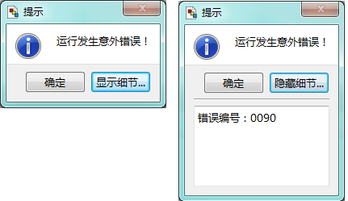
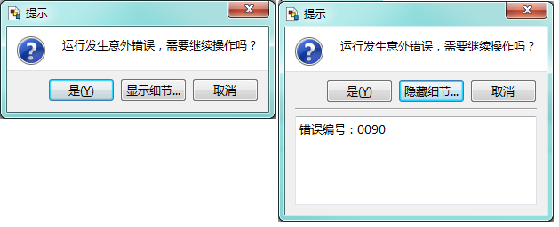
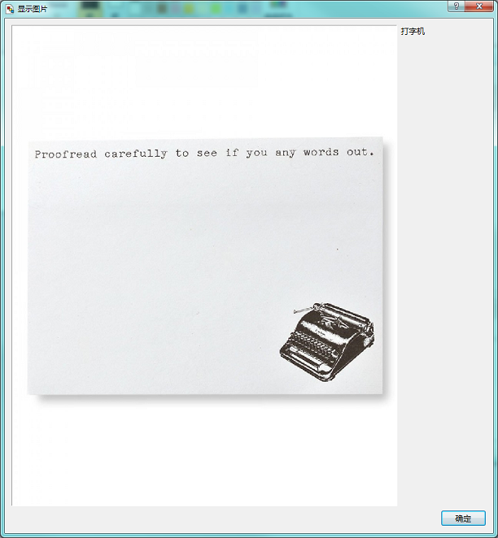
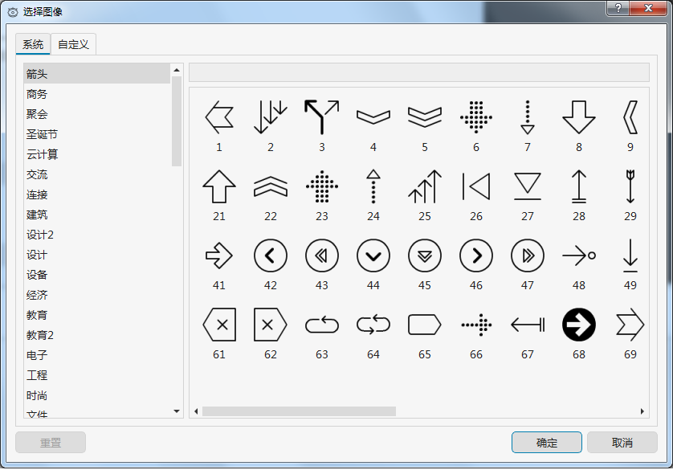
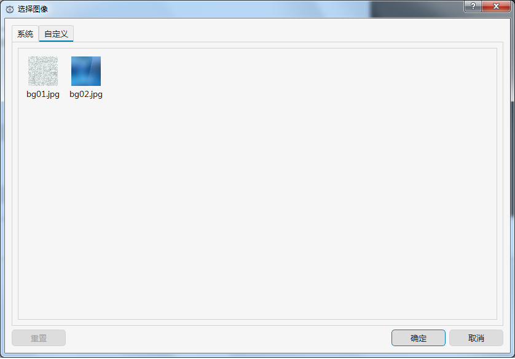

# 第一章 biForm开发基础 - pub对象

pub对象是 biForm/biReader 内置的一个特殊的对象，提供一些常用的常量和函数以方便程序调用。这个对象是在整个应用程序中全程唯一且全程有效。

---

<h2 id="category">目录</h2>

- [枚举类型](#枚举类型)
- [属性（常量）](#属性)
 - [常用颜色](#属性：常用颜色)
 - [标准按钮](#属性：标准按钮)
 - [条码类型](#属性：条码类型)
- [成员函数](#成员函数)
 - [系统选项类](#成员函数：系统选项类)
 - [日期时间类](#成员函数：日期时间类)
 - [对话框类](#成员函数：对话框类)
 - [颜色、图像类](#成员函数：颜色、图像类)
 - [表单相关](#成员函数：表单相关)
 - [应用程序](#成员函数：应用程序)
 - [登录账号](#成员函数：登录账号)
 - [控件相关](#成员函数：控件相关)
 - [其它](#成员函数：其它)
- [信号](#信号)

---
## 枚举类型

[返回目录](#category)

### 尺寸适应规则(SizePolicy)

等同于 QSizePolicy::Policy，放在pub类中方便调用。

|     枚举变量      |                       说明                        |
| ---------------- | ------------------------------------------------ |
| FIXEDSIZE        | 尺寸适应规则：固定                                 |
| MINIMUM          | 尺寸适应规则：不能小于缺省尺寸                     |
| MAXIMUM          | 尺寸适应规则：不能大于缺省尺寸                     |
| PREFERRED        | 尺寸适应规则：缺省尺寸是最佳效果                    |
| EXPANDING        | 尺寸适应规则：尽可能扩展                           |
| MINIMUMEXPANDING | 尺寸适应规则：缺省尺寸是最小值，在此基础上尽可能扩展 |
| IGNORED          | 尺寸适应规则：缺省尺寸将被忽略，尽可能扩展          |

### 校验器校验结果(ValidateState)

等同于 QValidator::State ，放在pub对象中方便调用。

|   枚举变量    |            说明            |
| ------------ | -------------------------- |
| INVALID      | 校验结果：不合法            |
| INTERMEDIATE | 校验结果：超出范围或格式有误 |
| ACCEPTABLE   | 校验结果：可接受的合法的输入 |

### 表单状态(FormState)

|        枚举变量         |           说明           |
| ---------------------- | ------------------------ |
| ERRSTATE               | 表单状态：错误            |
| UNSAVED_BLANK_NEW_FORM | 表单状态：未保存的空白表单 |
| SAVED_FORM             | 表单状态：保存的表单       |
| QUERY_RESULT           | 表单状态：查询结果        |

### 背景填充类型(FillStyles)

| 枚举变量 | 说明 |
| ------- | ---- |
| TRANSPARENT_BACKGROUND           | 背景填充类型：透明背景              |
| FILLED_BACKGROUND                | 背景填充类型：填充                  |

### 标题位置(CaptionPosition)

|             枚举变量              |              说明               |
| -------------------------------- | ------------------------------- |
| ATLEFT                           | 标题位置：左侧                   |
| ATRIGHT                          | 标题位置：右侧                   |
| ATTOP                            | 标题位置：上方                   |
| ATBOTTOM                         | 标题位置：下方                   |
| NOCAPTION                        | 标题位置：无标题                 |

### 输入框边框类型(BorderStyle)

|             枚举变量              |              说明               |
| -------------------------------- | ------------------------------- |
| RECTANGLE                        | 输入框边框类型：矩形边框         |
| NOFRAME                          | 输入框边框类型：没有边框         |
| UNDERLINE                        | 输入框边框类型：下划线           |

### 对齐方式(AlignmentFlag)

|   枚举变量    |         说明          |
| ------------ | -------------------- |
| ALIGNLEFT    | 水平对齐方式：靠左     |
| ALIGNRIGHT   | 水平对齐方式：靠右     |
| ALIGNHCENTER | 水平对齐方式：居中     |
| ALIGNJUSTIFY | 水平对齐方式：分散对齐 |
| ALIGNTOP     | 垂直对齐方式：靠上     |
| ALIGNBOTTOM  | 垂直对齐方式：靠下     |
| ALIGNVCENTER | 垂直对齐方式：居中     |

### 边框阴影样式(FrameShadow)

同于 QFrame::Shadow，放在pub对象中方便调用。

| 枚举变量 |     说明      |
| ------- | ------------- |
| PLAIN   | 边框样式：平的 |
| RAISED  | 边框样式：上凸 |
| SUNKEN  | 边框样式：下陷 |

### 方向(Orientation)

|             枚举变量              |              说明               |
| -------------------------------- | ------------------------------- |
| HORIZONTAL                       | 直线方向：水平                   |
| VERTICAL                         | 直线方向：垂直                   |

### 线型(PenStyle)

|             枚举变量              |              说明               |
| -------------------------------- | ------------------------------- |
| NOPEN                            | 线型：无                        |
| SOLIDLINE                        | 线型：实线                      |
| DASHLINE                         | 线型：破折线                     |
| DOTLINE                          | 线型：点划线                     |
| DASHDOTLINE                      | 线型：破折-点线                  |
| DASHDOTDOTLINE                   | 线型：破折-点-点线               |

### 列宽模式/行高模式(HeaderResizeMode)

|     枚举变量      |              说明               |
| ---------------- | ------------------------------- |
| INTERACTIVE      | 列宽模式/行高模式：用户可调       |
| FIXED            | 列宽模式/行高模式：固定大小       |
| STRETCH          | 列宽模式/行高模式：内容自动拉伸   |
| RESIZETOCONTENTS | 列宽模式/行高模式：按内容调整大小 |

### 换行模式(WrapMode)

同于 QTextOption::WrapMode，放在pub对象中方便调用。

|             枚举变量              |            说明            |
| -------------------------------- | -------------------------- |
| NOWRAP                           | 换行模式：不换行            |
| WORD_WRAP                        | 换行模式：换单词换行        |
| MANUAL_WRAP                      | 换行模式：手动换行          |
| WRAP_ANYWHERE                    | 换行模式：随时换行          |
| WRAP_ATWORD_BOUNDARY_OR_ANYWHERE | 换行模式：单词边界或随时换行 |

### 背景图片填充方式(BackgroundImageFillType)

|       枚举变量        |                说明                |
| -------------------- | --------------------------------- |
| TEXTURE_BACKGROUND   | 背景图片填充方式：连续填充          |
| LEFTTOP_CORNER       | 背景图片填充方式：左上角            |
| RIGHTTOP_CORNER      | 背景图片填充方式：右上角            |
| LEFTBOTTOM_CORNER    | 背景图片填充方式：左下角            |
| RIGHTBOTTOM_CORNER   | 背景图片填充方式：右下角            |
| IMAGE_CENTER         | 背景图片填充方式：居中              |

### 图片填充类型(FillStyles)

| 枚举变量 | 说明 |
| ------- | ---- |
| NOT_SCALED           | 图片填充类型：保持原样              |
| SCALED_CONTENTS      | 图片填充类型：缩放图片              |
| TEXTURE_IMAGE        | 图片填充类型：连续填充              |

### 表格选择区域模式(SelectionMode)

等同于QAbstractItemView::SelectionMode，放在pub对象中方便调用。

| 枚举变量 | 说明 |
| ------- | ---- |
| SINGLE_SELECTION     | 表格选择区域模式：只允许选择一个对象 |
| CONTIGUOUS_SELECTION | 表格选择区域模式：选择连续区域       |
| EXTENDED_SELECTION   | 表格选择区域模式：扩展选择          |
| MULTI_SELECTION      | 表格选择区域模式：允许选择多个对象   |
| NO_SELECTION         | 表格选择区域模式：不允许选择        |

### 表格行列选择模式(SelectionBehavior)

等同于QAbstractItemView::SelectionBehavior，放在pub对象中方便调用。

|    枚举变量     |            说明            |
| -------------- | -------------------------- |
| SELECT_ITEMS   | 表格行列选择模式：选择单元格 |
| SELECT_ROWS    | 表格行列选择模式：选择行     |
| SELECT_COLUMNS | 表格行列选择模式：选择列     |

### 滚动条显示模式(ScrollBarPolicy)

等同于 Qt::ScrollBarPolicy ，放在pub对象中方便调用。

|       枚举变量        |           说明           |
| -------------------- | ------------------------ |
| SCROLLBAR_AS_NEEDED  | 滚动条显示模式：需要时显示 |
| SCROLLBAR_ALWAYS_OFF | 滚动条显示模式：一直隐藏   |
| SCROLLBAR_ALWAYS_ON  | 滚动条显示模式：一直显示   |

### 勾选状态(CheckState)

等同于 Qt::CheckState，放在pub对象中方便调用。

|     枚举变量      |       说明        |
| ---------------- | ----------------- |
| UNCHECKED        | 勾选状态：未选中   |
| PARTIALLYCHECKED | 勾选状态：部分选中 |
| CHECKED          | 勾选状态：选中     |

### QRCode纠错级别(BarcodeECLevel)

条码控件使用。用于设置 qrcode 的纠错级别。

|     枚举变量     |             说明             |
| --------------- | ---------------------------- |
| ECLEVEL_LOW     | QRCode纠错级别：低(7%)        |
| ECLEVEL_MEDIUM  | QRCode纠错级别：中(15%)       |
| ECLEVEL_QUARTIL | QRCode纠错级别：四分之一(25%) |
| ECLEVEL_HIGH    | QRCode纠错级别：高(30%)       |

### DATAMATRIX数据模式(BarcodeDataMode)

条码控件使用。用于设置 datamatrix 的数据模式。

|     枚举变量      |              说明              |
| ---------------- | ------------------------------ |
| DATA_MODE_ALNUM  | DATAMATRIX数据模式：全字母      |
| DATA_MODE_DIGITS | DATAMATRIX数据模式：数字        |
| DATA_MODE_8BITS  | DATAMATRIX数据模式：8bits       |

### DATAMATRIX行列数(BarcodeDataMatrixSize)

条码控件使用。用于设置 datamatrix 的行列数。

|    枚举变量    |              说明              |
| ------------- | ------------------------------ |
| DM_AUTOSIZE   | DATAMATRIX行列数：自动计算尺寸   |
| DM_SIZE_10    | DATAMATRIX行列数：10行 * 10列   |
| DM_SIZE_12    | DATAMATRIX行列数：12行 * 12列   |
| DM_SIZE_14    | DATAMATRIX行列数：14行 * 14列   |
| DM_SIZE_16    | DATAMATRIX行列数：16行 * 16列   |
| DM_SIZE_18    | DATAMATRIX行列数：18行 * 18列   |
| DM_SIZE_20    | DATAMATRIX行列数：20行 * 20列   |
| DM_SIZE_22    | DATAMATRIX行列数：22行 * 22列   |
| DM_SIZE_24    | DATAMATRIX行列数：24行 * 24列   |
| DM_SIZE_26    | DATAMATRIX行列数：26行 * 26列   |
| DM_SIZE_32    | DATAMATRIX行列数：32行 * 32列   |
| DM_SIZE_36    | DATAMATRIX行列数：36行 * 36列   |
| DM_SIZE_40    | DATAMATRIX行列数：40行 * 40列   |
| DM_SIZE_44    | DATAMATRIX行列数：44行 * 44列   |
| DM_SIZE_48    | DATAMATRIX行列数：48行 * 48列   |
| DM_SIZE_52    | DATAMATRIX行列数：52行 * 52列   |
| DM_SIZE_64    | DATAMATRIX行列数：64行 * 64列   |
| DM_SIZE_72    | DATAMATRIX行列数：72行 * 72列   |
| DM_SIZE_80    | DATAMATRIX行列数：80行 * 80列   |
| DM_SIZE_88    | DATAMATRIX行列数：88行 * 88列   |
| DM_SIZE_96    | DATAMATRIX行列数：96行 * 96列   |
| DM_SIZE_104   | DATAMATRIX行列数：104行 * 104列 |
| DM_SIZE_120   | DATAMATRIX行列数：120行 * 120列 |
| DM_SIZE_132   | DATAMATRIX行列数：132行 * 132列 |
| DM_SIZE_144   | DATAMATRIX行列数：144行 * 144列 |
| DM_SIZE_8_18  | DATAMATRIX行列数：8行 * 18列    |
| DM_SIZE_8_32  | DATAMATRIX行列数：8行 * 32列    |
| DM_SIZE_12_26 | DATAMATRIX行列数：12行 * 26列   |
| DM_SIZE_12_36 | DATAMATRIX行列数：12行 * 36列   |
| DM_SIZE_16_36 | DATAMATRIX行列数：16行 * 36列   |
| DM_SIZE_16_48 | DATAMATRIX行列数：16行 * 48列   |

### CODE128字符集(BarcodeCharSet128)

条码控件使用，用于设置 code128 的字符集。

|   枚举变量    |         说明          |
| ------------ | --------------------- |
| CHARSET_AUTO | CODE128字符集：自动    |
| CHARSET_A    | CODE128字符集：字符集A |
| CHARSET_B    | CODE128字符集：字符集B |
| CHARSET_C    | CODE128字符集：字符集C |

## 属性

[返回目录](#category)

pub的属性除 objectName 之外，其实都是一些常量，通常用在一些标准控件和内置对象的接口中。使用 ```pub.GREEN``` 这样的方式就可以调用。

### 属性：常用颜色

|    属性     | 值类型  | 读写类型  |   说明   |
| ----------- | ------- | -------- | ------- |
| objectName  | QString | 可读 可写 | 对象名称 |
| GREEN       | QColor  | 可读      | 绿色     |
| RED         | QColor  | 可读      | 红色     |
| BLUE        | QColor  | 可读      | 蓝色     |
| WHITE       | QColor  | 可读      | 白色     |
| BLACK       | QColor  | 可读      | 黑色     |
| DARKRED     | QColor  | 可读      | 深红     |
| DARKGREEN   | QColor  | 可读      | 深绿     |
| DARKBLUE    | QColor  | 可读      | 深蓝     |
| CYAN        | QColor  | 可读      | 青色     |
| DARKCYAN    | QColor  | 可读      | 深青色   |
| MAGENTA     | QColor  | 可读      | 品红     |
| DARKMAGENTA | QColor  | 可读      | 深品红   |
| YELLOW      | QColor  | 可读      | 黄色     |
| DARKYELLOW  | QColor  | 可读      | 深黄色   |
| GRAY        | QColor  | 可读      | 灰色     |
| DARKGRAY    | QColor  | 可读      | 深灰色   |
| LIGHTGRAY   | QColor  | 可读      | 浅灰色   |
|             |         |          |         |

### 属性：标准按钮

这些属性返回的是标准按钮上显示的文字。

|          属性          | 值类型  | 读写类型 |             说明             |
| ---------------------- | ------- | -------- | --------------------------- |
| OK_BUTTON              | QString | 可读     | 标准按钮：确定               |
| OPEN_BUTTON            | QString | 可读     | 标准按钮：打开               |
| SAVE_BUTTON            | QString | 可读     | 标准按钮：保存               |
| CANCEL_BUTTON          | QString | 可读     | 标准按钮：取消               |
| CLOSE_BUTTON           | QString | 可读     | 标准按钮：关闭               |
| DISCARD_BUTTON         | QString | 可读     | 标准按钮：撤消               |
| APPLY_BUTTON           | QString | 可读     | 标准按钮：应用               |
| RESET_BUTTON           | QString | 可读     | 标准按钮：重置               |
| RESTOREDEFAULTS_BUTTON | QString | 可读     | 标准按钮：恢复缺省值          |
| HELP_BUTTON            | QString | 可读     | 标准按钮：帮助               |
| SAVEALL_BUTTON         | QString | 可读     | 标准按钮：保存所有            |
| YES_BUTTON             | QString | 可读     | 标准按钮：是                 |
| YESTOALL_BUTTON        | QString | 可读     | 标准按钮：全部是             |
| NO_BUTTON              | QString | 可读     | 标准按钮：否                 |
| NOTOALL_BUTTON         | QString | 可读     | 标准按钮：全部否             |
| ABORT_BUTTON           | QString | 可读     | 标准按钮：退出               |
| RETRY_BUTTON           | QString | 可读     | 标准按钮：重试               |
| IGNORE_BUTTON          | QString | 可读     | 标准按钮：忽略               |
| NOBUTTON               | QString | 可读     | 标准按钮：无按钮             |

### 属性：条码类型

这些属性返回的内容与属性名是一样的，对应系统支持的不同的条码类型。
有些版本的 biForm 不允许使用条码控件。

|     属性      | 值类型  | 读写类型 |             说明             |
| ------------- | ------- | -------- | --------------------------- |
| BC_CODE_39    | QString | 可读     | 条码类型：CODE 39            |
| BC_CODE_128   | QString | 可读     | 条码类型：CODE 128           |
| BC_CODE_2of5  | QString | 可读     | 条码类型：Interleaved 2 of 5 |
| BC_CODABAR    | QString | 可读     | 条码类型：CODABAR            |
| BC_CODE_EAN13 | QString | 可读     | 条码类型：EAN13              |
| BC_QRCODE     | QString | 可读     | 条码类型：QRCODE             |
| BC_DATAMATRIX | QString | 可读     | 条码类型：DATAMATRIX         |
| BC_PDF417     | QString | 可读     | 条码类型：PDF417             |
| BC_CODE_93    | QString | 可读     | 条码类型：CODE 93            |

---

## 成员函数

pub 中的函数分为几大类：

|                 分类                  |
| ------------------------------------- |
| [系统选项类](#成员函数：系统选项类)     |
| [日期时间类](#成员函数：日期时间类)     |
| [对话框类](#成员函数：对话框类)        |
| [颜色、图像类](#成员函数：颜色、图像类) |
| [表单相关](#成员函数：表单相关)        |
| [应用程序](#成员函数：应用程序)        |
| [登录账号](#成员函数：登录账号)        |
| [控件相关](#成员函数：控件相关)        |
| [其它](#成员函数：其它)                |

### 成员函数：系统选项类

[返回目录](#category)

系统选项类的成员函数，用于读写系统表 BLV_SYSOPT 的内容。这些选项并不是必须的，开发者可以按需要自己决定是否需要使用这些接口保存一些系统级的选项。

#### getSystemOption

调用接口：QVariant getSystemOption(const QString& uuid, const QString& optionName	, const QVariant& defValue =QVariant()) const

获取系统选项的值。

|   内容   |    名称    | 数据类型 |                    说明                     |
| ------- | ---------- | -------- | ------------------------------------------ |
| 传入参数 | uuid       | QString  | 选项的UUID                                  |
| 传入参数 | optionName | QString  | 选项的名称                                  |
| 传入参数 | defValue   | QVariant | 缺省值，在未获取到已有的值时，会返回这个缺省值 |
| 返回值   |            | QVariant | 获取到的系统选项的值                         |

#### existSystemOption

调用接口：bool existSystemOption(const QString& uuid, const QString& optionName) const

是否存在某个系统选项。

|   内容   |    名称    | 数据类型 |      说明       |
| ------- | ---------- | -------- | --------------- |
| 传入参数 | uuid       | QString  | 选项UUID        |
| 传入参数 | optionName | QString  | 选项的名称       |
| 返回值   |            | bool    | 是否存在这个选项 |

#### registerSystemOption

调用接口：bool registerSystemOption(const QString& uuid, const QString& optionName, const QString& optionValue, const QString& optionType, const QString& optionRemark) const

注册新的系统选项。

|   内容   |     名称     | 数据类型 |    说明     |
| ------- | ------------ | -------- | ----------- |
| 传入参数 | uuid         | QString  | 选项的UUID   |
| 传入参数 | optionName   | QString  | 选项的名称   |
| 传入参数 | optionValue  | QString  | 选项的值     |
| 传入参数 | optionType   | QString  | 选项类型     |
| 传入参数 | optionRemark | QString  | 选项的说明   |
| 返回值   |              | bool    | 注册是否成功 |

#### updateSystemOption

调用接口：bool updateSystemOption(const QString& uuid, const QString& optionName, const QString& optionValue) const

修改系统选项的值。

|   内容   |    名称     | 数据类型 |    说明     |
| ------- | ----------- | -------- | ----------- |
| 传入参数 | uuid        | QString  | 选项的UUID   |
| 传入参数 | optionName  | QString  | 选项名       |
| 传入参数 | optionValue | QString  | 选项值       |
| 返回值   |             | bool    | 是否修改成功 |

### 成员函数：日期时间类

[返回目录](#category)

#### year

调用接口：int year(const QString &date,const QString & format = "yyyy-MM-dd") const

返回日期值对应的年份。

|   内容   |  名称  | 数据类型 |   说明   |
| ------- | ------ | -------- | ------- |
| 传入参数 | date   | QString  | 日期值   |
| 传入参数 | format | QString  | 日期格式 |
| 返回值   |        | int     | 年份     |

#### month 

调用接口：int month(const QString &date,const QString & format = "yyyy-MM-dd") const

返回日期值的月份。

|   内容   |  名称  | 数据类型 |   说明   |
| ------- | ------ | -------- | ------- |
| 传入参数 | date   | QString  | 日期值   |
| 传入参数 | format | QString  | 日期格式 |
| 返回值   |        | int     | 月份     |

#### day

调用接口：int day(const QString &date,const QString & format = "yyyy-MM-dd") const

返回日期值的日期。

|   内容   |  名称  | 数据类型 |   说明   |
| ------- | ------ | -------- | ------- |
| 传入参数 | date   | QString  | 日期值   |
| 传入参数 | format | QString  | 日期格式 |
| 返回值   |        | int     | 日期     |

#### hour

调用接口：int hour(const QString &time,const QString & format = "HH:mm:ss") const

返回时间值的小时值。

|   内容   |  名称  | 数据类型 |   说明   |
| ------- | ------ | -------- | ------- |
| 传入参数 | time   | QString  | 时间值   |
| 传入参数 | format | QString  | 时间格式 |
| 返回值   |        | int     | 小时     |

#### minute

调用接口：int minute(const QString &time,const QString & format = "HH:mm:ss") const

返回时间值的分钟值。

|   内容   |  名称  | 数据类型 |   说明   |
| ------- | ------ | -------- | ------- |
| 传入参数 | time   | QString  | 时间值   |
| 传入参数 | format | QString  | 时间格式 |
| 返回值   |        | int     | 分钟     |

#### second

调用接口：int second(const QString &time,const QString & format = "HH:mm:ss") const

返回时间值的秒值。

|   内容   |  名称  | 数据类型 |   说明   |
| ------- | ------ | -------- | ------- |
| 传入参数 | time   | QString  | 时间值   |
| 传入参数 | format | QString  | 时间格式 |
| 返回值   |        | int     | 秒       |

#### dayOfWeek 

调用接口：int dayOfWeek (const QString &date,const QString & format = "yyyy-MM-dd") const

返回日期值是周几。

|   内容   |  名称  | 数据类型 |   说明   |
| ------- | ------ | -------- | ------- |
| 传入参数 | date   | QString  | 日期值   |
| 传入参数 | format | QString  | 日期格式 |
| 返回值   |        | int     | 周几     |

#### dayOfYear 

调用接口：int dayOfYear (const QString &date,const QString & format = "yyyy-MM-dd") const

返回日期值在本年中是第几天。

|   内容   |  名称  | 数据类型 |     说明      |
| ------- | ------ | -------- | ------------- |
| 传入参数 | date   | QString  | 日期值        |
| 传入参数 | format | QString  | 日期格式       |
| 返回值   |        | int     | 一年中是第几天 |

#### daysInMonth 

调用接口：int daysInMonth (const QString &date,const QString & format = "yyyy-MM-dd") const

返回日期值当月共有几天。

|   内容   |  名称  | 数据类型 |   说明   |
| ------- | ------ | -------- | ------- |
| 传入参数 | date   | QString  | 日期值   |
| 传入参数 | format | QString  | 日期格式 |
| 返回值   |        | int     | 天数     |

#### daysInYear 

调用接口：int daysInYear (const QString &date,const QString & format = "yyyy-MM-dd") const 

返回日期值当年共有几天。

|   内容   |  名称  | 数据类型 |   说明   |
| ------- | ------ | -------- | ------- |
| 传入参数 | date   | QString  | 日期值   |
| 传入参数 | format | QString  | 日期格式 |
| 返回值   |        | int     | 天数     |

#### daysTo 

调用接口：int daysTo ( const QString &date1,const QString & date2, const QString & format = "yyyy-MM-dd") const

两个日期值之间相隔的天数。

|   内容   |  名称  | 数据类型 |   说明   |
| ------- | ------ | -------- | ------- |
| 传入参数 | date1  | QString  | 日期值   |
| 传入参数 | date2  | QString  | 日期值   |
| 传入参数 | format | QString  | 日期格式 |
| 返回值   |        | int     | 天数     |

#### addDays 

调用接口：QString addDays (const QString &date, int ndays,const QString & format = "yyyy-MM-dd" ) const

返回日期值上增加（或减少）几天后的新的日期值。

|   内容   |  名称  | 数据类型 |           说明           |
| ------- | ------ | -------- | ------------------------ |
| 传入参数 | date   | QString  | 日期值                    |
| 传入参数 | ndays  | int     | 需要增加的天数，可以是负数 |
| 传入参数 | format | QString  | 日期格式                  |
| 返回值   |        | int     | 年份                     |

#### addMonths 

调用接口：QString addMonths ( const QString &date,int nmonths,const QString & format = "yyyy-MM-dd" ) const

返回日期值上增加（或减少）几个月后的新的日期值。

|   内容   |  名称   | 数据类型 |        说明         |
| ------- | ------- | -------- | ------------------- |
| 传入参数 | date    | QString  | 日期值              |
| 传入参数 | nmonths | int     | 增加（或减少）的月数 |
| 传入参数 | format  | QString  | 日期格式            |
| 返回值   |         | int     | 年份                |

#### addYears 

调用接口：QString addYears ( const QString &date,int nyears,const QString & format = "yyyy-MM-dd" ) const

返回日期值上增加（或减少）几年后的新的日期值。

|   内容   |  名称  | 数据类型 |       说明        |
| ------- | ------ | -------- | ----------------- |
| 传入参数 | date   | QString  | 日期值            |
| 传入参数 | nyears | int     | 增加(或减少)的年数 |
| 传入参数 | format | QString  | 日期格式          |
| 返回值   |        | int     | 年份              |

#### addHours

调用接口：QString addHours(const QString &time, int hours,  const QString & format = "HH:mm:ss") const

返回时间值上增加（或减少）几个小时后的新的时间值。

|   内容   |  名称  | 数据类型 |         说明          |
| ------- | ------ | -------- | -------------------- |
| 传入参数 | time   | QString  | 时间值                |
| 传入参数 | hours  | int     | 增加（或减少）的小时数 |
| 传入参数 | format | QString  | 时间格式              |
| 返回值   |        | int     | 年份                  |

#### addMinutes

调用接口：QString addMinutes(const QString &time, int minutes, const QString & format = "HH:mm:ss") const

返回时间值上增加（或减少）几个分钟后的新的时间值。

|   内容   |  名称   | 数据类型 |         说明          |
| ------- | ------- | -------- | -------------------- |
| 传入参数 | date    | QString  | 时间值                |
| 传入参数 | minites | int     | 增加（或减少）的分钟数 |
| 传入参数 | format  | QString  | 时间格式              |
| 返回值   |         | int     | 年份                  |

#### addSecs

调用接口：QString addSecs(const QString &time, int secs, const QString & format = "HH:mm:ss") const

返回时间值上增加（或减少）几个秒数后的新的时间值。

|   内容   |  名称  | 数据类型 |        说明         |
| ------- | ------ | -------- | ------------------- |
| 传入参数 | date   | QString  | 时间值              |
| 传入参数 | secs   | int     | 增加（或减少）的秒数 |
| 传入参数 | format | QString  | 时间格式            |
| 返回值   |        | int     | 年份                |

#### isLeapYear 

调用接口：bool isLeapYear (const QString &date,const QString & format  = "yyyy-MM-dd")	 const

返回日期值所处年份是否是闰年。

|   内容   |  名称  | 数据类型 |   说明   |
| ------- | ------ | -------- | ------- |
| 传入参数 | date   | QString  | 日期值   |
| 传入参数 | format | QString  | 日期格式 |
| 返回值   |        | bool    | 是否闰年 |

#### longDayName 

调用接口：QString longDayName (const QString &date,const QString & format  = "yyyy-MM-dd" )  const

返回周几的文本描述，比如“星期五”。

|   内容   |  名称  | 数据类型 |   说明   |
| ------- | ------ | -------- | ------- |
| 传入参数 | date   | QString  | 日期值   |
| 传入参数 | format | QString  | 日期格式 |
| 返回值   |        | QString | 周几     |

#### longMonthName 

调用接口：QString longMonthName ( const QString &date,const QString & format = "yyyy-MM-dd" )  const

返回月份的文本描述，比如“十月”。

|   内容   |  名称  | 数据类型 |   说明   |
| ------- | ------ | -------- | ------- |
| 传入参数 | date   | QString  | 日期值   |
| 传入参数 | format | QString  | 日期格式 |
| 返回值   |        | QString | 月份     |

#### shortDayName 

调用接口：QString shortDayName (const QString &date,const QString & format = "yyyy-MM-dd" )  const

返回月份的文本描述（缩写），比如“周五”。中文与 longDayName 返回的结果相同，英文环境下返回缩写。

|   内容   |  名称  | 数据类型 |   说明   |
| ------- | ------ | -------- | ------- |
| 传入参数 | date   | QString  | 日期值   |
| 传入参数 | format | QString  | 日期格式 |
| 返回值   |        | QString | 周几     |

#### shortMonthName 

调用接口：QString shortMonthName (const QString &date,const QString & format = "yyyy-MM-dd") const

返回月份的文本描述（缩写），比如“十月”。中文与 longDayName 返回的结果相同，英文环境下返回缩写。

|   内容   |  名称  |  数据类型   |   说明   |
| ------- | ------ | ---------- | ------- |
| 传入参数 | date   | QString    | 日期值   |
| 传入参数 | format | QString    | 日期格式 |
| 返回值   |        | intQString | 月份     |

#### chineseDate

调用接口：QString chineseDate(const QString &date,const QString & format = "yyyy-MM-dd") const

返回日期值对应的中国农历日期，如'九月初七'。

|   内容   |  名称  | 数据类型 |   说明   |
| ------- | ------ | -------- | ------- |
| 传入参数 | date   | QString  | 日期值   |
| 传入参数 | format | QString  | 日期格式 |
| 返回值   |        | int     | 年份     |

#### chineseDayOfWeek

调用接口：QString chineseDayOfWeek(const QString &date,const QString & format = "yyyy-MM-dd") const

返回日期值的周几的中文描述。如'星期五'。

|   内容   |  名称  | 数据类型 |   说明   |
| ------- | ------ | -------- | ------- |
| 传入参数 | date   | QString  | 日期值   |
| 传入参数 | format | QString  | 日期格式 |
| 返回值   |        | int     | 年份     |

#### chineseYear

调用接口：QString chineseYear(const QString &date,const QString & format = "yyyy-MM-dd") const

返回日期值的年份的中文描述。如'鼠年(庚子)'。

|   内容   |  名称  | 数据类型 |   说明   |
| ------- | ------ | -------- | ------- |
| 传入参数 | date   | QString  | 日期值   |
| 传入参数 | format | QString  | 日期格式 |
| 返回值   |        | int     | 年份     |

#### chineseYearDate

调用接口：QString chineseYearDate(const QString &date,const QString & format = "yyyy-MM-dd") const

返回日期值的年份和日期（农历）的中文描述。如'鼠年(庚子) 九月初七'。

|   内容   |  名称  | 数据类型 |   说明   |
| ------- | ------ | -------- | ------- |
| 传入参数 | date   | QString  | 日期值   |
| 传入参数 | format | QString  | 日期格式 |
| 返回值   |        | int     | 年份     |

#### isValidTime

调用接口：bool isValidTime(const QString &time,const QString & format = "yyyy-MM-dd") const

是否是有效的时间值。

|   内容   |  名称  | 数据类型 |   说明   |
| ------- | ------ | -------- | ------- |
| 传入参数 | time   | QString  | 时间值   |
| 传入参数 | format | QString  | 时间格式 |
| 返回值   |        | bool     |是否有效    |

#### isValidDate

调用接口：bool isValidDate(const QString &date,const QString & format = "HH:mm:ss") const

是否是有效的日期值。

|   内容   |  名称  | 数据类型 |   说明   |
| ------- | ------ | -------- | ------- |
| 传入参数 | date   | QString  | 日期值   |
| 传入参数 | format | QString  | 日期格式 |
| 返回值   |        | bool    | 是否有效 |

#### isValidTime

调用接口：bool isValidTime(int h,int m,int s) const

是否是有效的时间值。

|   内容   | 名称 | 数据类型 |   说明   |
| ------- | ---- | -------- | ------- |
| 传入参数 | h    | int     | 小时     |
| 传入参数 | m    | int     | 分钟     |
| 传入参数 | s    | int     | 秒       |
| 返回值   |      | bool     | 是否有效 |

#### isValidDate

调用接口：bool isValidDate(int y,int m,int d) const

是否是有效的日期值。

|   内容   | 名称 | 数据类型 |   说明   |
| ------- | ---- | -------- | ------- |
| 传入参数 | y    | int     | 年       |
| 传入参数 | m    | int     | 月       |
| 传入参数 | d    | int     | 日       |
| 返回值   |      | bool     | 是否有效 |

#### currentDate

调用接口：QString currentDate(const QString & format = "yyyy-MM-dd") const

以指定格式返回当前日期。

|   内容   |  名称  | 数据类型 |          说明           |
| ------- | ------ | -------- | ---------------------- |
| 传入参数 | format | QString  | 日期格式                |
| 返回值   |        | QString | 今天的日期值，字符串形式 |

#### currentTime

调用接口：QString currentTime(const QString & format = "HH:mm:ss") const

以指定格式返回当前时间。

|   内容   |  名称  | 数据类型 |          说明           |
| ------- | ------ | -------- | ---------------------- |
| 传入参数 | format | QString  | 时间格式                |
| 返回值   |        | QString | 现在的时间值，字符串形式 |

#### currentDateTime

调用接口：QString currentDateTime(const QString & format = "yyyy-MM-dd HH:mm:ss") const

以指定格式返回当前日期和时间。

|   内容   |  名称  | 数据类型 |               说明               |
| ------- | ------ | -------- | -------------------------------- |
| 传入参数 | format | QString  | 日期和时间格式                    |
| 返回值   |        | QString | 今天的日期和当前时间值，字符串形式 |

#### defaultDateFormat

调用接口：QString defaultDateFormat() const

系统所用的缺省的日期格式，在 biReader 和 biForm 中都是 "yyyy-MM-dd"。

|   内容   | 名称 | 数据类型 |   说明   |
| ------- | ---- | -------- | ------- |
| 传入参数 | 无   |         |         |
| 返回值   |      | QString | 日期格式 |

#### defaultDateTimeFormat

调用接口：QString defaultDateTimeFormat() const

系统所用的缺省的日期和时间格式，在 biReader 和 biForm 中都是 "yyyy-MM-dd HH:mm:ss"。

|   内容   | 名称 | 数据类型 |     说明      |
| ------- | ---- | -------- | ------------- |
| 传入参数 | 无   |         |               |
| 返回值   |      | QString | 日期和时间格式 |

#### defaultTimeFormat

调用接口：QString defaultTimeFormat() const

系统所用的缺省的时间格式，在 biReader 和 biForm 中都是 "HH:mm:ss"。

|   内容   | 名称 | 数据类型 |   说明   |
| ------- | ---- | -------- | ------- |
| 传入参数 | 无   |         |         |
| 返回值   |      | QString | 时间格式 |

#### chineseDate

调用接口：QString chineseDate(int y,int m,int d) const

返回指定日期的农历描述。如'十一月二十六'。

|   内容   | 名称 | 数据类型 |   说明   |
| ------- | ---- | -------- | ------- |
| 传入参数 | y    | int     | 年       |
| 传入参数 | m    | int     | 月       |
| 传入参数 | d    | int     | 日       |
| 返回值   |      | QString | 农历描述 |

####  chineseDayOfWeek

调用接口：QString chineseDayOfWeek(int y,int m,int d) const

返回指定日期的中文周几的描述。如'星期五'。

|   内容   | 名称 | 数据类型 |  说明  |
| ------- | ---- | -------- | ------ |
| 传入参数 | y    | int     | 年     |
| 传入参数 | m    | int     | 月     |
| 传入参数 | d    | int     | 日     |
| 返回值   |      | QString | 星期几 |

####  chineseYear

调用接口：QString chineseYear(int y,int m,int d) const

返回指定日期的农历的描述，如'兔年(己卯)'。

|   内容   | 名称 | 数据类型 |   说明   |
| ------- | ---- | -------- | ------- |
| 传入参数 | y    | int     | 年       |
| 传入参数 | m    | int     | 月       |
| 传入参数 | d    | int     | 日       |
| 返回值   |      | QString | 农历年份 |

####  chineseYearDate

调用接口：QString chineseYearDate(int y,int m,int d) const

返回指定日期的农历的描述，如'兔年(己卯) 十一月二十六'。

|   内容   | 名称 | 数据类型 |     说明      |
| ------- | ---- | -------- | ------------- |
| 传入参数 | y    | int     | 年            |
| 传入参数 | m    | int     | 月            |
| 传入参数 | d    | int     | 日            |
| 返回值   |      | QString | 农历年份和日期 |

#### date

调用接口：QString date(int y,int m,int d,const QString & format = "yyyy-MM-dd") const

将指定日期以格式化后的字符串形式返回。

|   内容   |  名称  | 数据类型 |   说明   |
| ------- | ------ | -------- | ------- |
| 传入参数 | y      | int     | 年       |
| 传入参数 | m      | int     | 月       |
| 传入参数 | d      | int     | 日       |
| 传入参数 | format | QString  | 日期格式 |
| 返回值   |        | QString | 日期值   |

#### time

调用接口：QString time(int h,int m,int s,const QString & format = "HH:mm:ss") const

将指定时间以格式化后的字符串形式返回。

|   内容   |  名称  | 数据类型 |   说明   |
| ------- | ------ | -------- | ------- |
| 传入参数 | h      | int     | 小时     |
| 传入参数 | m      | int     | 分钟     |
| 传入参数 | s      | int     | 秒       |
| 传入参数 | format | QString  | 日期格式 |
| 返回值   |        | QString | 时间值   |

#### datetime

调用接口：QString datetime(int y,int m,int d,int h,int mm,int s,const QString & format = "yyyy-MM-dd HH:mm:ss") const

将指定日期时间以格式化后的字符串形式返回。

|   内容   |  名称  | 数据类型 |    说明     |
| ------- | ------ | -------- | ----------- |
| 传入参数 | y      | int     | 年          |
| 传入参数 | m      | int     | 月          |
| 传入参数 | d      | int     | 日          |
| 传入参数 | h      | int     | 小时        |
| 传入参数 | m      | int     | 分钟        |
| 传入参数 | s      | int     | 秒          |
| 传入参数 | format | QString  | 日期格式     |
| 返回值   |        | QString | 日期和时间值 |

### 成员函数：对话框类

[返回目录](#category)

#### aboutMsg

调用接口：void aboutMsg(const QString & title, const QString & text )  const

弹出一个“关于”的对话窗口，只有一个“确定”按钮。

|   内容   | 名称  | 数据类型 |        说明         |
| ------- | ----- | -------- | ------------------- |
| 传入参数 | title | QString | 窗口标题            |
| 传入参数 | text  | QString | 弹出窗口中显示的文本 |
| 返回值   | 无    |         |                     |

#### infoMsgBox

调用接口：QString infoMsgBox(const QString & title, const QString & text
				 ,const QStringList &button1 = QStringList(tr("Ok")) 
				 ,const QString &button2 = tr("NoButton")
				 ,const QString &detailText="") const

弹出一个消息对话窗口。可自定义窗口标题、显示的文字、多个按钮、缺省按钮、详情说明文字等。比如```pub.infoMsgBox('提示','运行发生意外错误！',[pub.OK_BUTTON],'','错误编号：0090')```运行的结果如下图所示：



点击“确定”按钮，这个函数返回的结果就会是一个字符串，内容为“确定”，可以将之与 pub.OK_BUTTON 进行比较，以便判断用户点击的是哪个按钮。

infoMsgBox 与 QMessageBox::information 调用效果是一样的，只是调用接口做了简化。开发者也可以通过使用 QMessageBox::information 来实现更复杂的功能。

|   内容   |    名称    |   数据类型   |                            说明                             |
| ------- | ---------- | ----------- | ---------------------------------------------------------- |
| 传入参数 | title      | QString     | 窗口标题                                                   |
| 传入参数 | text       | QString     | 弹出窗口中显示的文本                                         |
| 传入参数 | button1    | QStringList | 按钮名称清单                                                |
| 传入参数 | button2    | QString     | 缺省按钮的名称                                              |
| 传入参数 | detailtext | QString     | 点击“详情”时显示的文字，如果不设置这个参数，不会显示“详情”按钮 |
| 返回值   |            | QString     | 用户点击的按钮的名称                                        |

#### questionMsgBox

调用接口：QString questionMsgBox(const QString & title, const QString & text
				 ,const QStringList &button1 = QStringList() << tr("Yes") << tr("No" )
				 ,const QString &button2 = tr("NoButton")
				 ,const QString &detailText="") const

弹出一个询问对话框。返回的结果是用户点击的按钮的名称（即标题）。比如 ```pub.questionMsgBox('提示','运行发生意外错误，需要继续操作吗？',[pub.YES_BUTTON,pub.CANCEL_BUTTON],'','错误编号：0090')```运行的结果如下图所示：



点击“是”按钮，这个函数返回的结果就会是一个字符串，内容为“是”，如果点击“取消”按钮，返回的结果就是“取消”。可以将之与 pub.YES_BUTTON 和 pub.CANCEL_BUTTON 进行比较，以便判断用户点击的是哪个按钮。

questionMsgBox 与 QMessageBox::question 调用效果是一样的，只是调用接口做了简化。开发者也可以通过使用 QMessageBox::question 来实现更复杂的功能。

|   内容   |    名称    |   数据类型   |                            说明                             |
| ------- | ---------- | ----------- | ---------------------------------------------------------- |
| 传入参数 | title      | QString     | 窗口标题                                                   |
| 传入参数 | text       | QString     | 弹出窗口中显示的文本                                         |
| 传入参数 | button1    | QStringList | 按钮名称清单                                                |
| 传入参数 | button2    | QString     | 缺省按钮的名称                                              |
| 传入参数 | detailtext | QString     | 点击“详情”时显示的文字，如果不设置这个参数，不会显示“详情”按钮 |
| 返回值   |            | QString     | 用户点击的按钮的名称                                        |

#### criticalMsgBox

调用接口：QString criticalMsgBox(const QString & title, const QString & text
				 ,const QStringList &button1 = QStringList(tr("Ok") )
				 ,const QString &button2 = tr("NoButton")
				 ,const QString &detailText="") const

弹出一个严重警告对话框。返回的结果是用户点击的按钮的名称（即标题）。执行结果与 questionMsgBox 类似，只是图标不同。

criticalMsgBox 与 QMessageBox::critical 调用效果是一样的，只是调用接口做了简化。开发者也可以通过使用 QMessageBox::critical 来实现更复杂的功能。

|   内容   |    名称    |   数据类型   |                            说明                             |
| ------- | ---------- | ----------- | ---------------------------------------------------------- |
| 传入参数 | title      | QString     | 窗口标题                                                   |
| 传入参数 | text       | QString     | 弹出窗口中显示的文本                                         |
| 传入参数 | button1    | QStringList | 按钮名称清单                                                |
| 传入参数 | button2    | QString     | 缺省按钮的名称                                              |
| 传入参数 | detailtext | QString     | 点击“详情”时显示的文字，如果不设置这个参数，不会显示“详情”按钮 |
| 返回值   |            | QString     | 用户点击的按钮的名称                                        |

#### warningMsgBox

调用接口：QString warningMsgBox(const QString & title, const QString & text
				 ,const QStringList &button1 = QStringList(tr("Ok") )
				 ,const QString &button2 = tr("NoButton")
				 ,const QString &detailText="") const

弹出一个提醒对话框。返回的结果是用户点击的按钮的名称（即标题）。执行结果与 questionMsgBox 类似，只是图标不同。

warningMsgBox 与 QMessageBox::warning 调用效果是一样的，只是调用接口做了简化。开发者也可以通过使用 QMessageBox::warning 来实现更复杂的功能。

|   内容   |    名称    |   数据类型   |                            说明                             |
| ------- | ---------- | ----------- | ---------------------------------------------------------- |
| 传入参数 | title      | QString     | 窗口标题                                                   |
| 传入参数 | text       | QString     | 弹出窗口中显示的文本                                         |
| 传入参数 | button1    | QStringList | 按钮名称清单                                                |
| 传入参数 | button2    | QString     | 缺省按钮的名称                                              |
| 传入参数 | detailtext | QString     | 点击“详情”时显示的文字，如果不设置这个参数，不会显示“详情”按钮 |
| 返回值   |            | QString     | 用户点击的按钮的名称                                        |

### 成员函数：颜色、图像类

[返回目录](#category)

#### popImage

调用接口：void popImage(const QString& imageSource,int width=0,int height=0,const QString& notes="") const

弹出一个图片显示框，可指定图片注释和建议的窗体尺寸。比如 ```pub.popImage('c:\\89542-opt.jpg',800,600,"打字机")```，会显示以下图片：



|   内容   |    名称     | 数据类型 |        说明         |
| ------- | ----------- | ------- | ------------------- |
| 传入参数 | imageSource | QString | 图片文件            |
| 传入参数 | width       | int     | 建议显示的对话框宽度 |
| 传入参数 | height      | int     | 建议显示的对话框高度 |
| 传入参数 | notes       | QString | 图片的说明文字       |
| 返回值   | 无          |         |                     |

#### rgb 

调用接口：QColor rgb(int r,int g,int b) const 

指定 red\green\blue 的值创建一个 QColor 对象。与 rgba 相比，QColor 的  alpha 值为 255。

|   内容   | 名称 | 数据类型 |      说明       |
| ------- | ---- | ------- | -------------- |
| 传入参数 | r    | int     | 颜色的 red 值   |
| 传入参数 | g    | int     | 颜色的 green 值 |
| 传入参数 | b    | int     | 颜色的 blue 值  |
| 返回值   |      | QColor  | 颜色            |

#### rgba

调用接口：QColor rgba(int r,int g,int b,int alpha = 0) const 

指定 red\green\blue\alpha 的值创建一个 QColor 对象。

|   内容   | 名称  | 数据类型 |      说明       |
| ------- | ----- | ------- | -------------- |
| 传入参数 | r     | int     | 颜色的 red 值   |
| 传入参数 | g     | int     | 颜色的 green 值 |
| 传入参数 | b     | int     | 颜色的 blue 值  |
| 传入参数 | alpha | int     | 颜色的 alpha 值 |
| 返回值   |       | QColor  | 颜色            |

#### rect

调用接口：QRect rect( int x, int y, int width, int height ) const

创建一个 QRect 对象。

|   内容   |  名称  | 数据类型 |      说明       |
| ------- | ------ | ------- | -------------- |
| 传入参数 | x      | int     | 左上角的X坐标值 |
| 传入参数 | y      | int     | 左上角的Y坐标值 |
| 传入参数 | width  | int     | 宽度            |
| 传入参数 | height | int     | 高度            |
| 返回值   |        | QRect   | 矩形区域对象    |

#### point

调用接口：QPoint point( int x, int y ) const 

创建一个 QPoint 对象。

|   内容   | 名称 | 数据类型 |      说明       |
| ------- | ---- | ------- | -------------- |
| 传入参数 | x    | int | 左上角的X坐标值 |
| 传入参数 | y    | int     | 左上角的Y坐标值 |
| 返回值   |      | QPoint   | 点对象         |

#### size

调用接口：QSize size( int width, int height ) const

创建一个 QSize 对象。

|   内容   |  名称  | 数据类型 |   说明   |
| ------- | ------ | ------- | ------- |
| 传入参数 | width  | int     | 宽度     |
| 传入参数 | height | int     | 高度     |
| 返回值   |        | QPoint   | 尺寸对象 |

#### pixmap

调用接口：QPixmap pixmap( const QString & fileName = "") const 

从指定文件加载并创建一个图片对象。

|   内容   |   名称   | 数据类型 |   说明   |
| ------- | -------- | ------- | ------- |
| 传入参数 | fileName | QString | 文件名   |
| 返回值   |          | QPixmap | 图片对象 |

#### loadPixmap

调用接口：QPixmap loadPixmap( const QByteArray & data,bool needDecode=true) const

从二进制数据加载并创建一个图片对象。

|   内容   |    名称    |  数据类型   |            说明             |
| ------- | ---------- | ---------- | --------------------------- |
| 传入参数 | data       | QByteArray | 二进制数据                  |
| 传入参数 | needDecode | bool       | 是否需要使用 base64 进行转码 |
| 返回值   |            | QPixmap    | 图片对象                    |

#### pixmapToString

调用接口：QString pixmapToString(const QString & filename) const

将图片文件的内容转换为字符串形式。使用 base64 进行编码转换。

|   内容   | 名称  | 数据类型 |    说明    |
| ------- | ----- | ------- | --------- |
| 传入参数 | title | QString | 图片文件名 |
| 返回值   |       | QString | 转换的结果 |

### 成员函数：输入框、弹出选择框

[返回目录](#category)

#### getDoubleInput 

调用接口：double getDoubleInput ( const QString & title, const QString & label
	, double value = 0, double minValue = -1.79e+308, double maxValue = 1.79e+308
	, int decimals = 2 )  const

弹出一个用于输入小数的输入框，返回用户输入的值。

|   内容   |   名称   | 数据类型 |        说明         |
| ------- | -------- | ------- | ------------------- |
| 传入参数 | title    | QString | 输入框的标题        |
| 传入参数 | label    | QString | 输入的内容的提示文字 |
| 传入参数 | value    | double  | 缺省值              |
| 传入参数 | minValue | double  | 可输入的最小值       |
| 传入参数 | maxValue | double  | 可输入的最大值       |
| 传入参数 | decimals | int     | 小数位数            |
| 返回值   |          | double  | 用户输入的值        |


#### getImageFromIconset 

调用接口：QString getImageFromIconset(const QString& name=""
    , bool iconsetEnabled=true
    ,QList<QPair<QString, QString> > customList= QList<QPair<QString, QString> >())

弹出一个从标准图标集中选择图标的对话框，也可以添加自己的图标文件供选择。

如果是从标准图标集中选择图标，返回的名称都是“:/iconset/”开头的，如果是自定义图标，则是返回传入参数 customList 中指定的图标名称。

调用示例：

``` Python
#允许选择缺省图标集中的图标，另外添加两个自定义图标
iconname1=pub.getImageFromIconset("",True,[["bg01.jpg","e:\\background\\bg01.jpg"],\
		["bg02.jpg","e:\\background\\bg02.jpg"]])
#不允许选择缺省图标集中的图标，自定义图标可以使用 Python 的列表类型或元组类型：
iconname2=pub.getImageFromIconset("bg01.jpg",False,(("bg01.jpg","e:\\background\\bg01.jpg"),\
		("bg02.jpg","e:\\background\\bg02.jpg")))
```

弹出对话框如下图：






|   内容   |      名称      |             数据类型             |                                 说明                                 |
| ------- | -------------- | ------------------------------- | -------------------------------------------------------------------- |
| 传入参数 | name           | QString                         | 缺省选择的图标的名称，不为空时，弹出对话框打开时会定位到这个图标         |
| 传入参数 | iconsetEnabled | bool                            | 是否允许从标准图标集中选择，如果设为否，只能选择 customList 中设置的图片 |
| 传入参数 | customList     | QList<QPair<QString, QString> > | 设置自定义图片，每个元素第一个元素是图片的名称，第二个元素是图片文件路径  |
| 返回值   |                | QString                         | 用户选中的图标的名称，未选择返回空字符串                                |

#### getIntegerInput 

调用接口：int getIntegerInput ( const QString & title, const QString & label
	, int value = 0, int minValue = -2147483647, int maxValue = 2147483647
	, int step = 1)  const

弹出一个用于输入整数的输入框，返回用户输入的值。

|   内容   |   名称   | 数据类型 |               说明               |
| ------- | -------- | ------- | -------------------------------- |
| 传入参数 | title    | QString | 输入框的标题                     |
| 传入参数 | label    | QString | 输入的内容的提示文字              |
| 传入参数 | value    | int     | 缺省值                           |
| 传入参数 | minValue | int     | 可输入的最小值                    |
| 传入参数 | maxValue | int     | 可输入的最大值                    |
| 传入参数 | step     | int     | 步长，即点击上下按钮，值增加的幅度 |
| 返回值   |          | int     | 用户输入的值                     |

#### getItemInput 

调用接口：QString getItemInput ( const QString & title, const QString & label
	, const QStringList & list, int current = -1, bool editable = false)  const

弹出一个用于在列表中多个条目中进行选择的输入框，返回用户的选择的条目。如果允许手工输入，返回用户手工输入的文字。

|   内容   |   名称   |   数据类型   |        说明         |
| ------- | -------- | ----------- | ------------------- |
| 传入参数 | title    | QString     | 输入框的标题        |
| 传入参数 | label    | QString     | 输入的内容的提示文字 |
| 传入参数 | list     | QStringList | 用于选择的列表内容   |
| 传入参数 | current  | int         | 缺省的选项          |
| 传入参数 | editable | bool        | 是否允许手工输入     |
| 返回值   |          | QString     | 选择的条目内容或手工输入的文本            |

#### getTextInput 

调用接口：QString getTextInput ( const QString & title, const QString & label
	, bool ispwd = false 
	, const QString & text = QString())  const

弹出一个文本输入框，用于输入一串文字。

|   内容   | 名称  | 数据类型 |                                            说明                                             |
| ------- | ----- | ------- | ------------------------------------------------------------------------------------------ |
| 传入参数 | title | QString | 输入框的标题                                                                                 |
| 传入参数 | label | QString | 输入的内容的提示文字                                                                         |
| 传入参数 | ispwd | bool    | 是否用于密码输入，如果设置为 True，用户的输入会被密码掩码覆盖，不会直接显示密码内容。缺省为 False |
| 传入参数 | text  | QString | 缺省内容，缺省为空字符串                                                                      |
| 返回值   |       | QString | 用户输入的字符串                                                                             |

#### getMultiLineTextInput 

调用接口：QString getMultiLineTextInput ( const QString & title, const QString & label
	, const QString & text = QString())  const

弹出一个文本输入框，用于输入多行文本。

|   内容   | 名称  | 数据类型 |          说明           |
| ------- | ----- | ------- | ---------------------- |
| 传入参数 | title | QString | 输入框的标题            |
| 传入参数 | label | QString | 输入的内容的提示文字     |
| 传入参数 | text  | QString | 缺省内容，缺省为空字符串 |
| 返回值   |       | QString | 用户输入的字符串        |

#### getExistingDirectory 

调用接口：QString getExistingDirectory (const QString & caption = QString(), 
	const QString & dir = QString())  const

弹出文件目录选择框，用于得到一个已存在的文件路径。

|   内容   |   名称   | 数据类型 |                              说明                              |
| ------- | ------- | ------- | ------------------------------------------------------------- |
| 传入参数 | caption | QString | 文件目录选择框的标题，缺省为空字符串，如果设为空会使用缺省标题替代 |
| 传入参数 | dir     | QString | 缺省路径，缺省为空字符串，如果设为空会使用当前目录                |
| 返回值   |         | QString | 文件路径                                                       |

#### getOpenFileName 

调用接口：QString getOpenFileName ( const QString & caption = QString(), 
	const QString & dir = QString(), 
	const QString & filter = QString() )  const

弹出文件选择框，用于得到一个已存在的文件的文件名。

|   内容   |   名称   | 数据类型 |      说明       |
| ------- | ------- | ------- | --------------- |
| 传入参数 | caption | QString | 文件选择框的标题 |
| 传入参数 | dir     | QString | 缺省路径        |
| 传入参数 | filter  | QString | 文件的过滤条件   |
| 返回值   |         | QString | 文件名          |

#### getOpenFileNames 

调用接口：QStringList getOpenFileNames ( const QString & caption = QString(), 
	const QString & dir = QString(), 
	const QString & filter = QString() )  const

弹出文件选择框，用于得到一个或多个已存在的文件的文件名。

|   内容   |   名称   |   数据类型   |      说明       |
| ------- | ------- | ----------- | --------------- |
| 传入参数 | caption | QString     | 文件选择框的标题 |
| 传入参数 | dir     | QString     | 缺省路径        |
| 传入参数 | filter  | QString     | 文件的过滤条件   |
| 返回值   |         | QStringList | 一个或多个文件名 |

#### getSaveFileName 

调用接口：QString getSaveFileName (  const QString & caption = QString(), 
	const QString & dir = QString(), 
	const QString & filter = QString() ) const

弹出文件选择框，用于得到一个用于保存的文件名。

|   内容   |   名称   | 数据类型 |      说明       |
| ------- | ------- | ------- | --------------- |
| 传入参数 | caption | QString | 文件选择框的标题 |
| 传入参数 | dir     | QString | 缺省路径        |
| 传入参数 | filter  | QString | 文件的过滤条件   |
| 返回值   |         | QString | 文件名          |

### 成员函数：表单相关

[返回目录](#category)

#### updateFormOption

调用接口：bool updateFormOption(const QString& formuuid, const QString& useruuid, const QString& key, const QString& value) const

修改某个表单的指定选项的值。这些选项会按“表单-用户-键值”为主关键字保存在系统选项表中。如果之前没有保存过这个值，会添加这个选项值。

|   内容   |   名称   | 数据类型 |    说明     |
| ------- | -------- | ------- | ----------- |
| 传入参数 | formuuid | QString | 表单UUID    |
| 传入参数 | useruuid | QString | 用户UUID    |
| 传入参数 | key      | QString | 选项的键值   |
| 传入参数 | value    | QString | 选项的值     |
| 返回值   |          | bool    | 修改是否成功 |

#### getFormOption

调用接口：QString getFormOption(const QString& formuuid, const QString& useruuid, const QString& key) const

获取某个表单的指定选项的值。以“表单-用户-键值”为主关键字获取保存在系统选项表中的值。

|   内容   |   名称   | 数据类型 |    说明    |
| ------- | -------- | ------- | --------- |
| 传入参数 | formuuid | QString | 表单UUID   |
| 传入参数 | useruuid | QString | 用户UUID   |
| 传入参数 | key      | QString | 选项的键值 |
| 返回值   |          | QString | 选项的值   |

#### openPFF

调用接口：void openPFF(const QString& formuuid,const QVariantList & args=QVariantList(),bool ignoreLastOpend=false,
	const QString& owner = "") 

加载一个PFF程序。这个程序必须是已经在系统中注册过（使用过），在系统中已经注册过其UUID，调用这个函数才有效果。

参数 args 是一组关键字和值，可以使用 Python 的列表类型或元组类型，类似 [['name','vivian'],['count',1]] 这样  ，每个元素第一个元素是参数的名字，第二个元素是参数的值。

如果指定了 args ，被加载的PFF程序中需要有相应的脚本处理这些参数。所以调用前需要事先了解被加载的PFF程序支持哪些参数及其含义。

调用示例：

``` Python

pub.openPFF('{a86607bb-540a-4962-8fe9-0384c213a74d}',(('name','vivian'),('count','6')),True)

```

|   内容   |       名称       |   数据类型    |                                             说明                                              |
| ------- | ---------------- | ------------ | --------------------------------------------------------------------------------------------- |
| 传入参数 | formuuid         | QString      | 待打开的表单的UUID                                                                             |
| 传入参数 | args             | QVariantList | 传递给需要打开的表单的参数                                                                      |
| 传入参数 | ignoreLastOpened | bool         | 是否忽略之前已经打开的这个表单的实例，如果值为 True ，则忽略之前运行中的实例，创建新的实例          |
| 传入参数 | owner            | QString      | 表单的拥有者（即注册和发布表单的账号）。不使用此参数，则使用系统缺省本地账号。留用的接口，暂未启用。 |
| 返回值   | 无               |              |                                                                                               |

#### openPFFFile

调用接口：void openPFFFile(const QString& filename) 

使用指定的文件加载一个PFF程序。

在智应软件中心和biReader中，一般情况下，这个PFF程序如果不是第一次被加载，运行时引擎会对之进行升级处理。判断指定的文件中的版本号和已注册的同一个PFF程序的版本号，如果文件中的版本号更高，就进行升级。所以，如果是对现有PFF程序进行升级，也可以调用这个函数，并不限于加载新程序。

不同的运行时环境，对这个函数的处理可能会稍有不同，取决于运行时环境的处理。比如有些情况下，因为权限管理和安全性的要求，运行时环境不允许当前用户加载新的PFF程序，或者不允许进行升级。

#### openPFPFile

调用接口：void openPFPFile(const QString& filename) 

使用指定的文件加载一个PFP程序包。

openPFPFile的效果等于对其中的PFF分别调用openPFFFile，但会在运行时环境中注册一个“应用模块”，这个模块与这些PFF是一对多的关系。关于应用模块的这些信息并不会影响各个PFF的运行，只是帮助运行时环境对这些PFF进行分类管理，简化注册PFF程序的过程。

与 openPFFFile 函数一样，运行时环境会判断是否需要升级，以及是否需要限制权限。

#### openRecord

调用接口：void openRecord(const QString& formuuid,const QString& recorduuid,bool ignoreLastOpend=false, const QString& owner = "") 

加载一个PFF表单，并转到显示指定的某条记录。这种调用方式只对设置了“主表”属性的表单有效，其它类型的表单会被加载，但不会转到对应的记录。

|   内容   |       名称       | 数据类型 |                                 说明                                  |
| ------- | ---------------- | -------- | --------------------------------------------------------------------- |
| 传入参数 | formuuid         | QString  | 待打开的表单的UUID                                                     |
| 传入参数 | recorduuid       | QString  | 主表中某条记录的UUID                                                   |
| 传入参数 | ignoreLastOpened | bool     | 是否忽略之前已经打开的这个表单的实例                                    |
| 传入参数 | owner            | QString  | 表单的拥有者（即注册和发布表单的账号）不使用此参数，则使用系统缺省本地账号 |
| 返回值   | 无               |         |                                                                       |

#### openFormList

调用接口：void openFormList(const QString& formuuid, const QString& filter ="", bool ignoreLastOpened = true
	,bool lockFilter = true, const QString& owner = "") 

以列表模式加载一个PFF表单。这种调用方式只对设置了“主表”属性的表单，以及允许使用“列表”模式“的表单有效。其它类型的表单会被加载，但不会转到列表模式。

filter 是针对表单主表的过滤条件，语法参考 SQL 语句中 where 子句的写法（不带 where 关键字）。lockFilter 若设置为 True，打开的表单会将传入的 filter 设置为全程有效的过滤条件，即其它过滤和查询都是在基于传入的 filter 基础上再进行进一步的过滤，否则可以忽略 filter 中的过滤条件进行其它的过滤条件的设置。

|   内容   |       名称       | 数据类型 |                                 说明                                  |
| ------- | ---------------- | -------- | --------------------------------------------------------------------- |
| 传入参数 | formuuid         | QString  | 待打开的表单的UUID                                                     |
| 传入参数 | filter           | QString  | 对表单记录的过滤条件                                                   |
| 传入参数 | ignoreLastOpened | bool     | 是否忽略之前已经打开的这个表单的实例                                    |
| 传入参数 | lockFilter       | bool     | 是否锁定过滤条件                                                       |
| 传入参数 | owner            | QString  | 表单的拥有者（即注册和发布表单的账号）不使用此参数，则使用系统缺省本地账号 |
| 返回值   | 无               |         |                                                                       |

#### popupPFF

调用接口：QVariant popupPFF(const QString& formuuid,const QVariantList & args=QVariantList()
	,bool maximized=false,bool isModal=true
	, const QString& owner = "") 

以弹出对话框的方式加载一个PFF表单。

isModal为true时，弹出的是模式窗口，只有关闭掉它才能继续使用其它窗口。

如果isModal为true，被加载的表单可以通过accept(result)或reject()来关闭，popupPFF返回的值是调用accept函数时传入的result的值，如果使用reject()关闭，得到空的QVariant。

如果isModal为false，返回的值是为True或False，表示表单是否被打开了。被加载的表单调用accept的值不会被处理。

maximized设为true也并不是对所有类型的表单有效。如果表单设置为“只使用表单模式”且“使用缺省的框架”，maximized是无效的。

args 用来传递一些数据给需要打开的表单，在表单中可以通过 this.form.args this.form.getArg 等接口调用这些参数加以使用。具体参考文档 [表单的成员函数和信号](1-6-form-func) 。

|   内容   |   名称    |   数据类型    |                                 说明                                  |
| ------- | --------- | ------------ | --------------------------------------------------------------------- |
| 传入参数 | formuuid  | QString      | 待打开的表单的UUID                                                     |
| 传入参数 | args      | QVariantList | 传递给需要打开的表单的参数                                              |
| 传入参数 | maximized | bool         | 最否以最大化窗口的方式显示                                              |
| 传入参数 | isModal   | bool         | 是否使用模式窗口。模式窗口显示时只有先关闭它才能使用应用程序其它窗口       |
| 传入参数 | owner     | QString      | 表单的拥有者（即注册和发布表单的账号）不使用此参数，则使用系统缺省本地账号 |
| 返回值   |           | QVariant     | 弹出对话框执行被接受后，PFF返回的数据                                   |

#### getIcon

调用接口：QPixmap getIcon(const QString& uuid)

获取一个PFF程序或一个PFP应用模块的图标。也可以用于存储自定义的一些图标。

PFF程序设计时有“图标”属性，PFP应用包也可以设置图标。如果进行过设置，在运行时环境中注册时也会注册其图标，其它程序可以随时通过这个函数获得其图标。

如果PFF程序/PFP程序包没有设置“图标”属性，或者 uuid 无效，系统没有找到对应的图标，会返回一个空的 QPixmap ，可以用 isNull() 来判断是不是为空。

|   内容   | 名称 | 数据类型 |    说明    |
| ------- | ---- | -------- | ---------- |
| 传入参数 | uuid | QString  | 表单的UUID |
| 返回值   |      | QPixmap | 表单的图标 |

#### updateIcon

调用接口：bool updateIcon(const QString& uuid, const QPixmap& pixmap)

与getIcon对应，这个函数用于设置一个PFF程序或一个PFP应用模块的图标 。但也可用于存储自已的一些图标，要注意uuid不要与其它图标冲突。

不建议存储大的图片文件，也不建议存储标准图标集（通过 getImageFromIconset 可获取）中的图标，即以“:/iconset/”开头的那些图标，这些图标在运行时引擎中直接通过名称就可以引用，不必再用这个函数另外存储一份。

相同uuid的情况下，第二次调用这个函数，会用第二次调用的图标覆盖原来的图标。

发布PFF/PFP并不需要在程序中主动调用这个函数，因为运行时引擎会按设置进行处理。将来的运行时环境也许会限制这个函数对PFF/PFP图标的修改，所以这类图标的维护请不要依赖这个函数。只建议将之用于管理用户自定义图标的场合。

这些图标设置是全局有效，并长期有效的，可以在其它表单中随时调用。

|   内容   |  名称  | 数据类型 |               说明               |
| ------- | ------ | -------- | -------------------------------- |
| 传入参数 | uuid   | QString  | 图标的UUID，或表单或应用模块的UUID |
| 传入参数 | pixmap | QPixmap | 图标                             |
| 返回值   |        | bool    | 设置是否成功                      |

### 成员函数：应用程序

[返回目录](#category)

#### applicationDisplayName

调用接口：QString applicationDisplayName() const

返回当前正在使用的应用程序展示用的名称，通常是本地化的详细名称。V3.1.006引入。

|   内容   | 名称 | 数据类型 |        说明         |
| ------- | ---- | ------- | ------------------- |
| 传入参数 | 无   |         |                     |
| 返回值   |      | QString | 应用程序展示用的名称 |

#### applicationName

调用接口：QString applicationName() const

返回当前正在使用的应用程序内部用名称，通常是缩写名称。

|   内容   | 名称 | 数据类型 |    说明     |
| ------- | ---- | ------- | ----------- |
| 传入参数 | 无   |         |             |
| 返回值   |      | QString | 应用程序名称 |

#### applicationVersion

调用接口：QString applicationVersion() const

返回当前正在使用的应用程序的版本号。

|   内容   | 名称 | 数据类型 |     说明      |
| ------- | ---- | ------- | ------------- |
| 传入参数 | 无   |         |               |
| 返回值   |      | QString | 应用程序版本号 |

#### applicationDirPath

调用接口：QString applicationDirPath() const

返回应用程序所在目录。

|   内容   | 名称 | 数据类型 |      说明       |
| ------- | ---- | ------- | --------------- |
| 传入参数 | 无   |         |                 |
| 返回值   |      | QString | 应用程序所在目录 |

#### engineVersion

调用接口：QString engineVersion() const

返回应用程序所用的PFF引擎的版本号。V3.1.006开始引入。

|   内容   | 名称 | 数据类型 |            说明             |
| ------- | ---- | ------- | --------------------------- |
| 传入参数 | 无   |         |                             |
| 返回值   |      | QString | 应用程序所用的PFF引擎的版本号 |

#### machineID

调用接口：QString machineID() const

返回机器的唯一ID。

|   内容   | 名称 | 数据类型 |     说明     |
| ------- | ---- | ------- | ----------- |
| 传入参数 | 无   |         |             |
| 返回值   |      | QString | 机器的唯一ID |

#### showWaitCursor

调用接口：void showWaitCursor() const

将图标设置为等待的状态。

|   内容   | 名称 | 数据类型 | 说明 |
| ------- | ---- | ------- | ---- |
| 传入参数 | 无   |         |      |
| 返回值   |      | 无       |      |

#### resetCursor

调用接口：void resetCursor() const 

将等待图标还原。

|   内容   | 名称 | 数据类型 | 说明 |
| ------- | ---- | ------- | ---- |
| 传入参数 | 无   |         |      |
| 返回值   |      | 无       |      |

#### getTempFilePath

调用接口：QString getTempFilePath(const QString& filename="") const

返回运行时环境缺省的临时文件目录，带参数调用则返回临时文件名。

|   内容   |   名称   | 数据类型 |        说明         |
| ------- | -------- | ------- | ------------------- |
| 传入参数 | filename | QString | 临时文件名          |
| 返回值   |          | 无       | 临时文件目录或文件名 |

#### triggerAppAction

调用接口：void triggerAppAction(const QString& name) const

触发主应用程序的某个运作。这个函数的调用需结合PFF的运行时环境来使用。不同的应用程序可能会开放不同的 action 供这个函数调用，比如 biReader 中开放了打开PFF文件等 action ，具体参考各应用程序的开发文档。

|   内容   | 名称 | 数据类型 |          说明           |
| ------- | ---- | ------- | ----------------------- |
| 传入参数 | name | QString | 需要触发的 action 的名称 |
| 返回值   |      | 无       |                         |

### 成员函数：登录账号

[返回目录](#category)

#### isLogin

调用接口：bool isLogin() const

返回当前的登录状态。

|   内容   | 名称 | 数据类型 |    说明    |
| ------- | ---- | ------- | --------- |
| 传入参数 | 无  |         |           |
| 返回值   |      | bool    | 是否已登录 |

#### currentUserID

调用接口：QString currentUserID() const 

返回当前用户的ID（登录账号）。

|   内容   | 名称 | 数据类型 |  说明  |
| ------- | ---- | ------- | ------ |
| 传入参数 | 无  |         |        |
| 返回值   |      | QString | 用户ID |

#### currentUserName

调用接口：QString currentUserName() const

返回当前用户的姓名。

|   内容   | 名称 | 数据类型 |   说明   |
| ------- | ---- | ------- | ------- |
| 传入参数 | 无  |         |         |
| 返回值   |      | QString | 用户姓名 |

#### currentUserUUID

调用接口：QString currentUserUUID() const

返回当前用户的UUID。用户ID和UUID是两个不同的属性。ID是登录账号，可用于登录，UUID是内部用于管理用户唯一性的全程唯一标识。

|   内容   | 名称 | 数据类型 |    说明    |
| ------- | ---- | ------- | ---------- |
| 传入参数 | 无  |         |            |
| 返回值   |      | QString | 用户的UUID |

#### userTableName

调用接口：QString userTableName()	 const 

返回系统底层使用的管理用户账号的数据表名。

|   内容   | 名称 | 数据类型 |   说明   |
| ------- | ---- | ------- | ------- |
| 传入参数 | 无  |         |         |
| 返回值   |      | QString | 数据表名 |

#### getUserName

调用接口：QString getUserName(const QString & ID) const

通过用户ID返回用户的姓名。用户ID和UUID是两个不同的属性。ID是登录账号，可用于登录，UUID是内部用于管理用户唯一性的全程唯一标识。

|   内容   | 名称 | 数据类型 |   说明   |
| ------- | ---- | ------- | ------- |
| 传入参数 | ID   | QString | 用户ID   |
| 返回值   |      | QString | 用户姓名 |

### 成员函数：控件相关

[返回目录](#category)

#### intValidator

调用接口：intValidatorDelegate* intValidator() const
调用接口：intValidatorDelegate* intValidator(int bottom,int top) const

创建一个双精度浮点数的校验器，用于在单行文本输入框中辅助输入小数。

|   内容   |  名称  |        数据类型        |      说明       |
| ------- | ------ | --------------------- | --------------- |
| 传入参数 | bottom | int                   | 最小值          |
| 传入参数 | top    | int                   | 最大值          |
| 返回值   |        | intValidatorDelegate* | 返回的校验器对象 |

#### doubleValidator

调用接口：doubleValidatorDelegate* doubleValidator() const
调用接口：doubleValidatorDelegate* doubleValidator(double minv,double maxv, int decimals = 0) const

创建一个双精度浮点数的校验器，用于在单行文本输入框中辅助输入小数。

|   内容   |   名称    |         数据类型          |      说明       |
| ------- | -------- | ------------------------ | --------------- |
| 传入参数 | minv     | double                   | 最小值        |
| 传入参数 | maxv     | double                   | 最大值          |
| 传入参数 | decimals | int                      | 小数位数        |
| 返回值   |          | doubleValidatorDelegate* | 返回的校验器对象 |

#### treeItem

调用接口：treeItemDelegate* treeItem(  )  const
调用接口：treeItemDelegate* treeItem ( const QStringList & strings )  const
调用接口：treeItemDelegate* treeItem ( treeWidgetDelegate * parent)  const
调用接口：treeItemDelegate* treeItem ( treeWidgetDelegate * parent, const QStringList & strings)  const
调用接口：treeItemDelegate* treeItem ( treeWidgetDelegate * parent, treeItemDelegate * preceding )  const

创建一个树形控件的节点对象。可以指定显示的文字和图标。创建后可以设置绑定到表格控件中。具体调用方法参考 [树形控件](2-6-tree) 的调用接口。treeItemDelegate 的接口请参考 [树形控件的节点](2-26-treeitem) 。

|   内容   |   名称    |       数据类型       |                      说明                       |
| ------- | --------- | ------------------- | ---------------------------------------------- |
| 传入参数 | parent    | treeWidgetDelegate* | 树形控件                                        |
| 传入参数 | strings   | QStringList         | 显示的文字内容，列表中每个元素对应树形控件中的一列 |
| 传入参数 | preceding | treeItemDelegate*   | 上一级节点                                      |
| 返回值   |           | treeItemDelegate*   | 返回的条目对象                                  |

#### tableCell

调用接口：tableCellDelegate* tableCell(  )  const
调用接口：tableCellDelegate* tableCell( const QString & text)  const
调用接口：tableCellDelegate* tableCell( const QString & iconFileName, const QString & text ) const
调用接口：tableCellDelegate* tableCell( const QPixmap & icon, const QString & text ) const

创建一个表格控件的单元格对象。可以指定显示的文字和图标。创建后可以设置绑定到表格控件中。具体调用方法参考 [表格控件](2-24-table) 的调用接口。tableCellDelegate的接口请参考 [表格控件的单元格](2-27-tablecell) 。

|   内容   |     名称     |      数据类型      |     说明      |
| ------- | ------------ | ------------------ | ------------- |
| 传入参数 | text         | QString            | 显示的文字内容 |
| 传入参数 | iconFileName | QString            | 图标文件名     |
| 传入参数 | icon         | QPixmap            | 图标对象       |
| 返回值   |              | tableCellDelegate* | 返回的条目对象 |

#### listItem

调用接口：listItemDelegate* listItem( listWidgetDelegate * parent = 0)  const
调用接口：listItemDelegate* listItem( const QString & text, listWidgetDelegate * parent = 0) const
调用接口：listItemDelegate* listItem(  const QString & iconfile, const QString & text, listWidgetDelegate * parent = 0 )  const
调用接口：listItemDelegate* listItem(  const QPixmap & icon, const QString & text, listWidgetDelegate * parent = 0 )  const

创建一个列表控件的条目对象。可以指定显示的文字和图标。创建后可以添加到列表控件中。具体调用方法参考 [列表控件](2-23-list) 的调用接口。listItemDelegate的接口请参考 [列表控件的条目](2-28-listitem) 。

|   内容   |   名称   |      数据类型       |     说明      |
| ------- | -------- | ------------------- | ------------- |
| 传入参数 | parent   | listWidgetDelegate* | 列表控件       |
| 传入参数 | text     | QString             | 显示的文字内容 |
| 传入参数 | iconfile | QString             | 图标文件名     |
| 传入参数 | icon     | QPixmap             | 图标对象       |
| 返回值   |          | listItemDelegate*   | 返回的条目对象 |

### 成员函数：其它

[返回目录](#category)

#### clipboard

调用接口：QClipboard * clipboard();

返回系统剪贴板对象，其访问接口参考 Qt 文档。

|  内容  | 名称 |   数据类型    |    说明    |
| ------ | ---- | ------------ | --------- |
| 返回值 |      | QClipboard * | 剪贴板对象 |

#### textWidth

调用接口：int textWidth(const QFont &f,const QString &text) const

返回一个字符串在指定字体下占用的宽度（像素）。

|   内容   | 名称 | 数据类型 |   说明   |
| ------- | ---- | -------- | ------- |
| 传入参数 | f    | QFont   | 字体     |
| 传入参数 | text | QString | 文字内容 |
| 返回值   |      | int     | 文字宽度 |

#### simplified

调用接口：QString simplified(const QString& s)

对一个字符串进行简化，返回简化后的字符串。简化的过程会去掉首尾的空字符，中间重复的空字符会转换为单个空格。空字符包括'\t', '\n', '\v', '\f', '\r', 和 ' '（空格）。

|   内容   | 名称 | 数据类型 |     说明      |
| ------- | ---- | -------- | ------------- |
| 传入参数 | s   | QString | 待简化的字符串 |
| 返回值   |      | QString | 简化后的字符串 |

#### createUuid 

调用接口：QString createUuid () const 

创建一个UUID字符串。

|   内容   | 名称 | 数据类型 | 说明 |
| ------- | ---- | -------- | ---- |
| 传入参数 | 无   |         |      |
| 返回值   |      | QString | UUID |

#### openUrl

调用接口：void openUrl(const QString& url) const

打开一个超链接地址。取决于所用的操作系统和设置，会启动外部的浏览器程序打开这个链接。

|   内容   | 名称 | 数据类型 |    说明    |
| ------- | ---- | -------- | --------- |
| 传入参数 | 无   |         |           |
| 返回值   |      | QString | 超链接地址 |

#### num2chn

调用接口：QString num2chn(double v) const

将数值转换为中文的人民币金额，只到“分”，后面的小数位数会在四舍五入后被忽略。如```pub.num2chn(23423.239234)```会得到“贰万叁仟肆佰贰拾叁元贰角肆分”。

|   内容   | 名称 | 数据类型 |        说明         |
| ------- | ---- | -------- | ------------------- |
| 传入参数 | v   | double  | 双精度浮点数        |
| 返回值   |      | QString | 中文的人民币金额描述 |

#### localeNumber

调用接口：QString localeNumber(double v, int precision = 2,bool showBlank=true) const

返回加了千分位分隔符的小数值。

|   内容   |   名称    | 数据类型 |           说明           |
| ------- | --------- | -------- | ------------------------ |
| 传入参数 | v         | double  | 双精度浮点数              |
| 传入参数 | precision | int     | 小数位数                  |
| 传入参数 | showBlank | bool    | 如果值为零是否返回空字符串 |
| 返回值   |           | QString |                          |

#### _const

调用接口：QString _const() const

列出 pub 对象接口中所有常量名称和值。

|   内容   | 名称 | 数据类型 | 说明 |
| ------- | ---- | -------- | ---- |
| 传入参数 | 无   |         |      |
| 返回值   |      | QString |      |

#### _method

调用接口：QString _method() const

列出 pub 对象接口中所有成员函数。

|   内容   | 名称 | 数据类型 | 说明 |
| ------- | ---- | -------- | ---- |
| 传入参数 | 无   |         |      |
| 返回值   |      | QString |      |

---

## 信号

[返回目录](#category)

|       信号       |                 说明                  |
| ---------------- | ------------------------------------ |
| wantOpenUUID     | 试图打开一个PFF表单                    |
| wantOpenRecord   | 试图打开一个PFF表单并定位到指定记录     |
| wantOpenFormList | 试图打开一个PFF表单并转到显示列表的状态 |

### 信号：wantOpenUUID

void wantOpenUUID(const QString& uuid,const QString& owner,const QVariantList & args,bool ignoreLastOpened)

在调用 pub.openPFF  时会发出此信号 。

|       参数       |     类型     |                                             说明                                              |
| ---------------- | ------------ | -------------------------------------------------------------------------------------------- |
| uuid             | QString      | 表单的UUID                                                                                    |
| owner            | QString      | 表单发布（注册）的账号                                                                         |
| args             | QVariantList | 需要传给这个表单的参数                                                                         |
| ignoreLastOpened | bool         | 是否忽略之前已经打开的同一个表单。如果选择 True，则重新打开一个实例，否则，打开之前打开的那个实例。 |

### 信号：wantOpenRecord

void wantOpenRecord(const QString& uuid,const QString& recorduuid,const QString& owner,bool ignoreLastOpened)

在调用 pub.openRecord  时会发出此信号 。

|       参数       |  类型   |                                             说明                                              |
| ---------------- | ------- | -------------------------------------------------------------------------------------------- |
| uuid             | QString | 表单的UUID                                                                                    |
| recorduuid       | QString | 表单主表中某条记录的UUID                                                                       |
| owner            | QString | 表单发布（注册）的账号                                                                         |
| ignoreLastOpened | bool    | 是否忽略之前已经打开的同一个表单。如果选择 True，则重新打开一个实例，否则，打开之前打开的那个实例。 |

### 信号：wantOpenFormList

void wantOpenFormList(const QString& formuuid, const QString& filter, bool ignoreLastOpend, bool lockFilter, const QString& owner)

在调用 pub.openFormList  时会发出此信号 。

|       参数       |  类型   |                                                                说明                                                                 |
| ---------------- | ------- | ---------------------------------------------------------------------------------------------------------------------------------- |
| formuuid         | QString | 表单的UUID                                                                                                                          |
| filter           | QString | 过滤条件                                                                                                                            |
| ignoreLastOpened | bool    | 是否忽略之前已经打开的同一个表单。如果选择 True，则重新打开一个实例，否则，打开之前打开的那个实例。                                       |
| lockFilter       | bool    | 是否锁定过滤条件，如果选择 True，打开的表单只允许在传入的 filter 条件内再过滤，不允许超出此范围，如果选择 False，可以重新对所有记录进行过滤 |
| owner            | QString | 表单发布（注册）的账号                                                                                                               |
