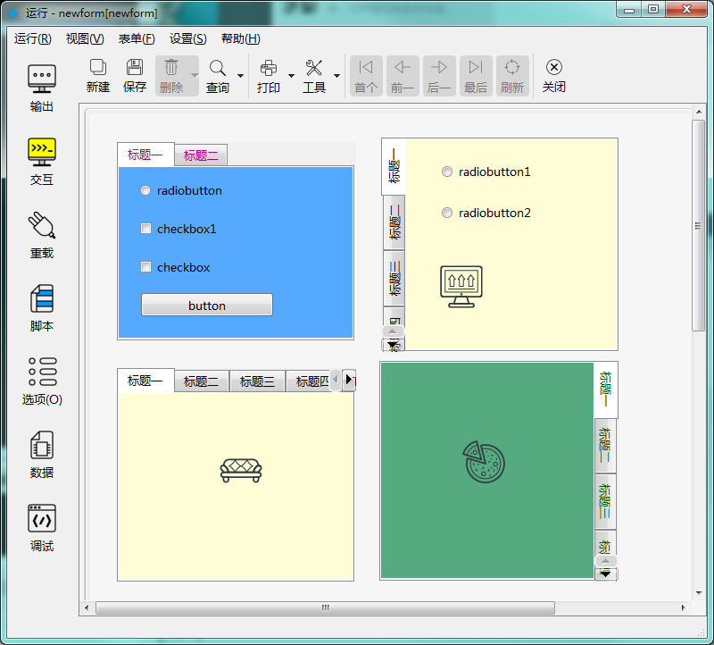

# 分页控件

分页控件为多个控件提供分页显示的容器。如下图示：

---

<h2 id="category">目录</h2>

- [继承的属性和函数](#继承的属性和函数)

- [自有属性](#树形控件的自有属性)

- [自有成员函数](#树形控件自有成员函数)

- [信号](#树形控件的信号)

- [可编程函数](#可编程函数)

---

## 继承的属性和函数

- [继承自QObject 的属性](2-1-qobject?id=属性)

- [继承自QObject 的 成员函数](2-1-qobject?id=成员函数)

- [继承自widgetDelegateBase的属性](2-2-base?id=属性)

- [继承自widgetDelegateBase的成员函数](2-2-base?id=成员函数)

---

## 树形控件的属性

[返回目录](#category)

|属性|值类型|读写类型|说明|
| - | - | - | - |

- ### 属性：tabCount （类型：int 可读 可写）

{{ usage }}

| |调用方法|
| - | - |
|读取|int tabCount const|
|修改|void setTabCount( int tabCount ) const|

- ### 属性：tabPosition （类型：int 可读 可写）

{{ usage }}

| |调用方法|
| - | - |
|读取|int tabPosition const|
|修改|void setTabPosition( int tabPosition ) const|

- ### 属性：tabCaptions （类型：QStringList 可读 可写）

{{ usage }}

| |调用方法|
| - | - |
|读取|QStringList tabCaptions const|
|修改|void setTabCaptions( const QStringList &tabCaptions ) const|

- ### 属性：tabNames （类型：QStringList 可读 可写）

{{ usage }}

| |调用方法|
| - | - |
|读取|QStringList tabNames const|
|修改|void setTabNames( const QStringList &tabNames ) const|

- ### 属性：usesScrollButtons （类型：bool 可读 可写）

{{ usage }}

| |调用方法|
| - | - |
|读取|bool usesScrollButtons const|
|修改|void setUsesScrollButtons( bool usesScrollButtons ) const|

- ### 属性：currentIndex （类型：int 可读 可写）

{{ usage }}

| |调用方法|
| - | - |
|读取|int currentIndex const|
|修改|void setCurrentIndex( int currentIndex ) const|

- ### 属性：currentTab （类型：QString 可读 可写）

{{ usage }}

| |调用方法|
| - | - |
|读取|QString currentTab const|
|修改|void setCurrentTab( const QString &currentTab ) const|

- ### 属性：defaultIndex （类型：int 可读 ）

{{ usage }}

| |调用方法|
| - | - |
|读取|int defaultIndex const|

- ### 属性：defaultVal （类型：int 可读 ）

{{ usage }}

| |调用方法|
| - | - |
|读取|int defaultVal const|

