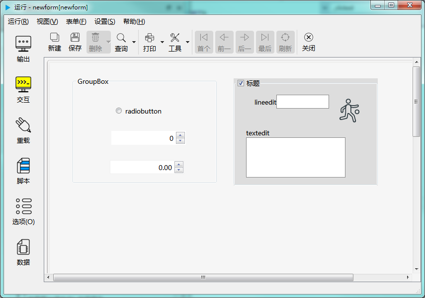

# 第二章 标准控件 - 分组框控件

分组框控件为多个控件提供可选的容器。如下图示：



---

<h2 id="category">目录</h2>

- [继承的属性和函数](#继承的属性和函数)

- [自有属性](#分组框控件的自有属性)

- [自有成员函数](#分组框控件自有成员函数)

- [信号](#分组框控件的信号)

- [可编程函数](#可编程函数)

---

## 继承的属性和函数

- [继承自QObject 的属性](2-1-qobject?id=属性)

- [继承自QObject 的 成员函数](2-1-qobject?id=成员函数)

- [继承自widgetDelegateBase的属性](2-2-base?id=属性)

- [继承自widgetDelegateBase的成员函数](2-2-base?id=成员函数)

---

## 分组框控件的自有属性

[返回目录](#category)

|      属性       | 值类型  | 读写类型  |     说明      |
| --------------- | ------- | -------- | ------------- |
| caption         | QString | 可读 可写 | 标题显示的文字 |
| checked         | bool    | 可读 可写 | 是否被选中     |
| checkable       | bool    | 可读 可写 | 是否可勾选     |
| alignment       | int     | 可读 可写 | 标题的对齐方式 |
| defaultVal      | bool    | 可读      | 缺省的勾选状态 |
| titleBackground | QColor  | 可读 可写 | 标题的背景色   |

- ### 属性：caption （类型：QString 可读 可写）

标题显示的文字。

|      |                     调用方法                     |
| ---- | ----------------------------------------------- |
| 读取 | QString caption() const                         |
| 修改 | void setCaption( const QString &caption ) const |

- ### 属性：checked （类型：bool 可读 可写）

是否已选中。

|      |                调用方法                |
| ---- | ------------------------------------- |
| 读取 | bool checked() const                  |
| 修改 | void setChecked( bool checked ) const |

- ### 属性：checkable （类型：bool 可读 可写）

是否允许勾选。允许勾选的分组框会在标题处显示一个勾选框。

|      |                  调用方法                  |
| ---- | ----------------------------------------- |
| 读取 | bool checkable() const                    |
| 修改 | void setCheckable( bool checkable ) const |

- ### 属性：alignment （类型：int 可读 可写）

标题的对齐方式。

|      |                 调用方法                  |
| ---- | ---------------------------------------- |
| 读取 | int alignment() const                    |
| 修改 | void setAlignment( int alignment ) const |
|      | **alignment取值：**                      |
|      | pub.ALIGNLEFT 向左对齐                    |
|      | pub.ALIGNRIGHT 向右对齐                   |
|      | pub.ALIGNHCENTER 水平居中对齐             |

- ### 属性：defaultVal （类型：bool 可读 ）

缺省值。对分组框控件来讲，为是否被选中的状态。如果“是否可勾选”设为否，则将忽略这个初始值设定。

|      |         调用方法         |
| ---- | ----------------------- |
| 读取 | bool defaultVal() const |

- ### 属性：titleBackground （类型：QColor 可读 可写）

标题的背景色。

|      |                       调用方法                       |
| ---- | --------------------------------------------------- |
| 读取 | QColor titleBackground() const                      |
| 修改 | void setTitleBackground(const QColor &color ) const |

---

## 分组框控件自有成员函数

[返回目录](#category)

所有属性的设置函数（参考上一节中修改属性的接口），都属于此类，都可以当做槽使用。除此之处还包括以下成员函数：

|函数|接口|说明|
| - | - | - | 
|buttonGroupCount|int buttonGroupCount() const|单选按钮群的数量，一直为1等于分页数量|
|buttonGroup|radioButtonGroupDelegate* buttonGroup(int index = 0) const|返回单选按钮群|

---

## 分组框控件的信号

[返回目录](#category)

这两个信号只在分组框为“可勾选”状态时会发出。clicked可以带参数或不带参数，需要注意的是如果在 connect 中不带参数使用时，需要加上 ()。

示例：

``` python

def func1(v=True):
	log.debug('func1')
	
def func2():
	log.debug('func2')

#连接clicked，要注意带上()
ok = this.groupbox.connect('clicked()',func2)
log.debug(ok)
#也可以连接到func1，但func1若有调用参数，需要设置缺省值，否则可以连接成功，但信号触发后不能成功调用被连接的函数
ok = this.groupbox.connect('clicked()',func1)
log.debug(ok)
#连接clicked(bool)
ok = this.groupbox.connect('clicked(bool)',func1)
log.debug(ok)
#连接toggled(bool)
ok = this.groupbox.connect('toggled(bool)',func1)
log.debug(ok)

```

|信号|接口|说明|
| - | - | - | 
|clicked|void clicked ( bool checked = false ) |点击标题栏中的复选按钮时发出此信号|
|toggled|void toggled ( bool on ) |切换勾选状态时发出此信号|

---

## 可编程函数

[返回目录](#category)

- [可编程函数的详细说明](1-4-openscript?id=控件的可编程函数)

分组框控件所有可编程函数的清单：

|函数|函数名|传入参数|返回值|说明|
| - | - | - | - | - |
|[点击时](1-4-openscript?id=clicked)|控件名_clicked|无|无|鼠标点击标题栏中的复选按钮时调用|
|[缺省值](1-4-openscript?id=default) | 控件名_default | 无 |缺省的被勾选状态<br>**数据类型：布尔**| 是否被选中。|
|[校验规则](1-4-openscript?id=validator)|控件名_validator|输入的文本|输入值是否合法<br>**数据类型：布尔**|如果输入值满足要求，返回True，否则返回False。<br>这个函数会在完成输入后被调用。<br>手工输入和程序修改都会调用此函数。|
|[鼠标进入时](1-4-openscript?id=enter)|控件名_enter|无|无|鼠标光标进入到这个控件时调用|
|[鼠标离开时](1-4-openscript?id=leave)|控件名_leave|无|无|鼠标光标离开这个控件时调用|
|[大小改变时](1-4-openscript?id=resize)|控件名_resize|无|无|控件大小改变时调用|
|[当拖拽进入时](1-4-openscript?id=dragEnter)|控件名_dragEnter|拖拽进入的元数据|是否接受拖拽进入<br>**数据类型：布尔**|当从外部拖拽一些内容进入到这个控件时，会调用此函数。<br>不接受拖拽的控件不会调用此函数。<br>通过脚本判断是否接受拖拽，<br>如果接受，返回 True，如果在控件上放开鼠标，程序会转而调用“当拖拽放下时”函数。<br>如果不接受，返回False，程序将不会调用“当拖拽放下时”函数。<br><br>**传入参数：**<br>format:元数据的格式列表，以列表类型传入<br>data:元数据的内容，以列表类型传入<br>dx:拖入的位置X坐标<br>dy:拖入的位置Y坐标|
|[当拖拽放下时](1-4-openscript?id=drop)|控件名_drop|拖拽放下的元数据|是否接受拖拽放下<br>**数据类型：布尔**|拖拽放下时调用。允许则返回 True，否则返回 False。<br><br>**传入参数：**<br>format:元数据的格式列表，以列表类型传入<br>data:元数据的内容，以列表类型传入<br>dx:放下的位置X坐标<br>dy:放下的位置Y坐标|
|[获得焦点](1-4-openscript?id=getfocus)|控件名_getfocus|无|无|获得焦点时调用|
|[失去焦点](1-4-openscript?id=lostfocus)|控件名_lostfocus|无|无|失去焦点时调用|
|[单次定时器超时时](1-4-openscript?id=singleshot)|控件名_singleshot|无|无|内置单次定时器超时时调用|
|[定时器超时时](1-4-openscript?id=timeout)|控件名_timeout|定时器的ID值|无|内置定时器超时时调用|

