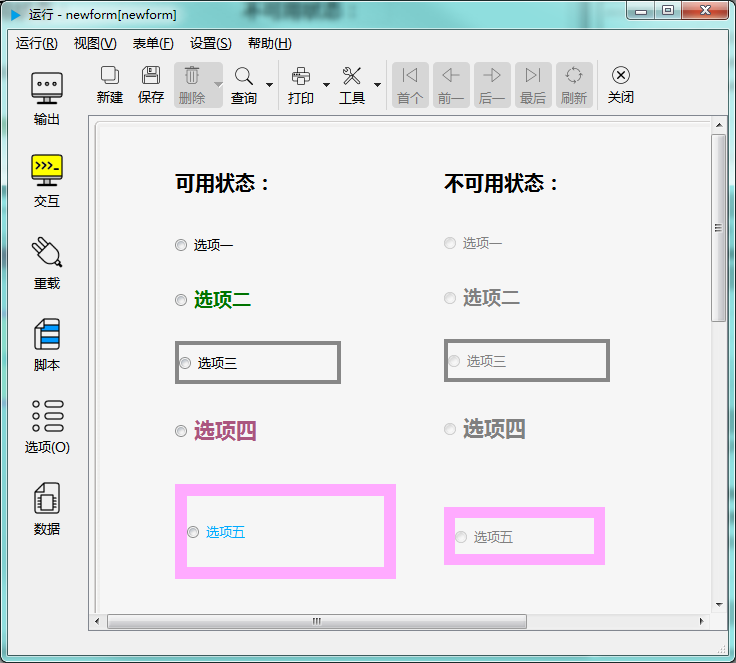

# 单选按钮控件

单选按钮控件用于在多个选项中选择一项。如下图示：

---

<h2 id="category">目录</h2>

- [继承的属性和函数](#继承的属性和函数)

- [自有属性](#单选按钮控件的自有属性)

- [自有成员函数](#单选按钮控件自有成员函数)

- [信号](#单选按钮控件的信号)

- [可编程函数](#可编程函数)

---

## 继承的属性和函数

- [继承自QObject 的属性](2-1-qobject?id=属性)

- [继承自QObject 的 成员函数](2-1-qobject?id=成员函数)

- [继承自widgetDelegateBase的属性](2-2-base?id=属性)

- [继承自widgetDelegateBase的成员函数](2-2-base?id=成员函数)

---

## 单选按钮控件的自有属性

[返回目录](#category)

|属性|值类型|读写类型|说明|
| - | - | - | - |
|caption|QString|可读 可写|显示的标题文字|
|checked|bool|可读 可写|显示的标题文字|
|value|QString|可读 可写|显示的标题文字|
|defaultVal|bool|可读 可写|缺省的是否选中的状态|

- ### 属性：caption （类型：QString 可读 可写）

显示的标题文字。

|      |                     调用方法                     |
| ---- | ----------------------------------------------- |
| 读取 | QString caption() const                         |
| 修改 | void setCaption( const QString &caption ) const |

- ### 属性：checked （类型：bool 可读 可写）

设置是否选中，True表示选中，False表示未选中。

|      |                调用方法                |
| ---- | ------------------------------------- |
| 读取 | bool checked() const                  |
| 修改 | void setChecked( bool checked ) const |

- ### 属性：value （类型：QString 可读 可写）

控件的值，字符串形式，多用于存储其被选中时的含义或需要保存到数据库中的值。

|      |                   调用方法                   |
| ---- | ------------------------------------------- |
| 读取 | QString value() const                       |
| 修改 | void setValue( const QString &value ) const |

- ### 属性：defaultVal （类型：bool 可读 ）

缺省的是否选中的状态值。

|      |         调用方法         |
| ---- | ----------------------- |
| 读取 | bool defaultVal() const |

---

## 单选按钮控件自有成员函数

[返回目录](#category)

所有属性的设置函数（参考上一节中修改属性的接口），都属于此类，都可以当做槽使用。除此之处还包括以下成员函数：

|函数|接口|说明|
| - | - | - | 
|click|void click() const|模拟用鼠标点击单选按钮，会切换选中的状态，但也会取决于控件是否可用，及是否符合校验规则|

---

## 单选按钮控件的信号

[返回目录](#category)

|信号|接口|说明|
| - | - | - | 
|clicked|void clicked ( bool checked = false ) |点击单选按钮时发出此信号|
|pressed|void pressed() |在控件上按下鼠标按键时发出此信号|
|released|void released() |在控件上松开鼠标按键时发出此信号|
|toggled|void toggled ( bool checked ) |切换单选按钮勾选状态时发出此信号|

---

## 可编程函数

[返回目录](#category)

- [可编程函数的详细说明](1-4-openscript?id=控件的可编程函数)

单选按钮控件所有可编程函数的清单：

|函数|函数名|传入参数|返回值|说明|
| - | - | - | - | - |
|[点击时](1-4-openscript?id=clicked)|控件名_clicked|无|无|鼠标点击时调用|
|[缺省值](1-4-openscript?id=default) | 控件名_default | 无 |缺省的被勾选状态 **数据类型：布尔**| 是否被选中。|
|[校验规则](1-4-openscript?id=validator)|控件名_validator|输入的文本|输入值是否合法 **数据类型：布尔**|如果当前选中状态值满足要求，返回True，否则返回False。 这个函数会在完成输入后被调用。 手工输入和程序修改都会调用此函数。|
|[鼠标进入时](1-4-openscript?id=enter)|控件名_enter|无|无|鼠标光标进入到这个控件时调用|
|[鼠标离开时](1-4-openscript?id=leave)|控件名_leave|无|无|鼠标光标离开这个控件时调用|
|[大小改变时](1-4-openscript?id=resize)|控件名_resize|无|无|控件大小改变时调用|
|[当拖曳进入时](1-4-openscript?id=dragEnter)|控件名_dragEnter|拖曳进入的元数据|是否接受拖曳进入 **数据类型：布尔**|当从外部拖曳一些内容进入到这个控件时，会调用此函数。 不接受拖曳的控件不会调用此函数。 通过脚本判断是否接受拖曳， 如果接受，返回 True，如果在控件上放开鼠标，程序会转而调用“当拖曳放下时”函数。 如果不接受，返回False，程序将不会调用“当拖曳放下时”函数。  **传入参数：** format:元数据的格式列表，以列表类型传入 data:元数据的内容，以列表类型传入 dx:拖入的位置X坐标 dy:拖入的位置Y坐标|
|[当拖曳放下时](1-4-openscript?id=drop)|控件名_drop|拖曳放下的元数据|是否接受拖曳放下 **数据类型：布尔**|拖曳放下时调用。允许则返回 True，否则返回 False。  **传入参数：** format:元数据的格式列表，以列表类型传入 data:元数据的内容，以列表类型传入 dx:放下的位置X坐标 dy:放下的位置Y坐标|
|[获得焦点](1-4-openscript?id=getfocus)|控件名_getfocus|无|无|获得焦点时调用|
|[失去焦点](1-4-openscript?id=lostfocus)|控件名_lostfocus|无|无|失去焦点时调用|
|[单次定时器超时时](1-4-openscript?id=singleshot)|控件名_singleshot|无|无|内置单次定时器超时时调用|
|[定时器超时时](1-4-openscript?id=timeout)|控件名_timeout|定时器的ID值|无|内置定时器超时时调用|

