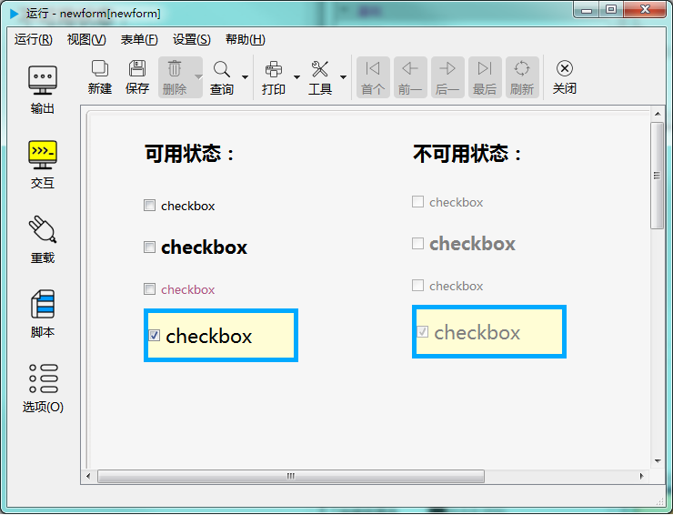

# 复选框控件

复选框控件用于勾选某个选项，同级的一组复选框可进行多项选择。如下图示：

---

<h2 id="category">目录</h2>

- [继承的属性和函数](#继承的属性和函数)

- [自有属性](#复选框控件的自有属性)

- [自有成员函数](#复选框控件自有成员函数)

- [信号](#复选框控件的信号)

- [可编程函数](#可编程函数)

---

## 继承的属性和函数

- [继承自QObject 的属性](2-1-qobject?id=属性)

- [继承自QObject 的 成员函数](2-1-qobject?id=成员函数)

- [继承自widgetDelegateBase的属性](2-2-base?id=属性)

- [继承自widgetDelegateBase的成员函数](2-2-base?id=成员函数)

---

## 复选框控件的属性

[返回目录](#category)

|属性|值类型|读写类型|说明|
| - | - | - | - |
|caption|QString|可读 可写|标题显示的文本|
|checked|bool|可读 可写|标题显示的文本|
|checkState|int|可读 可写|勾选状态|
|triState|bool|可读 可写|是否可用三种状态|
|defaultVal|QVariant|可读 可写|缺省勾选状态|
|checkedText|QString|可读 可写|选中状态对应的的文本|
|uncheckedText|QString|可读 可写|未选中状态的文本|
|partiallyCheckedText|QString|可读 可写|部分选中对应的文本|
|currentText|QString|可读 可写|当前状态对应的的文本|

- ### 属性：caption （类型：QString 可读 可写）

标题显示的文本。

| |调用方法|
| - | - |
|读取|QString caption const|
|修改|void setCaption( const QString &caption ) const|

- ### 属性：checked （类型：bool 可读 可写）

设置勾选状态。这个属性只能设置两种状态。如果要设置为“部分选中”的状态，使用setCheckState。

| |调用方法|
| - | - |
|读取|bool checked const|
|修改|void setChecked( bool checked ) const|

- ### 属性：checkState （类型：int 可读 可写）

设置勾选状态。

| |调用方法|
| - | - |
|读取|int checkState const|
|修改|void setCheckState( int checkState ) const|
||**checkState取值：**|
||pub.UNCHECKED 未选中|
||pub.PARTIALLYCHECKED 部分选中|
||pub.CHECKED 选中|

- ### 属性：triState （类型：bool 可读 可写）

是否允许使用三种勾选状态。设为 True 时，可以为“部分选中”的状态，否则只有“选中”和“未选中”两种状态。

| |调用方法|
| - | - |
|读取|bool triState const|
|修改|void setTriState( bool triState ) const|

- ### 属性：defaultVal （类型：QVariant 可读 ）

缺省值。对应不同的勾选状态，在控件创建后，使用这个值做为初始状态。

| |调用方法|
| - | - |
|读取|QVariant defaultVal const|
||**defaultVal值的含义**|
|| 0 : 未选中|
|| 1 : 部分选中|
|| 2 : 选中|

- ### 属性：checkedText （类型：QString 可读 可写）

选中时对应的文本内容。

| |调用方法|
| - | - |
|读取|QString checkedText const|
|修改|void setCheckedText( const QString &checkedText ) const|

- ### 属性：uncheckedText （类型：QString 可读 可写）

未勾选时对应的文本内容。

| |调用方法|
| - | - |
|读取|QString uncheckedText const|
|修改|void setUncheckedText( const QString &uncheckedText ) const|

- ### 属性：partiallyCheckedText （类型：QString 可读 可写）

部分勾选时对应的文本内容。

| |调用方法|
| - | - |
|读取|QString partiallyCheckedText const|
|修改|void setPartiallyCheckedText( const QString &partiallyCheckedText ) const|

- ### 属性：currentText （类型：QString 可读 可写）

当前文本。文本按当前勾选的状态，返回不同的文本内容。

| |调用方法|
| - | - |
|读取|QString currentText const|
|修改|void setCurrentText( const QString &currentText ) const|

---

## 复选框控件自有成员函数

[返回目录](#category)

所有属性的设置函数（参考上一节中修改属性的接口），都属于此类，都可以当做槽使用。除此之处还包括以下成员函数：

|函数|接口|说明|
| - | - | - | 
|click()|void click() const|模拟用鼠标点击复选按钮控件，勾选状态会在允许的几个状态之间切换。|

---

## 复选框控件的信号

[返回目录](#category)

|信号|接口|说明|
| - | - | - | 
|clicked|void clicked ( bool checked = false ) |点击时发出此信号|
|pressed|void pressed() |在控件上按下鼠标按键时发出此信号|
|released|void released() |在控件上松开鼠标按键时发出此信号|
|toggled|void toggled ( bool checked ) |切换勾选状态时发出此信号|
|stateChanged|	void stateChanged ( int state )|勾选状态发生改变时|

---

## 可编程函数

[返回目录](#category)

- [可编程函数的详细说明](1-4-openscript?id=控件的可编程函数)

复选框控件所有可编程函数的清单：

|函数|函数名|传入参数|返回值|说明|
| - | - | - | - | - |
|[缺省值](1-4-openscript?id=default) | 控件名_default | 无 |缺省的分页序号 **数据类型：整数**| 控件创建后，缺省显示的分页序号|
|[改变标签时](1-4-openscript?id=validator)|控件名_tabchanged||index：当前分页的编号，从0开始序号|切换当前分页时调用此函数。手动切换或程序切换都会调用。|
|[鼠标进入时](1-4-openscript?id=enter)|控件名_enter|无|无|鼠标光标进入到这个控件时调用|
|[鼠标离开时](1-4-openscript?id=leave)|控件名_leave|无|无|鼠标光标离开这个控件时调用|
|[大小改变时](1-4-openscript?id=resize)|控件名_resize|无|无|控件大小改变时调用|
|[当拖曳进入时](1-4-openscript?id=dragEnter)|控件名_dragEnter|拖曳进入的元数据|是否接受拖曳进入 **数据类型：布尔**|当从外部拖曳一些内容进入到这个控件时，会调用此函数。 不接受拖曳的控件不会调用此函数。 通过脚本判断是否接受拖曳， 如果接受，返回 True，如果在控件上放开鼠标，程序会转而调用“当拖曳放下时”函数。 如果不接受，返回False，程序将不会调用“当拖曳放下时”函数。  **传入参数：** format:元数据的格式列表，以列表类型传入 data:元数据的内容，以列表类型传入 dx:拖入的位置X坐标 dy:拖入的位置Y坐标|
|[当拖曳放下时](1-4-openscript?id=drop)|控件名_drop|拖曳放下的元数据|是否接受拖曳放下 **数据类型：布尔**|拖曳放下时调用。允许则返回 True，否则返回 False。  **传入参数：** format:元数据的格式列表，以列表类型传入 data:元数据的内容，以列表类型传入 dx:放下的位置X坐标 dy:放下的位置Y坐标|
|[单次定时器超时时](1-4-openscript?id=singleshot)|控件名_singleshot|无|无|内置单次定时器超时时调用|
|[定时器超时时](1-4-openscript?id=timeout)|控件名_timeout|定时器的ID值|无|内置定时器超时时调用|

