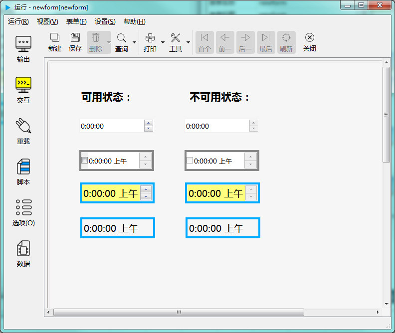

# 第二章 标准控件 - 时间编辑器控件

时间编辑器控件用于选择设定时间。如下图示：

---

<h2 id="category">目录</h2>

- [继承的属性和函数](#继承的属性和函数)

- [自有属性](#时间编辑器的自有属性)

- [自有成员函数](#时间编辑器自有成员函数)

- [信号](#时间编辑器的信号)

- [可编程函数](#可编程函数)

---

## 继承的属性和函数

- [继承自QObject 的属性](2-1-qobject?id=属性)

- [继承自QObject 的 成员函数](2-1-qobject?id=成员函数)

- [继承自widgetDelegateBase的属性](2-2-base?id=属性)

- [继承自widgetDelegateBase的成员函数](2-2-base?id=成员函数)

---

## 时间编辑器的属性

[返回目录](#category)

|    属性    | 值类型  | 读写类型  |      说明       |
| ---------- | ------- | -------- | --------------- |
| wrapping   | bool    | 可读 可写 | 是否使用值循环   |
| format     | QString | 可读 可写 | 显示格式        |
| text       | QString | 可读 可写 | 当前显示的文本   |
| defaultVal | QString | 可读 可写 | 缺省值          |
| checkable  | bool    | 可读 可写 | 是否可勾选       |
| checked    | bool    | 可读 可写 | 是否被勾选       |
| time       | QString | 可读 可写 | 当前时间        |
| readonly   | bool    | 可读 可写 | 是否只读        |
| showButton | bool    | 可读 可写 | 是否显示调节按钮 |

- ### 属性：margin （类型：int 可读 可写）

边界宽度（像素为单位）。

|      |              调用方法               |
| ---- | ---------------------------------- |
| 读取 | int margin() const                 |
| 修改 | void setMargin( int margin ) const |

- ### 属性：wrapping （类型：bool 可读 可写）

是否值循环。值循环是指，当前值已到最大值时，若再向上调会转到最小值。只有设置了最大最小值时有效。

|      |                 调用方法                 |
| ---- | --------------------------------------- |
| 读取 | bool wrapping() const                   |
| 修改 | void setWrapping( bool wrapping ) const |

- ### 属性：format （类型：QString 可读 可写）

显示格式。

比如格式设置为 “hh:mm:ss”，显示的格式就是“09:08:05“，如果设置为“h点m分s秒”，显示的格式就是“9点8分5秒”。

关于格式的设置参考下表，更详细的资料请参考 Qt 文档。

|格式|说明|
| - | - |
|h|小时的值，不补零 (0 到 23 ，设置了显示上午/下午时为 1 至 12)|
|hh|小时的值，两位数字，不足两位时补零 (00 到 23 ，设置了显示上午/下午时为 01 至 12)|
|H|小时的值，不补零 (0 到 23 ，设置了显示上午/下午时也是为 00 至 23)|
|HH|小时的值，两位数字，不足两位时补零 (00 到 23 ，设置了显示上午/下午时也是为 00 至 23)|
|m|分钟的值，不补零 (0 到 59)|
|mm|分钟的值，两位数字，不足两位时补零 (00 到 59)|
|s|秒的值，不补零 (0 到 59)|
|ss|秒的值 ，两位数字，不足两位时补零 (00 到 59)|
|z|毫秒的值，不补零 (0 到 999)|
|zzz|毫秒的值，三位数字，不足三位时补零 (000 到 999)|
|AP|显示本地化的上午和下午，大写（中文不分大小写）|
|ap|显示本地化的上午和下午，小写（中文不分大小写）|

|      |                    调用方法                    |
| ---- | --------------------------------------------- |
| 读取 | QString format() const                        |
| 修改 | void setFormat( const QString &format ) const |

- ### 属性：defaultVal （类型：QString 可读 ）

缺省的时间值。

|      |          调用方法           |
| ---- | -------------------------- |
| 读取 | QString defaultVal() const |

- ### 属性：text （类型：QString 可读 ）

当前显示的文本。

|      |       调用方法        |
| ---- | -------------------- |
| 读取 | QString text() const |

- ### 属性：checkable （类型：bool 可读 ）

是否可勾选。

|      |        调用方法         |
| ---- | ---------------------- |
| 读取 | bool checkable() const |

- ### 属性：checked （类型：bool 可读 可写）

是否被勾选。

|      |                调用方法                |
| ---- | ------------------------------------- |
| 读取 | bool checked() const                  |
| 修改 | void setChecked( bool checked ) const |

- ### 属性：time （类型：QString 可读 可写）

当前时间值。

|      |                       调用方法                       |
| ---- | --------------------------------------------------- |
| 读取 | QString timeToString() const                        |
| 修改 | void setTimeFromString( const QString &time ) const |

- ### 属性：readOnly （类型：bool 可读 可写）

是否只读。

|      |                 调用方法                 |
| ---- | --------------------------------------- |
| 读取 | bool readOnly() const                   |
| 修改 | void setReadOnly( bool readOnly ) const |

- ### 属性：showButton（类型：bool 可读 可写）

是否显示值调节按钮。

|      |                调用方法                |
| ---- | ------------------------------------- |
| 读取 | bool showButton() const               |
| 修改 | void setShowButton( bool show ) const |

---

## 时间编辑器控件自有成员函数

[返回目录](#category)

所有属性的设置函数（参考上一节中修改属性的接口），都属于此类，都可以当做槽使用。除此之处还包括以下成员函数：

|函数|接口|说明|
| - | - | - | 
|isValid|bool isValid()	const|是否是有效的时间值|
|minimumTime|QString minimumTime() const|最小时间值|
|maximumTime|QString maximumTime() const	|最大时间值|
|setMinimumTime|void setMinimumTime(int h,int m,int s ) const|设置最小时间值|
|setMaximumTime|void setMaximumTime(int h,int m,int s ) const	|设置最大时间值|
|clear|void clear ()		const|清除输入的内容|
|selectAll|void selectAll () 	const|选择所有文本|
|stepDown|void stepDown () 	const|向下调(减少)|
|stepUp|void stepUp () 		const|向上调(增加)|
|hour|int hour() const		|当前时间值对应的小时|
|minute|int minute() const		|当前时间值对应的分钟|
|second|int second() const		|当前时间值对应的秒|
|toString|QString toString() const|当前日期值按日期格式转换成字符串|

---

## 时间编辑器控件的信号

[返回目录](#category)

|信号|接口|说明|
| - | - | - | 
|timeChanged|void timeChanged ( const QTime & time ) |日期值改变时发出此信号|
|editingFinished|	void editingFinished () |编辑完成时发出此信号|
|stateChanged|	void stateChanged(bool)|如果允许勾选，在勾选状态发生变化时发出此信号|

---

## 可编程函数

[返回目录](#category)

- [可编程函数的详细说明](1-4-openscript?id=控件的可编程函数)

日期编辑器控件所有可编程函数的清单：

|函数|函数名|传入参数|返回值|说明|
| - | - | - | - | - |
|[缺省值](1-4-openscript?id=default) | 控件名_default | 无 |缺省的时间值 **数据类型：字符串**| 控件创建后，缺省显示的时间值|
|[校验规则](1-4-openscript?id=validator)|控件名_validator|输入的文本|输入值是否合法 **数据类型：布尔**|如果输入值满足要求，返回True，否则返回False。 这个函数会在完成输入后被调用。 手工输入和程序修改都会调用此函数。|
|[鼠标进入时](1-4-openscript?id=enter)|控件名_enter|无|无|鼠标光标进入到这个控件时调用|
|[鼠标离开时](1-4-openscript?id=leave)|控件名_leave|无|无|鼠标光标离开这个控件时调用|
|[大小改变时](1-4-openscript?id=resize)|控件名_resize|无|无|控件大小改变时调用|
|[当拖拽进入时](1-4-openscript?id=dragEnter)|控件名_dragEnter|拖拽进入的元数据|是否接受拖拽进入 **数据类型：布尔**|当从外部拖拽一些内容进入到这个控件时，会调用此函数。 不接受拖拽的控件不会调用此函数。 通过脚本判断是否接受拖拽， 如果接受，返回 True，如果在控件上放开鼠标，程序会转而调用“当拖拽放下时”函数。 如果不接受，返回False，程序将不会调用“当拖拽放下时”函数。  **传入参数：** format:元数据的格式列表，以列表类型传入 data:元数据的内容，以列表类型传入 dx:拖入的位置X坐标 dy:拖入的位置Y坐标|
|[当拖拽放下时](1-4-openscript?id=drop)|控件名_drop|拖拽放下的元数据|是否接受拖拽放下 **数据类型：布尔**|拖拽放下时调用。允许则返回 True，否则返回 False。  **传入参数：** format:元数据的格式列表，以列表类型传入 data:元数据的内容，以列表类型传入 dx:放下的位置X坐标 dy:放下的位置Y坐标|
|[单次定时器超时时](1-4-openscript?id=singleshot)|控件名_singleshot|无|无|内置单次定时器超时时调用|
|[定时器超时时](1-4-openscript?id=timeout)|控件名_timeout|定时器的ID值|无|内置定时器超时时调用|

