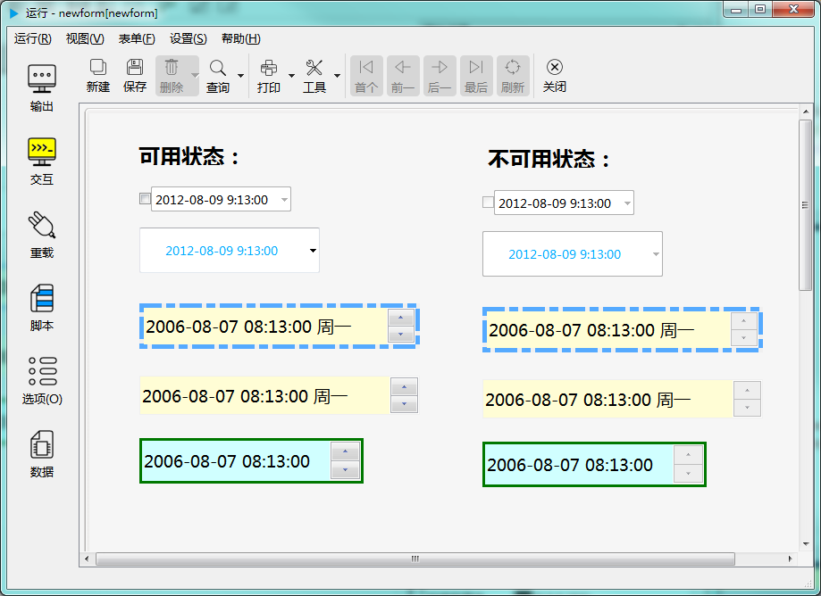

# 日期时间编辑器控件

日期时间编辑器控件用于选择设定日期和时间。如下图示：

---

<h2 id="category">目录</h2>

- [继承的属性和函数](#继承的属性和函数)

- [自有属性](#日期时间编辑器的自有属性)

- [自有成员函数](#日期时间编辑器自有成员函数)

- [信号](#日期时间编辑器的信号)

- [可编程函数](#可编程函数)

---

## 继承的属性和函数

- [继承自QObject 的属性](2-1-qobject?id=属性)

- [继承自QObject 的 成员函数](2-1-qobject?id=成员函数)

- [继承自widgetDelegateBase的属性](2-2-base?id=属性)

- [继承自widgetDelegateBase的成员函数](2-2-base?id=成员函数)

---

## 日期时间编辑器的属性

[返回目录](#category)

|属性|值类型|读写类型|说明|
| - | - | - | - |
|wrapping|bool|可读 可写|是否使用值循环|
|format|QString|可读 可写|显示格式|
|calendarpopup|bool|可读 可写|是否弹出日期选择框|
|text|QString|可读 可写|当前显示的文本|
|defaultVal|QString|可读 可写|缺省值|
|checkable|bool|可读 可写|是否可勾选|
|checked|bool|可读 可写|是否被勾选|
|datetime|QString|可读 可写|当前日期时间|
|readonly|bool|可读 可写|是否只读|

- ### 属性：margin （类型：int 可读 可写）

边界宽度。

| |调用方法|
| - | - |
|读取|int margin const|
|修改|void setMargin( int margin ) const|

- ### 属性：wrapping （类型：bool 可读 可写）

是否使用值循环。值循环是指，当前值已到最大值时，若再向上调会转到最小值。只有设置了最大最小值时有效。

| |调用方法|
| - | - |
|读取|bool wrapping const|
|修改|void setWrapping( bool wrapping ) const|

- ### 属性：format （类型：QString 可读 可写）

显示格式。

比如格式设置为 “yyyy-MM-dd hh:mm:ss”，显示的格式就是“2020-06-08 09:08:05“，如果设置为“yy年M月d日 h点m分s秒”，显示的格式就是“20年5月8日 9点8分5秒”。

比如格式设置为 “yyyy-MM-dd”，显示的格式就是“2020-06-08“，如果设置为“yyyy年M月d日”，显示的格式就是“20年5月8日”。

关于格式的设置参考下表，更详细的资料请参考 Qt 文档。

|格式|说明|
| - | - |
|d|日期数值，不补零 (1 到 31)|
|dd|日期，两位，不足两位时在前面补零 (01 到 31)|
|ddd|简化的本地化的周几(如英文 'Mon' 到 'Sun'，中文'周一'到'周日').|
|dddd|本地化的周几(如英文 'Monday' to 'Sunday'，中文'星期一'到'星期日').|
|M|月份数值，前面不补零 (1 到 12)|
|MM|两位的月份数值，不足两位时前面补零 (01 到 12)|
|MMM|简化的本地化的月份名称(如英文 'Jan' 到 'Dec'，中文'一月'到'十二月'). |
|MMMM|本地化的月份名称(如英文 'January' 到 'December'，中文'一月'到'十二月').|
|yy|两位的年份数值 (00 to 99)|
|yyyy|四位的年份数值|
|h|小时的值，不补零 (0 到 23 ，设置了显示上午/下午时为 1 至 12)|
|hh|小时的值，两位数字，不足两位时补零 (00 到 23 ，设置了显示上午/下午时为 01 至 12)|
|H|小时的值，不补零 (0 到 23 ，设置了显示上午/下午时也是为 00 至 23)|
|HH|小时的值，两位数字，不足两位时补零 (00 到 23 ，设置了显示上午/下午时也是为 00 至 23)|
|m|分钟的值，不补零 (0 到 59)|
|mm|分钟的值，两位数字，不足两位时补零 (00 到 59)|
|s|秒的值，不补零 (0 到 59)|
|ss|秒的值 ，两位数字，不足两位时补零 (00 到 59)|
|z|毫秒的值，不补零 (0 到 999)|
|zzz|毫秒的值，三位数字，不足三位时补零 (000 到 999)|
|AP|显示本地化的上午和下午，大写（中文不分大小写）|
|ap|显示本地化的上午和下午，小写（中文不分大小写）|

| |调用方法|
| - | - |
|读取|QString format const|
|修改|void setFormat( const QString &format ) const|

- ### 属性：calendarpopup （类型：bool 可读 可写）

是否提供弹出日历做为日期期的辅助输入方式。在设为 True 时，设置边框的属性无效。

| |调用方法|
| - | - |
|读取|bool calendarpopup const|
|修改|void setCalendarpopup( bool calendarpopup ) const|

- ### 属性：defaultVal （类型：QString 可读 ）

缺省值。控件创建之后默认设置为这个缺省值。

| |调用方法|
| - | - |
|读取|QString defaultVal const|

- ### 属性：text （类型：QString 可读 ）

显示的文本。

| |调用方法|
| - | - |
|读取|QString text const|

- ### 属性：checkable （类型：bool 可读 ）

是否可勾选。如果是可勾选的状态，在未选中时，不允许输入日期。

| |调用方法|
| - | - |
|读取|bool checkable const|

- ### 属性：checked （类型：bool 可读 可写）

checkable为 True 时，是否是选中的状态。

| |调用方法|
| - | - |
|读取|bool checked const|
|修改|void setChecked( bool checked ) const|

- ### 属性：datetime （类型：QString 可读 可写）

当前日期值。返回值会被转换为字符串形式。如果以 obj.date 的方式调用，格式是"yyyy-MM-dd hh:mm:ss"。如果需要其它格式，使用 obj.dateToString(format) 形式调用。同理，修改属性值时，默认格式也是"yyyy-MM-dd"。

| |调用方法|
| - | - |
|读取|QString datetime const|
|修改|void setDatetime( const QString &datetime ) const|

- ### 属性：readOnly （类型：bool 可读 可写）

是否只读

| |调用方法|
| - | - |
|读取|bool readOnly const|
|修改|void setReadOnly( bool readOnly ) const|

---

## 日期时间编辑器控件自有成员函数

[返回目录](#category)

所有属性的设置函数（参考上一节中修改属性的接口），都属于此类，都可以当做槽使用。除此之处还包括以下成员函数：

|函数|接口|说明|
| - | - | - | 
|isValid|bool isValid()	const|是否是有效的时间值|
|minimumtime|QString minimum() const|最小时间值|
|maximumtime|QString maximum() const	|最大时间值|
|minimumdate|QString minimum() const|最小日期值|
|maximumdate|QString maximum() const	|最大日期值|
|setMinimumDate|void setMinimumDate(int y,int m,int d ) const|设置最小日期值|
|setMaximumDate|void setMaximumDate(int y,int m,int d ) const	|设置最大日期值|
|setMinimumTime|void setMinimumTime(int h,int m,int s ) const|设置最小时间值|
|setMaximumTime|void setMaximumTime(int h,int m,int s ) const	|设置最大时间值|
|dateToString|QString toString(const QString & format="yyyy-MM-dd") const|当前日期值按日期格式转换成字符串|
|timeToString|QString toString(const QString & format="HH:mm:ss") const|当前时间值按格式转换成字符串|
|dateTimeToString|QString toString(const QString & format="yyyy-MM-dd HH:mm:ss") const|当前日期时间值值按格式转换成字符串|
|clear|void clear ()		const|清除输入的内容|
|selectAll|void selectAll () 	const|选择所有文本|
|stepDown|void stepDown () 	const|向下调(减少)|
|stepUp|void stepUp () 		const|向上调(增加)|
|year|int year() const		|当前日期值对应的年份|
|month|int month() const		|当前日期值对应的月份|
|day|int day() const		|当前日期值对应的一个月中的第几天|
|dayOfWeek|int dayOfWeek() const|当前日期值对应的一周中的周几|
|daysTo|int daysTo(int year,int month,int day ) const		|当前日期值与另一个日期值之间相隔几天|
|dayOfYear|int dayOfYear () const 	|当前日期值在该年份中是第几天（值从1到365/366）|
|daysInMonth|int daysInMonth () const 	|当前日期值对应的月份总共有几天|
|daysInYear|int daysInYear () const 	|当前日期值对应的年份总共有几天|
|hour|int hour() const		|当前时间值对应的小时|
|minute|int minute() const		|当前时间值对应的分钟|
|second|int second() const		|当前时间值对应的秒|
|secsTo|int secsTo(int h,int m,int s) const		|当前时间值与其它时间值之间相差多少秒|
|isLeapYear|bool isLeapYear ( )	 const|是否是闰年|
|longDayName|QString longDayName (  )  const|周几的名称|
|longMonthName|QString longMonthName (  )  const|月份的名称|
|shortDayName|QString shortDayName ( )  const	|周几的简短名称|
|shortMonthName|QString shortMonthName () const	|月份的简短名称|
|toString|QString toString(const QString & format="yyyy-MM-dd HH:mm:ss") const|当前日期值按日期格式转换成字符串|
|setDate|void setDate(int year,int month,int day) |设置日期值|
|setTime|void setTime(int h,int m,int s) const|设置时间值|
|setDateTime|void setDateTime(int year,int month,int day,int h,int m,int s) const|设置日期时间值|
|setDateFromString|QString toString(const QString & format="yyyy-MM-dd") const|设置日期|
|setTimeFromString|QString toString(const QString & format="HH:mm:ss") const|设置时间|
|setDateTimeFromString|QString toString(const QString & format="yyyy-MM-dd HH:mm:ss") const|设置日期时间|
|chineseDay|QString chineseDay() const|当前日期值对应的中国农历的日期，如“八月初六”。|
|chineseYear|QString chineseYear() const|当前日期值对应的中国农历，如“兔年(己卯)”。|

---

## 日期时间编辑器控件的信号

[返回目录](#category)

|信号|接口|说明|
| - | - | - | 
|dateChanged|void dateChanged ( const QDate & time ) |日期值改变时发出此信号|
|timeChanged|void timeChanged ( const QTime & time ) |时间值改变时发出此信号|
|dateTimeChanged|void dateTimeChanged ( const QDateTime & time ) |日期时间值改变时发出此信号|
|editingFinished|	void editingFinished () |编辑完成时发出此信号|
|stateChanged|	void stateChanged(bool)|如果允许勾选，在勾选状态发生变化时发出此信号|

---

## 可编程函数

[返回目录](#category)

- [可编程函数的详细说明](1-4-openscript?id=控件的可编程函数)

日期时间编辑器控件所有可编程函数的清单：

|函数|函数名|传入参数|返回值|说明|
| - | - | - | - | - |
|[缺省值](1-4-openscript?id=default) | 控件名_default | 无 |缺省的日期时间值 **数据类型：字符串**| 控件创建后，缺省显示的日期时间值|
|[校验规则](1-4-openscript?id=validator)|控件名_validator|输入的文本|输入值是否合法 **数据类型：布尔**|如果输入值满足要求，返回True，否则返回False。 这个函数会在完成输入后被调用。 手工输入和程序修改都会调用此函数。|
|[鼠标进入时](1-4-openscript?id=enter)|控件名_enter|无|无|鼠标光标进入到这个控件时调用|
|[鼠标离开时](1-4-openscript?id=leave)|控件名_leave|无|无|鼠标光标离开这个控件时调用|
|[大小改变时](1-4-openscript?id=resize)|控件名_resize|无|无|控件大小改变时调用|
|[当拖曳进入时](1-4-openscript?id=dragEnter)|控件名_dragEnter|拖曳进入的元数据|是否接受拖曳进入 **数据类型：布尔**|当从外部拖曳一些内容进入到这个控件时，会调用此函数。 不接受拖曳的控件不会调用此函数。 通过脚本判断是否接受拖曳， 如果接受，返回 True，如果在控件上放开鼠标，程序会转而调用“当拖曳放下时”函数。 如果不接受，返回False，程序将不会调用“当拖曳放下时”函数。  **传入参数：** format:元数据的格式列表，以列表类型传入 data:元数据的内容，以列表类型传入 dx:拖入的位置X坐标 dy:拖入的位置Y坐标|
|[当拖曳放下时](1-4-openscript?id=drop)|控件名_drop|拖曳放下的元数据|是否接受拖曳放下 **数据类型：布尔**|拖曳放下时调用。允许则返回 True，否则返回 False。  **传入参数：** format:元数据的格式列表，以列表类型传入 data:元数据的内容，以列表类型传入 dx:放下的位置X坐标 dy:放下的位置Y坐标|
|[单次定时器超时时](1-4-openscript?id=singleshot)|控件名_singleshot|无|无|内置单次定时器超时时调用|
|[定时器超时时](1-4-openscript?id=timeout)|控件名_timeout|定时器的ID值|无|内置定时器超时时调用|

