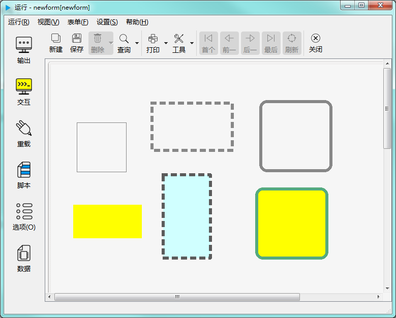

# 矩形控件

矩形控件用于显示一个矩形图形。如下图示：

---

<h2 id="category">目录</h2>

- [继承的属性和函数](#继承的属性和函数)

- [自有属性](#圆形控件的自有属性)

- [自有成员函数](#圆形控件自有成员函数)

- [信号](#圆形控件的信号)

- [可编程函数](#可编程函数)

---

## 继承的属性和函数

- [继承自QObject 的属性](2-1-qobject?id=属性)

- [继承自QObject 的 成员函数](2-1-qobject?id=成员函数)

- [继承自widgetDelegateBase的属性](2-2-base?id=属性)

- [继承自widgetDelegateBase的成员函数](2-2-base?id=成员函数)

---

## 矩形控件的属性

[返回目录](#category)

|属性|值类型|读写类型|说明|
| - | - | - | - |
|fillColor|QColor|可读 可写|填充颜色|
|xCorner|int|可读 可写|圆角x方向曲率|
|yCorner|int|可读 可写|圆角y方向曲率|
|isRoundCorner|bool|可读 可写|是否使用圆角|

- ### 属性：fillColor （类型：QColor 可读 可写）

填充颜色。

| |调用方法|
| - | - |
|读取|QColor fillColor const|
|修改|void setFillColor( const QColor &fillColor ) const|

- ### 属性：xCorner （类型：int 可读 可写）

圆角x方向曲率。

| |调用方法|
| - | - |
|读取|int xCorner const|
|修改|void setXCorner( int xCorner ) const|

- ### 属性：yCorner （类型：int 可读 可写）

圆角y方向曲率。

| |调用方法|
| - | - |
|读取|int yCorner const|
|修改|void setYCorner( int yCorner ) const|

- ### 属性：isRoundCorner （类型：bool 可读 可写）

是否使用圆角。

| |调用方法|
| - | - |
|读取|bool isRoundCorner const|
|修改|void setIsRoundCorner( bool isRoundCorner ) const|

