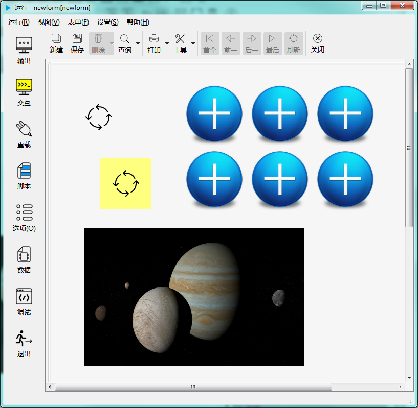

# 图片控件

图片控件用于显示图片。如下图示：

## 继承自 widgetDelegateBase 的 属性和成员函数

参考： [基类widgetDelegateBase](2-2-base)

## 图片控件的属性

- ### 属性：image （类型：QPixmap 可读 可写）

{{ usage }}

| |调用方法|
| - | - |
|读取|QPixmap image const|
|修改|void setImage( const QPixmap &image ) const|

- ### 属性：defaultVal （类型：QString 可读 ）

{{ usage }}

| |调用方法|
| - | - |
|读取|QString defaultVal const|

- ### 属性：palette （类型：QPalette 可读 可写）

{{ usage }}

| |调用方法|
| - | - |
|读取|QPalette palette const|
|修改|void setPalette( const QPalette &palette ) const|

- ### 属性：URL （类型：QString 可读 可写）

{{ usage }}

| |调用方法|
| - | - |
|读取|QString URL const|
|修改|void setURL( const QString &URL ) const|

- ### 属性：imageFillStyle （类型：int 可读 可写）

{{ usage }}

| |调用方法|
| - | - |
|读取|int imageFillStyle const|
|修改|void setImageFillStyle( int imageFillStyle ) const|

