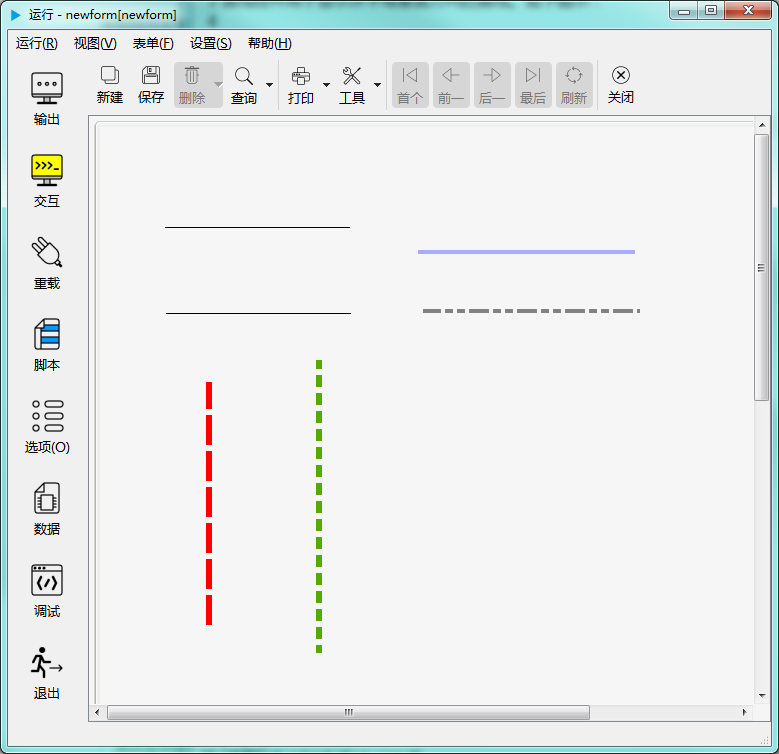

# 直线控件

直线控件用于显示水平或垂直方向的直线。如下图示：

---

<h2 id="category">目录</h2>

- [继承的属性和函数](#继承的属性和函数)

- [自有属性](#直线控件的自有属性)

- [自有成员函数](#直线控件自有成员函数)

- [信号](#直线控件的信号)

- [可编程函数](#可编程函数)

---

## 继承的属性和函数

- [继承自QObject 的属性](2-1-qobject?id=属性)

- [继承自QObject 的 成员函数](2-1-qobject?id=成员函数)

- [继承自widgetDelegateBase的属性](2-2-base?id=属性)

- [继承自widgetDelegateBase的成员函数](2-2-base?id=成员函数)

---

## 直线控件的自有属性

[返回目录](#category)

|属性|值类型|读写类型|说明|
| - | - | - | - |
|lineColor|QColor|可读 可写|线条颜色|
|lineWidth|int|可读 可写|线宽|
|orientation|int|可读 可写|方向|
|lineStyle|int|可读 可写|线型|

- ### 属性：lineColor （类型：QColor 可读 可写）

线条颜色。

| |调用方法|
| - | - |
|读取|QColor lineColor const|
|修改|void setLineColor( const QColor &lineColor ) const|

- ### 属性：lineWidth （类型：int 可读 可写）

线宽（像素为单位）。

| |调用方法|
| - | - |
|读取|int lineWidth const|
|修改|void setLineWidth( int lineWidth ) const|

- ### 属性：orientation （类型：int 可读 可写）

方向。

| |调用方法|
| - | - |
|读取|int orientation const|
|修改|void setOrientation( int orientation ) const|
||**orientation取值：**|
||pub.VERTICAL 垂直方向|
||pub.HORIZONTAL 水平方向|

- ### 属性：lineStyle （类型：int 可读 可写）

线型。

| |调用方法|
| - | - |
|读取|int lineStyle const|
|修改|void setLineStyle( int lineStyle ) const|
||**lineStyle取值：**|
||pub.SOLIDLINE 实线|
||pub.DASHLINE 破折线|
||pub.DOTLINE 点划线|
||pub.DASHDOTLINE 破折-点线|
||pub.DASHDOTDOTLINE 破折-点-点线|

---

## 直线控件自有成员函数

[返回目录](#category)

所有属性的设置函数（参考上一节中修改属性的接口），都属于此类，都可以当做槽使用。除此之处， 直线控件没有其它的成员函数。 

---

## 直线控件的信号

[返回目录](#category)

直线控件没有信号。

---

## 可编程函数

[返回目录](#category)

- [可编程函数的详细说明](1-4-openscript?id=控件的可编程函数)

直线控件除了继承的 widgetDelegateBase 中的可编程函数外，没有其它可编程函数。

