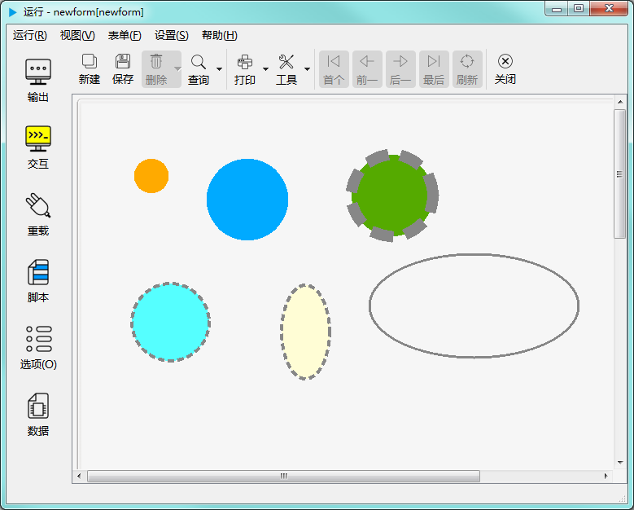

# 圆形控件

圆形控件用于显示圆形或椭圆形。如下图示：

---

<h2 id="category">目录</h2>

- [继承的属性和函数](#继承的属性和函数)

- [自有属性](#圆形控件的自有属性)

- [自有成员函数](#圆形控件自有成员函数)

- [信号](#圆形控件的信号)

- [可编程函数](#可编程函数)

---

## 继承的属性和函数

- [继承自QObject 的属性](2-1-qobject?id=属性)

- [继承自QObject 的 成员函数](2-1-qobject?id=成员函数)

- [继承自widgetDelegateBase的属性](2-2-base?id=属性)

- [继承自widgetDelegateBase的成员函数](2-2-base?id=成员函数)

---

## 圆形控件的自有属性

[返回目录](#category)

|属性|值类型|读写类型|说明|
| - | - | - | - |
|fillColor|QColor|可读 可写|填充颜色|

- ### 属性：fillColor （类型：QColor 可读 可写）

填充颜色。如果填充方式是“透明”，这个值不起作用。

| |调用方法|
| - | - |
|读取|QColor fillColor const|
|修改|void setFillColor( const QColor &fillColor ) const|

---

## 圆形控件自有成员函数

[返回目录](#category)

所有属性的设置函数（参考上一节中修改属性的接口），都属于此类，都可以当做槽使用。除此之处， 圆形控件没有其它的成员函数。 

---

## 圆形控件的信号

[返回目录](#category)

圆形控件没有信号。

---

## 可编程函数

[返回目录](#category)

- [可编程函数的详细说明](1-4-openscript?id=控件的可编程函数)

圆形控件除了继承的 widgetDelegateBase 中的可编程函数外，没有其它可编程函数。

圆形控件所有可编程函数的清单：

|函数|函数名|传入参数|返回值|说明|
| - | - | - | - | - |
|[鼠标进入时](1-4-openscript?id=enter)|控件名_enter|无|无|鼠标光标进入到这个控件时调用|
|[鼠标离开时](1-4-openscript?id=leave)|控件名_leave|无|无|鼠标光标离开这个控件时调用|
|[大小改变时](1-4-openscript?id=resize)|控件名_resize|无|无|控件大小改变时调用|
|[当拖曳进入时](1-4-openscript?id=dragEnter)|控件名_dragEnter|拖曳进入的元数据|是否接受拖曳进入 **数据类型：布尔**|当从外部拖曳一些内容进入到这个控件时，会调用此函数。 不接受拖曳的控件不会调用此函数。 通过脚本判断是否接受拖曳， 如果接受，返回 True，如果在控件上放开鼠标，程序会转而调用“当拖曳放下时”函数。 如果不接受，返回False，程序将不会调用“当拖曳放下时”函数。  **传入参数：** format:元数据的格式列表，以列表类型传入 data:元数据的内容，以列表类型传入 dx:拖入的位置X坐标 dy:拖入的位置Y坐标|
|[当拖曳放下时](1-4-openscript?id=drop)|控件名_drop|拖曳放下的元数据|是否接受拖曳放下 **数据类型：布尔**|拖曳放下时调用。允许则返回 True，否则返回 False。  **传入参数：** format:元数据的格式列表，以列表类型传入 data:元数据的内容，以列表类型传入 dx:放下的位置X坐标 dy:放下的位置Y坐标|
|[单次定时器超时时](1-4-openscript?id=singleshot)|控件名_singleshot|无|无|内置单次定时器超时时调用|
|[定时器超时时](1-4-openscript?id=timeout)|控件名_timeout|定时器的ID值|无|内置定时器超时时调用|

