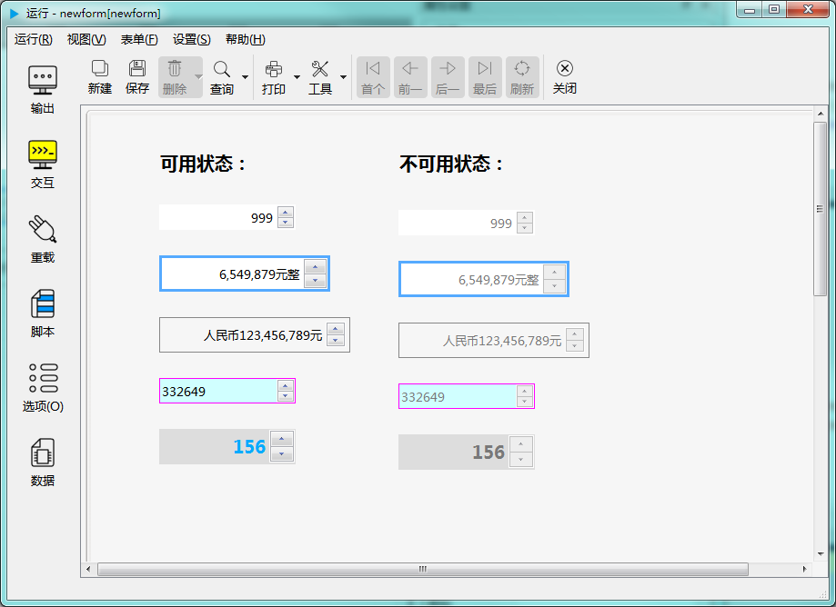

# 整数编辑器控件

整数编辑器控件用于输入整数值。如下图示：

## 继承自 widgetDelegateBase 的 属性和成员函数

参考： [基类widgetDelegateBase](2-2-base)

## 整数编辑器控件的属性

- ### 属性：margin （类型：int 可读 可写）

{{ usage }}

| |调用方法|
| - | - |
|读取|int margin const|
|修改|void setMargin( int margin ) const|

- ### 属性：minimum （类型：int 可读 可写）

{{ usage }}

| |调用方法|
| - | - |
|读取|int minimum const|
|修改|void setMinimum( int minimum ) const|

- ### 属性：maximum （类型：int 可读 可写）

{{ usage }}

| |调用方法|
| - | - |
|读取|int maximum const|
|修改|void setMaximum( int maximum ) const|

- ### 属性：wrapping （类型：bool 可读 可写）

{{ usage }}

| |调用方法|
| - | - |
|读取|bool wrapping const|
|修改|void setWrapping( bool wrapping ) const|

- ### 属性：singlestep （类型：int 可读 可写）

{{ usage }}

| |调用方法|
| - | - |
|读取|int singlestep const|
|修改|void setSinglestep( int singlestep ) const|

- ### 属性：prefix （类型：QString 可读 可写）

{{ usage }}

| |调用方法|
| - | - |
|读取|QString prefix const|
|修改|void setPrefix( const QString &prefix ) const|

- ### 属性：suffix （类型：QString 可读 可写）

{{ usage }}

| |调用方法|
| - | - |
|读取|QString suffix const|
|修改|void setSuffix( const QString &suffix ) const|

- ### 属性：defaultVal （类型：int 可读 ）

{{ usage }}

| |调用方法|
| - | - |
|读取|int defaultVal const|

- ### 属性：alignment （类型：int 可读 可写）

{{ usage }}

| |调用方法|
| - | - |
|读取|int alignment const|
|修改|void setAlignment( int alignment ) const|

- ### 属性：text （类型：QString 可读 ）

{{ usage }}

| |调用方法|
| - | - |
|读取|QString text const|

- ### 属性：cleanText （类型：QString 可读 ）

{{ usage }}

| |调用方法|
| - | - |
|读取|QString cleanText const|

- ### 属性：value （类型：int 可读 可写）

{{ usage }}

| |调用方法|
| - | - |
|读取|int value const|
|修改|void setValue( int value ) const|

- ### 属性：readOnly （类型：bool 可读 可写）

{{ usage }}

| |调用方法|
| - | - |
|读取|bool readOnly const|
|修改|void setReadOnly( bool readOnly ) const|

- ### 属性：showSeperator （类型：bool 可读 可写）

{{ usage }}

| |调用方法|
| - | - |
|读取|bool showSeperator const|
|修改|void setShowSeperator( bool showSeperator ) const|

