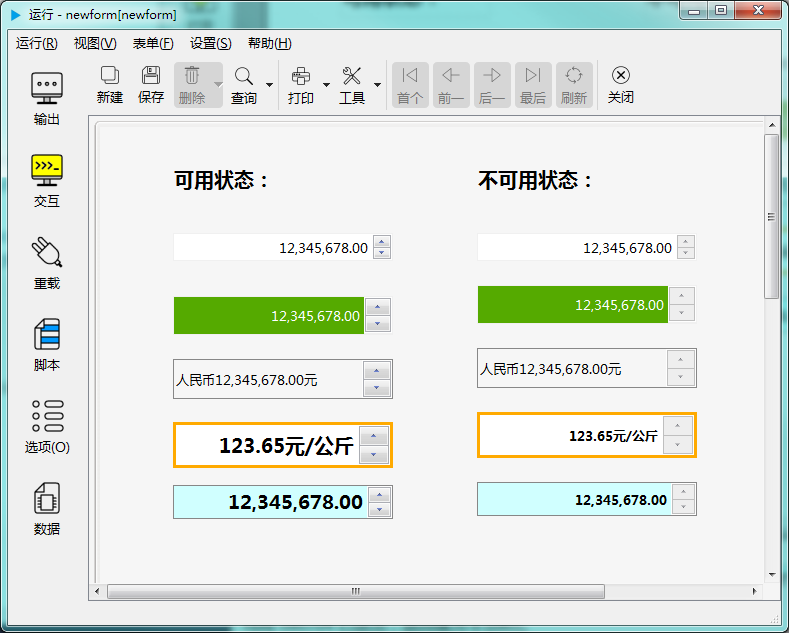

# 双精度浮点数编辑器控件

双精度浮点数编辑器控件用于输入带小数的数值。如下图示：

---

<h2 id="category">目录</h2>

- [继承的属性和函数](#继承的属性和函数)

- [自有属性](#双精度浮点数编辑器的自有属性)

- [自有成员函数](#双精度浮点数编辑器自有成员函数)

- [信号](#双精度浮点数编辑器的信号)

- [可编程函数](#可编程函数)

---

## 继承的属性和函数

- [继承自QObject 的属性](2-1-qobject?id=属性)

- [继承自QObject 的 成员函数](2-1-qobject?id=成员函数)

- [继承自widgetDelegateBase的属性](2-2-base?id=属性)

- [继承自widgetDelegateBase的成员函数](2-2-base?id=成员函数)

---

## 双精度浮点数编辑器的自有属性

[返回目录](#category)

|     属性      |  值类型  | 读写类型  |        说明        |
| ------------- | ------- | -------- | ------------------ |
| margin        | int     | 可读 可写 | 边界宽度            |
| minimum       | double  | 可读 可写 | 最小值             |
| maximum       | double  | 可读 可写 | 最大值             |
| wrapping      | bool    | 可读 可写 | 值循环             |
| singlestep    | int     | 可读 可写 | 步长               |
| prefix        | QString | 可读 可写 | 前缀               |
| suffix        | QString | 可读 可写 | 后缀               |
| decimals      | int     | 可读 可写 | 小数位数            |
| defaultVal    | double  | 可读      | 缺省值             |
| text          | QString | 可读      | 显示文本            |
| cleanText     | QString | 可读      | 数值对应文本        |
| value         | double  | 可读 可写 | 当前值             |
| readOnly      | bool    | 可读 可写 | 是否只读            |
| showSeperator | bool    | 可读 可写 | 是否显示千分位分隔符 |

- ### 属性：margin （类型：int 可读 可写）

边界宽度（像素值）。

|      |              调用方法               |
| ---- | ---------------------------------- |
| 读取 | int margin() const                 |
| 修改 | void setMargin( int margin ) const |

- ### 属性：minimum （类型：double 可读 可写）

最小值。

|      |                 调用方法                 |
| ---- | --------------------------------------- |
| 读取 | double minimum() const                  |
| 修改 | void setMinimum( double minimum ) const |

- ### 属性：maximum （类型：double 可读 可写）

最大值。

|      |                 调用方法                 |
| ---- | --------------------------------------- |
| 读取 | double maximum() const                  |
| 修改 | void setMaximum( double maximum ) const |

- ### 属性：wrapping （类型：bool 可读 可写）

是否值循环。值循环是指，当前值已到最大值时，若再向上调会转到最小值。只有设置了最大最小值时有效。

|      |                 调用方法                 |
| ---- | --------------------------------------- |
| 读取 | bool wrapping() const                   |
| 修改 | void setWrapping( bool wrapping ) const |

- ### 属性：singlestep （类型：int 可读 可写）

步长。点击上下按钮或滚动鼠标滚轮时值增加或减少的量。

|      |                  调用方法                   |
| ---- | ------------------------------------------ |
| 读取 | int singlestep() const                     |
| 修改 | void setSinglestep( int singlestep ) const |

- ### 属性：prefix （类型：QString 可读 可写）

前缀。在控件中显示数值对应的文本时，前面会加上前缀，不影响 value 的值，只影响显示的文本即 text 的值。

|      |                    调用方法                    |
| ---- | --------------------------------------------- |
| 读取 | QString prefix() const                        |
| 修改 | void setPrefix( const QString &prefix ) const |

- ### 属性：suffix （类型：QString 可读 可写）

后缀。在控件中显示数据对应的文本时，后面会加上后缀，不影响 value 的值，只影响显示的文本即 text 的值。

|      |                    调用方法                    |
| ---- | --------------------------------------------- |
| 读取 | QString suffix() const                        |
| 修改 | void setSuffix( const QString &suffix ) const |

- ### 属性：decimals （类型：int 可读 可写）

小数位数。

|      |                调用方法                 |
| ---- | -------------------------------------- |
| 读取 | int decimals() const                   |
| 修改 | void setDecimals( int decimals ) const |

- ### 属性：defaultVal （类型：double 可读 ）

显示的文本。为数值转换成字符串后，加上前缀和后缀，如果需要显示千分位，会再加上千分位分隔符“，”。

|      |          调用方法          |
| ---- | ------------------------- |
| 读取 | double defaultVal() const |

- ### 属性：text （类型：QString 可读 ）

显示的文本。为数值转换成字符串后，加上前缀和后缀，如果需要显示千分位，会再加上千分位分隔符“，”。

|      |       调用方法        |
| ---- | -------------------- |
| 读取 | QString text() const |

- ### 属性：cleanText （类型：QString 可读 ）

当前数值转换为字符串。只将数值转换成字符串，不会加上前缀、后缀、千分位，并且会除去前后可能会有的空格。

|      |          调用方法          |
| ---- | ------------------------- |
| 读取 | QString cleanText() const |

- ### 属性：value （类型：double 可读 可写）

当前数值。

|      |               调用方法               |
| ---- | ----------------------------------- |
| 读取 | double value() const                |
| 修改 | void setValue( double value ) const |

- ### 属性：readOnly （类型：bool 可读 可写）

是否只读。

|      |                 调用方法                 |
| ---- | --------------------------------------- |
| 读取 | bool readOnly() const                   |
| 修改 | void setReadOnly( bool readOnly ) const |

- ### 属性：showSeperator （类型：bool 可读 可写）

是否显示千分位分隔符，千分位分隔符统一为“,”。

|      |                      调用方法                      |
| ---- | ------------------------------------------------- |
| 读取 | bool showSeperator() const                        |
| 修改 | void setShowSeperator( bool showSeperator ) const |

---

## 双精度浮点数编辑器自有成员函数

[返回目录](#category)

所有属性的设置函数（参考上一节中修改属性的接口），都属于此类，都可以当做槽使用。除此之处，另外还包括以下几个成员函数：

|函数|接口|说明|
| - | - | - |
|clear|void clear()  const|清除输入的内容对应的文本和千分位，但不会清除前缀和后缀，并且不影响其值|
|selectAll|void selectAll() const|选择所有文本|
|stepDown|void stepDown () const|值上调一步，上调的值等于步长|
|stepUp|void stepUp () const|值下调一步，下调的值等于步长|
|setRange |void setRange(int min,int max) const|设置最大最小值范围|

---

## 双精度浮点数编辑器的信号

[返回目录](#category)

|      信号       |                    接口                    |                                                                               说明                                                                                |
| --------------- | ------------------------------------------ | ----------------------------------------------------------------------------------------------------------------------------------------------------------------- |
| editingFinished | void editingFinished ()                    | 编辑完成时发出此信号 。通常是在按下回车键或控件失去焦点时标识着编辑已完成。 如果设置了校验器或输入掩码，只在符合输入规范（返回QValidator::Acceptable）时才会触发此信号。 |
| valueChanged    | void valueChanged ( double value )         | 值被修改时发出此信号。通过程序修改值也会发出此信号。value 为修改后的值                                                                                                |
| valueChanged    | void valueChanged ( const QString & text ) | 值被修改时发出此信号。通过程序修改值也会发出此信号。text 为显示的文本，包括前缀后缀及可能会有的千分位分隔符。                                                            |

---

## 可编程函数

[返回目录](#category)

- [可编程函数的详细说明](1-4-openscript?id=控件的可编程函数)

双精度浮点数编辑器所有可编程函数的清单：

|                      函数                       |      函数名       |    传入参数     |                    返回值                     |                                                                                                                                                                                        说明                                                                                                                                                                                         |
| ---------------------------------------------- | ---------------- | -------------- | -------------------------------------------- | ---------------------------------------------------------------------------------------------------------------------------------------------------------------------------------------------------------------------------------------------------------------------------------------------------------------------------------------------------------------------------------- |
| [缺省值](1-4-openscript?id=default)             | 控件名_default    | 无             | 初始值 **数据类型：整数**                   | 返回控件的初始值。 控件创建后、新建空白表单后整数值会还原成初始值。                                                                                                                                                                                                                                                                                                                    |
| [校验规则](1-4-openscript?id=validator)         | 控件名_validator  | 输入的数值      | 输入值是否合法 **数据类型：布尔**            | 如果输入值满足要求，返回True，否则返回False。 这个函数会在完成输入后被调用。 手工输入和程序修改都会调用此函数。                                                                                                                                                                                                                                                                         |
| [鼠标进入时](1-4-openscript?id=enter)           | 控件名_enter      | 无             | 无                                            | 鼠标光标进入到这个控件时调用                                                                                                                                                                                                                                                                                                                                                          |
| [鼠标离开时](1-4-openscript?id=leave)           | 控件名_leave      | 无             | 无                                            | 鼠标光标离开这个控件时调用                                                                                                                                                                                                                                                                                                                                                            |
| [大小改变时](1-4-openscript?id=resize)          | 控件名_resize     | 无             | 无                                            | 控件大小改变时调用                                                                                                                                                                                                                                                                                                                                                                   |
| [当拖曳进入时](1-4-openscript?id=dragEnter)      | 控件名_dragEnter  | 拖曳进入的元数据 | 是否接受拖曳进入 **数据类型：布尔**          | 当从外部拖曳一些内容进入到这个控件时，会调用此函数。 不接受拖曳的控件不会调用此函数。 通过脚本判断是否接受拖曳， 如果接受，返回 True，如果在控件上放开鼠标，程序会转而调用“当拖曳放下时”函数。 如果不接受，返回False，程序将不会调用“当拖曳放下时”函数。  **传入参数：** format:元数据的格式列表，以列表类型传入 data:元数据的内容，以列表类型传入 dx:拖入的位置X坐标 dy:拖入的位置Y坐标 |
| [当拖曳放下时](1-4-openscript?id=drop)           | 控件名_drop       | 拖曳放下的元数据 | 是否接受拖曳放下 **数据类型：布尔**          | 拖曳放下时调用。允许则返回 True，否则返回 False。  **传入参数：** format:元数据的格式列表，以列表类型传入 data:元数据的内容，以列表类型传入 dx:放下的位置X坐标 dy:放下的位置Y坐标                                                                                                                                                                                               |
| [生成元数据](1-4-openscript?id=mimedata)        | 控件名_mimedata   | 无             | 以列表形式生成控件的元数据 **数据类型：列表** | 拖曳时这个控件时生成元数据的内容                                                                                                                                                                                                                                                                                                                                                       |
| [获得焦点](1-4-openscript?id=getfocus)          | 控件名_getfocus   | 无             | 无                                            | 获得焦点时调用                                                                                                                                                                                                                                                                                                                                                                       |
| [失去焦点](1-4-openscript?id=lostfocus)         | 控件名_lostfocus  | 无             | 无                                            | 失去焦点时调用                                                                                                                                                                                                                                                                                                                                                                       |
| [单次定时器超时时](1-4-openscript?id=singleshot) | 控件名_singleshot | 无             | 无                                            | 内置单次定时器超时时调用                                                                                                                                                                                                                                                                                                                                                              |
| [定时器超时时](1-4-openscript?id=timeout)        | 控件名_timeout    | 定时器的ID值    | 无                                            | 内置定时器超时时调用                                                                                                                                                                                                                                                                                                                                                                 |
