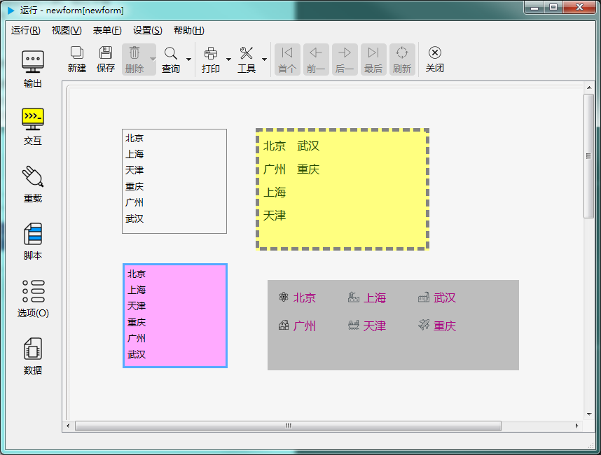

# 第二章 标准控件 - 列表控件

列表控件用于显示一些条目的清单。如下图示：

---

<h2 id="category">目录</h2>

- [继承的属性和函数](#继承的属性和函数)

- [自有属性](#列表控件的自有属性)

- [自有成员函数](#列表控件自有成员函数)

- [信号](#列表控件的信号)

- [可编程函数](#可编程函数)

---

## 继承的属性和函数

- [继承自QObject 的属性](2-1-qobject?id=属性)

- [继承自QObject 的 成员函数](2-1-qobject?id=成员函数)

- [继承自widgetDelegateBase的属性](2-2-base?id=属性)

- [继承自widgetDelegateBase的成员函数](2-2-base?id=成员函数)

---

## 列表控件的自有属性

[返回目录](#category)

|       属性       |   值类型    | 读写类型  |                     说明                      |
| ---------------- | ----------- | -------- | --------------------------------------------- |
| allowSelectMulti | bool        | 可读 可写 | 是否允许选择多项                               |
| count            | int         | 可读      | 列表中项目的数量                               |
| currentRow       | int         | 可读 可写 | 当前行                                         |
| gridWidth        | int         | 可读 可写 | 网格宽度                                       |
| gridHeight       | int         | 可读 可写 | 网格高度                                       |
| iconSize         | int         | 可读 可写 | 图标尺寸，长宽相同（像素为单位）。V3.1.006引入。 |
| listtext         | QStringList | 可读      | 所有文本的列表                                 |
| listvalue        | QStringList | 可读      | 所有值的列表                                   |
| margin           | int         | 可读 可写 | 边界宽度                                       |
| sortingEnabled   | bool        | 可读 可写 | 是否允许排序                                   |
| spacing          | int         | 可读 可写 | 项目周围空白空间的大小                          |
| uniformItemSizes | bool        | 可读 可写 | 条目是否统一尺寸                               |
| wrapping         | bool        | 可读 可写 | 是否自动换行                                   |

- ### 属性：allowSelectMulti （类型：bool 可读 可写）

是否允许选择多项

|      |                         调用方法                         |
| ---- | ------------------------------------------------------- |
| 读取 | bool allowSelectMulti() const                           |
| 修改 | void setAllowSelectMulti( bool allowSelectMulti ) const |

- ### 属性：count （类型：int 可读 ）

列表中项目的数量。

|      |      调用方法      |
| ---- | ----------------- |
| 读取 | int count() const |

- ### 属性：currentRow （类型：int 可读 可写）

当前行。

|      |                  调用方法                   |
| ---- | ------------------------------------------ |
| 读取 | int currentRow() const                     |
| 修改 | void setCurrentRow( int currentRow ) const |

- ### 属性：gridHeight （类型：int 可读 可写）

用于布置项目的网格的高度。

|      |                  调用方法                   |
| ---- | ------------------------------------------ |
| 读取 | int gridHeight() const                     |
| 修改 | void setGridHeight( int gridHeight ) const |

- ### 属性：gridWidth （类型：int 可读 可写）

用于布置项目的网格的宽度。

|      |                 调用方法                  |
| ---- | ---------------------------------------- |
| 读取 | int gridWidth() const                    |
| 修改 | void setGridWidth( int gridWidth ) const |

- ### 属性：iconSize （类型：int 可读 可写）

图标尺寸，长宽相同（像素为单位）。V3.1.006引入。

|      |              调用方法               |
| ---- | ---------------------------------- |
| 读取 | int iconSize() const               |
| 修改 | void setIconSize( int size ) const |

- ### 属性：listtext （类型：QStringList 可读 ）

所有列表项目显示的文本的列表。

|      |           调用方法            |
| ---- | ---------------------------- |
| 读取 | QStringList listtext() const |

- ### 属性：listvalue （类型：QStringList 可读 ）

所有列表项目的值的列表。

|      |            调用方法            |
| ---- | ----------------------------- |
| 读取 | QStringList listvalue() const |

- ### 属性：margin （类型：int 可读 可写）

边界宽度（像素为单位）。

|      |              调用方法               |
| ---- | ---------------------------------- |
| 读取 | int margin() const                 |
| 修改 | void setMargin( int margin ) const |

- ### 属性：sortingEnabled （类型：bool 可读 可写）

是否允许排序。

|      |                       调用方法                       |
| ---- | --------------------------------------------------- |
| 读取 | bool sortingEnabled() const                         |
| 修改 | void setSortingEnabled( bool sortingEnabled ) const |

- ### 属性：spacing （类型：int 可读 可写）

列表中项目周围的空白空间大小。

|      |               调用方法                |
| ---- | ------------------------------------ |
| 读取 | int spacing() const                  |
| 修改 | void setSpacing( int spacing ) const |

- ### 属性：uniformItemSizes （类型：bool 可读 可写）

各项目是否统一尺寸。

|      |                     调用方法                      |
| ---- | ------------------------------------------------ |
| 读取 | bool uniformItemSizes () const                   |
| 修改 | void setUniformItemSizes ( bool wrapping ) const |

- ### 属性：wrapping （类型：bool 可读 可写）

项目布局是否应换行。用于控制当可见区域中不再有空间时布局是否应换行。

|      |                 调用方法                 |
| ---- | --------------------------------------- |
| 读取 | bool wrapping() const                   |
| 修改 | void setWrapping( bool wrapping ) const |

---

## 列表控件自有成员函数

[返回目录](#category)

所有属性的设置函数（参考上一节中修改属性的接口），都属于此类，都可以当做槽使用。除此之处，另外还包括以下几个成员函数：

|         函数          |                                              接口                                              |                               说明                                |
| --------------------- | ---------------------------------------------------------------------------------------------- | ----------------------------------------------------------------- |
| addItem               | void addItem ( listItemDelegate * item ) const                                                 | 添加项目                                                           |
| addItem               | void addItem(const QString &t,const QString &v,const QPixmap &icn) const                       | 在列表最后增加项目                                                 |
| addItem               | void addItem(const QString &t,const QString &v,const QString &icnfile="") const                | 在列表最后增加项目                                                 |
| addItems              | void addItems(const QStringList &t,const QStringList &v,const QStringList &icnfile) const      | 在列表最后增加多个项目                                              |
| addList               | void addList(const QVariantList &v) const                                                      | 在最后增加列表                                                     |
| clear                 | void clear() const                                                                             | 清除输入的内容对应的文本和千分位，但不会清除前缀和后缀，并且不影响其值 |
| clearSelection        | void clearSelection() const                                                                    | 取消所有选择，只是取消选择，不会掉项目                               |
| closePersistentEditor | void closePersistentEditor( listItemDelegate * item) const                                     | 关闭所指项目编辑器                                                 |
| currentItem           | listItemDelegate * currentItem () const                                                        | 当前项目                                                           |
| editItem              | void editItem ( listItemDelegate * item ) const                                                | 编辑项目                                                           |
| insertItem            | void insertItem ( int row, const QString & label ) const                                       | 在位置 row 处插入项目                                              |
| insertItem            | void insertItem ( int row, listItemDelegate * item ) const                                     | 在位置 row 处插入项目                                              |
| insertItem            | void insertItem(int x,const QString &t,const QString &v,const QPixmap &icon ) const            | 在指定位置添加项目                                                 |
| insertItem            | void insertItem(int x,const QString &t,const QString &v,const QString &iconfile="") const      | 在指定位置添加项目                                                 |
| insertItems           | void insertItems ( int row, const QStringList & labels ) const                                 | 在位置 row 处添加多个项目                                          |
| insertItems           | void insertItems(int x,const QStringList &t,const QStringList &v,                              | 在指定位置添加多个项目                                              |
|                       | 　　　　　　　　　　const QStringList &iconfile=QStringList()) const                            |                                                                   |
| insertList            | void insertList(int index,const QVariantList &v) const                                         | 在指定位置添加列表                                                 |
| isLeftToRight         | bool isLeftToRight() const                                                                     | 是否是从左到右陈列                                                 |
| isTopToBottom         | bool isTopToBottom() const                                                                     | 是否是从上到下陈列                                                 |
| item                  | listItemDelegate * item ( int row ) const                                                      | 返回第 row 行的项目（从0开始序号）                                  |
| itemAt                | listItemDelegate * itemAt ( const QPoint & p ) const                                           | 返回光标所在处的项目                                               |
| itemAt                | listItemDelegate * itemAt ( int x, int y ) const                                               | 返回坐标所在处的项目                                               |
| itemData              | QString itemData(int row) const                                                                | 返回指定行的项目的数据                                              |
| itemText              | QString itemText(int row) const                                                                | 返回指定行的项目的文本                                              |
| openPersistentEditor  | void openPersistentEditor ( listItemDelegate * item ) const                                    | 打开某个项目的编辑器                                               |
| removeItem            | void removeItem(int row) const                                                                 | 移除指定行对应的项目                                               |
| row                   | int row ( const listItemDelegate * item ) const                                                | 返回某个指定项目所在的行                                            |
| selectAll             | void selectAll() const                                                                         | 选择所有项目                                                       |
| selectedItemsCount    | int selectedItemsCount () const                                                                | 选中的项目的数量                                                   |
| selectedRows          | QVariantList selectedRows() const                                                              | 所有选中的项目的行号清单                                            |
| setCurrentItem        | void setCurrentItem (listItemDelegate * item ) const                                           | 设置当前项目                                                       |
| setCurrentItem        | void setCurrentItem(listItemDelegate *item, QItemSelectionModel::SelectionFlags command) const | 设置当前项目，可设置是否选择模式                                    |
| setData               | void setData(int row,const QString &val) const                                                 | 设指定行的数据                                                     |
| setIcon               | void setIcon(int row,const QPixmap &icon) const                                                | 设置指定行的图标                                                   |
| setIcon               | void setIcon(int row,const QString &iconfile) const                                            | 设置指定行的图标                                                   |
| setIconSize           | void setIconSize(int size) const                                                               | 设置图标尺寸。比如设置size为32，则图标尺寸为 32 * 32                 |
| setLeftToRight        | void setLeftToRight() const                                                                    | 设置从左到右陈列                                                   |
| setList               | void setList(const QVariantList &v) const                                                      | 批量设置整个列表                                                   |
| setText               | void setText(int row,const QString &txt) const                                                 | 设置指定行的文本                                                   |
| setTopToBottom        | void setTopToBottom() const                                                                    | 设置从上到下陈列                                                   |
| sortItems             | void sortItems ( bool ascorder = true ) const                                                  | 对项目进行排序                                                     |
| takeItem              | listItemDelegate * takeItem ( int row ) const                                                  | 取出指定序号的项目                                                 |
| unselectedRows        | QVariantList unselectedRows() const                                                            | 所有未选中的项目的行号清单                                          |
| visualItemRect        | QRect visualItemRect ( const listItemDelegate * item ) const                                   | 指定项目的可见区域的尺寸                                            |
	
---

## 列表控件的信号

[返回目录](#category)

|         信号         |                              接口                              |                说明                |
| -------------------- | -------------------------------------------------------------- | --------------------------------- |
| currentItemChanged   | 	void currentItemChanged ( int currentRow, int previousRow ) | 当前项目发生改变时发出此信号        |
| currentRowChanged    | 	void currentRowChanged ( int currentRow )                   | 当前行发生变化时发出此信号          |
| currentTextChanged   | 	void currentTextChanged ( const QString & currentText )     | 当前项目文本发生变化时发出此信号     |
| itemActivated        | 	void itemActivated ( int row )                              | 项目被点击或双击时发出此信号        |
| itemChanged          | 	void itemChanged ( int row )                                | 项目发生变化时发出此信号            |
| itemClicked          | 	void itemClicked ( int row )                                | 点击项目时发出此信号                |
| itemDoubleClicked    | 	void itemDoubleClicked (int row)                            | 双击项目时发出此信号                |
| itemEntered          | 	void itemEntered ( int row )                                | 鼠标光标进入某项目时发出此信号       |
| itemPressed          | void itemPressed ( int row)                                    | 鼠标光标在某项目上被按下时发出此信号 |
| itemSelectionChanged | 	void itemSelectionChanged ()                                | 选择范围发生变化时发出此信号        |
| viewportEntered      | 	void viewportEntered ()                                     | 进入可视范围时发出此信号            |

---

## 可编程函数

[返回目录](#category)

- [可编程函数的详细说明](1-4-openscript?id=控件的可编程函数)

列表控件所有可编程函数的清单：

|                      函数                       |      函数名       |    传入参数     |                     返回值                      |                                                                                                                                                                                               说明                                                                                                                                                                                               |
| ---------------------------------------------- | ---------------- | -------------- | ---------------------------------------------- | ----------------------------------------------------------------------------------------------------------------------------------------------------------------------------------------------------------------------------------------------------------------------------------------------------------------------------------------------------------------------------------------------- |
| [鼠标进入时](1-4-openscript?id=enter)           | 控件名_enter      | 无              | 无                                             | 鼠标光标进入到这个控件时调用                                                                                                                                                                                                                                                                                                                                                                      |
| [鼠标离开时](1-4-openscript?id=leave)           | 控件名_leave      | 无              | 无                                             | 鼠标光标离开这个控件时调用                                                                                                                                                                                                                                                                                                                                                                        |
| [大小改变时](1-4-openscript?id=resize)          | 控件名_resize     | 无              | 无                                             | 控件大小改变时调用                                                                                                                                                                                                                                                                                                                                                                                |
| [当拖拽进入时](1-4-openscript?id=dragEnter)      | 控件名_dragEnter  | 拖拽进入的元数据 | 是否接受拖拽进入 **数据类型：布尔**          | 当从外部拖拽一些内容进入到这个控件时，会调用此函数。 不接受拖拽的控件不会调用此函数。 通过脚本判断是否接受拖拽， 如果接受，返回 True，如果在控件上放开鼠标，程序会转而调用“当拖拽放下时”函数。 如果不接受，返回False，程序将不会调用“当拖拽放下时”函数。  **传入参数：** format:元数据的格式列表，以列表类型传入 data:元数据的内容，以列表类型传入 dx:拖入的位置X坐标 dy:拖入的位置Y坐标 |
| [当拖拽放下时](1-4-openscript?id=drop)           | 控件名_drop       | 拖拽放下的元数据 | 是否接受拖拽放下 **数据类型：布尔**          | 拖拽放下时调用。允许则返回 True，否则返回 False。  **传入参数：** format:元数据的格式列表，以列表类型传入 data:元数据的内容，以列表类型传入 dx:放下的位置X坐标 dy:放下的位置Y坐标                                                                                                                                                                                                      |
| [生成元数据](1-4-openscript?id=mimedata)        | 控件名_mimedata   | 无              | 以列表形式生成控件的元数据 **数据类型：列表** | 拖拽时这个控件时生成元数据的内容                                                                                                                                                                                                                                                                                                                                                                   |
| [获得焦点](1-4-openscript?id=getfocus)          | 控件名_getfocus   | 无              | 无                                             | 获得焦点时调用                                                                                                                                                                                                                                                                                                                                                                                   |
| [失去焦点](1-4-openscript?id=lostfocus)         | 控件名_lostfocus  | 无              | 无                                             | 失去焦点时调用                                                                                                                                                                                                                                                                                                                                                                                   |
| [单次定时器超时时](1-4-openscript?id=singleshot) | 控件名_singleshot | 无              | 无                                             | 内置单次定时器超时时调用                                                                                                                                                                                                                                                                                                                                                                          |
| [定时器超时时](1-4-openscript?id=timeout)        | 控件名_timeout    | 定时器的ID值    | 无                                             | 内置定时器超时时调用                                                                                                                                                                                                                                                                                                                                                                              |

