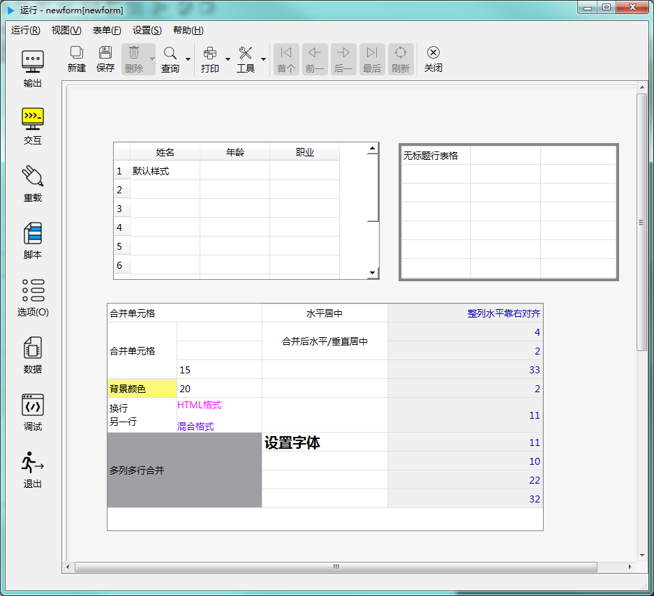

# 第二章 标准控件 - 表格控件

表格控件用于以表格形式显示数据和文字清单，既可以做为展示，也可以用于输入数据。如下图示：

---

<h2 id="category">目录</h2>

- [继承的属性和函数](#继承的属性和函数)

- [自有属性](#表格控件的自有属性)

- [自有成员函数](#表格控件自有成员函数)

- [信号](#表格控件的信号)

- [可编程函数](#可编程函数)

---

## 继承的属性和函数

- [继承自QObject 的属性](2-1-qobject?id=属性)

- [继承自QObject 的 成员函数](2-1-qobject?id=成员函数)

- [继承自widgetDelegateBase的属性](2-2-base?id=属性)

- [继承自widgetDelegateBase的成员函数](2-2-base?id=成员函数)

---

## 表格控件的自有属性

[返回目录](#category)

|            属性             | 值类型 | 读写类型  |       说明        |
| --------------------------- | ------ | -------- | ----------------- |
| alternateBaseColor          | QColor | 可读 可写 | 双行背景色        |
| alternatingRowColors        | bool   | 可读 可写 | 单双行颜色不同     |
| columnCount                 | int    | 可读 可写 | 列数              |
| columnHeaderFont            | QFont  | 可读 可写 | 列标题字体        |
| columnHeaderForegroundColor | QColor | 可读 可写 | 列标题前景色       |
| columnHeaderVisible         | bool   | 可读 可写 | 列标题是否可见     |
| columnResizeMode            | int    | 可读 可写 | 列宽调整模式       |
| cornerBackground            | QColor | 可读 可写 | 左上角按钮背景色   |
| cornerBorderColor           | QColor | 可读 可写 | 左上角按钮边框色   |
| cornerButtonEnabled         | bool   | 可读 可写 | 左上角按钮是否可用 |
| defaultColumnWidth          | int    | 可读 可写 | 缺省列宽          |
| defaultRowHeight            | int    | 可读 可写 | 缺省行高          |
| gridColor                   | QColor | 可读 可写 | 格线颜色          |
| gridStyle                   | int    | 可读 可写 | 网格线样式        |
| headerBorderColor           | QColor | 可读 可写 | 标题栏边框颜色     |
| horizontalScrollBarPolicy   | int    | 可读 可写 | 水平滚动条显示规则 |
| margin                      | int    | 可读 可写 | 边界宽度          |
| rowCount                    | int    | 可读 可写 | 行数              |
| rowHeaderBackgroundColor    | QColor | 可读 可写 | 行标题背景色       |
| rowHeaderFont               | QFont  | 可读 可写 | 行标题字体        |
| rowHeaderForegroundColor    | QColor | 可读 可写 | 行标题前景色       |
| rowHeaderVisible            | bool   | 可读 可写 | 行标题是否可见     |
| rowResizeMode               | int    | 可读 可写 | 行高调整模式       |
| selectionBehavior           | int    | 可读 可写 | 行列选择模式       |
| selectionColor              | QColor | 可读 可写 | 被选中区域的前景色 |
| selectionBackgroundColor    | QColor | 可读 可写 | 被选中区域的背景色 |
| selectionMode               | int    | 可读 可写 | 选择区域模式       |
| showGrid                    | bool   | 可读 可写 | 是否显示网格线     |
| sortingEnabled              | bool   | 可读 可写 | 是否允许排序       |
| stretchLastColumn           | bool   | 可读 可写 | 是否最后列自动扩展 |
| stretchLastRow              | bool   | 可读 可写 | 是否最后行自动扩展 |
| verticalScrollBarPolicy     | int    | 可读 可写 | 垂直滚动条显示规则 |
| wordwrap                    | bool   | 可读 可写 | 是否自动换行       |

- ### 属性：alternatingRowColors （类型：bool 可读 可写）

[返回目录](#category)

单双行不同背景色。

|      |                             调用方法                             |
| ---- | --------------------------------------------------------------- |
| 读取 | bool alternatingRowColors() const                               |
| 修改 | void setAlternatingRowColors( bool alternatingRowColors ) const |

- ### 属性：alternateBaseColor （类型：QColor 可读 可写）

[返回目录](#category)

双行背景色。

|      |                               调用方法                                |
| ---- | -------------------------------------------------------------------- |
| 读取 | QColor alternateBaseColor() const                                    |
| 修改 | void setAlternateBaseColor( const QColor &alternateBaseColor ) const |

- ### 属性：columnCount （类型：int 可读 可写）

[返回目录](#category)

列数。

|      |                   调用方法                    |
| ---- | -------------------------------------------- |
| 读取 | int columnCount() const                      |
| 修改 | void setColumnCount( int columnCount ) const |

- ### 属性：columnHeaderFont （类型：QFont 可读 可写）

[返回目录](#category)

列标题字体。

|      |                             调用方法                             |
| ---- | --------------------------------------------------------------- |
| 读取 | QFont columnHeaderFont() const                                  |
| 修改 | void setColumnHeaderFont( const QFont &columnHeaderFont ) const |

- ### 属性：columnHeaderForegroundColor （类型：QColor 可读 可写）

[返回目录](#category)

列标题前景色。

|      |                                        调用方法                                         |
| ---- | -------------------------------------------------------------------------------------- |
| 读取 | QColor columnHeaderForegroundColor() const                                             |
| 修改 | void setColumnHeaderForegroundColor( const QColor &columnHeaderForegroundColor ) const |

- ### 属性：columnHeaderVisible （类型：bool 可读 可写）

[返回目录](#category)

列标题是否可见。

|      |                            调用方法                            |
| ---- | ------------------------------------------------------------- |
| 读取 | bool columnHeaderVisible() const                              |
| 修改 | void setColumnHeaderVisible( bool columnHeaderVisible ) const |

- ### 属性：columnResizeMode （类型：int 可读 可写）

[返回目录](#category)

列宽调整模式。

|      |                        调用方法                         |
| ---- | ------------------------------------------------------ |
| 读取 | int columnResizeMode() const                           |
| 修改 | void setColumnResizeMode( int columnResizeMode ) const |
|      | **columnResizeMode取值：**                             |
|      | pub.INTERACTIVE 用户可调                                |
|      | pub.FIXED  固定大小                                     |
|      | pub.STRETCH 内容自动拉伸                                |
|      | pub.RESIZETOCONTENTS 按内容调整大小                     |

- ### 属性：cornerBackground（类型：QColor 可读 可写）

[返回目录](#category)

左上角按钮背景色。

|      |                       调用方法                        |
| ---- | ---------------------------------------------------- |
| 读取 | QColor cornerBackground() const                      |
| 修改 | void setCornerBackground( const QColor &color) const |

- ### 属性：cornerBorderColor（类型：QColor 可读 可写）

[返回目录](#category)

左上角按钮边框颜色。

|      |                        调用方法                        |
| ---- | ----------------------------------------------------- |
| 读取 | QColor cornerBorderColor() const                      |
| 修改 | void setCornerBorderColor( const QColor &color) const |

- ### 属性：cornerButtonEnabled （类型：bool 可读 可写）

[返回目录](#category)

左上角按钮是否可用。如果是可用的，点击这个按钮，可以选择所有单元格。

|      |                            调用方法                            |
| ---- | ------------------------------------------------------------- |
| 读取 | bool cornerButtonEnabled() const                              |
| 修改 | void setCornerButtonEnabled( bool cornerButtonEnabled ) const |

- ### 属性：defaultColumnWidth （类型：int 可读 可写）

[返回目录](#category)

缺省列宽。

|      |                          调用方法                           |
| ---- | ---------------------------------------------------------- |
| 读取 | int defaultColumnWidth() const                             |
| 修改 | void setDefaultColumnWidth( int defaultColumnWidth ) const |

- ### 属性：defaultRowHeight （类型：int 可读 可写）

[返回目录](#category)

缺省行高。

|      |                        调用方法                         |
| ---- | ------------------------------------------------------ |
| 读取 | int defaultRowHeight() const                           |
| 修改 | void setDefaultRowHeight( int defaultRowHeight ) const |

- ### 属性：gridColor （类型：QColor 可读 可写）

[返回目录](#category)

格线颜色。

|      |                    调用方法                    |
| ---- | --------------------------------------------- |
| 读取 | QColor gridColor() const                      |
| 修改 | void setGridColor( const QColor &color) const |

- ### 属性：gridStyle （类型：int 可读 可写）

[返回目录](#category)

网格样式。

|      |                 调用方法                  |
| ---- | ---------------------------------------- |
| 读取 | int gridStyle() const                    |
| 修改 | void setGridStyle( int gridStyle ) const |
|      | **gridStyle取值：**                      |
|      | pub.SOLIDLINE 实线                       |
|      | pub.DASHLINE 破折线                      |
|      | pub.DOTLINE 点划线                       |
|      | pub.DASHDOTLINE 破折-点线                 |
|      | pub.DASHDOTDOTLINE 破折-点-点线           |

- ### 属性：headerBorderColor（类型：QColor 可读 可写）

[返回目录](#category)

标题行边框颜色。

|      |                        调用方法                         |
| ---- | ------------------------------------------------------ |
| 读取 | QColor headerBorderColor() const                       |
| 修改 | void setHheaderBorderColor( const QColor &color) const |

- ### 属性：horizontalScrollBarPolicy （类型：int 可读 可写）

[返回目录](#category)

水平滚动条显示规则。

|      |                                 调用方法                                  |
| ---- | ------------------------------------------------------------------------ |
| 读取 | int horizontalScrollBarPolicy() const                                    |
| 修改 | void setHorizontalScrollBarPolicy( int horizontalScrollBarPolicy ) const |
|      | **horizontalScrollBarPolicy取值**                                        |
|      | pub.SCROLLBAR_AS_NEEDED 需要时显示                                        |
|      | pub.SCROLLBAR_ALWAYS_OFF 一直隐藏                                         |
|      | pub.SCROLLBAR_ALWAYS_ON 一直显示                                          |

- ### 属性：margin （类型：int 可读 可写）

[返回目录](#category)

边界宽度（像素值）。

|      |              调用方法               |
| ---- | ---------------------------------- |
| 读取 | int margin() const                 |
| 修改 | void setMargin( int margin ) const |

- ### 属性：rowCount （类型：int 可读 可写）

[返回目录](#category)

行数。

|      |                调用方法                 |
| ---- | -------------------------------------- |
| 读取 | int rowCount() const                   |
| 修改 | void setRowCount( int rowCount ) const |

- ### 属性：rowHeaderBackgroundColor （类型：QColor 可读 可写）

[返回目录](#category)

行标题背景色。

|      |                                     调用方法                                      |
| ---- | -------------------------------------------------------------------------------- |
| 读取 | QColor rowHeaderBackgroundColor() const                                          |
| 修改 | void setRowHeaderBackgroundColor( const QColor &rowHeaderBackgroundColor ) const |

- ### 属性：rowHeaderFont （类型：QFont 可读 可写）

[返回目录](#category)

行标题字体。

|      |                          调用方法                          |
| ---- | --------------------------------------------------------- |
| 读取 | QFont rowHeaderFont() const                               |
| 修改 | void setRowHeaderFont( const QFont &rowHeaderFont ) const |

- ### 属性：rowHeaderForegroundColor （类型：QColor 可读 可写）

[返回目录](#category)

行标题前景色。

|      |                                     调用方法                                      |
| ---- | -------------------------------------------------------------------------------- |
| 读取 | QColor rowHeaderForegroundColor() const                                          |
| 修改 | void setRowHeaderForegroundColor( const QColor &rowHeaderForegroundColor ) const |

- ### 属性：rowHeaderVisible （类型：bool 可读 可写）

[返回目录](#category)

行标题是否可见。

|      |                         调用方法                         |
| ---- | ------------------------------------------------------- |
| 读取 | bool rowHeaderVisible() const                           |
| 修改 | void setRowHeaderVisible( bool rowHeaderVisible ) const |

- ### 属性：rowResizeMode （类型：int 可读 可写）

[返回目录](#category)

行高调整模式。

|      |                     调用方法                      |
| ---- | ------------------------------------------------ |
| 读取 | int rowResizeMode() const                        |
| 修改 | void setRowResizeMode( int rowResizeMode ) const |
|      | **rowResizeMode取值：**                          |
|      | pub.INTERACTIVE 用户可调                          |
|      | pub.FIXED  固定大小                               |
|      | pub.STRETCH 内容自动拉伸                          |
|      | pub.RESIZETOCONTENTS 按内容调整大小               |

- ### 属性：selectionBehavior （类型：int 可读 可写）

[返回目录](#category)

行列选择模式。更详细的说明请参考 Qt 文档。

|      |                         调用方法                          |
| ---- | -------------------------------------------------------- |
| 读取 | int selectionBehavior() const                            |
| 修改 | void setSelectionBehavior( int selectionBehavior ) const |
|      | **selectionBehavior**                                    |
|      | pub.SELECT_ITEMS 选择单元格                               |
|      | pub.SELECT_ROWS 选择行                                   |
|      | pub.SELECT_COLUMNS 选择列                                |

- ### 属性：selectionColor （类型：QColor 可读 可写）

[返回目录](#category)

被选中区域的前景色。

|      |                       调用方法                       |
| ---- | --------------------------------------------------- |
| 读取 | QColor selectionColor() const                       |
| 修改 | void setSelectionColor( const QColor& color ) const |

- ### 属性：selectionBackgroundColor （类型：QColor 可读 可写）

[返回目录](#category)

被选中区域的背景色。

|      |                            调用方法                            |
| ---- | ------------------------------------------------------------- |
| 读取 | QColor selectionBackgroundColor() const                       |
| 修改 | void setSelectionBackgroundColor( const QColor& color ) const |

- ### 属性：selectionMode （类型：int 可读 可写）

[返回目录](#category)

选择区域模式。更详细的说明请参考 Qt 文档。

|      |                      调用方法                       |
| ---- | --------------------------------------------------- |
| 读取 | int selectionMode() const                           |
| 修改 | void setSelectionMode( int selectionMode ) const    |
|      | **selectionMode**                                   |
|      | pub.SINGLE_SELECTION  只允许选择一个对象             |
|      | pub.CONTIGUOUS_SELECTION 选择连续区域                |
|      | pub.EXTENDED_SELECTION 扩展选择（可选择不连续的区域） |
|      | pub.MULTI_SELECTION 允许选择多个对象                 |
|      | pub.NO_SELECTION 不允许选择                          |

- ### 属性：showGrid （类型：bool 可读 可写）

[返回目录](#category)

是否显示网格线。

|      |                 调用方法                 |
| ---- | --------------------------------------- |
| 读取 | bool showGrid() const                   |
| 修改 | void setShowGrid( bool showGrid ) const |

- ### 属性：sortingEnabled （类型：bool 可读 可写）

[返回目录](#category)

是否允许排序。

|      |                       调用方法                       |
| ---- | --------------------------------------------------- |
| 读取 | bool sortingEnabled() const                         |
| 修改 | void setSortingEnabled( bool sortingEnabled ) const |

- ### 属性：stretchLastColumn （类型：bool 可读 可写）

[返回目录](#category)

最后列是否自动扩展。设为 True 时，最后一列的宽度会延伸到填满表格的水平方向。

|      |                          调用方法                          |
| ---- | --------------------------------------------------------- |
| 读取 | bool stretchLastColumn() const                            |
| 修改 | void setStretchLastColumn( bool stretchLastColumn ) const |

- ### 属性：stretchLastRow （类型：bool 可读 可写）

[返回目录](#category)

最后行是否自动扩展。设为 True 时，最后一行的高度会延伸到填满表格的垂直方向。

|      |                       调用方法                       |
| ---- | --------------------------------------------------- |
| 读取 | bool stretchLastRow() const                         |
| 修改 | void setStretchLastRow( bool stretchLastRow ) const |

- ### 属性：verticalScrollBarPolicy （类型：int 可读 可写）

[返回目录](#category)

垂直滚动条显示规则。

|      |                               调用方法                                |
| ---- | -------------------------------------------------------------------- |
| 读取 | int verticalScrollBarPolicy() const                                  |
| 修改 | void setVerticalScrollBarPolicy( int verticalScrollBarPolicy ) const |
|      | **verticalScrollBarPolicy取值：**                                    |
|      | pub.SCROLLBAR_AS_NEEDED 需要时显示                                    |
|      | pub.SCROLLBAR_ALWAYS_OFF 一直隐藏                                     |
|      | pub.SCROLLBAR_ALWAYS_ON 一直显示                                      |

- ### 属性：wordwrap （类型：bool 可读 可写）

[返回目录](#category)

单元格内是否自动换行。

|      |                 调用方法                 |
| ---- | --------------------------------------- |
| 读取 | bool wordwrap() const                   |
| 修改 | void setWordwrap( bool wordwrap ) const |

---

## 表格控件自有成员函数

[返回目录](#category)

所有属性的设置函数（参考上一节中修改属性的接口），都属于此类，都可以当做槽使用。除此之处，另外还包括以下几个成员函数：

|           函数            |                                                                        接口                                                                        |                        说明                        |
| ------------------------- | -------------------------------------------------------------------------------------------------------------------------------------------------- | -------------------------------------------------- |
| cell                      | tableCellDelegate * cell ( int row, int column ) const                                                                                             | 按指定的行和列返回单元格对象                         |
| cellAt                    | tableCellDelegate * cellAt ( const QPoint & point ) const                                                                                          | 按光标所在位置返回单元格对象                         |
| cellAt                    | tableCellDelegate * cellAt ( int ax, int ay ) const                                                                                                | 按光标所在位置返回单元格对象                         |
| clear                     | void clear()const                                                                                                                                  | 清除所有，所括列标题和行标题和表格内容都清除          |
| clearContents             | void clearContents()const                                                                                                                          | 只清除表格内容，行列标题保留                         |
| clearSelection            | void clearSelection ()const                                                                                                                        | 取消所有已选中的内容，不影响内容，只是不再选中这些项目 |
| clearSpans                | void clearSpans()const                                                                                                                             | 清除所有单元格合并的设置                             |
| closeCurrentEditor        | void closeCurrentEditor()const                                                                                                                     | 关闭当前单元格编辑器                                 |
| closePersistentEditor     | void closePersistentEditor ( tableCellDelegate * item ) const                                                                                      | 关闭指定单元格对象的编辑器                           |
| columnAt                  | int columnAt ( int x ) const                                                                                                                       | 按鼠标位置 x 坐标返回对应的列                        |
| columnHeaderHeight        | int columnHeaderHeight()const                                                                                                                      | 列标题高度                                          |
| columnHeaderLength        | int columnHeaderLength()const                                                                                                                      | 列标题宽度                                          |
| columnSpan                | int columnSpan ( int row, int column ) const                                                                                                       | 指定单元格合并了几列                                 |
| columnWidth               | int columnWidth ( int column ) const                                                                                                               | 返回指定列的列宽                                    |
| currentCell               | tableCellDelegate * currentCell () const                                                                                                           | 当前单元格                                          |
| currentColumn             | int currentColumn () const                                                                                                                         | 当前单元格所在列                                    |
| currentEditor             | widgetDelegate* currentEditor() const                                                                                                              | 当前编辑器                                          |
| currentRow                | int currentRow () const                                                                                                                            | 当前单元格所在行                                    |
| editCell                  | void editCell( tableCellDelegate * item ) const                                                                                                    | 编辑指定单元格                                      |
| isCreateEditorByColumn    | bool editorIsByColumn() const                                                                                                                      | 是否按列设置编辑器                                  |
| isCreateEditorByRow       | bool editorIsByRow() const                                                                                                                         | 是否按行设置编辑器                                  |
| isCreateEditorByScript    | bool editorIsByScript() const                                                                                                                      | 是否按脚本设置编辑器                                 |
| editorsName               | QStringList editorsName() const                                                                                                                    | 所以编辑器的名称清单                                 |
| hiddenColumnCount         | int hiddenColumnCount() const                                                                                                                      | 隐藏的列数                                          |
| hiddenRowCount            | int hiddenRowCount() const                                                                                                                         | 隐藏的行数                                          |
| hideColumn                | void hideColumn ( int column )const                                                                                                                | 隐藏指定列                                          |
| hideRow                   | void hideRow ( int row )const                                                                                                                      | 隐藏指定行                                          |
| horizontalHeaderItem      | tableCellDelegate * horizontalHeaderItem ( int column ) const                                                                                      | 指定列的行标题对象                                  |
| horizontalHeaderLabels    | QStringList horizontalHeaderLabels() const                                                                                                         | 统一设置列标题                                      |
| insertColumn              | void insertColumn( int column ,const QString &title = "")const                                                                                     | 在指定位置插入列                                    |
| insertRow                 | void insertRow( int row ,const QString &title = "")const                                                                                           | 在指定位置插入行                                    |
| isColumnHidden            | bool isColumnHidden ( int column ) const                                                                                                           | 返回指定列是否隐藏                                  |
| isRowHidden               | bool isRowHidden ( int row ) const                                                                                                                 | 返回指定行是否隐藏                                  |
| openPersistentEditor      | void openPersistentEditor ( tableCellDelegate * item )const                                                                                        | 打开指定单元格对象的编辑器                           |
| range                     | tableRangeDelegate* range( int top, int left, int bottom, int right )const                                                                         | 指定单元格范围                                      |
| removeColumn              | void removeColumn ( int column )const                                                                                                              | 移除指定列                                          |
| removeColumnEditor        | void removeColumnEditor(int column)const                                                                                                           | 移除指定列的编辑器                                  |
| removeRange               | void removeRange(tableRangeDelegate* range,bool downToUp=false,bool rightToLeft=false)const                                                        | 删除指定范围的单元格                                 |
| removeRow                 | void removeRow ( int row )const                                                                                                                    | 移除指定行                                          |
| removeRowEditor           | void removeRowEditor(int row)const                                                                                                                 | 删除指定行的编辑器                                  |
| resizeColumnsToContents   | void resizeColumnsToContents ()const                                                                                                               | 按内容自动调整所有列的列宽                           |
| resizeColumnToContents    | void resizeColumnToContents ( int column ) const                                                                                                   | 按内容自动调整指定列的列宽                           |
| resizeRowsToContents      | void resizeRowsToContents ()const                                                                                                                  | 按内容自动调整所有行的高度                           |
| resizeRowToContents       | void resizeRowToContents ( int row ) const                                                                                                         | 按内容自动调整指定行的高度                           |
| rowAt                     | int rowAt ( int y ) const                                                                                                                          | 返回鼠标y值对应第几行                                |
| rowHeaderLength           | int rowHeaderLength()const                                                                                                                         | 行标题高度                                          |
| rowHeaderWidth            | int rowHeaderWidth()const                                                                                                                          | 行标题宽度                                          |
| rowHeight                 | int rowHeight ( int row ) const                                                                                                                    | 返回指定行的高度                                    |
| rowSpan                   | int rowSpan ( int row, int column ) const                                                                                                          | 返回指定单元格合并了几行                             |
| rowViewportPosition       | int rowViewportPosition ( int row ) const                                                                                                          | 返回指定行的可视范围的位置                           |
| scrollToBottom            | void scrollToBottom ()const                                                                                                                        | 垂直滚动条滚动到底端                                 |
| scrollToCellAtBottom      | void scrollToCellAtBottom ( const tableCellDelegate * item ) const                                                                                 | 滚动到指定单元格在最底部                             |
| scrollToCellAtCenter      | void scrollToCellAtCenter( const tableCellDelegate * item ) const                                                                                  | 滚动到指定单元格在中央位置                           |
| scrollToCellAtTop         | void scrollToCellAtTop ( const tableCellDelegate * item ) const                                                                                    | 滚动指定单元格到最顶端                               |
| scrollToCellEnsureVisible | void scrollToCellEnsureVisible ( const tableCellDelegate * item ) const                                                                            | 滚动指定单元格确保可见                               |
| scrollToTop               | void scrollToTop ()const                                                                                                                           | 垂直滚动条滚动到顶端                                 |
| selectCell                | void selectCell ( int row, int column ) const                                                                                                      | 选择指定单元格                                      |
| selectColumn              | void selectColumn ( int column )const                                                                                                              | 选择指定列                                          |
| selectedCell              | tableCellDelegate* selectedCell(int index)const                                                                                                    | 按索引返回选中的部分单元格                           |
| selectedCellsCount        | int selectedCellsCount() const                                                                                                                     | 选中的所有单元格的数量                               |
| selectedRange             | tableRangeDelegate* selectedRange(int index)const                                                                                                  | 按索引返回选中的部分区域                             |
| selectedRangesCount       | int selectedRangesCount() const                                                                                                                    | 选中的所有不连续区域的数量                           |
| selectRow                 | void selectRow ( int row )const                                                                                                                    | 选择指定行                                          |
| setCell                   | void setCell ( int row, int column, tableCellDelegate * item ) const                                                                               | 设置单元格对象                                      |
| setCellBackground         | void setCellBackground(int row,int column,const QColor & brushcolor)const                                                                          | 设置单元格背景颜色                                  |
| setCellData               | void setCellData(int row,int col,const QString & text,const QVariant & value)const                                                                 | 设置单元格显示的文本和数据                           |
| setCellFont               | void setCellFont ( int row, int column,const QFont & font )const                                                                                   | 设置单元格字体                                      |
| setCellForeground         | void setCellForeground(int row,int column,const QColor & brushcolor)const                                                                          | 设置单元格前景色                                    |
| setCellHAlignment         | void setCellHAlignment ( int row, int column,int alignment )const                                                                                  | 设置单元格水平对齐方式                               |
| setCellsData              | void setCellsData(int row_from,int col_from,int row_to,int col_to,const QString & text,const QVariant & value)const                                | 批量设置多个单元格显示的文本和数据                    |
| setCellsHAlignment        | void setCellsHAlignment (int row1, int column1, int row2, int column2, int alignment )const                                                        | 设置多个单元格水平对齐方式                           |
| setCellsText              | void setCellsText(int row_from,int col_from,int row_to,int col_to,const QString & text)const                                                       | 批量设置多个单元格显示的文本                         |
| setCellsVAlignment        | void setCellsVAlignment ( int row1, int column1, int row2, int column2,int alignment )const                                                        | 设置多个单元格垂直对齐方式                           |
| setCellsValue             | void setCellsValue(int row_from,int col_from,int row_to,int col_to,const QVariant & value)const                                                    | 批量设置多个单元的数据                               |
| setCellText               | void setCellText(int row,int col,const QString & text)const                                                                                        | 设置指定单元格显示的文字                             |
| setCellVAlignment         | void setCellVAlignment ( int row, int column,int alignment )const                                                                                  | 设置单元格垂直对齐方式                               |
| setCellValue              | void setCellValue(int row,int col,const QVariant & value)const                                                                                     | 设置指定单元格的数据                                 |
| setColumnBackground       | void setColumnBackground(int column, const QColor & brushcolor)const                                                                               | 按列设置背景色                                      |
| setColumnData             | void setColumnData(int col,QVariant v,bool forDisplay=true)const                                                                                   | 按列批量设置数据                                    |
| setColumnEditor           | void setColumnEditor(int column,const QString &editorName)const                                                                                    | 设置指定列的编辑器                                  |
| setColumnFont             | void setColumnFont ( int column,const QFont & font )const                                                                                          | 按列设置字体                                        |
| setColumnForeground       | void setColumnForeground(int column ,const QColor & brushcolor)const                                                                               | 按列设置前景色                                      |
| setColumnWidth            | void setColumnWidth ( int column, int width ) const                                                                                                | 按列设置列宽                                        |
| setCurrentCell            | void setCurrentCell ( int row, int column ) const                                                                                                  | 设置当前单元格                                      |
| setCurrentCell            | void setCurrentCell ( tableCellDelegate * item ) const                                                                                             | 设置当前单元格                                      |
| setCreateEditorByColumn   | void setEditorByColumn()const                                                                                                                      | 设置按列设置编辑器                                  |
| setCreateEditorByRow      | void setEditorByRow()const                                                                                                                         | 设置按行设置编辑器                                  |
| setCreateEditorByScript   | void setEditorByScript()const                                                                                                                      | 设置按脚本设置编辑器                                 |
| setHorizontalHeaderItem   | void setHorizontalHeaderItem ( int column, tableCellDelegate * item ) const                                                                        | 设置指定列的列标题对象                               |
| setHorizontalHeaderLabels | void setHorizontalHeaderLabels ( const QStringList & labels ) const                                                                                | 批量设置列标题显示的文本                             |
| setHorizontalValue        | void setHorizontalValue(int value)const                                                                                                            | 设置水平滚动条的值                                  |
| setList                   | void setList(const QVariantList &list,int row=0,int column=0,const QStringList & title=QStringList())const                                         | 快速设置表格内容                                    |
| setListByQuery            | bool setListByQuery(const QString &table,const QStringList &fields=QStringList() ,const QString &filter="",int sortIndex=-1,bool ASC=true)const | 使用数据表快速设置表格内容                           |
| setListBySQL              | bool setListBySQL(const QString &sql,const QStringList & title=QStringList())const                                                                 | 使用SQL语句快速设置表格内容                          |
| setRangeSelected          | void setRangeSelected ( const tableRangeDelegate* range, bool select ) const                                                                       | 设置某个区域的选中状态                               |
| setRowBackground          | void setRowBackground(int row, const QColor & brushcolor)const                                                                                     | 按行设置背景色                                      |
| setRowData                | void setRowData(int row,QVariant v,bool forDisplay=true)const                                                                                      | 按行批量设置值                                      |
| setRowEditor              | void setRowEditor(int row,const QString &editorName)const                                                                                          | 设置指定行的编辑器                                  |
| setRowFont                | void setRowFont ( int row,const QFont & font )const                                                                                                | 按行设置字体                                        |
| setRowForeground          | void setRowForeground(int row, const QColor & brushcolor)const                                                                                     | 按行设置前景色                                      |
| setRowHeight              | void setRowHeight ( int row, int height )const                                                                                                     | 设置指定行的行高                                    |
| setSpan                   | void setSpan ( int row, int column, int rowSpan, int columnSpan ) const                                                                            | 设置某个单元格合并的行数和列数                       |
| setVerticalHeaderItem     | void setVerticalHeaderItem ( int row, tableCellDelegate * item ) const                                                                             | 设置指定行行标题对象                                 |
| setVerticalHeaderLabels   | void setVerticalHeaderLabels ( const QStringList & labels )const                                                                                   | 批量设置行标题显示的文本                             |
| setVerticalValue          | void setVerticalValue(int value)const                                                                                                              | 设置垂直滚动条的值                                  |
| showColumn                | void showColumn ( int column )const                                                                                                                | 显示指定列                                          |
| showRow                   | void showRow ( int row )const                                                                                                                      | 显示指定行                                          |
| sortByColumn              | void sortByColumn ( int column, bool asc = true) const                                                                                             | 对指定列进行排序                                    |
| sumValue                  | double sumValue(int col)const                                                                                                                      | 对某列的数值求合                                    |
| takeCell                  | tableCellDelegate * takeCell ( int row, int column ) const                                                                                         | 取出并删除掉某个单元格对象                           |
| takeHorizontalHeaderItem  | tableCellDelegate * takeHorizontalHeaderItem ( int column ) const                                                                                  | 取出指定列的列标题对象                               |
| takeVerticalHeaderItem    | tableCellDelegate * takeVerticalHeaderItem ( int row ) const                                                                                       | 取出指定行的行标题对象                               |
| verticalHeaderItem        | tableCellDelegate * verticalHeaderItem ( int row ) const                                                                                           | 返回指定行的行标题对象                               |
| verticalHeaderLabels      | QStringList verticalHeaderLabels() const                                                                                                           | 返回行标题显示的文本清单                             |
| visualCellRect            | QRect visualCellRect ( const tableCellDelegate * item ) const                                                                                      | 指定单元格的可见区域尺寸大小                         |

---

## 表格控件的信号

[返回目录](#category)

|          信号          |                                                接口                                                |                 说明                 |
| ---------------------- | -------------------------------------------------------------------------------------------------- | ----------------------------------- |
| verticalValueChanged   | void verticalValueChanged(int value)                                                               | 垂直滚动条的值发生改变时发出此信号     |
| horizontalValueChanged | void horizontalValueChanged(int value)                                                             | 水平滚动条的值发生改变时时发出此信号   |
| cellActivated          | void cellActivated ( int row, int column )                                                         | 单元格激活时发出此信号                |
| cellChanged            | void cellChanged ( int row, int column )                                                           | 单元格的数据被修改时发出此信号        |
| cellClicked            | void cellClicked ( int row, int column )                                                           | 单元格被单击时发出此信号              |
| cellDoubleClicked      | void cellDoubleClicked ( int row, int column )                                                     | 单元格被双击时发出此信号              |
| cellEntered            | void cellEntered ( int row, int column )                                                           | 鼠标光标进入单元格时发出此信号        |
| cellPressed            | void cellPressed ( int row, int column )                                                           | 在单元格上按下鼠标时发出此信号        |
| currentCellChanged     | void currentCellChanged ( int currentRow, int currentColumn, int previousRow, int previousColumn ) | 在单元格之间切换时发出此信号          |
| itemSelectionChanged   | void itemSelectionChanged ()                                                                       | 选择范围发生改变时发出此信号          |
| viewportEntered        | void viewportEntered ()                                                                            | 进入可视区域时发出此信号              |
| itemClicked            | void itemClicked(tableCellDelegate* item)                                                          | 点击单元格对象时发出此信号            |
| currentItemChanged     | void currentItemChanged (tableCellDelegate* currentItem,tableCellDelegate* previousItem)           | 切换当前单元格对象时发出此信号        |
| itemActivated          | void itemActivated (tableCellDelegate* item)                                                       | 单元格对象被激活时发出此信号          |
| itemChanged            | void itemChanged ( tableCellDelegate* item)                                                        | 单元格对象数据发生改变时发出此信号     |
| itemDoubleClicked      | void itemDoubleClicked ( tableCellDelegate* item )                                                 | 单元格对象被双击时发出此信号          |
| itemEntered            | void itemEntered (tableCellDelegate* item)                                                         | 鼠标光标进入某单元格时发出此信号       |
| itemPressed            | void itemPressed ( tableCellDelegate* item)                                                        | 鼠标光标在某单元格中被按下时发出此信号 |

---

## 可编程函数

[返回目录](#category)

- [可编程函数的详细说明](1-4-openscript?id=可编程函数)

表格控件所有可编程函数的清单：

|                      函数                       |      函数名       |    传入参数     |                     返回值                      |                                                                                                                                                                                          说明                                                                                                                                                                                           |
| ----------------------------------------------- | ----------------- | --------------- | ---------------------------------------------- | --------------------------------------------------------------------------------------------------------------------------------------------------------------------------------------------------------------------------------------------------------------------------------------------------------------------------------------------------------------------------------------- |
| [编辑器](1-4-openscript?id=editor)               | 控件名_editor     | 单元格所在行和列 | 编辑器的名称                                    | 某个单元格进入编辑状态时调用                                                                                                                                                                                                                                                                                                                                                              |
| [鼠标进入时](1-4-openscript?id=enter)            | 控件名_enter      | 无              | 无                                             | 鼠标光标进入到这个控件时调用                                                                                                                                                                                                                                                                                                                                                              |
| [鼠标离开时](1-4-openscript?id=leave)            | 控件名_leave      | 无              | 无                                             | 鼠标光标离开这个控件时调用                                                                                                                                                                                                                                                                                                                                                               |
| [大小改变时](1-4-openscript?id=resize)           | 控件名_resize     | 无              | 无                                             | 控件大小改变时调用                                                                                                                                                                                                                                                                                                                                                                       |
| [当拖拽进入时](1-4-openscript?id=dragEnter)      | 控件名_dragEnter  | 拖拽进入的元数据 | 是否接受拖拽进入 **数据类型：布尔**          | 当从外部拖拽一些内容进入到这个控件时，会调用此函数。 不接受拖拽的控件不会调用此函数。 通过脚本判断是否接受拖拽， 如果接受，返回 True，如果在控件上放开鼠标，程序会转而调用“当拖拽放下时”函数。 如果不接受，返回False，程序将不会调用“当拖拽放下时”函数。 传入参数： format:元数据的格式列表，以列表类型传入 data:元数据的内容，以列表类型传入 dx:拖入的位置X坐标 dy:拖入的位置Y坐标 |
| [当拖拽放下时](1-4-openscript?id=drop)           | 控件名_drop       | 拖拽放下的元数据 | 是否接受拖拽放下 **数据类型：布尔**          | 拖拽放下时调用。允许则返回 True，否则返回 False。 format:元数据的格式列表，以列表类型传入 data:元数据的内容，以列表类型传入 dx:放下的位置X坐标 dy:放下的位置Y坐标                                                                                                                                                                                                                    |
| [生成元数据](1-4-openscript?id=mimedata)         | 控件名_mimedata   | 无              | 以列表形式生成控件的元数据 **数据类型：列表** | 拖拽时这个控件时生成元数据的内容                                                                                                                                                                                                                                                                                                                                                          |
| [获得焦点](1-4-openscript?id=getfocus)          | 控件名_getfocus   | 无              | 无                                             | 获得输入焦点时调用                                                                                                                                                                                                                                                                                                                                                                       |
| [失去焦点](1-4-openscript?id=lostfocus)         | 控件名_lostfocus  | 无              | 无                                             | 失去输入焦点时调用                                                                                                                                                                                                                                                                                                                                                                       |
| [单次定时器超时时](1-4-openscript?id=singleshot) | 控件名_singleshot | 无              | 无                                             | 内置单次定时器超时时调用                                                                                                                                                                                                                                                                                                                                                                 |
| [定时器超时时](1-4-openscript?id=timeout)        | 控件名_timeout    | 定时器的ID值     | 无                                             | 内置定时器超时时调用                                                                                                                                                                                                                                                                                                                                                                     |

