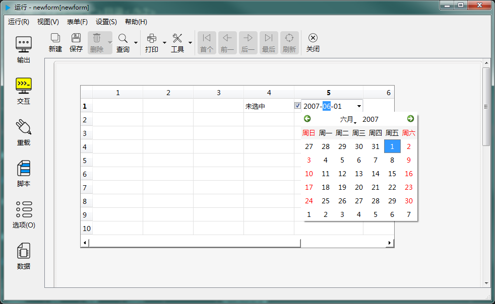

# 第二章 标准控件 - 编辑器

编辑器是在表格控件中对单元格内容进行编辑的一组控件。biForm中目前支持以下几种编辑器：

|        类型         |                                  说明                                   |             参考控件类型              |
| ------------------- | ----------------------------------------------------------------------- | ------------------------------------ |
| 无编辑器(只读编辑器) | 若单元格指定为无编辑器时，将不允许用户对单元格进行编辑，只能通过程序修改内容 |                                      |
| 文本编辑器          | 用于输入单行文本                                                         | [单行文本输入控件](2-3-lineedit)      |
| 整数编辑器          | 用于输入整数值                                                           | [整数编辑器](2-21-spin)              |
| 双精度浮点数编辑器   | 用于输入小数值                                                           | [双精度浮点数编辑器](2-22-doublespin) |
| 下拉列表框          | 使用下拉列表框在列表中选择                                               | [下拉列表框控件](2-7-combobox)        |
| 按钮                | 单元格内显示一个按钮                                                     | [按钮控件](2-5-button)               |
| 是/否               | 显示一个列表为“是”和“否”的下拉列表框                                      | [下拉列表框控件](2-7-combobox)        |
| 复选框              | 显示一个复选框                                                           | [复选框控件](2-13-checkbox)          |
| 日期输入框          | 用于输入日期值                                                           | [日期编辑器控件](2-14-date)           |
| 时间输入框          | 用于输入时间值                                                           | [时间编辑器控件](2-15-time)           |
| 日期时间输入框       | 用于输入日期和时间值                                                     | [日期时间编辑器控件](2-16-datetime)   |

---

<h2 id="category">目录</h2>

- [创建](#创建)

- [属性](#属性)

- [成员函数](#成员函数)

- [信号](#信号)

- [表格控件与编辑器相关的接口](#表格控件与编辑器相关的接口)
---

## 创建

[返回目录](#category)

编辑器由运行时引擎自动创建，并不需要开发者使用代码进行创建。但开发者需要指定在编辑某个单元格时，使用哪个编辑器。指定方式有以下几种：

| 编辑器与表格的关系 |               说明               |
| ----------------- | -------------------------------- |
| 按列设定          | 整列都是使用同一个编辑器          |
| 按行设定          | 整行都是使用同一个编辑器          |
| 脚本设定          | 按脚本返回的编辑器的名称设置编辑器 |

需要注意的是，运行时引擎会进入单元格编辑状态时重新创建一个新的编辑器控件，即使同一列设定的是同一个编辑器，每一个单元格中使用的编辑器控件是相同类型和属性的不同实例，并不是只有一个唯一的控件用于这一列上的所有单元格。

## 属性

[返回目录](#category)

所有编辑器与上面表格中对应的“参考控件类型”有差不多相同的属性，但以下几个属性会有所区别：

|      属性       |                                   说明                                    |
| --------------- | ------------------------------------------------------------------------ |
| x               | 变成只读属性，因为编辑器的控件位置由单元格决定，不允许修改                    |
| y               | 变成只读属性，因为编辑器的控件位置由单元格决定，不允许修改                    |
| width           | 变成只读属性，因为编辑器的控件大小由单元格决定，不允许修改                    |
| height          | 变成只读属性，因为编辑器的控件大小由单元格决定，不允许修改                    |
| visible         | 变成只读属性，因为编辑器控件一旦创建，总是可见的，用完即销毁，不提供隐藏的接口 |
| geometry        | 变成只读属性，因为编辑器的控件大小位置由单元格决定，不允许修改                |
| size            | 变成只读属性，因为编辑器的控件大小由单元格决定，不允许修改                    |
| rect            | 变成只读属性，因为编辑器的控件大小位置由单元格决定，不允许修改                |
| pos             | 变成只读属性，因为编辑器的控件位置由单元格决定，不允许修改                    |
| tabOrder        | 编辑器没有这个属性                                                         |
| maxheight       | 编辑器没有这个属性                                                         |
| minheight       | 编辑器没有这个属性                                                         |
| maxwidth        | 编辑器没有这个属性                                                         |
| minwidth        | 编辑器没有这个属性                                                         |
| showOnForm      | 编辑器没有这个属性                                                         |
| showOnPDF       | 编辑器没有这个属性                                                         |
| showWhenPrint   | 编辑器没有这个属性                                                         |
| spacing         | 编辑器没有这个“与标题的间距”这个属性，因为文本输入类控件的标题都设为“无标题”了 |
| updatesEnabled  | 编辑器没有这个属性                                                         |
| dragEnabled     | 编辑器没有这个属性                                                         |
| acceptDrops     | 编辑器没有这个属性                                                         |
| focus           | 编辑器没有这个属性                                                         |
| editTableRow    | 编辑器正在编辑的表格的行号（从0开始），只读属性                              |
| editTableColumn | 编辑器正在编辑的表格的列号（从0开始），只读属性                              |

## 成员函数

[返回目录](#category)

所有编辑器与上面表格中对应的“参考控件类型”成员函数基本相同，除了以下：

|    函数     |           接口           | 
| ----------- | ------------------------ |
| setShortCut | 按钮编辑器没有这个成员函数 |

## 信号

[返回目录](#category)

所有编辑器与上面表格中对应的“参考控件类型”的信号相同。

## 表格控件与编辑器相关的接口

假设表单上有一个表格控件名为”table“，其中设置了一个整数编辑器”editor_int“：

|                               接口                               |                  调用示例                   |                    说明                     |
| ---------------------------------------------------------------- | ------------------------------------------ | ------------------------------------------- |
| QStringList editorsName() const                                  | this.table.editorsName()                   | 返回所有编辑器的名称清单                      |
| bool editorIsByColumn() const		                               | this.table.editorIsByColumn()              | 是否“按列设定”                               |
| bool editorIsByRow() const	                                   | this.table.editorIsByRow()                 | 是否“按行设定”                               |
| bool editorIsByScript() const                                    | this.table.editorIsByScript()              | 是否“按脚本设定”                             |
| void setEditorByColumn() const                                   | this.table.setEditorByColumn()             | 设置为“按列设定”编辑器                       |
| void setEditorByRow()	const                                      | this.table.setEditorByRow()                | 设置为“按行设定”编辑器                       |
| void setEditorByScript() const                                   | this.table.setEditorByScript()             | 设置为“按脚本设定”编辑器                     |
| void setColumnEditor(int column,const QString &editorName) const | this.table.setColumnEditor(1,'editor_int') | 设置某列对应的编辑器，只在“按列设定”时有效     |
| void setRowEditor(int row,const QString &editorName) const       | this.table.setRowEditor(1,'editor_int')    | 设置某行对应的编辑器，只在“按行设定”时有效     |
| void removeColumnEditor(int column) const                        | this.table.removeColumnEditor(1)           | 移除对某列的编辑器的设置，只在“按列设定”时有效 |
| void removeRowEditor(int row)	const                              | this.table.removeRowEditor(1)              | 移除对某行的编辑器的设置，只在“按行设定”时有效 |
| widgetDelegate* currentEditor() const                            | editor=this.table.currentEditor()          | 返回当前正在使用的编辑器                      |
| void closeCurrentEditor()	const                                  | this.table.closeCurrentEditor()            | 关闭当前编辑器                               |

## 编辑器的生存周期

在某个单元格进入编辑状态时，才会创建编辑器对象，在结束编辑（比如选择了其它单元格，按下回车，控件失去焦点等）时，编辑器控件将被删除。所以在调用 currentEditor() 返回的编辑器对象指针时需要注意在编辑器被销毁时，该指针会被置空。

