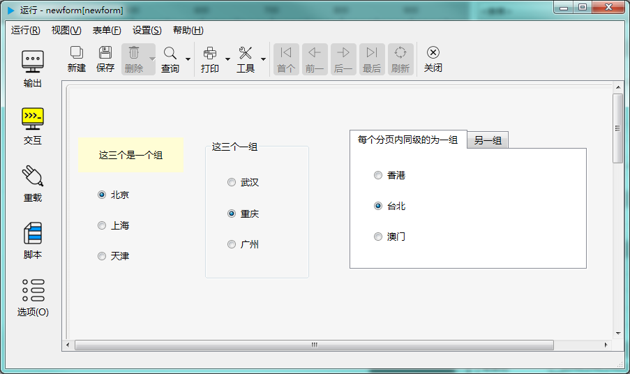

# 第二章 标准控件 - 单选按钮组

单选按钮组用于管理同一级多个单选按钮。在一个组的几个单选按钮，只有一个能为“选中”的状态。同属于一个父控件的同级的单选按钮组在 biForm 中会自动组成一个单选按钮组，并不需要使用脚本来设置。调用时使用父控件的接口来访问。

---

<h2 id="category">目录</h2>

- [如何调用](#如何调用)

- [属性](#属性)

- [成员函数](#成员函数)

- [信号](#信号)

---

## 如何调用

[返回目录](#category)

只有几种容器类控件会产生单选按钮组。在 biForm 中有以下几种：

|    容器     |                    如何调用单选按钮组                     |                                     说明                                     |
| ----------- | -------------------------------------------------------- | ---------------------------------------------------------------------------- |
| 表单        | int buttonGroupCount() const                             | 返回表单上单选按钮组的数量，一般都是返回1，意外情况时会返回0                     |
|             | radioButtonGroupDelegate* buttonGroup() const	         | 返回表单上单选按钮组对象的指针，意外情况时返回空指针                             |
| 分组框架控件 | int buttonGroupCount() const                             | 返回分组框架上单选按钮组的数量，一般都是返回1，意外情况时会返回0                  |
|             | radioButtonGroupDelegate* buttonGroup() const	         | 返回分组框架上单选按钮组对象的指针，意外情况时返回空指针                         |
| 框架控件     | int buttonGroupCount() const                             | 返回框架控件上单选般都是返回1，意外情况时会返回0                                |
|             | radioButtonGroupDelegate* buttonGroup() const            | 返回框架中单选按钮组对象的指针，意外情况时返回空指针                             |
| 分页控件     | int buttonGroupCount() const                             | 返回分页控件上单选按钮组的数量，一般都是返回分页的数量，意外情况时会返回0         |
|             | radioButtonGroupDelegate* buttonGroup(int index=0) const | 返回单页控件中第 index 个分页中的单选按钮组，index 超出范围或意外情况时返回空指针 |

需要注意的是，即使容器控件中没有使用单选按钮，也会有单选按钮组对象，只是其中组员的数量为0。只有意外情况，比如表单控件指针被意外置零，或者其它无法预知的意外情况才会返回空指针。对于表单、分组框架控件和框架控件，单选按钮组的数量总为1，分页控件的单选按钮组的数量总为分页的数量，程序中一般可以忽略 buttonGroup() 可能会返回空指针的情况。

## 属性

[返回目录](#category)

| 属性  |  值类型  | 读写类型  | 读取  | 赋值函数 |         说明          |
| ----- | ------- | -------- | ----- | ------- | -------------------- |
| count | int     | 可读      | count |         | 组中成员的数量        |
| value | QString | 可读 可写 | text  | setText | 当前选中的单选按钮的值 |

## 成员函数

[返回目录](#category)

成员函数也是槽函数，可以使用 connect 和 disconnet 连接其它对象的信号。

组内成员的顺序与按钮的 tabOrder 保持一致，tabOrder 值小的排在前面。

单选按钮的值对应单选按钮的属性“在群组中的值”，即 radioButtonDelegate 的 value 属性。

|       函数        |                     接口                     |                              说明                               |
| ----------------- | -------------------------------------------- | --------------------------------------------------------------- |
| isNull            | bool isNull() const	                       | 是否是空的组（成员数量为零）                                      |
| setValue          | void setValue(const QString &val) const	   | 设置当前值，符合的单选按钮会被选中，组内其它单选按钮为未被选中的状态 |
| checkButton       | void checkButton( int index) const           | 选中第几个按钮，其它会被置为未被选中的状态                         |
| buttonNames       | QStringList buttonNames() const              | 返回群中单选按钮的控件名称的清单，列表中的顺序按 tabOrder 的顺序    |
| buttonValues      | QStringList buttonValues() const             | 返回群中单选按钮的值的清单，列表中的顺序按 tabOrder 的顺序          |
| currentIndex      | int currentIndex () const                    | 当前选中的单选按钮在群中的顺序                                    |
| checkedButtonName | QString checkedButtonName() const            | 当前选中的单选按钮的控件名称                                      |
| indexOfName       | int indexOfName(const QString &name) const   | 按单选控件的名称返回其中群中的顺序                                 |
| indexOfValue      | int indexOfValue(const QString &value) const | 按单选按钮的值返回其中群中的顺序                                  |
| buttonName        | QString buttonName( int index)  const        | 按顺序返回单选按钮的控件名称                                      |
| buttonValue       | QString buttonValue( int index) const        | 按顺序返回单选按钮的值                                            |

## 信号

[返回目录](#category)

|           信号           |              说明              |
| ------------------------ | ------------------------------ |
| buttonClicked ( int id ) | 组中第几项按钮被点击时发出此信号 |
