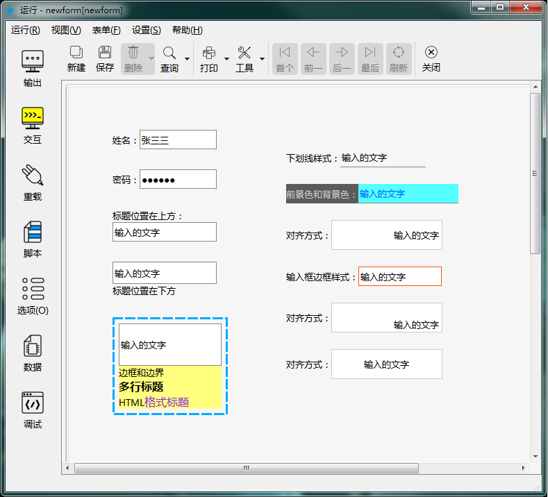

# 第二章 标准控件 - 单行文本输入控件

单行文本输入控件用于输入文字。可以有多种格式，比如下图显示了几种不同样式：

---

<h2 id="category">目录</h2>

- [继承的属性和函数](2-3-lineedit?id=继承的属性和函数)

- [自有属性](2-3-lineedit?id=单行文本输入控件自有属性)

- [自有成员函数](2-3-lineedit?id=单行文本输入控件自有成员函数)

- [信号](2-3-lineedit?id=单行文本输入控件的信号)

- [可编程函数](2-3-lineedit?id=可编程函数)

---

## 继承的属性和函数

- [继承自QObject 的属性](2-1-qobject?id=属性)

- [继承自QObject 的 成员函数](2-1-qobject?id=成员函数)

- [继承自widgetDelegateBase的属性](2-2-base?id=属性)

- [继承自widgetDelegateBase的成员函数](2-2-base?id=成员函数)

---

## 单行文本输入控件自有属性

[返回目录](#category)

|       属性        | 值类型  | 读写类型  |       说明        |
| ----------------- | ------- | -------- | ----------------- |
| caption           | QString | 可读 可写 | 标题文本          |
| captionPosition   | int     | 可读      | 标题位置          |
| defaultVal        | QString | 可读 可写 | 缺省值            |
| displaytext       | QString | 可读      | 显示文本          |
| editorBackColor   | QColor  | 可读 可写 | 编辑器背景色       |
| editorBorderColor | QColor  | 可读 可写 | 编辑器边框颜色     |
| editorBorderStyle | int     | 可读 可写 | 编辑器边框样式     |
| editorFillStyle   | int     | 可读 可写 | 编辑器填充样式     |
| editorFont        | QFont   | 可读 可写 | 编辑器字体        |
| editorForeColor   | QColor  | 可读 可写 | 编辑器前景色       |
| editorHAlign      | int     | 可读 可写 | 编辑器水平对齐方式 |
| editorVAlign      | int     | 可读 可写 | 编辑器垂直对齐方式 |
| inputMask         | QString | 可读 可写 | 输入掩码          |
| isPWD             | bool    | 可读 可写 | 是否显示密码格式   |
| margin            | int     | 可读 可写 | 边界宽度          |
| maxLength         | int     | 可读 可写 | 输入文字最大长度   |
| readOnly          | bool    | 可读 可写 | 是否只读          |
| shadow            | int     | 可读 可写 | 边框特效样式       |
| text              | QString | 可读 可写 | 输入的文本        |

- ### 属性：caption （类型：QString 可读 可写）

[返回目录](#category)

标题显示的文字。

|      |                     调用方法                     |
| ---- | ----------------------------------------------- |
| 读取 | QString caption() const                         |
| 修改 | void setCaption( const QString &caption ) const |

- ### 属性：editorFont （类型：QFont 可读 可写）

[返回目录](#category)

文本编辑控件的字体。注意 font 属性指标题的字体，editorFont才是输入文字的控件的字体。

|      |                       调用方法                       |
| ---- | --------------------------------------------------- |
| 读取 | QFont editorFont() const                            |
| 修改 | void setEditorFont( const QFont &editorFont ) const |

- ### 属性：editorBackColor （类型：QColor 可读 可写）

[返回目录](#category)

文本输入控件的背景色，只在填充属性为“填充”时有效。

|      |                            调用方法                             |
| ---- | -------------------------------------------------------------- |
| 读取 | QColor editorBackColor() const                                 |
| 修改 | void setEditorBackColor( const QColor &editorBackColor ) const |

- ### 属性：editorForeColor （类型：QColor 可读 可写）

[返回目录](#category)

文本输入控件的前景色。

|      |                            调用方法                             |
| ---- | -------------------------------------------------------------- |
| 读取 | QColor editorForeColor() const                                 |
| 修改 | void setEditorForeColor( const QColor &editorForeColor ) const |

- ### 属性：editorBorderColor （类型：QColor 可读 可写）

[返回目录](#category)

文本输入控件边框颜色。

|      |                              调用方法                               |
| ---- | ------------------------------------------------------------------ |
| 读取 | QColor editorBorderColor() const                                   |
| 修改 | void setEditorBorderColor( const QColor &editorBorderColor ) const |

- ### 属性：margin （类型：int 可读 可写）

[返回目录](#category)

边界宽度。

|      |              调用方法               |
| ---- | ---------------------------------- |
| 读取 | int margin() const                 |
| 修改 | void setMargin( int margin ) const |

- ### 属性：maxLength （类型：int 可读 可写）

[返回目录](#category)

输入文本最大长度。

|      |                 调用方法                  |
| ---- | ---------------------------------------- |
| 读取 | int maxLength() const                    |
| 修改 | void setMaxLength( int maxLength ) const |

- ### 属性：editorBorderStyle （类型：int 可读 可写）

[返回目录](#category)

文本编辑器边框类型。

|      |                         调用方法                          |
| ---- | -------------------------------------------------------- |
| 读取 | int editorBorderStyle() const                            |
| 修改 | void setEditorBorderStyle( int editorBorderStyle ) const |
|      | **editorBorderStyle取值：**                              |
|      | pub.NOFRAME 没有边框                                      |
|      | pub.UNDERLINE 下划线                                     |
|      | pub.RECTANGLE 矩形边框                                    |

- ### 属性：captionPosition （类型：int 可读 ）

[返回目录](#category)

标题所在位置。设计时设置后，在运行时只读，不允许修改。

|      |           调用方法           |
| ---- | --------------------------- |
| 读取 | int captionPosition() const |
|      | pub.ATTOP 在上方            |
|      | pub.ATBOTTOM 在下方         |
|      | pub.ATLEFT 在左侧           |
|      | pub.ATRIGHT 在右侧          |
|      | pub.NOCAPTION 无标题        |

- ### 属性：shadow （类型：int 可读 可写）

[返回目录](#category)

输入框边框特效样式。

|      |              调用方法               |
| ---- | ---------------------------------- |
| 读取 | int shadow() const                 |
| 修改 | void setShadow( int shadow ) const |
|      | **shadow取值：**                   |
|      | pub.PLAIN 平的                     |
|      | pub.RAISED 上凸                    |
|      | pub.SUNKEN 下陷                    |

- ### 属性：editorFillStyle （类型：int 可读 可写）

[返回目录](#category)

输入框背景填充样式。设置为“透明”时，背景色无效。

|      |                       调用方法                        |
| ---- | ---------------------------------------------------- |
| 读取 | int editorFillStyle() const                          |
| 修改 | void setEditorFillStyle( int editorFillStyle ) const |
|      | **editorFillStyle的值：**                            |
|      | - pub.FILLED_BACKGROUND 填充                         |
|      | - pub.TRANSPARENT_BACKGROUND 透明                    |

- ### 属性：isPWD （类型：bool 可读 可写）

[返回目录](#category)

是否是密码输入控件。密码输入控件会显示特殊字符替代输入的文字。

|      |              调用方法              |
| ---- | --------------------------------- |
| 读取 | bool isPWD() const                |
| 修改 | void setIsPWD( bool isPWD ) const |

- ### 属性：inputMask （类型：QString 可读 可写）

输入掩码。详细用法参考Qt文档。

|      |                       调用方法                       |
| ---- | --------------------------------------------------- |
| 读取 | QString inputMask() const                           |
| 修改 | void setInputMask( const QString &inputMask ) const |

- ### 属性：text （类型：QString 可读 可写）

[返回目录](#category)

输入的文字。

|      |                  调用方法                  |
| ---- | ----------------------------------------- |
| 读取 | QString text() const                      |
| 修改 | void setText( const QString &text ) const |

- ### 属性：displaytext （类型：QString 可读 ）

[返回目录](#category)

输入框显示的文字。

|      |           调用方法           |
| ---- | --------------------------- |
| 读取 | QString displaytext() const |

- ### 属性：defaultVal （类型：QString 可读 可写）

[返回目录](#category)

缺省文本。

|      |                        调用方法                        |
| ---- | ----------------------------------------------------- |
| 读取 | QString defaultVal() const                            |
| 修改 | void setDefaultVal( const QString &defaultVal ) const |

- ### 属性：editorVAlign （类型：int 可读 可写）

[返回目录](#category)

输入框文本垂直方向对齐方式。

|      |                    调用方法                     |
| ---- | ---------------------------------------------- |
| 读取 | int editorVAlign() const                       |
| 修改 | void setEditorVAlign( int editorVAlign ) const |
|      | **editorVAlign取值：**                         |
|      | pub.ALIGNTOP 向上对齐                           |
|      | pub.ALIGNBOTTOM 向下对齐                        |
|      | pub.ALIGNVCENTER 垂直居中对齐                   |

- ### 属性：editorHAlign （类型：int 可读 可写）

[返回目录](#category)

输入框文本水平方向对齐方式。

|      |                    调用方法                     |
| ---- | ---------------------------------------------- |
| 读取 | int editorHAlign() const                       |
| 修改 | void setEditorHAlign( int editorHAlign ) const |
|      | **editorHAlign取值：**                         |
|      | pub.ALIGNLEFT 向左对齐                          |
|      | pub.ALIGNRIGHT 向右对齐                         |
|      | pub.ALIGNHCENTER 水平居中对齐                   |
|      | pub.ALIGNJUSTIFY 水平分散对齐                   |

- ### 属性：readOnly （类型：bool 可读 可写）

[返回目录](#category)

是否只读。只读的文本输入控件可以通过脚本修改其中的文字，但不允许用户修改。

|      |                 调用方法                 |
| ---- | --------------------------------------- |
| 读取 | bool readOnly() const                   |
| 修改 | void setReadOnly( bool readOnly ) const |

---

## 单行文本输入控件自有成员函数

[返回目录](#category)

所有属性的设置函数（参考上一节中修改属性的接口），都属于此类，都可以当做槽使用。除此之处，另外还包括以下几个成员函数：

|        函数        |                               接口                                |                                                                       说明                                                                        |
| ------------------ | ----------------------------------------------------------------- | ------------------------------------------------------------------------------------------------------------------------------------------------- |
| clear              | void clear()  const                                               | 清除输入的文本                                                                                                                                     |
| copy               | void copy() const                                                 | 复制选中的文本                                                                                                                                     |
| cut                | void cut()  const                                                 | 剪切选中的文本                                                                                                                                     |
| paste              | void paste()  const                                               | 从剪切板粘贴文本                                                                                                                                   |
| redo               | void redo()  const                                                | 重复上一步撤消的操作                                                                                                                                |
| undo               | void undo()  const                                                | 撤消上一步操作                                                                                                                                     |
| selectAll          | void selectAll() const                                            | 选择所有文本                                                                                                                                       |
| setText            | void setText ( const QString & text ) const                       | 设置输入框内的文本                                                                                                                                 |
| setIsPWD           | void setIsPWD(bool isPWD) const                                   | 设置是否显示密码                                                                                                                                   |
| setDefaultVal      | void setDefaultVal(const QString &text) const                     | 设置缺省值                                                                                                                                         |
| setInputMask       | void setInputMask(const QString &mask) const                      | 设置输入掩码                                                                                                                                       |
| setEditorVAlign    | void setEditorVAlign(int valign) const                            | 设置编辑器垂直方向对齐方式（valign取值：pub.ALIGNTOP 向上对齐；pub.ALIGNBOTTOM 向下对齐；pub.ALIGNVCENTER 垂直居中对齐）                               |
| setEditorHAlign    | void setEditorHAlign(int halign) const                            | 设置编辑器水平方向对齐方式（halign取值：pub.ALIGNLEFT 向左对齐；pub.ALIGNRIGHT 向右对齐；pub.ALIGNHCENTER 水平居中对齐；pub.ALIGNJUSTIFY 水平分散对齐） |
| setReadOnly        | void setReadOnly(bool readonly) const                             | 设置是否只读                                                                                                                                       |
| setIntValidator    | void setIntValidator(intValidatorDelegate* validator) const       | 设置整数输入校验器，intValidatorDelegate的用法参考[校验器](2-32-validator)                                                                           |
| setDoubleValidator | void setDoubleValidator(doubleValidatorDelegate* validator) const | 设置双精度小数输入校验器，doubleValidatorDelegate的用法参考[校验器](2-32-validator)                                                                  |

---

## 单行文本输入控件的信号

[返回目录](#category)

|信号|接口|说明|
| - | - | - |
|cursorPositionChanged|void cursorPositionChanged ( int oldp, int newp ) |光标位置发生改变时发出此信号。|
|editingFinished|void editingFinished () |编辑完成时发出此信号 。通常是在按下回车键或控件失去焦点时标识着编辑已完成。如果设置了校验器或输入掩码，只在符合输入规范（返回QValidator::Acceptable）时才会触发此信号。|
|returnPressed|void returnPressed ()	 |输入回车键时发出此信号。如果设置了校验器或输入掩码，只在符合输入规范（返回QValidator::Acceptable）时才会触发此信号。|
|selectionChanged|void selectionChanged () 	 |选择的文本范围发生变化时发出此信号。|
|textChanged|void textChanged ( const QString & text ) |文本被修改时发出此信号。与textEdited不同，通过程序修改文本内容也会发出此信号。|
|textEdited|void textEdited ( const QString & text )  |文本被操作者编辑修改时发出此信号。通过程序修改文本内容不会发出此信号。|

---

## 可编程函数

[返回目录](#category)

- [可编程函数的详细说明](1-4-openscript?id=控件的可编程函数)

单行文本输入控件所有可编程函数的清单：

|函数|函数名|传入参数|返回值|说明|
| - | - | - | - | - |
|[缺省值](1-4-openscript?id=default) | 控件名_default | 无 | 输入框中文本内容的初始值 **数据类型：字符串**| 返回控件的初始值。 控件创建后、新建空白表单后输入框中的文本会还原成初始值。|
|[显示格式](1-4-openscript?id=format)|控件名_format|输入的文本|转换格式后要显示的文本 **数据类型：字符串**|单行文本输入框中输入的内容和显示的内容可以不一样， 这个函数用来将输入的内容转换成需要显示的格式。 用户结束输入或通过程序修改都会调用此函数。|
|[校验规则](1-4-openscript?id=validator)|控件名_validator|输入的文本|输入值是否合法 **数据类型：布尔**|如果输入值满足要求，返回True，否则返回False。 这个函数会在完成输入后被调用。 手工输入和程序修改都会调用此函数。|
|[鼠标进入时](1-4-openscript?id=enter)|控件名_enter|无|无|鼠标光标进入到这个控件时调用|
|[鼠标离开时](1-4-openscript?id=leave)|控件名_leave|无|无|鼠标光标离开这个控件时调用|
|[大小改变时](1-4-openscript?id=resize)|控件名_resize|无|无|控件大小改变时调用|
|[当拖曳进入时](1-4-openscript?id=dragEnter)|控件名_dragEnter|拖曳进入的元数据|是否接受拖曳进入 **数据类型：布尔**|当从外部拖曳一些内容进入到这个控件时，会调用此函数。 不接受拖曳的控件不会调用此函数。 通过脚本判断是否接受拖曳， 如果接受，返回 True，如果在控件上放开鼠标，程序会转而调用“当拖曳放下时”函数。 如果不接受，返回False，程序将不会调用“当拖曳放下时”函数。  **传入参数：** format:元数据的格式列表，以列表类型传入 data:元数据的内容，以列表类型传入 dx:拖入的位置X坐标 dy:拖入的位置Y坐标|
|[当拖曳放下时](1-4-openscript?id=drop)|控件名_drop|拖曳放下的元数据|是否接受拖曳放下 **数据类型：布尔**|拖曳放下时调用。允许则返回 True，否则返回 False。  **传入参数：** format:元数据的格式列表，以列表类型传入 data:元数据的内容，以列表类型传入 dx:放下的位置X坐标 dy:放下的位置Y坐标|
|[生成元数据](1-4-openscript?id=mimedata)|控件名_mimedata|无|以列表形式生成控件的元数据 **数据类型：列表**|拖曳时这个控件时生成元数据的内容|
|[获得焦点](1-4-openscript?id=getfocus)|控件名_getfocus|无|无|获得焦点时调用|
|[失去焦点](1-4-openscript?id=lostfocus)|控件名_lostfocus|无|无|失去焦点时调用|
|[单次定时器超时时](1-4-openscript?id=singleshot)|控件名_singleshot|无|无|内置单次定时器超时时调用|
|[定时器超时时](1-4-openscript?id=timeout)|控件名_timeout|定时器的ID值|无|内置定时器超时时调用|

