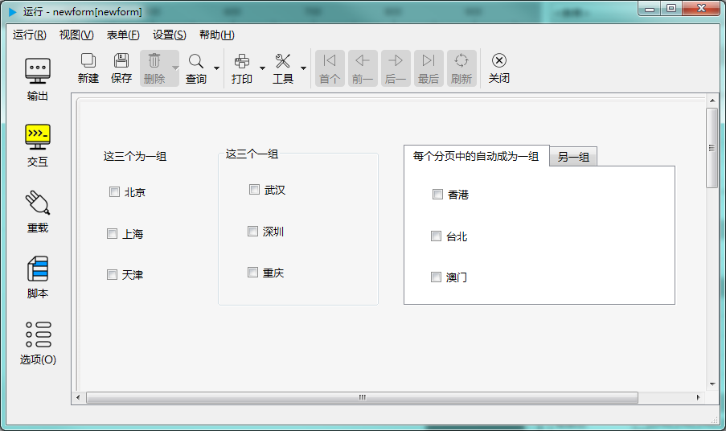

# 多选按钮组

多个多选按钮控件，可以组成一个群组方便调用和管理。与单选按钮组不同的是，同级的多选按钮控件并不会被自动组成群组，需要调用相关的接口来创建群组，而且只有表单控件（formDelegate）有这样的接口，所以只能通过访问表单的接口来访问多选按钮组。



---

<h2 id="category">目录</h2>

- [创建](#创建)

- [属性](#属性)

- [成员函数](#成员函数)

- [信号](#信号)

---

## 创建

[返回目录](#category)

调用接口：

|                                       调用接口                                       |                                                         说明                                                         |
| ----------------------------------------------------------------------------------- | -------------------------------------------------------------------------------------------------------------------- |
| checkBoxGroupDelegate* addCheckBoxGroup(const QString &name,bool exclusive = false) | 创建一个多选按钮组，name指定组名，exclusive指定组内成员是否是互斥的，互斥表示只能有一个被选中 ，返回创建后的多选按钮组的指针 |
| checkBoxGroupDelegate* checkBoxGroup(const QString &name) const                     | 按名称返回对应的多选按钮组，如果不存在，返回空指针                                                                       |
	
示例：

``` python 

#先创建一个多选按钮组
a=this.form.addCheckBoxGroup('test')
#再往组里添加成员
a.addButton('checkbox1')
a.addButton('checkbox2')
a.addButton('checkbox3')

```
	
## 属性

[返回目录](#category)

|   属性    | 值类型  | 读写类型  |   读取    |   赋值函数    |                                 说明                                  |
| --------- | ------- | -------- | --------- | ------------ | --------------------------------------------------------------------- |
| count     | int     | 可读      | count     |              | 组内成员的数量                                                         |
| value     | QString | 可读 可写 | text      | setText      | 当前选中的复选框的值，如果组内成员不是互斥的，返回最后勾选的那个复选框的值 |
| exclusive | bool    | 可读 可写 | exclusive | setExclusive | 组内成员是否是互斥的，互斥表示只有一个能被选中，效果与单选按钮组相同       |

## 成员函数

[返回目录](#category)

组内成员的顺序为添加时的顺序，返回值为列表类型时，就按这个顺序返回列表。

|          函数          |                     接口                     |                            说明                            |
| ---------------------- | -------------------------------------------- | ---------------------------------------------------------- |
| isNull                 | bool isNull() const	                        | 是否是一个没有指向有效的单元格的空对象                       |
| addButton              | bool addButton(const QString &name) const    | 往组内添加成员，name为控件名称                              |
| removeButton           | bool removeButton(const QString &name) const | 移除组内成员，name为控件名称                                |
| setValue               | void setValue(const QString &val) const      | 设置当前值                                                 |
| setValues              | void setValues(const QStringList &val) const | 设置多个值，匹配的多选框会被选中，其它不匹配的设置为未选中状态 |
| checkButton            | void checkButton(int index) const            | 将第 index 个设置为选中状态                                 |
| checkedValues          | QStringList checkedValues() const            | 所有选中的多选框的值的列表                                  |
| uncheckedValues        | QStringList uncheckedValues() const          | 所有未选中的多选框的值的列表                                 |
| uncheckedNames         | QStringList uncheckedNames() const           | 所有未选中的多选框的控件名称                                 |
| PartiallyCheckedValues | QStringList PartiallyCheckedValues() const   | 所有部分选中的多选框的值的列表                               |
| PartiallyCheckedValues | QStringList PartiallyCheckedNames() const    | 所有部分选中的多选框的控件名称的列表                         |
| checkedNames           | QStringList checkedNames() const             | 所有选中的多选框的控件名称的列表                             |
| buttonNames            | QStringList buttonNames() const              | 所有多选框的控件名称的列表                                  |
| buttonValues           | QStringList buttonValues() const             | 所有多选框的值的列表                                        |
| currentIndex           | int currentIndex () const                    | 当前选中的多选框的序号                                      |
| checkdButtonName       | QString checkedButtonName() const            | 当前选中的多选框的控件名称                                  |
| indexOfName            | int indexOfName(const QString &name) const   | 按控件名称返回其中组中的顺序                                 |
| indexOfValue           | int indexOfValue(const QString &value) const | 按控件的值返回其在组中的顺序                                 |
| buttonName             | QString buttonName(int id) const             | 按指定序号返回对应的控件名称                                 |
| buttonValue            | QString buttonValue(int id) const            | 按指定离号返回对应控件的值                                  |

## 信号

[返回目录](#category)

|           信号           |              说明              |
| ------------------------ | ------------------------------ |
| buttonClicked ( int id ) | 组中第几项按钮被点击时发出此信号 |
