# 对话框

biForm 提供了几种对话框类用于辅助输入一些数据。它们与其它标准控件不同，不能在表单界面上显示，需要通过 Python 代码调用，以弹出对话框的形式运行。

biForm 也可以使用 Qt 提供的一些特殊的对话框类，或者通过继承 QDialog 来创建自定义对话框。也可以将某个 PFF 表单做为对话框调用。

---

<h2 id=category>目录</h2>

- [如何使用对话框](#如何使用对话框)
 - [对话框的分类](#对话框的分类)
 - [如何创建一个新的对话框](#如何创建一个新的对话框)
- [对话框：选择项目](#对话框：选择项目)
- [对话框：选择日期](#对话框：选择日期)
- [对话框：选择时间](#对话框：选择时间)
- [对话框：选择日期时间](#对话框：选择日期时间)
- [对话框：选择日期范围](#对话框：选择日期范围)
- [对话框：选择时间范围](#对话框：选择时间范围)
- [对话框：选择日期时间范围](#对话框：选择日期时间范围)
- [其它对话框](#其它对话框)
 - [1. 使用 qt 提供的 QDialog 派生类](#_1-使用-qt-提供的-qdialog-派生类)
 - [2. 继承 QDialog 类](#_2-继承-qdialog-类)
 - [3. 使用 PFF 表单](#_3-使用-PFF-表单)

---

## 如何使用对话框

[返回目录](#category)

### 对话框的分类

biForm 中对话框控件分为以下几类：

|                     类型                     |         类名          |                 功能                 |
| -------------------------------------------- | --------------------- | ----------------------------------- |
| [选择项目](#对话框：选择项目)                  | DialogSelectItem      | 从数据库记录中选择一个或多个条目       |
| [搜索下拉列表项目](#对话框：搜索下拉列表项目)   | DialogComboSearch     | 在下拉列表框的列表中执行并选择一个条目 |
| [输入日期](#对话框：选择日期)                  | DialogSelectDate      | 供用户输入一个日期值                  |
| [输入时间](#对话框：选择时间)                  | DialogSelectTime      | 供用户输入一个时间值                  |
| [输入日期和时间](#对话框：选择日期时间)        | DialogSelectDateTime  | 供用户输入一个日期时间值              |
| [输入日期范围](#对话框：选择日期范围)          | DialogSelectDate2     | 供用户输入一个日期范围                |
| [输入时间范围](#对话框：选择时间范围)          | DialogSelectTime2     | 供用户输入一个时间范围                |
| [输入日期和时间范围](#对话框：选择日期时间范围) | DialogSelectDateTime2 | 供用户输入一个日期和时间范围          |

### 如何创建一个新的对话框

[返回目录](#category)

在 biForm 中通过使用 PythonQt.private 模块来调用它们。

我们在 biForm 中用以下命令试一下：

``` Python

>>> import PythonQt.private 
>>> dir()
['PythonQt', '__builtins__', '__cached__', '__doc__', '__file__', '__loader__', '__name__', '__package__', '__spec__', 'base64', 'codecs', 'formclass_newform', 'log', 'logging', 'newform', 'pub', 'sys', 'this']

>>> dir(PythonQt.private)
['DatabaseConnection', 'DialogSelectDate', 'DialogSelectDate2', 'DialogSelectDateTime', 'DialogSelectDateTime2', 'DialogSelectItem', 'DialogSelectTime', 'DialogSelectTime2', 'FormDBDelegate', 'LogSystem', 'PythonQtDebugAPI', 'QObject', 'QSerialPort', 'RunTimeForm', 'RunTimeWidget', '__doc__', '__loader__', '__name__', '__package__', '__spec__', 'actionDelegate', 'buttonDelegate', 'buttonEditorDelegate', 'checkBoxDelegate', 'checkBoxEditorDelegate', 'checkBoxGroupDelegate', 'circleDelegate', 'codeEditorDelegate', 'comboDelegate', 'comboEditorDelegate', 'dateEditDelegate', 'dateEditEditorDelegate', 'dateTimeEditDelegate', 'dateTimeEditEditorDelegate', 'doubleSpinDelegate', 'doubleSpinEditorDelegate', 'doubleValidatorDelegate', 'editorDelegate', 'fieldDelegate', 'fieldEditorDelegate', 'formDelegate', 'frameDelegate', 'groupBoxDelegate', 'imageDelegate', 'intValidatorDelegate', 'labelDelegate', 'lineDelegate', 'lineEditDelegate', 'lineEditEditorDelegate', 'listItemDelegate', 'listWidgetDelegate', 'multiLineDelegate', 'multiLineEditorDelegate', 'pubClass', 'radioButtonDelegate', 'radioButtonEditorDelegate', 'radioButtonGroupDelegate', 'rectangleDelegate', 'rt_Button', 'rt_CheckBox', 'rt_Circle', 'rt_CodeEditor', 'rt_Combo', 'rt_DateEdit', 'rt_DateTimeEdit', 'rt_DoubleSpin', 'rt_Field', 'rt_Frame', 'rt_GroupBox', 'rt_Image', 'rt_Label', 'rt_Line', 'rt_ListWidget', 'rt_MultiLine', 'rt_RadioButton', 'rt_Rectangle', 'rt_Spin', 'rt_Tab', 'rt_TableWidget', 'rt_TimeEdit', 'rt_TreeWidget', 'spinDelegate', 'spinEditorDelegate', 'tabDelegate', 'tableCellDelegate', 'tableRangeDelegate', 'tableWidgetDelegate', 'timeEditDelegate', 'timeEditEditorDelegate', 'treeItemDelegate', 'treeWidgetDelegate', 'widgetDelegate', 'widgetDelegateBase']

```

可以看到 PythonQt.private 中列出了这几个类名。比如我们需要创建一个 DialogSelectDate 实例时，用以下几种方法都可以：

``` Python

>>> import PythonQt.private 
>>> a=PythonQt.private.DialogSelectDate()

```

或者：

``` Python

>>> from PythonQt.private import DialogSelectDate
>>> b=DialogSelectDate(this.form)

```

需要注意创建时，构建函数中的传入参数是指定这个对话框窗的父对象，只能是 0 ，或者是继承自 formDelegate 的对象，比如 this.form。比如前面的两个例子，一个指定了父对象，一个指定 this.form 为父对象。

这几个类都继承自 QDialog，用 dir() 查看一下：

``` Python

>>> import PythonQt.private 
>>> a=PythonQt.private.DialogSelectDate()
>>> dir(a)
['Accepted', 'DialogCode', 'DrawChildren', 'DrawWindowBackground', 'IgnoreMask', 'PaintDeviceMetric', 'PdmDepth', 'PdmDevicePixelRatio', 'PdmDevicePixelRatioScaled', 'PdmDpiX', 'PdmDpiY', 'PdmHeight', 'PdmHeightMM', 'PdmNumColors', 'PdmPhysicalDpiX', 'PdmPhysicalDpiY', 'PdmWidth', 'PdmWidthMM', 'Rejected', 'RenderFlag', 'RenderFlags', '__bool__', '__class__', '__delattr__', '__dict__', '__dir__', '__doc__', '__eq__', '__format__', '__ge__', '__getattribute__', '__gt__', '__hash__', '__init__', '__init_subclass__', '__le__', '__lt__', '__module__', '__ne__', '__new__', '__reduce__', '__reduce_ex__', '__repr__', '__setattr__', '__sizeof__', '__str__', '__subclasshook__', '__weakref__', '_q_styleSheetWidgetFont', 'accept', 'acceptDrops', 'accepted', 'accessibleDescription', 'accessibleName', 'actionEvent', 'actions', 'activateWindow', 'addAction', 'addActions', 'adjustPosition', 'adjustSize', 'autoFillBackground', 'backgroundRole', 'backingStore', 'baseSize', 'blockSignals', 'changeEvent', 'childAt', 'childEvent', 'children', 'childrenRect', 'childrenRegion', 'className', 'clearFocus', 'clearMask', 'close', 'closeEvent', 'colorCount', 'connect', 'contentsMargins', 'contentsRect', 'contextMenuEvent', 'contextMenuPolicy', 'createWinId', 'createWindowContainer', 'cursor', 'customContextMenuRequested', 'customEvent', 'date', 'delete', 'deleteLater', 'depth', 'destroy', 'destroyed', 'devType', 'devicePixelRatio', 'devicePixelRatioF', 'devicePixelRatioFScale', 'disconnect', 'done', 'dragEnterEvent', 'dragLeaveEvent', 'dragMoveEvent', 'dropEvent', 'dumpObjectInfo', 'dumpObjectTree', 'dynamicPropertyNames', 'effectiveWinId', 'enabled', 'ensurePolished', 'enterEvent', 'event', 'eventFilter', 'exec', 'execDialog', 'findChild', 'findChildren', 'finished', 'focus', 'focusInEvent', 'focusNextChild', 'focusNextPrevChild', 'focusOutEvent', 'focusPolicy', 'focusPreviousChild', 'focusProxy', 'focusWidget', 'font', 'fontInfo', 'fontMetrics', 'foregroundRole', 'frameGeometry', 'frameSize', 'fullScreen', 'geometry', 'getDate', 'grab', 'grabGesture', 'grabKeyboard', 'grabMouse', 'grabShortcut', 'graphicsEffect', 'graphicsProxyWidget', 'hasFocus', 'hasHeightForWidth', 'hasMouseTracking', 'hasTabletTracking', 'height', 'heightForWidth', 'heightMM', 'help', 'hide', 'hideEvent', 'inherits', 'initPainter', 'inputMethodEvent', 'inputMethodHints', 'inputMethodQuery', 'insertAction', 'insertActions', 'installEventFilter', 'isActiveWindow', 'isAncestorOf', 'isEnabled', 'isEnabledTo', 'isFullScreen', 'isHidden', 'isLeftToRight', 'isMaximized', 'isMinimized', 'isModal', 'isRightToLeft', 'isSignalConnected', 'isSizeGripEnabled', 'isVisible', 'isVisibleTo', 'isWidgetType', 'isWindow', 'isWindowModified', 'isWindowType', 'keyPressEvent', 'keyReleaseEvent', 'keyboardGrabber', 'killTimer', 'layout', 'layoutDirection', 'leaveEvent', 'locale', 'logicalDpiX', 'logicalDpiY', 'lower', 'mapFrom', 'mapFromGlobal', 'mapFromParent', 'mapTo', 'mapToGlobal', 'mapToParent', 'mask', 'maximized', 'maximumHeight', 'maximumSize', 'maximumWidth', 'metaObject', 'metric', 'minimized', 'minimumHeight', 'minimumSize', 'minimumSizeHint', 'minimumWidth', 'modal', 'mouseDoubleClickEvent', 'mouseGrabber', 'mouseMoveEvent', 'mousePressEvent', 'mouseReleaseEvent', 'mouseTracking', 'move', 'moveEvent', 'moveToThread', 'nativeEvent', 'nativeParentWidget', 'nextInFocusChain', 'normalGeometry', 'objectName', 'objectNameChanged', 'open', 'overrideWindowFlags', 'overrideWindowState', 'paintEngine', 'paintEvent', 'paintingActive', 'palette', 'parent', 'parentWidget', 'physicalDpiX', 'physicalDpiY', 'pos', 'previousInFocusChain', 'property', 'raise', 'rect', 'redirected', 'reject', 'rejected', 'releaseKeyboard', 'releaseMouse', 'releaseShortcut', 'removeAction', 'removeEventFilter', 'render', 'repaint', 'resize', 'resizeEvent', 'restoreGeometry', 'result', 'saveGeometry', 'scroll', 'sender', 'senderSignalIndex', 'setAcceptDrops', 'setAccessibleDescription', 'setAccessibleName', 'setAttribute', 'setAutoFillBackground', 'setBackgroundRole', 'setBaseSize', 'setContentsMargins', 'setContextMenuPolicy', 'setCursor', 'setDate', 'setDisabled', 'setEnabled', 'setFixedHeight', 'setFixedSize', 'setFixedWidth', 'setFocus', 'setFocusPolicy', 'setFocusProxy', 'setFont', 'setForegroundRole', 'setGeometry', 'setGraphicsEffect', 'setHidden', 'setInputMethodHints', 'setLayout', 'setLayoutDirection', 'setLocale', 'setMask', 'setMaximumHeight', 'setMaximumSize', 'setMaximumWidth', 'setMinimumHeight', 'setMinimumSize', 'setMinimumWidth', 'setModal', 'setMouseTracking', 'setObjectName', 'setPalette', 'setParent', 'setProperty', 'setResult', 'setShortcutAutoRepeat', 'setShortcutEnabled', 'setSizeGripEnabled', 'setSizeIncrement', 'setSizePolicy', 'setStatusTip', 'setStyle', 'setStyleSheet', 'setTabOrder', 'setTabletTracking', 'setToolTip', 'setToolTipDuration', 'setUpdatesEnabled', 'setVisible', 'setWhatsThis', 'setWindowFilePath', 'setWindowFlag', 'setWindowFlags', 'setWindowIcon', 'setWindowIconText', 'setWindowModality', 'setWindowModified', 'setWindowOpacity', 'setWindowRole', 'setWindowState', 'setWindowTitle', 'sharedPainter', 'show', 'showEvent', 'showExtension', 'showFullScreen', 'showMaximized', 'showMinimized', 'showNormal', 'signalsBlocked', 'size', 'sizeGripEnabled', 'sizeHint', 'sizeIncrement', 'sizePolicy', 'stackUnder', 'startTimer', 'statusTip', 'style', 'styleSheet', 'tabletEvent', 'tabletTracking', 'testAttribute', 'thread', 'timerEvent', 'toolTip', 'toolTipDuration', 'tr', 'underMouse', 'ungrabGesture', 'unsetCursor', 'unsetLayoutDirection', 'unsetLocale', 'update', 'updateGeometry', 'updatesEnabled', 'visible', 'visibleRegion', 'whatsThis', 'wheelEvent', 'width', 'widthMM', 'winId', 'window', 'windowFilePath', 'windowFlags', 'windowHandle', 'windowIcon', 'windowIconChanged', 'windowIconText', 'windowIconTextChanged', 'windowModality', 'windowModified', 'windowOpacity', 'windowRole', 'windowState', 'windowTitle', 'windowTitleChanged', 'windowType', 'x', 'y']

```

可以看到内容很多。这些接口的详细用法请参考 [Qt在线文档-QDialog](https://doc.qt.io/qt-5/qdialog.html)  。但我们通常并不需要使用所有这些接口。下面各部分会讲解那些经常需要使用的接口，其它内容通常比较少用到，可以在需要时再详细了解。

## 对话框：选择项目

[返回目录](#category)

这个弹出对话框用于在多条记录中选择一个或多个项目。对应的类为 DialogSelectItem。从 PythonQt.private 模块中导入后就可以使用。

这些记录指使用SQL查询语句从数据库里查询的结果。如以下是员工资料相关的几个数据表的表结构：

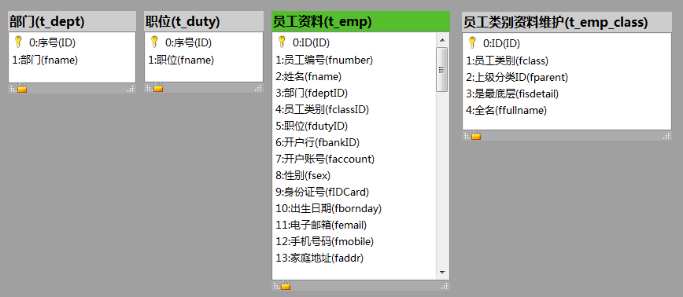

假设我们现在想在表单上，使用一个按钮，点击后就能弹出一个对话框显示所有员工资料，用户可以设置过滤条件以便可以快速找到想要选择的员工。选择员工后，点击“确定”按钮，表单上的控件中显示这个员工的姓名，并保存员工的ID供之后的脚本使用。

我们就可以按以下的几个步骤完成这样的操作。

**第一步：设计控件**

我们在表单上添加一个单行文本输入控件，名为lePerson，再添加个按钮控件，名为buSelectPerson，如下图所示：

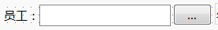

**第二步：初始化对话框**

``` Python

#这段代码写在“表单”的“公共模块”中，这样表单启动后就会执行，并且在表单上下文中全程有效

#先要从 PythonQt.private 模块中导入 DialogSelectItem
from PythonQt.private import DialogSelectItem

#======初始化选择员工的弹出对话框======

#创建一个新实例，参数为对话框标题，及 parent 对象 
dialog=DialogSelectItem('员工',this.form)

#设置表格各列显示的标题
dialog.setTitles(['ID','员工编号','姓名','街道','类别','职务'])

#设置可以供过滤的字段的序号,0表示第一列,下面这句表示可以按"员工编号\姓名\部门\类别\职务"这几列设置过滤条件
dialog.setFilterFields([1,2,3,4,5])

#设置选中一项记录时，在下方显示选中内容时，显示哪些列中的内容
dialog.setDisplayFields([1,2,3,4,5])

#第一列"ID"隐藏,其它列都可见
dialog.setHiddenFields([0])

#设置是否允许选择多个项目,传入参数为 False ，表示一次只允许选择一个项目
dialog.setMultiSelection(False)

```

**第三步：处理按钮的点击事件**

在按钮 buSelectPerson 的“点击时”脚本里，写以下代码：

``` Python

def buSelectPerson_clicked():
    '''这段脚本在点击这个控件时被调用。'''
    #上面这部分是可编程函数模板的固定的内容--------------------------

    #从这里开始，是开发者要写的脚本内容

    #因为是在按钮控件的可编程函数里写，所以要先用 global 申明一下 dialog 这个表单级的对象，否则无法使用它
    global dialog

    #需要用到表单的数据库连接对象
    db=this.form.database()

    #下面这句用来设置查询员工资料使用的SQL语句。对话框显示时，会用这个SQL语句从数据库里查出所有员工的资料，显示在弹出对话框中的表格里
    dialog.setSqlModel("select t0.ID,t0.fnumber,t0.fname,t1.fname,t2.fclass,t3.fname "+\
        " from "+db.getRealTableName('t_emp')+" t0,"+\
            db.getRealTableName('t_dept')+" t1,"+
            db.getRealTableName('t_emp_class')+" t2, "+\
            db.getRealTableName('t_duty')+" t3 "+\
        " where t0.fdeptID=t1.ID "+\
            " and t0.fclassID=t2.ID "+\
            " and t0.fdutyID=t3.ID"+\
        " order by t0.fnumber ")

    #运行这个对话框，用 dialog.exec() 也可以，返回结果为1表示用户点了“确认”，为0表示用户点了“取消”
    ok=dialog.execDialog()

    #获取这个对话框运行时用户选择的条目，如果得到 None，表示用户没有选择项目，否则返回的是第一栏“ID”的值
    a=dialog.getSelectedItem()
    if not ok or a is None:
        return

    #保存用户选择的结果，并查询出员工姓名，显示在控件中
    this.lePerson.tag = a
    re=db.execute("select fname from "+db.getRealTableName('t_emp')+\
        " where ID="+str(a))
    if len(re)>0:
        this.lePerson.text = re[0][0]

    #下面这部分是模板的内容-----------------------------------
    return None

```

弹出的对话框如下图所示：

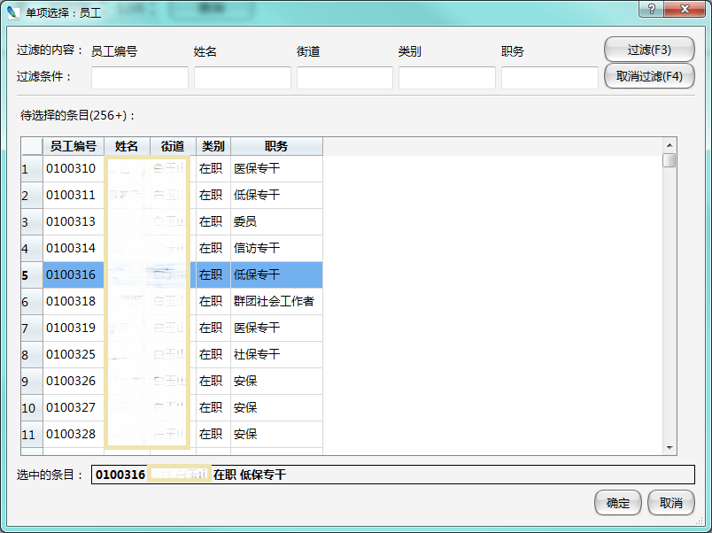

如果设置为允许选择多个条目 ，则是这样的：

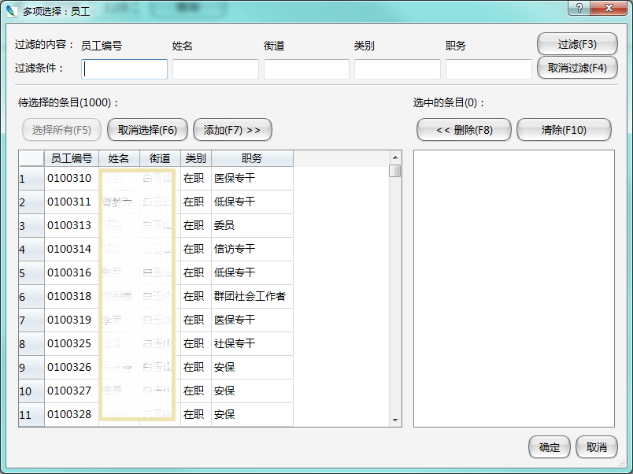

除了继承自 QDialog 的接口，选择项目对话框还提供以下调用接口：

|        接口         |                       调用方式                       |                                     说明                                     |
| ------------------- | --------------------------------------------------- | --------------------------------------------------------------------------- |
| setMultiSelection   | void setMultiSelection( bool value)                 | 设置是否允许选择多个项目，如果设为否，则只允许选择一个项目                      |
| setSelectAllEnabled | void setSelectAllEnabled( bool value)               | 设置是否允许显示“全选”按钮                                                    |
| setSqlModel         | void setSqlModel(const QString& sql)                | 设置记录列表使用的SQL语句                                                     |
| setTitles           | void setTitles(const QStringList & list)            | 设置表格的标题显示的文字                                                      |
| setDisplayFields    | void setDisplayFields(const QVariant & fieldsIndex) | 设置选中的项目在选中清单或控件中，显示哪些字段的内容                            |
| setHiddenFields     | void setHiddenFields(const QVariant & fieldsIndex)  | 设置列表中隐藏的列，列的序号从0开始                                            |
| setKeyFieldIndex    | void setKeyFieldIndex(int index)                    | 设置返回的值对应的字段在列表中的顺序，如果不设置，缺省使用第一列，顺序从0开始序号 |
| setFilterFields     | void setFilterFields(const QVariant & fieldsIndex)  | 设置允许按哪几个字段进行过滤，传入参数为字段在列表中的顺序，从0开始序号          |
| prepareList         | void prepareList(const QVariant & selected)         | 弹出对话框时，预先设置哪些为已选中的，常用于修改已选清单                        |
| execDialog          | int execDialog()                                    | 执行这个对话框，等同于 exec()                                                 |
| exec                | int exec()                                          | 执行这个对话框                                                               |
| getSelectedItems    | QVariantList getSelectedItems()                     | 允许多选时，返回所有选中的项目的值                                             |
| getSelectedItem     | QVariant getSelectedItem()                          | 返回所选的项目                                                               |

## 对话框：搜索下拉列表项目

[返回目录](#category)

这个弹出对话框用于在一个下拉列表框控件的条目中进行搜索和选择。对应的类为 DialogComboSearch。从 PythonQt.private 模块中导入后就可以使用。

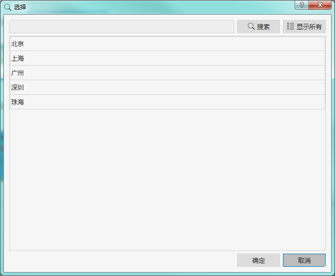

假设我们现在表单上有一个下拉列表框，用于选择城市，名称为 combobox 。有时这种下拉列表框中的内容太多，我们就可以用这个弹出对话框对条目进行搜索，并返回选中的项目。

我们就可以在合适的地方，用脚本来使用这个弹出对话框，在弹出对话框中双击选中的条目，或选择后点击“确定”完成选择。脚本如以下示例：

``` Python

>>> from PythonQt.private import DialogComboSearch
>>> a=DialogComboSearch(this.combobox)
>>> a.exec()
1

>>> a.getSelectedIndex()
1

>>> a.getSelectedItem()
'上海'

```

这个对话框也可反复调用，或使用 setCombo 重新指定对应其它的下拉列表框控件。

除了继承自 QDialog 的接口，选择项目对话框还提供以下调用接口：

|       接口       |                调用方式                 |                              说明                              |
| ---------------- | -------------------------------------- | ------------------------------------------------------------- |
| execDialog       | int execDialog()                       | 执行这个对话框，等同于 exec()                                   |
| exec             | int exec()                             | 执行这个对话框，点“取消”返回0，点“确定”返回1，直接关闭窗体，返回0 |
| getSelectedItem  | QVariant getSelectedItem()             | 返回所有选中的条目的文本，未选择时返回空字符串                    |
| getSelectedIndex | int getSelectedItem()                  | 返回所选的项目在下拉列表中的索引，从0开始，未选择时返回-1         |
| setCombo         | void setCombo(comboBoxDelegate* combo) | 重新指定对应的下拉列表框控件                                    |

## 对话框：选择日期

[返回目录](#category)

这个弹出对话框用于输入一个日期值。对应的类为 DialogSelectDate。从 PythonQt.private 模块中导入后就可以使用。

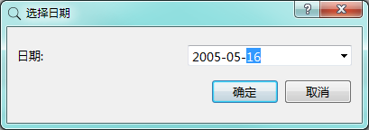

创建完这个对话框之后，需要调用 exec() 或 execDialog() 来执行，如果用户点击了“确认”按钮，则 exec() 返回的值为 1，否则返回的值为 0。可通过此判断用户是否取消了这项输入操作。

如果需要知道用户输入的日期值，则调用它的 getDate 函数。如以下示例：

``` Python

>>> import PythonQt.private 
>>> a=PythonQt.private.DialogSelectDate()
>>> re=a.exec() #用户点取消
>>> re
0

>>> re=a.exec() #用户点确定
1

>>> a.getDate()
QDate (2005-05-16, at: 0x09CDBF80)

```

需要注意的是，即使用户点击了“取消”，getDate 也是会返回一个有效的值的，所以不能通过这个值来判断用户是否取消了输入操作。

如果希望在对话框中显示一个初始的日期值，可以在调用 exec() 之前，通过 setDate 设置缺省值，如下示例：

``` Python

>>> from PythonQt.Qt import QDate
>>> a.setDate(QDate(2020,10,1))
>>> a.exec()

```

也可以用  ```a.setDate(QDate.currentDate())``` 使之的初始值为今天的日期。

我们也可以设置日期值的最大最小值，如以下示例：

``` Python

>>> from PythonQt.Qt import QDate
>>> a.dateEdit.setMinimumDate(QDate(2008,1,1))
>>> a.dateEdit.setMaximumDate(QDate(2020,12,31))
>>> a.exec()

```

有时我们会希望使用不一样的日期格式，比如以“xxxx年xx月xx日”这样的格式进行输入，如下示例：

``` Python

>>> a.dateEdit.setDisplayFormat('yyyy年MM月dd日')
>>> a.exec()

```

这样执行时显示的日期的格式就是我们设定的格式了：

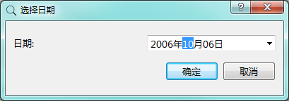

如果希望以指定的格式返回字符串，可以参考如下示例：

```
>>> a.dateEdit.date.toString('yyyy年MM月dd日')
'2006年10月06日'
```

exec可以反复调用，下次再调用时，缺省是使用上次用户输入的值，当然也可以在执行 exec 前，通过修改 date 属性来设置缺省值。

当然在使用过这个对话框对象后，也可以调用 ```del a``` 来删除这个对象。但一般也不必显式地进行删除，在它的生命期结束后，比如在表单被关闭时，也会被自动销毁。

总结一下常用的接口：

|       接口        |                                      调用方式                                      |                                               说明                                               |
| ----------------- | --------------------------------------------------------------------------------- | ----------------------------------------------------------------------------------------------- |
| exec              | int exec()                                                                        | 显示这个对话框，返回执行结果。如果点击“确定”，返回值为1，如果点击“取消”，返回值为0. 可做为槽函数使用。 |
| execDialog        | int execDialog()                                                                  | 与 exec 相同                                                                                     |
| setDate           | void setDate(const QDate & date)                                                  | 设置日期值                                                                                       |
| getDate           | QDate getDate()                                                                   | 获取用户输入的日期值                                                                              |
| dateEdit          | QDateEdit dateEdit                                                                | 返回日期输入控件对象                                                                              |
| setDateFromString | void setDateFromString(const QString & date,const QString& format= "yyyy-MM-dd" ) | 以字符串形式设置日期，字符串的格式以format参数指定                                                 |
| dateToString      | QString dateToString(const QString& format = "yyyy-MM-dd")                        | 返回字符串格式的日期，格式由format参数指定                                                         |

dateEdit返回的是一个 QDateEdit 对象，详细信息参考 [Qt在线文档-qdateedit](https://doc.qt.io/qt-5/qdateedit.html) 。常用的接口：

|       接口       |                        调用方式                        |         说明          |
| ---------------- | ----------------------------------------------------- | -------------------- |
| minimumDate      | QDate minimumDate() const                             | 读取最小日期值        |
| setMinimumDate   | void setMinimumDate(const QDate &min)                 | 设置最小日期值        |
| maximumDate      | QDate maximumDate() const                             | 读取最大日期值        |
| setMaximumDate   | void setMaximumDate(const QDate &min)                 | 设置最大日期值        |
| setDateRange     | void setDateRange(const QDate &min, const QDate &max) | 设置日期范围          |
| displayFormat    | QString displayFormat() const                         | 读取显示格式          |
| setDisplayFormat | void setDisplayFormat(const QString &format)          | 设置显示格式          |
| toString         | QString toString(const QString &format) const         | 按指定格式转换成字符串 |

## 对话框：选择时间

[返回目录](#category)

这个弹出对话框用于输入一个时间值。对应的类为 DialogSelectTime。从 PythonQt.private 模块中导入后就可以使用。调用方式与 DialogSelectDate 类似，只不过处理的是时间值。

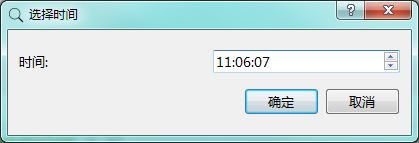

常用的接口：

|       接口        |                                    调用方式                                    |                                               说明                                               |
| ----------------- | ----------------------------------------------------------------------------- | ----------------------------------------------------------------------------------------------- |
| exec              | int exec()                                                                    | 显示这个对话框，返回执行结果。如果点击“确定”，返回值为1，如果点击“取消”，返回值为0. 可做为槽函数使用。 |
| execDialog        | int execDialog()                                                              | 与 exec 相同                                                                                     |
| setTime           | void setTime(const QTime & time)                                              | 设置时间值                                                                                       |
| getTime           | QTime getTime()                                                               | 获取用户输入的时间值                                                                              |
| timeEdit          | QTimeEdit timeEdit                                                            | 返回时间输入控件对象                                                                              |
| setTimeFromString | void setTimeFromString(const QString & time,const QString& format="HH:mm:ss") | 以字符串形式设置时间，字符串的格式以format参数指定                                                 |
| timeToString      | QString timeToString(const QString& format="HH:mm:ss")                        | 返回字符串格式的时间，格式由format参数指定                                                         |

timeEdit返回的是一个 QTimeEdit 对象，详细信息参考 [Qt在线文档-qtimeedit](https://doc.qt.io/qt-5/qtimeedit.html) 。常用的接口：

|       接口       |                        调用方式                        |         说明          |
| ---------------- | ----------------------------------------------------- | -------------------- |
| minimumTime      | QDate minimumTime() const                             | 读取最小时间值        |
| setMinimumTime   | void setMinimumTime(const QTime &min)                 | 设置最小时间值        |
| maximumTime      | QDate maximumTime() const                             | 读取最大时间值        |
| setMaximumTime   | void setMaximumTime(const QTime &min)                 | 设置最大时间值        |
| setTimeRange     | void setTimeRange(const QTime &min, const QTime &max) | 设置时间范围          |
| displayFormat    | QString displayFormat() const                         | 读取显示格式          |
| setDisplayFormat | void setDisplayFormat(const QString &format)          | 设置显示格式          |
| toString         | QString toString(const QString &format) const         | 按指定格式转换成字符串 |

## 对话框：选择日期时间

[返回目录](#category)

这个弹出对话框用于输入一个日期时间值。对应的类为 DialogSelectDateTime。从 PythonQt.private 模块中导入后就可以使用。调用方式与 DialogSelectDate 类似，只不过处理的是日期和时间值。

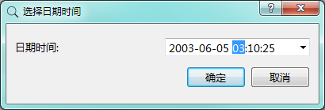

常用的接口：

|         接口          |                                调用方式                                |                                               说明                                               |
| --------------------- | --------------------------------------------------------------------- | ----------------------------------------------------------------------------------------------- |
| exec                  | int exec()                                                            | 显示这个对话框，返回执行结果。如果点击“确定”，返回值为1，如果点击“取消”，返回值为0. 可做为槽函数使用。 |
| execDialog            | int execDialog()                                                      | 与 exec 相同                                                                                     |
| setDateTime           | void setDateTime(const QDateTime & time)                              | 设置日期时间值                                                                                   |
| getDateTime           | QDateTime getDateTime()                                               | 获取用户输入的日期时间值                                                                          |
| dateTimeEdit          | QDateTimeEdit timeEdit                                                | 返回日期时间输入控件对象                                                                          |
| setDateTimeFromString | void setDateTimeFromString(const QString & datetime,                  | 以字符串形式设置时间，字符串的格式以format参数指定                                                 |
|                       | 　　　　const QString& format="yyyy-MM-dd HH:mm:ss")                   |                                                                                                 |
| dateTimeToString      | QString dateTimeToString(const QString& format="yyyy-MM-dd HH:mm:ss") | 返回字符串格式的时间，格式由format参数指定                                                         |

dateTimeEdit返回的是一个 QDateTimeEdit 对象，详细信息参考 [Qt在线文档-qdatetimeedit](https://doc.qt.io/qt-5/qdatetimeedit.html) 。常用的接口：

|        接口        |                              调用方式                              |         说明          |
| ------------------ | ----------------------------------------------------------------- | -------------------- |
| minimumDateTime    | QDateTime minimumTime() const                                     | 读取最小日期时间值     |
| setMinimumDateTime | void setMinimumTime(const QDateTime &min)                         | 设置最小日期时间值     |
| maximumDateTime    | QDateTime maximumDateTime() const                                 | 读取最大日期时间值     |
| setMaximumDateTime | void setMaximumDateTime(const QDateTime &min)                     | 设置最大日期时间值     |
| setDateTimeRange   | void setDateTimeRange(const QDateTime &min, const QDateTime &max) | 设置日期时间范围       |
| displayFormat      | QString displayFormat() const                                     | 读取显示格式          |
| setDisplayFormat   | void setDisplayFormat(const QString &format)                      | 设置显示格式          |
| toString           | QString toString(const QString &format) const                     | 按指定格式转换成字符串 |

## 对话框：选择日期范围

[返回目录](#category)

这个弹出对话框用于输入日期范围。对应的类为 DialogSelectDate2。从 PythonQt.private 模块中导入后就可以使用。调用方式与 DialogSelectDate 类似，只不过处理执行后能获取两个日期值。

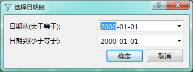

常用的接口：

|       接口        |                                  调用方式                                  |                                               说明                                               |
| ----------------- | ------------------------------------------------------------------------- | ----------------------------------------------------------------------------------------------- |
| exec              | int exec()                                                                | 显示这个对话框，返回执行结果。如果点击“确定”，返回值为1，如果点击“取消”，返回值为0. 可做为槽函数使用。 |
| execDialog        | int execDialog()                                                          | 与 exec 相同                                                                                     |
| setDate           | void setDate(const QDate & datefrom,const QDate & dateto)                 | 设置日期值的范围                                                                                 |
| getDateFrom       | QDate getDateFrom()                                                       | 获取用户输入的开始日期值（大于或等于）                                                             |
| getDateTo         | QDate getDateTo()                                                         | 获取用户输入的截止日期值（小于或等于）                                                             |
| dateEdit_from     | QDateEdit dateEdit_from                                                   | 返回用于输入开始日期的日期输入控件对象                                                             |
| dateEdit_to       | QDateEdit dateEdit_to                                                     | 返回用于输入截止日期的日期输入控件对象                                                             |
| setDateFromString | void setDateFromString(const QString & datefrom,                          | 以字符串设置起止日期，字符串格式用参数format设置                                                   |
|                   | 　　const QString & dateto, const QString& format = "yyyy-MM-dd") |                                                                                                 |
| dateFromToString  | 	QString dateFromToString(const QString& format="yyyy-MM-dd")            | 返回字符串格式的开始日期，格式由参数format设置                                                     |
| dateToToString    | 	QString dateToToString(const QString& format = "yyyy-MM-dd")            | 返回字符串格式的截止日期，格式由参数format设置                                                     |

dateEdit_from 和 dateEdit_to 返回的都是 QDateEdit 对象，详细信息参考 [Qt在线文档-qdateedit](https://doc.qt.io/qt-5/qdateedit.html) 。常用的接口：

|       接口       |                        调用方式                        |         说明          |
| ---------------- | ----------------------------------------------------- | -------------------- |
| minimumDate      | QDate minimumDate() const                             | 读取最小日期值        |
| setMinimumDate   | void setMinimumDate(const QDate &min)                 | 设置最小日期值        |
| maximumDate      | QDate maximumDate() const                             | 读取最大日期值        |
| setMaximumDate   | void setMaximumDate(const QDate &min)                 | 设置最大日期值        |
| setDateRange     | void setDateRange(const QDate &min, const QDate &max) | 设置日期范围          |
| displayFormat    | QString displayFormat() const                         | 读取显示格式          |
| setDisplayFormat | void setDisplayFormat(const QString &format)          | 设置显示格式          |
| toString         | QString toString(const QString &format) const         | 按指定格式转换成字符串 |

## 对话框：选择时间范围

[返回目录](#category)

这个弹出对话框用于输入时间范围。对应的类为 DialogSelectTime2。从 PythonQt.private 模块中导入后就可以使用。调用方式与 DialogSelectDate 类似，只不过处理执行后能获取两个时间值。

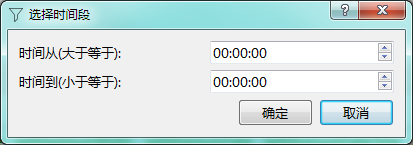

常用的接口：

|       接口        |                            调用方式                             |                                               说明                                               |
| ----------------- | --------------------------------------------------------------- | ----------------------------------------------------------------------------------------------- |
| exec              | int exec()                                                      | 显示这个对话框，返回执行结果。如果点击“确定”，返回值为1，如果点击“取消”，返回值为0. 可做为槽函数使用。 |
| execDialog        | int execDialog()                                                | 与 exec 相同                                                                                     |
| setTime           | void setTime(const QTime & timefrom,const QTime & timeto)       | 设置时间值的范围                                                                                 |
| getTimeFrom       | QTime getTimeFrom()                                             | 获取用户输入的开始时间值（大于或等于）                                                             |
| getTimeTo         | QTime getTimeTo()                                               | 获取用户输入的截止时间值（小于或等于）                                                             |
| timeEdit_from     | QTimeEdit timeEdit_from                                         | 返回用于输入开始时间的时间输入控件对象                                                             |
| timeEdit_to       | QTimeEdit timeEdit_to                                           | 返回用于输入截止时间的时间输入控件对象                                                             |
| setTimeFromString | void setTimeFromString(const QString & timefrom,                | 以字符串设置起止时间，字符串格式用参数format设置                                                   |
|                   | 　　const QString & timeto, const QString& format = "HH:mm:ss") |                                                                                                 |
| timeFromToString  | 	QString timeFromToString(const QString& format="HH:mm:ss")    | 返回字符串格式的开始时间，格式由参数format设置                                                     |
| timeToToString    | 	QString timeToToString(const QString& format = "HH:mm:ss")    | 返回字符串格式的截止时间，格式由参数format设置                                                     |

timeEdit_from 和 timeEdit_to 返回的都是 QTimeEdit 对象，详细信息参考 [Qt在线文档-qtimeedit](https://doc.qt.io/qt-5/qtimeedit.html) 。常用的接口：

|       接口       |                        调用方式                        |         说明          |
| ---------------- | ----------------------------------------------------- | -------------------- |
| minimumTime      | QDate minimumTime() const                             | 读取最小时间值        |
| setMinimumTime   | void setMinimumTime(const QTime &min)                 | 设置最小时间值        |
| maximumTime      | QDate maximumTime() const                             | 读取最大时间值        |
| setMaximumTime   | void setMaximumTime(const QTime &min)                 | 设置最大时间值        |
| setTimeRange     | void setTimeRange(const QTime &min, const QTime &max) | 设置时间范围          |
| displayFormat    | QString displayFormat() const                         | 读取显示格式          |
| setDisplayFormat | void setDisplayFormat(const QString &format)          | 设置显示格式          |
| toString         | QString toString(const QString &format) const         | 按指定格式转换成字符串 |

## 对话框：选择日期时间范围

[返回目录](#category)

这个弹出对话框用于输入时间范围。对应的类为 DialogSelectDateTime2。从 PythonQt.private 模块中导入后就可以使用。调用方式与 DialogSelectDate 类似，只不过处理执行后能获取两个日期时间值。

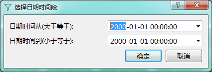

常用的接口：

|         接口          |                                    调用方式                                    |                                               说明                                               |
| --------------------- | ----------------------------------------------------------------------------- | ----------------------------------------------------------------------------------------------- |
| exec                  | int exec()                                                                    | 显示这个对话框，返回执行结果。如果点击“确定”，返回值为1，如果点击“取消”，返回值为0. 可做为槽函数使用。 |
| execDialog            | int execDialog()                                                              | 与 exec 相同                                                                                     |
| setDateTime           | void setDateTime(const QDateTime & dateTimeFrom,const QDateTime & dateTimeTo) | 设置时间值的范围                                                                                 |
| getDateTimeFrom       | QDateTime getDateTimeFrom()                                                   | 获取用户输入的开始日期时间值（大于或等于）                                                         |
| getDateTimeTo         | QDateTime getDateTimeTo()                                                     | 获取用户输入的截止日期时间值（小于或等于）                                                         |
| dateTimeEdit_from     | QDateTimeEdit dateTimeEdit_from                                               | 返回用于输入开始日期时间的日期时间输入控件对象                                                      |
| dateTimeEdit_to       | QDateTimeEdit dateTimeEdit_to                                                 | 返回用于输入截止日期时间的日期时间输入控件对象                                                      |
| setDateTimeFromString | void setDateTimeFromString(const QString & datetimefrom,                      | 以字符串设置起止日期时间，字符串格式用参数format设置                                                |
|                       | 　　const QString & datetimeto, const QString& format = "yyyy-MM-dd HH:mm:ss") |                                                                                                 |
| dateTimeFromToString  | 	QString dateTimeFromToString(const QString& format="yyyy-MM-dd HH:mm:ss")    | 返回字符串格式的开始日期时间，格式由参数format设置                                                 |
| dateTimeToToString    | 	QString dateTimeToToString(const QString& format = "yyyy-MM-dd HH:mm:ss")    | 返回字符串格式的截止日期时间，格式由参数format设置                                                 |

dateTimeEdit_from 和 dateTimeEdit_to 返回的都是 QDateTimeEdit 对象，详细信息参考 [Qt在线文档-qdatetimeedit](https://doc.qt.io/qt-5/qdatetimeedit.html) 。常用的接口：

|        接口        |                              调用方式                              |         说明          |
| ------------------ | ----------------------------------------------------------------- | -------------------- |
| minimumDateTime    | QDateTime minimumTime() const                                     | 读取最小日期时间值     |
| setMinimumDateTime | void setMinimumTime(const QDateTime &min)                         | 设置最小日期时间值     |
| maximumDateTime    | QDateTime maximumDateTime() const                                 | 读取最大日期时间值     |
| setMaximumDateTime | void setMaximumDateTime(const QDateTime &min)                     | 设置最大日期时间值     |
| setDateTimeRange   | void setDateTimeRange(const QDateTime &min, const QDateTime &max) | 设置日期时间范围       |
| displayFormat      | QString displayFormat() const                                     | 读取显示格式          |
| setDisplayFormat   | void setDisplayFormat(const QString &format)                      | 设置显示格式          |
| toString           | QString toString(const QString &format) const                     | 按指定格式转换成字符串 |

## 其它对话框

[返回目录](#category)

除了以上几种 biForm 提供的对话框类，开发者还可以通过以下几种方式使用对话框。

### 1. 使用 Qt 提供的 QDialog 派生类

Qt中其实提供了多种对话框类，可以直接使用，比如 QColorDialog, QErrorMessage, QFileDialog, QFontDialog, QInputDialog, QMessageBox, QProgressDialog, QWizard 等，这些类使用起来也很方便。具体参考 Qt 文档。

|       类        |                 用途                 |                            参考文档                             |
| --------------- | ----------------------------------- | -------------------------------------------------------------- |
| QColorDialog    | 选择颜色                             | [QColorDialog](https://doc.qt.io/qt-5/qcolordialog.html)       |
| QErrorMessage   | 错误信息提示                         | [QErrorMessage](https://doc.qt.io/qt-5/qerrormessage.html)     |
| QFileDialog     | 选择文件或路径                       | [QFileDialog](https://doc.qt.io/qt-5/qfiledialog.html)         |
| QFontDialog     | 选择字体                             | [QFontDialog](https://doc.qt.io/qt-5/qfontdialog.html)         |
| QInputDialog    | 输入数据（文本、整数、小数、选择项目） | [QInputDialog](https://doc.qt.io/qt-5/qinputdialog.html)       |
| QMessageBox     | 消息对话框                           | [QMessageBox](https://doc.qt.io/qt-5/qmessagebox.html)         |
| QProgressDialog | 进度条                               | [QProgressDialog](https://doc.qt.io/qt-5/qprogressdialog.html) |
| QWizard         | 多步骤向导                           | [QWizard](https://doc.qt.io/qt-5/qwizard.html)                 |

其中 QMessageBox 的功能可以使用 [pub.infoMsgBox](1-9-pub#infoMsgBox)、[pub.questionMsgBox](1-9-pub#questionMsgBox)、[pub.criticalMsgBox](1-9-pub#criticalMsgBox)、[pub.warningMsgBox](1-9-pub#warningMsgBox) 代替。但 QMessageBox 提供了更多的接口，可以在需要的时候再使用。

QProgressDialog 也可以使用 [this.form.showWaiting](1-6-form-func#showWaiting) 来代替。QProgressDialog 提供了更丰富的接口，可以在需要的时候再使用。

### 2. 继承 QDialog 类

如果有自己的特殊需求，可以在 Python 脚本中创建一个新的类，继承 QDialog 或其它对话框类，实现自己想要的界面和处理逻辑。这种方式需要比较熟悉 Qt 库。

### 3. 使用 PFF 表单

我们可以将对话框也设计成一个PFF表单，在需要调用它的另一个表单中，调用 pub.popupPFF 函数，就可以以对话框模式打开这个表单，并且返回执行的结果。具体调用方法参考 [pub.popupPFF](1-9-pub#popupPFF) 中的说明。

这种调用方式的前提是这个对话框表单在 PFF 运行时环境中已经注册（打开）过，否则脚本运行时会因为在系统已经注册的表单中找不到这个表单，就不起作用。所以在 biForm 中试运行时，这个语句执行是看不到效果的，因为 biForm 试运行环境中只有当前表单，不能调用其它表单，只能在 PFF运行时环境（比如 biReader ）中进行测试。

这种方式可以使用 biForm 的设计界面设计表单，比第二种方式要更简单，代码量通常更少，不需要事先熟悉 Qt 库。所以我们建议多用这种方式，第二种方式可以具体看情况决定是否采用。

其实任何 PFF 表单都可以使用 popupPFF 函数来调用，都可以以弹出对话框方式呈现。但脚本中必须要以调用 [accept](1-6-form-func#accept) 函数的方式关闭表单才能回传数据，调用 accept 传入的参数就是回传的数据。
