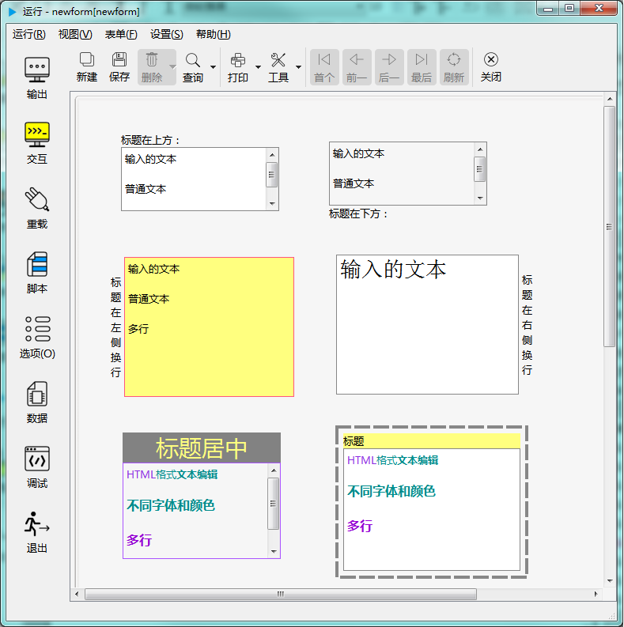

# 多行文本输入控件

多行文本控件用于输入文字。可以有多种格式，比如下图显示了几种不同样式：

---

<h2 id="category">目录</h2>

- [继承的属性和函数](2-4-multilineedit?id=继承的属性和函数)

- [自有属性](2-4-multilineedit?id=多行文本输入控件的自有属性)

- [自有成员函数](2-4-multilineedit?id=多行文本输入控件自有成员函数)

- [信号](2-4-multilineedit?id=多行文本输入控件的信号)

- [可编程函数](2-4-multilineedit?id=可编程函数)

---

## 继承的属性和函数

- [继承自QObject 的属性](2-1-qobject?id=属性)

- [继承自QObject 的 成员函数](2-1-qobject?id=成员函数)

- [继承自widgetDelegateBase的属性](2-2-base?id=属性)

- [继承自widgetDelegateBase的成员函数](2-2-base?id=成员函数)

---

## 多行文本输入控件的自有属性

[返回目录](#category)

|属性|值类型|读写类型|说明|
| - | - | - | - |
|caption|QString|可读 可写|标题文字|
|editorFont|QFont|可读 可写|文本输入框字体|
|editorBackColor|QColor|可读 可写|文本输入框背景色|
|editorForeColor|QColor|可读 可写|文本输入框前景色|
|editorBorderColor|QColor|可读 可写|文本输入框边框颜色|
|margin|int|可读 可写|边界宽度|
|maxLength|int|可读 可写|输入文本最大长度|
|editorBorderStyle|int|可读 可写|文本输入框边框样式|
|captionPosition|int|可读 |标题位置|
|shadow|int|可读 可写|文本输入框边框特效样式|
|editorFillStyle|int|可读 可写|文本输入框背景填充类型|
|html|QString|可读 可写|当前HTML格式的文本|
|plainText|QString|可读 可写|当前普通文本|
|wordWrapMode|int|可读 可写|文本输入框换行模式|
|defaultVal|QString|可读 可写|缺省文本|
|editorVAlign|int|可读 可写|文本输入框垂直方向对齐方式|
|editorHAlign|int|可读 可写|文本输入框水平方向对齐方式|
|readOnly|bool|可读 可写|是否只读|

- ### 属性：caption （类型：QString 可读 可写）

标题显示的文本。

| |调用方法|
| - | - |
|读取|QString caption const|
|修改|void setcaption( const QString &caption ) const|

- ### 属性：editorFont （类型：QFont 可读 可写）

文本编辑器的字体。

| |调用方法|
| - | - |
|读取|QFont editorFont const|
|修改|void seteditorFont( const QFont &editorFont ) const|

- ### 属性：editorBackColor （类型：QColor 可读 可写）

文本编辑器的背景色，在填充类型设为“透明”时无效。

| |调用方法|
| - | - |
|读取|QColor editorBackColor const|
|修改|void seteditorBackColor( const QColor &editorBackColor ) const|

- ### 属性：editorForeColor （类型：QColor 可读 可写）

文本编辑器的前景色。

| |调用方法|
| - | - |
|读取|QColor editorForeColor const|
|修改|void seteditorForeColor( const QColor &editorForeColor ) const|

- ### 属性：editorBorderColor （类型：QColor 可读 可写）

文本编辑器的边框颜色。

| |调用方法|
| - | - |
|读取|QColor editorBorderColor const|
|修改|void seteditorBorderColor( const QColor &editorBorderColor ) const|

- ### 属性：margin （类型：int 可读 可写）

边界宽度（像素为单位）。

| |调用方法|
| - | - |
|读取|int margin const|
|修改|void setmargin( int margin ) const|

- ### 属性：maxLength （类型：int 可读 可写）

可输入文本的最大长度。

| |调用方法|
| - | - |
|读取|int maxLength const|
|修改|void setmaxLength( int maxLength ) const|

- ### 属性：editorBorderStyle （类型：int 可读 可写）

文本输入框边框样式。

| |调用方法|
| - | - |
|读取|int editorBorderStyle const|
|修改|void seteditorBorderStyle( int editorBorderStyle ) const|
| |**editorBorderStyle取值：**|
| |pub.NOFRAME 没有边框|
| |pub.UNDERLINE 下划线|
| |pub.RECTANGLE 矩形边框|

- ### 属性：captionPosition （类型：int 可读 ）

标题所在位置。设计阶段设置后，运行时不允许修改。

| |调用方法|
| - | - |
|读取|int captionPosition const|
||值的含义：|
||pub.ATTOP 在上方|
||pub.ATLEFT 在左侧|
||pub.ATBOTTOM 在下方|
||pub.ATRIGHT 在右侧|
||pub.NOCAPTION 无标题|

- ### 属性：shadow （类型：int 可读 可写）

文本输入框边框样式。

| |调用方法|
| - | - |
|读取|int shadow const|
|修改|void setshadow( int shadow ) const|
| |**shadow取值：**|
| |pub.PLAIN 平的|
| |pub.RAISED 上凸|
| |pub.SUNKEN 下陷|

- ### 属性：editorFillStyle （类型：int 可读 可写）

文本输入框背景填充样式。设置为“透明”时，背景色无效。

| |调用方法|
| - | - |
|读取|int editorFillStyle const|
|修改|void seteditorFillStyle( int editorFillStyle ) const|
| |**editorFillStyle的值：**|
| |- pub.FILLED_BACKGROUND 填充|
| |- pub.TRANSPARENT_BACKGROUND 透明|

- ### 属性：html （类型：QString 可读 可写）

输入的HTML格式的文本内容。

| |调用方法|
| - | - |
|读取|QString html const|
|修改|void sethtml( const QString &html ) const|

- ### 属性：plainText （类型：QString 可读 可写）

输入的普通文本内容。

| |调用方法|
| - | - |
|读取|QString plainText const|
|修改|void setplainText( const QString &plainText ) const|

- ### 属性：wordWrapMode （类型：int 可读 可写）

换行模式。

| |调用方法|
| - | - |
|读取|int wordWrapMode const|
|修改|void setwordWrapMode( int wordWrapMode ) const|
| |**wordWrapMode的值：**|
| |- pub.NOWRAP 不换行|
| |- pub.WORD_WRAP 换单词换行|
| |- pub.MANUAL_WRAP 手动换行|
| |- pub.WRAP_ANYWHERE 随时换行|
| |- pub.WRAP_ATWORD_BOUNDARY_OR_ANYWHERE 单词边界或随时换行|

- ### 属性：defaultVal （类型：QString 可读 可写）

缺省的文本内容。

| |调用方法|
| - | - |
|读取|QString defaultVal const|
|修改|void setdefaultVal( const QString &defaultVal ) const|

- ### 属性：editorVAlign （类型：int 可读 可写）

文本输入框垂直方向对齐方式。

| |调用方法|
| - | - |
|读取|int editorVAlign const|
|修改|void seteditorVAlign( int editorVAlign ) const|
| |**editorVAlign取值：**|
| |pub.ALIGNTOP 向上对齐|
| |pub.ALIGNBOTTOM 向下对齐|
| |pub.ALIGNVCENTER 垂直居中对齐|

- ### 属性：editorHAlign （类型：int 可读 可写）

文本输入框水平方向对齐方式。

| |调用方法|
| - | - |
|读取|int editorHAlign const|
|修改|void seteditorHAlign( int editorHAlign ) const|
| |**editorHAlign取值：**|
| |pub.ALIGNLEFT 向左对齐|
| |pub.ALIGNRIGHT 向右对齐|
| |pub.ALIGNHCENTER 水平居中对齐|
| |pub.ALIGNJUSTIFY 水平分散对齐|

- ### 属性：readOnly （类型：bool 可读 可写）

是否只读。

| |调用方法|
| - | - |
|读取|bool readOnly const|
|修改|void setreadOnly( bool readOnly ) const|

---

## 多行文本输入控件自有成员函数

[返回目录](#category)

|函数|接口|说明|
| - | - | - |
|append| void append(const QString & text) const|在最后添加文本|
|clear| void clear() const|清除所有内容|
|copy| void copy() const|复制选中的文本|
|cut| void cut() const|剪切|
|insertHtml| void insertHtml(const QString &text) const|插入HTML文本|
|insertPlainText| void insertPlainText(const QString &text) const|插入普通文本|
|paste| void paste() const|粘贴|
|redo| void redo() const|重做上一步操作|
|selectAll| void selectAll() const|选择所有|
|setText| void setText(const QString & text) const|设置文本|
|undo| void undo() const|撤消上一步操作|
|zoomIn| void zoomIn(int range = 1) const|放大，range指定字号增加的点数|
|zoomOut| void zoomOut(int range =1) const|缩小，range指定字号减少的点数|

---

## 多行文本输入控件的信号

[返回目录](#category)

|信号|接口|说明|
| - | - | - | 
|copyAvailable| void copyAvailable(bool yes)|是否可以进行复制的状态时发出此信号|
|currentCharFormatChanged|void currentCharFormatChanged ( const QTextCharFormat & f ) |当前字符格式发生变化时 f是新的格式 通常是在html格式输入时当光标位置发生变化时|
|cursorPositionChanged| void cursorPositionChanged()|光标位置改变时发出此信号|
|redoAvailable| void redoAvailable(bool available)|可以重做上一步操作的状态时发出此信号|
|selectionChanged| void selectionChanged()|所选文本范围发生变化时发出此信号|
|textChanged| void textChanged()|文本发生改变时发出此信号，通过程序修改文本也会发出此信号|
|undoAvailable| void undoAvailable(bool available)|可以撤消上一步操作时发出此信号|

---

## 可编程函数

[返回目录](#category)

- [可编程函数的详细说明](1-4-openscript?id=控件的可编程函数)

多行文本输入控件所有可编程函数的清单：

|函数|函数名|传入参数|返回值|说明|
| - | - | - | - | - |
|[缺省值](1-4-openscript?id=default) | 控件名_default | 无 | 输入框中文本内容的初始值 **数据类型：字符串**| 返回控件的初始值。 控件创建后、新建空白表单后输入框中的文本会还原成初始值。|
|[校验规则](1-4-openscript?id=validator)|控件名_validator|输入的文本|输入值是否合法 **数据类型：布尔**|如果输入值满足要求，返回True，否则返回False。 这个函数会在完成输入后被调用。 手工输入和程序修改都会调用此函数。|
|[鼠标进入时](1-4-openscript?id=enter)|控件名_enter|无|无|鼠标光标进入到这个控件时调用|
|[鼠标离开时](1-4-openscript?id=leave)|控件名_leave|无|无|鼠标光标离开这个控件时调用|
|[大小改变时](1-4-openscript?id=resize)|控件名_resize|无|无|控件大小改变时调用|
|[当拖曳进入时](1-4-openscript?id=dragEnter)|控件名_dragEnter|拖曳进入的元数据|是否接受拖曳进入 **数据类型：布尔**|当从外部拖曳一些内容进入到这个控件时，会调用此函数。 不接受拖曳的控件不会调用此函数。 通过脚本判断是否接受拖曳， 如果接受，返回 True，如果在控件上放开鼠标，程序会转而调用“当拖曳放下时”函数。 如果不接受，返回False，程序将不会调用“当拖曳放下时”函数。  **传入参数：** format:元数据的格式列表，以列表类型传入 data:元数据的内容，以列表类型传入 dx:拖入的位置X坐标 dy:拖入的位置Y坐标|
|[当拖曳放下时](1-4-openscript?id=drop)|控件名_drop|拖曳放下的元数据|是否接受拖曳放下 **数据类型：布尔**|拖曳放下时调用。允许则返回 True，否则返回 False。  **传入参数：** format:元数据的格式列表，以列表类型传入 data:元数据的内容，以列表类型传入 dx:放下的位置X坐标 dy:放下的位置Y坐标|
|[获得焦点](1-4-openscript?id=getfocus)|控件名_getfocus|无|无|获得输入焦点时调用|
|[失去焦点](1-4-openscript?id=lostfocus)|控件名_lostfocus|无|无|失去输入焦点时调用|
|[单次定时器超时时](1-4-openscript?id=singleshot)|控件名_singleshot|无|无|内置单次定时器超时时调用|
|[定时器超时时](1-4-openscript?id=timeout)|控件名_timeout|定时器的ID值|无|内置定时器超时时调用|

