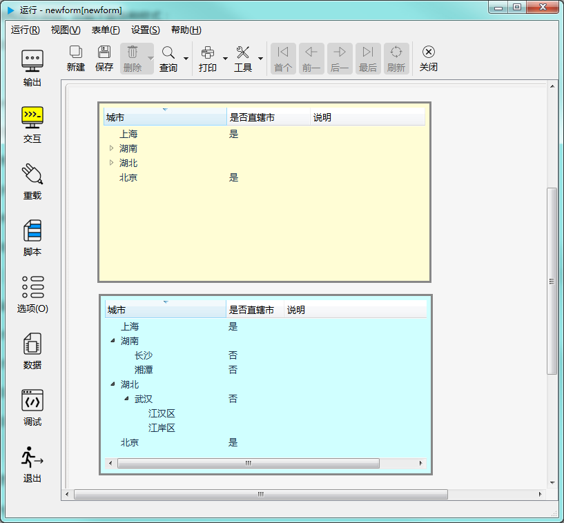

# 树形控件

树形控件以树形结构显示项目。比如下图各种样式：

---

树形控件每个节点都是一个 treeItemDelegate 对象，在成员函数中，经常需要将 treeItemDelegate 类的实例做为传入参数或返回值进行处理。关于 treeItemDelegate 的接口，请参考[二十六、树形控件的节点](2-26-treeitem)。

---

<h2 id="category">目录</h2>

- [继承的属性和函数](#继承的属性和函数)

- [自有属性](#树形控件的自有属性)

- [自有成员函数](#树形控件自有成员函数)

- [信号](#树形控件的信号)

- [可编程函数](#可编程函数)

---

## 继承的属性和函数

- [继承自QObject 的属性](2-1-qobject?id=属性)

- [继承自QObject 的 成员函数](2-1-qobject?id=成员函数)

- [继承自widgetDelegateBase的属性](2-2-base?id=属性)

- [继承自widgetDelegateBase的成员函数](2-2-base?id=成员函数)

---

## 树形控件的属性

[返回目录](#category)

|属性|值类型|读写类型|说明|
| - | - | - | - |
|margin|int|可读 可写|边界宽度（像素为单位）|
|indentation|int|可读 可写|缩进宽度（像素为单位）|
|columnCount|int|可读 可写|列数|
|sortingEnabled|bool|可读 可写|是否允许排序|
|rootIsDecorated|bool|可读 可写|根节点是否显示|
|uniformRowHeights|bool|可读 可写|统一行高|
|animated|bool|可读 可写|是否动态显示展开和折叠过程|
|allColumnsShowFocus|bool|可读 可写|是否所有列允许获得焦点|
|wordwrap|bool|可读 可写|是否自动换行|
|itemsExpandable|bool|可读 可写|项目是否可展开|

- ### 属性：margin （类型：int 可读 可写）

边界宽度（像素为单位）

| |调用方法|
| - | - |
|读取|int margin const|
|修改|void setMargin( int margin ) const|

- ### 属性：indentation （类型：int 可读 可写）

缩进宽度（像素为单位）

| |调用方法|
| - | - |
|读取|int indentation const|
|修改|void setIndentation( int indentation ) const|

- ### 属性：columnCount （类型：int 可读 可写）

列数。

| |调用方法|
| - | - |
|读取|int columnCount const|
|修改|void setColumnCount( int columnCount ) const|

- ### 属性：sortingEnabled （类型：bool 可读 可写）

是否允许排序。

| |调用方法|
| - | - |
|读取|bool sortingEnabled const|
|修改|void setSortingEnabled( bool sortingEnabled ) const|

- ### 属性：rootIsDecorated （类型：bool 可读 可写）

根节点是否允许展开和折叠。如果设置为 False，将只显示顶层节点，不会列出所有下级节点，外观和列表控件类似。

| |调用方法|
| - | - |
|读取|bool rootIsDecorated const|
|修改|void setRootIsDecorated( bool rootIsDecorated ) const|

- ### 属性：uniformRowHeights （类型：bool 可读 可写）

是否统一行高。

| |调用方法|
| - | - |
|读取|bool uniformRowHeights const|
|修改|void setUniformRowHeights( bool uniformRowHeights ) const|

- ### 属性：animated （类型：bool 可读 可写）

是否动态显示展开和折叠过程

| |调用方法|
| - | - |
|读取|bool animated const|
|修改|void setAnimated( bool animated ) const|

- ### 属性：allColumnsShowFocus （类型：bool 可读 可写）

是否所有列允许获得焦点

| |调用方法|
| - | - |
|读取|bool allColumnsShowFocus const|
|修改|void setAllColumnsShowFocus( bool allColumnsShowFocus ) const|

- ### 属性：wordwrap （类型：bool 可读 可写）

是否自动换行。

| |调用方法|
| - | - |
|读取|bool wordwrap const|
|修改|void setWordwrap( bool wordwrap ) const|

- ### 属性：itemsExpandable （类型：bool 可读 可写）

项目是否允许展开。

| |调用方法|
| - | - |
|读取|bool itemsExpandable const|
|修改|void setItemsExpandable( bool itemsExpandable ) const|

---

## 框架控件自有成员函数

[返回目录](#category)

所有属性的设置函数（参考上一节中修改属性的接口），都属于此类，都可以当做槽使用。除此之处还包括以下成员函数：

|函数|接口|说明|
| - | - | - | 
|clear|	void clear() const|清除所有|
|currentColumn|	int currentColumn() const|当前列|
|currentText|	QString currentText(int col=0) const|指定列的当前显示的文本|
|setHeaderLabels|	void setHeaderLabels ( const QStringList & labels ) const|设置列标题|
|sortColumn|	int sortColumn () const|当前正使用排序的列的序号|
|sortItems|	void sortItems ( int column, bool ascorder = true)	const|对项目进行排序，指定列和排序规则|
|removeTopLevelItem|	void removeTopLevelItem ( int index ) 	const|移除顶级项目|
|topLevelItemCount|	int topLevelItemCount() const|顶级项目数量|
|columnAt|int columnAt ( int x ) const|鼠标位置x处于哪一列|
|columnViewportPosition|	int columnViewportPosition ( int column ) const|指定列在可视区域水平方向的位置|
|columnWidth|int columnWidth ( int column ) const |列的宽度|
|setColumnHidden|void setColumnHidden ( int column, bool hide ) 	const|设置某列隐藏或显示|
|setColumnWidth|void setColumnWidth ( int column, int width )	const|设置列宽|
|collapseAll|void collapseAll ()	const|折叠所有|
|expandAll|void expandAll () const|展开|
|expandToDepth|	void expandToDepth ( int depth )	const|展开到第几级|
|hideColumn|void hideColumn ( int column )	const|隐藏指定列|
|resizeColumnToContents|	void resizeColumnToContents ( int column )	const|自动按内容调整指定列的宽度|
|showColumn|void showColumn ( int column )	const|显示指定列|
|scrollToBottom|void scrollToBottom () const|滚动到最底端|
|scrollToTop|	void scrollToTop ()	 const|滚动到最顶端|
|addTopLevelItem|	void addTopLevelItem ( treeItemDelegate * item ) const|添加顶层项目|
|closePersistentEditor|	void closePersistentEditor ( treeItemDelegate * item, int column = 0 ) const|关闭当前正用的编辑器|
|currentItem|	treeItemDelegate * currentItem () const |当前选中的项目|
|editItem|	void editItem ( treeItemDelegate * item, int column = 0 ) 	const|编加指定项目|
|headerItem|	treeItemDelegate * headerItem () const |返回标题栏对应的项目|
|indexOfTopLevelItem|	int indexOfTopLevelItem ( treeItemDelegate * item ) const |返回指定顶层项目的索引|
|insertTopLevelItem|	void insertTopLevelItem ( int index, treeItemDelegate * item ) 	const|在指定位置插入顶层项目|
|invisibleRootItem|	treeItemDelegate * invisibleRootItem () const |根项目是否可见|
|isFirstItemColumnSpanned|	bool isFirstItemColumnSpanned ( const treeItemDelegate * item ) const |返回指定项目是否被设置为合并了所有列|
|itemAbove|	treeItemDelegate * itemAbove ( const treeItemDelegate * item ) const |返回指定项目的上一个项目|
|itemAt|	treeItemDelegate * itemAt ( const QPoint & p ) const |返回鼠标指针位置对应的项目|
|itemAt|	treeItemDelegate * itemAt ( int x, int y ) const |返回鼠标位置对应的项目|
|itemBelow|	treeItemDelegate * itemBelow ( const treeItemDelegate * item ) const |返回指定项目的下一个项目|
|openPersistentEditor|	void openPersistentEditor ( treeItemDelegate * item, int column = 0 ) const|打开指定项目和指定列的编辑器|
|removeItemWidget|	void removeItemWidget ( treeItemDelegate * item, int column ) 	const|移除指定项目指定列的控件|
|selectedItemsCount|	int selectedItemsCount () const |选中的项目数量|
|selectedItem|	treeItemDelegate* selectedItem(int index) const |按索引返回选中的项目中的某一项|
|setCurrentItem|	void setCurrentItem ( treeItemDelegate * item )	const|将指定项目设置当前项目|
|setCurrentItem|	void setCurrentItem ( treeItemDelegate * item, int column ) 	const|指定项目和列设置当前项目|
|setFirstItemColumnSpanned|	void setFirstItemColumnSpanned ( const treeItemDelegate * item, bool span ) 	const|设置某项目合并所有列|
|setHeaderItem|	void setHeaderItem (const treeItemDelegate * item )	const|设置标题行项目|
|takeTopLevelItem|	treeItemDelegate * takeTopLevelItem ( int index ) 	const|取出指定索引的顶层项目|
|topLevelItem|	treeItemDelegate * topLevelItem ( int index ) const|返回指定索引的顶层项目|
|visualItemRect|	QRect visualItemRect ( const treeItemDelegate * item ) const |指定项目在可见区域的位置和尺寸|
|collapseItem|	void collapseItem ( const treeItemDelegate * item ) 	const|折叠指定项目|
|expandItem|	void expandItem ( const treeItemDelegate * item ) 	const|展开指定项目|
|scrollToItemEnsureVisible|	void scrollToItemEnsureVisible ( const treeItemDelegate * item ) 	const|滚动到保证指定项目可见|
|scrollToItemAtTop|	void scrollToItemAtTop ( const treeItemDelegate * item ) 	const|滚到到指定项目置于可视区域的最上方|
|scrollToItemAtBottom|	void scrollToItemAtBottom ( const treeItemDelegate * item ) 	const|滚动指定项目置于可视区域的最下方|
|scrollToItemAtCenter|	void scrollToItemAtCenter( const treeItemDelegate * item ) 	const|滚动指定项目置于可视区域的中央|

---

## 框架控件的信号

[返回目录](#category)

|信号|接口|说明|
| - | - | - | 
|itemSelectionChanged|void itemSelectionChanged ()|选择范围发生变化时发出此信号|
|viewportEntered|void viewportEntered ()|进入可视区域时发出此信号|	
|currentItemChanged|void currentItemChanged ( treeItemDelegate * current, treeItemDelegate * previous )|切换当前所选项目时发出此信号|
|itemActivated|void itemActivated ( treeItemDelegate * item, int column ) |用户通过点击或双击激活某个项目时发出此信号|
|itemChanged|void itemChanged ( treeItemDelegate * item, int column )|项目内容发生变化时发出此信号|
|itemClicked|void itemClicked ( treeItemDelegate * item, int column ) |项目被点击时发出此信号|
|itemCollapsed|void itemCollapsed ( treeItemDelegate * item ) |项目被折叠时发出此信号|
|itemDoubleClicked|void itemDoubleClicked ( treeItemDelegate * item, int column ) |项目被双击时发出此信号|
|itemEntered|void itemEntered ( treeItemDelegate * item, int column ) |鼠标光标进入某个项目时发出此信号|
|itemExpanded|void itemExpanded ( treeItemDelegate * item ) |项目被展开时发出此信号|
|itemPressed|void itemPressed ( treeItemDelegate * item, int column ) |用户在某个项目上按下鼠标时发出此信号|

---

## 可编程函数

[返回目录](#category)

- [可编程函数的详细说明](1-4-openscript?id=控件的可编程函数)

树形控件所有可编程函数的清单：

|函数|函数名|传入参数|返回值|说明|
| - | - | - | - | - |
|[鼠标进入时](1-4-openscript?id=enter)|控件名_enter|无|无|鼠标光标进入到这个控件时调用|
|[鼠标离开时](1-4-openscript?id=leave)|控件名_leave|无|无|鼠标光标离开这个控件时调用|
|[大小改变时](1-4-openscript?id=resize)|控件名_resize|无|无|控件大小改变时调用|
|[当拖曳进入时](1-4-openscript?id=dragEnter)|控件名_dragEnter|拖曳进入的元数据|是否接受拖曳进入 **数据类型：布尔**|当从外部拖曳一些内容进入到这个控件时，会调用此函数。 不接受拖曳的控件不会调用此函数。 通过脚本判断是否接受拖曳， 如果接受，返回 True，如果在控件上放开鼠标，程序会转而调用“当拖曳放下时”函数。 如果不接受，返回False，程序将不会调用“当拖曳放下时”函数。  **传入参数：** format:元数据的格式列表，以列表类型传入 data:元数据的内容，以列表类型传入 dx:拖入的位置X坐标 dy:拖入的位置Y坐标|
|[当拖曳放下时](1-4-openscript?id=drop)|控件名_drop|拖曳放下的元数据|是否接受拖曳放下 **数据类型：布尔**|拖曳放下时调用。允许则返回 True，否则返回 False。  **传入参数：** format:元数据的格式列表，以列表类型传入 data:元数据的内容，以列表类型传入 dx:放下的位置X坐标 dy:放下的位置Y坐标|
|[单次定时器超时时](1-4-openscript?id=singleshot)|控件名_singleshot|无|无|内置单次定时器超时时调用|
|[定时器超时时](1-4-openscript?id=timeout)|控件名_timeout|定时器的ID值|无|内置定时器超时时调用|

