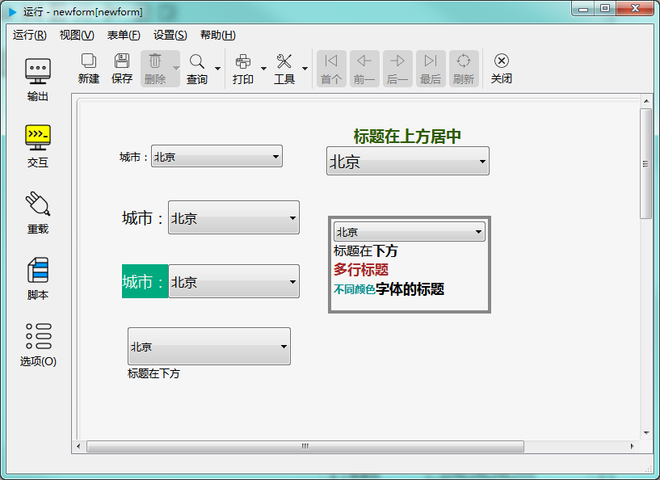

# 下拉列表框控件

下拉列表框提供一个弹出的下拉列表供选择。如下图示：

## 继承自 widgetDelegateBase 的 属性和成员函数

参考： [基类widgetDelegateBase](2-2-base)

## 下拉列表框控件的属性

- ### 属性：caption （类型：QString 可读 可写）

{{ usage }}

| |调用方法|
| - | - |
|读取|QString caption const|
|修改|void setCaption( const QString &caption ) const|

- ### 属性：editorFont （类型：QFont 可读 可写）

{{ usage }}

| |调用方法|
| - | - |
|读取|QFont editorFont const|
|修改|void setEditorFont( const QFont &editorFont ) const|

- ### 属性：editorBackColor （类型：QColor 可读 可写）

{{ usage }}

| |调用方法|
| - | - |
|读取|QColor editorBackColor const|
|修改|void setEditorBackColor( const QColor &editorBackColor ) const|

- ### 属性：editorForeColor （类型：QColor 可读 可写）

{{ usage }}

| |调用方法|
| - | - |
|读取|QColor editorForeColor const|
|修改|void setEditorForeColor( const QColor &editorForeColor ) const|

- ### 属性：editorBorderColor （类型：QColor 可读 可写）

{{ usage }}

| |调用方法|
| - | - |
|读取|QColor editorBorderColor const|
|修改|void setEditorBorderColor( const QColor &editorBorderColor ) const|

- ### 属性：margin （类型：int 可读 可写）

{{ usage }}

| |调用方法|
| - | - |
|读取|int margin const|
|修改|void setMargin( int margin ) const|

- ### 属性：maxLength （类型：int 可读 可写）

{{ usage }}

| |调用方法|
| - | - |
|读取|int maxLength const|
|修改|void setMaxLength( int maxLength ) const|

- ### 属性：editorBorderStyle （类型：int 可读 可写）

{{ usage }}

| |调用方法|
| - | - |
|读取|int editorBorderStyle const|
|修改|void setEditorBorderStyle( int editorBorderStyle ) const|

- ### 属性：captionPosition （类型：int 可读 ）

{{ usage }}

| |调用方法|
| - | - |
|读取|int captionPosition const|

- ### 属性：shadow （类型：int 可读 可写）

{{ usage }}

| |调用方法|
| - | - |
|读取|int shadow const|
|修改|void setShadow( int shadow ) const|

- ### 属性：editorFillStyle （类型：int 可读 可写）

{{ usage }}

| |调用方法|
| - | - |
|读取|int editorFillStyle const|
|修改|void setEditorFillStyle( int editorFillStyle ) const|

- ### 属性：editable （类型：bool 可读 可写）

{{ usage }}

| |调用方法|
| - | - |
|读取|bool editable const|
|修改|void setEditable( bool editable ) const|

- ### 属性：textList （类型：QStringList 可读 ）

{{ usage }}

| |调用方法|
| - | - |
|读取|QStringList textList const|

- ### 属性：valueList （类型：QStringList 可读 ）

{{ usage }}

| |调用方法|
| - | - |
|读取|QStringList valueList const|

- ### 属性：currentText （类型：QString 可读 可写）

{{ usage }}

| |调用方法|
| - | - |
|读取|QString currentText const|
|修改|void setCurrentText( const QString &currentText ) const|

- ### 属性：currentIndex （类型：int 可读 可写）

{{ usage }}

| |调用方法|
| - | - |
|读取|int currentIndex const|
|修改|void setCurrentIndex( int currentIndex ) const|

- ### 属性：currentData （类型：QString 可读 可写）

{{ usage }}

| |调用方法|
| - | - |
|读取|QString currentData const|
|修改|void setCurrentData( const QString &currentData ) const|

- ### 属性：count （类型：int 可读 ）

{{ usage }}

| |调用方法|
| - | - |
|读取|int count const|

- ### 属性：defaultVal （类型：QString 可读 ）

{{ usage }}

| |调用方法|
| - | - |
|读取|QString defaultVal const|

- ### 属性：reference （类型：QString 可读 可写）

{{ usage }}

| |调用方法|
| - | - |
|读取|QString reference const|
|修改|void setReference( const QString &reference ) const|

