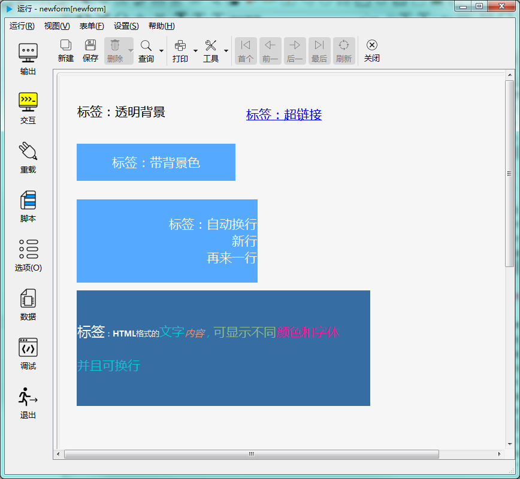

# 第二章 标准控件 - 标签控件

标签控件用于显示文本，可以有多种格式，比如下图显示了几种不同样式的文本标签控件：

---

<h2 id="category">目录</h2>

- [继承的属性和函数](#继承的属性和函数)

- [自有属性](#标签控件的自有属性)

- [自有成员函数](#标签控件自有成员函数)

- [信号](#标签控件的信号)

- [可编程函数](#可编程函数)

---

## 继承的属性和函数

- [继承自QObject 的属性](2-1-qobject?id=属性)

- [继承自QObject 的 成员函数](2-1-qobject?id=成员函数)

- [继承自widgetDelegateBase的属性](2-2-base?id=属性)

- [继承自widgetDelegateBase的成员函数](2-2-base?id=成员函数)

---

## 标签控件的自有属性

[返回目录](#category)

|属性|值类型|读写类型|说明|
| - | - | - | - |
|caption|QString|可读 可写|显示的文本|
|URL|QString|可读 可写|超链接地址|
|wordWrap|bool|可读 可写|是否自动换行|

- ### 属性：caption （类型：QString 可读 可写）

显示的文本。

|      |                     调用方法                     |
| ---- | ----------------------------------------------- |
| 读取 | QString caption() const                         |
| 修改 | void setCaption( const QString &caption ) const |

- ### 属性：URL （类型：QString 可读 可写）

超链接地址。

|      |                 调用方法                 |
| ---- | --------------------------------------- |
| 读取 | QString URL() const                     |
| 修改 | void setURL( const QString &URL ) const |

- ### 属性：wordWrap （类型：bool 可读 可写）

是否自动换行。

|      |                 调用方法                 |
| ---- | --------------------------------------- |
| 读取 | bool wordWrap() const                   |
| 修改 | void setWordWrap( bool wordWrap ) const |

---

## 标签控件自有成员函数

[返回目录](#category)

所有属性的设置函数（参考上一节中修改属性的接口），都属于此类，都可以当做槽使用。除此之处， 标签控件还有以下成员函数。 

|函数|接口|说明|
| - | - | - |
|setNum|void setNum ( int num ) const	|设置数字，数字会转换成字符串后显示|
|setNum|void setNum ( double num ) const|设置数字，数字会转换成字符串后显示|

---

## 标签控件的信号

[返回目录](#category)

|信号|接口|说明|
| - | - | - | 
|linkActivated|void linkActivated ( const QString & link ) |设置了URL之后，点击链接时发出此信号|
|linkHovered|void linkHovered ( const QString & link )|设置了URL之后，鼠标悬停在控件上时发出此信号|

---

## 可编程函数

[返回目录](#category)

- [可编程函数的详细说明](1-4-openscript?id=控件的可编程函数)

标签控件除了继承的 widgetDelegateBase 中的可编程函数外，没有其它可编程函数。

标签控件所有可编程函数的清单：

|函数|函数名|传入参数|返回值|说明|
| - | - | - | - | - |
|[鼠标进入时](1-4-openscript?id=enter)|控件名_enter|无|无|鼠标光标进入到这个控件时调用|
|[鼠标离开时](1-4-openscript?id=leave)|控件名_leave|无|无|鼠标光标离开这个控件时调用|
|[大小改变时](1-4-openscript?id=resize)|控件名_resize|无|无|控件大小改变时调用|
|[当拖拽进入时](1-4-openscript?id=dragEnter)|控件名_dragEnter|拖拽进入的元数据|是否接受拖拽进入 **数据类型：布尔**|当从外部拖拽一些内容进入到这个控件时，会调用此函数。 不接受拖拽的控件不会调用此函数。 通过脚本判断是否接受拖拽， 如果接受，返回 True，如果在控件上放开鼠标，程序会转而调用“当拖拽放下时”函数。 如果不接受，返回False，程序将不会调用“当拖拽放下时”函数。  **传入参数：** format:元数据的格式列表，以列表类型传入 data:元数据的内容，以列表类型传入 dx:拖入的位置X坐标 dy:拖入的位置Y坐标|
|[当拖拽放下时](1-4-openscript?id=drop)|控件名_drop|拖拽放下的元数据|是否接受拖拽放下 **数据类型：布尔**|拖拽放下时调用。允许则返回 True，否则返回 False。  **传入参数：** format:元数据的格式列表，以列表类型传入 data:元数据的内容，以列表类型传入 dx:放下的位置X坐标 dy:放下的位置Y坐标|
|[单次定时器超时时](1-4-openscript?id=singleshot)|控件名_singleshot|无|无|内置单次定时器超时时调用|
|[定时器超时时](1-4-openscript?id=timeout)|控件名_timeout|定时器的ID值|无|内置定时器超时时调用|
