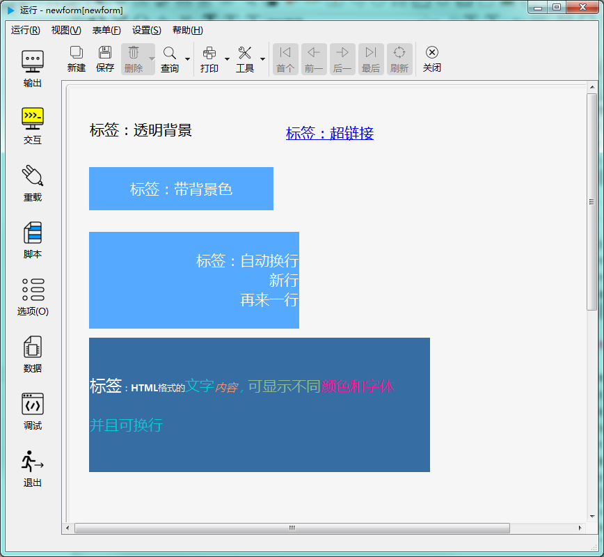

# 标签控件

标签控件用于显示文本，可以有多种格式，比如下图显示了几种不同样式的文本标签控件：

--- labelDelegate ---
Properties:
objectName (QString )
showType (int )
tabOrder (int )
visible (bool )
geometry (QRect )
x (int )
y (int )
pos (QPoint )
size (QSize )
width (int )
height (int )
vAlign (int )
hAlign (int )
rect (QRect )
focus (bool )
toolTip (QString )
statusTip (QString )
whatsThis (QString )
reloadWhenCreateNew (bool )
acceptDrops (bool )
dragEnabled (bool )
tag (QString )
showInForm (bool )
showInPDF (bool )
showInPrinter (bool )
updatesEnabled (bool )
maxwidth (int )
maxheight (int )
minwidth (int )
minheight (int )
caption (QString )
foreground (QColor )
background (QColor )
showBorder (bool )
borderColor (QColor )
borderWidth (int )
borderStyle (int )
vAlign (int )
hAlign (int )
font (QFont )
fillStyle (int )
enabled (bool )
URL (QString )
wordWrap (bool )
Slots:
QString help()
QString className()
deleteLater() -> void
grab() -> QPixmap
setStyleSheet(QString style) -> void
setFullScreen() -> void
quitFullScreen() -> void
setSizePolicy(QSizePolicy policy) -> void
showBalloon(QString msg) -> void
showValidBalloon() -> void
hideBalloon() -> void
setShowInForm(bool v) -> void
setShowInPDF(bool v) -> void
setShowInPrinter(bool v) -> void
setReloadWhenCreateNew(bool v) -> void
isNull() -> bool
toTop() -> void
toBottom() -> void
raise() -> void
lower() -> void
repaint() -> void
show() -> void
hide() -> void
setMaxWidth(int v) -> void
setMaxHeight(int v) -> void
setMinWidth(int v) -> void
setMinHeight(int v) -> void
setAcceptDrops(bool v) -> void
setDragEnabled(bool v) -> void
setUpdatesEnabled(bool v) -> void
startTimer(int interval) -> int
killTimer(int id) -> bool
killAllTimer() -> void
timers() -> QStringList
startSingleShot(int interval) -> void
setFocus(bool v) -> void
setEnabled(bool v) -> void
setDisabled(bool v) -> void
setVisible(bool v) -> void
setFont(QFont v) -> void
setGeometry(QRect v) -> void
setX(int v) -> void
setY(int v) -> void
setPos(QPoint v) -> void
setSize(QSize v) -> void
setWidth(int v) -> void
setHeight(int v) -> void
setToolTip(QString v) -> void
setStatusTip(QString v) -> void
setWhatsThis(QString v) -> void
setHAlign(int v) -> void
setVAlign(int v) -> void
setBorderStyle(int v) -> void
setFillStyle(int v) -> void
setShowType(int v) -> void
setBorderWidth(int v) -> void
setShowBorder(bool v) -> void
setBorderColor(QColor v) -> void
setBackground(QColor v) -> void
setForeground(QColor v) -> void
setNum(int num) -> void
setNum(double num) -> void
setCaption(QString v) -> void
setWordWrap(bool v) -> void
setURL(QString v) -> void
Signals:
destroyed(QObject*)
destroyed()
objectNameChanged(QString)
linkActivated(QString)
linkHovered(QString)
