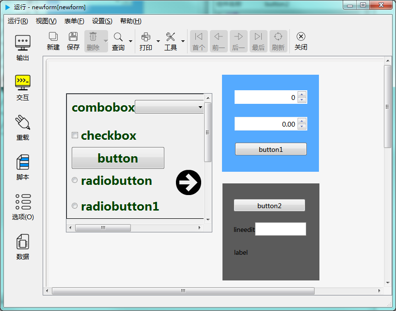

# 框架控件

框架控件为多个控件提供容器。如下图示：

## 继承自 widgetDelegateBase 的 属性和成员函数

参考： [基类widgetDelegateBase](2-2-base)

## 框架控件的属性

- ### 属性：shadow （类型：int 可读 可写）

{{ usage }}

| |调用方法|
| - | - |
|读取|int shadow const|
|修改|void setShadow( int shadow ) const|

- ### 属性：useScrollBar （类型：bool 可读 ）

{{ usage }}

| |调用方法|
| - | - |
|读取|bool useScrollBar const|

- ### 属性：viewportWidth （类型：int 可读 可写）

{{ usage }}

| |调用方法|
| - | - |
|读取|int viewportWidth const|
|修改|void setViewportWidth( int viewportWidth ) const|

- ### 属性：viewportHeight （类型：int 可读 可写）

{{ usage }}

| |调用方法|
| - | - |
|读取|int viewportHeight const|
|修改|void setViewportHeight( int viewportHeight ) const|

- ### 属性：horizontalScrollBarPolicy （类型：int 可读 可写）

{{ usage }}

| |调用方法|
| - | - |
|读取|int horizontalScrollBarPolicy const|
|修改|void setHorizontalScrollBarPolicy( int horizontalScrollBarPolicy ) const|

- ### 属性：verticalScrollBarPolicy （类型：int 可读 可写）

{{ usage }}

| |调用方法|
| - | - |
|读取|int verticalScrollBarPolicy const|
|修改|void setVerticalScrollBarPolicy( int verticalScrollBarPolicy ) const|

