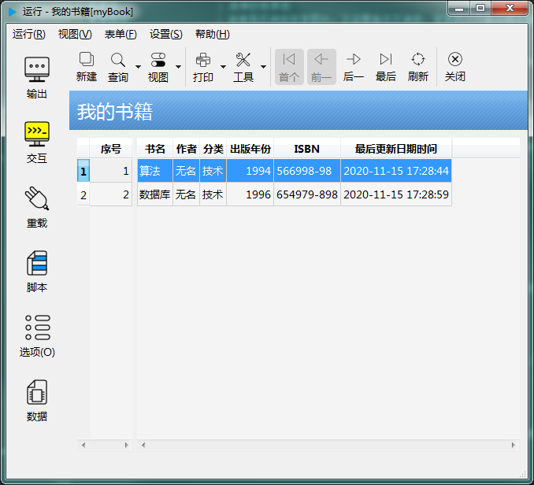

# 第三章 表单设计 - 界面设计

biForm 提供了“所见即所得”的界面设计器，提供了22种标准控件。

在工具栏或菜单中点击想要的控件，在表单界面上再点一下，就可以在界面上增加控件了。如果在一个容器控件上点击，新控件会成为该容器控件的子控件。


biForm 中可以通过这种方式设计的控件，只有22种标准控件，但不等于在表单界面上只能使用这些控件。实际上，QtWidgets中的所有控件都可以添加到表单上，但需要通过脚本实现。另外，也可以使用 Python 的图形库，比如 tkInter ，但这些控件会有单独的显示窗体，不会在 biForm 的表单上显示。

---

<h2 id=category>目录</h2>

- [界面布局](#界面布局)
  - [1 自由布局](#_1-自由布局)
  - [2 使用布局管理器](#_2-使用布局管理器)
  - [3 使用可调式布局管理器](#_3-使用可调式布局管理器)
  - [4 使用Qt的布局管理器](#_4-使用Qt的布局管理器)

- [界面调整](#界面调整)

- [表单](#表单)
 - [缺省的工具栏](#缺省的工具栏)
 - [表单的视图模式](#表单的视图模式)
  - 1. [表单模式](#_1-表单模式)
  - 2. [列表模式](#_2-列表模式)
  - 3. [表单和列表混合模式](#_3-表单和列表混合模式)
 - [图片集](#图片集)

- [控件](#控件)
  - [1 编辑树形控件的内容](#_1-编辑树形控件的内容)
  - [2 编辑列表控件的内容](#_2-编辑列表控件的内容)
  - [3 编辑表格控件的内容](#_3-编辑表格控件的内容)
  - [4 设置表格控件的编辑器](#_4-设置表格控件的编辑器)
  - [5 调整tab顺序](#_5-调整tab顺序)
---

## 界面布局

[返回目录](#category)

界面布局指的是表单上控件的排列方式。在 biForm 中支持以下几种布局方式。

### 1. 自由布局

[返回目录](#category)

biForm 中以可视化方式设计的控件默认是自由布局的方式。所有控件按位置定位，并且大小不会自动随表单或窗体的尺寸而变化。

表单有一个属性 “不使用缺省的框架样式”。设为“是”时，运行时的表单大小会随所在父窗口的大小而缩放，表单设计时指定的“宽度”、“高度”这两个属性会被忽略。设为“否”时，表单大小则是固定为指定的“高度”和“宽度”。

所以，在使用自由布局方式时，将“不使用缺省的框架样式”设为“否”能得到比较好的效果，否则表单大小随所在父窗口的大小而缩放，控件大小和位置却是固定的，效果就不太好，虽然并不影响程序运行。

以下是一个自由布局的例子：


### 2. 使用布局管理器

[返回目录](#category)

布局管理器用于对控件按照一定规则进行排列，并且控件能随表单的大小自动调整大小和相对位置。在表单上并不能“显式地”使用布局管理器，这一点与 Qt Designer 不同。添加控件还是通过可视化的方式添加，但布局需要通过脚本来实现。

比如以下是设计界面：


可以看到所有控件都有，但位置大小都是乱的，但这个没有关系，通过在脚本中使用布局管理器，在运行时，它们就会呈现这样的布局：


实现方式，则是在表单的“公共模块”中写入以下代码：

``` python 
#以下写入你自己的脚本:
#导入 QSizePolicy 用来设置控件的缩放规则
from PythonQt.Qt import QSizePolicy

def updateUI():
	#调整界面布局
	#宽度自动缩放、高度固定
	a=QSizePolicy()
	a.setHorizontalPolicy(QSizePolicy.Expanding)
	a.setVerticalPolicy(QSizePolicy.Fixed)
	#宽度和高度都自动缩放
	b=QSizePolicy()
	b.setHorizontalPolicy(QSizePolicy.Expanding)
	b.setVerticalPolicy(QSizePolicy.Expanding)
	#宽度和高度都固定
	c=QSizePolicy()
	c.setHorizontalPolicy(QSizePolicy.Fixed)
	c.setVerticalPolicy(QSizePolicy.Fixed)
	#宽度固定、高度自动缩放
	d=QSizePolicy()
	d.setHorizontalPolicy(QSizePolicy.Fixed)
	d.setVerticalPolicy(QSizePolicy.Expanding)
	#标题控件和报表选项控件组都设置为宽度自动缩放、高度固定
	this.frameTitle.setSizePolicy(a)
	this.frameOption.setSizePolicy(a)
	#左侧报表标题高度和宽度都固定
	tableTitleLeft.setSizePolicy(c)
	tableTitleLeft.setMaxWidth(514)
	tableTitleLeft.setMaxHeight(27)
	#左侧报表内容设置为宽度和高度都自动缩放
	tableContentLeft.setSizePolicy(b)
	#左侧报表内容，宽度固定，高度自动缩放
	frameLeft.setSizePolicy(d)
	frameLeft.setMaxWidth(this.tableTitleLeft.width)
	#左侧报表标题和报表内容都添加到一个垂直布局器中
	this.frameLeft.setVLayout(['tableTitleLeft','tableContentLeft'],0,0,0,0,0)
	#右侧报表标题设置为宽度自动缩放、高度固定
	tableTitleRight.setSizePolicy(a)
	tableTitleRight.setMaxHeight(27)
	#右侧报表内容设置为宽度和高度都自动缩放
	tableContentRight.setSizePolicy(b)
	#右侧报表标题和报表内容都添加到一个垂直布局器中
	this.frameRight.setVLayout(['tableTitleRight','tableContentRight'],0,0,0,0,0)	
	#右侧报表内容，宽度和高度都自动缩放	
	frameRight.setSizePolicy(b)
	#左侧报表内容和右侧报表内容都添加到一个水平布局器中
	this.frameReport.setHLayout(['frameLeft','frameRight'],4,0,4,0,0)
	#整个表单由 标题控件容器、选项控件容器、报表内容容器 三部分在一个垂直布局器中组成
	this.form.setVLayout(['frameTitle','frameOption','frameReport'],4,4,4,4,0)

```

在表单的“加载后”或“新建空白表单后”中调用```updateUI()```就可以完成布局。

上面的脚本中我们可以看到，我们必须要设置控件的 sizePolicy ，否则缺省情况下，控件的大小是固定的。在  biForm 中也没有 QSpacerItem 这样的控件，可以使用一个未设置文本的标签控件来代替。

在 biForm 中并没有 Qt 中的 layout 控件，而是通过调用 setVLayout 和 setHLayout 函数来实现布局。在  biForm 中也没有 QSpacerItem 这样的控件，可以使用一个未设置文本的标签控件来代替。

只有表单和框架控件有布局函数接口，如下表所示：

|   类型   |                      接口                      |
| ------- | ---------------------------------------------- |
| 表单     | [setHLayout](1-6-form-func#setHLayout)         |
| 表单     | [setVLayout](1-6-form-func#setVLayout)         |
| 框架控件 | [setHLayout](2-9-frame?id=框架控件自有成员函数) |
| 框架控件 | [setVLayout](2-9-frame?id=框架控件自有成员函数) |

### 3. 使用可调式布局管理器

[返回目录](#category)

与普通的布局管理器不同的是，可调试布局管理器可以由用户在使用中手工调整各个部分的大小。这种布局也需要通过脚本来补充实现。

比如上面的例子中，如果希望 frameReport 左侧和右侧可以手工调节相对的大小，将 setHLayout 改为 setHSplitter 就可以了，其它参数都是相同的。

但需要注意的是，可调的范围会受布局内控件的最大宽度、最大高度、最小宽度、最小高度的影响，所以实际上上例中需要将```frameLeft.setMaxWidth(this.tableTitleLeft.width)```这句取消，否则也调节不动。

|   类型   |                       接口                       |
| ------- | ------------------------------------------------ |
| 表单     | [setHSplitter](1-6-form-func#setHSplitter)       |
| 表单     | [setVSplitter](1-6-form-func#setVSplitter)       |
| 框架控件 | [setHSplitter](2-9-frame?id=框架控件自有成员函数) |
| 框架控件 | [setVSplitter](2-9-frame?id=框架控件自有成员函数) |

### 4. 使用Qt的布局管理器

[返回目录](#category)

在 biForm 中也可以直接使用 Qt 的布局管理器及相关接口。需要注意的是，标准控件在 Python 脚本中能访问的只是代理控件，并不是 QWidget 的派生类，所以不能通过 QLayout::addWidget 这样的接口添加进 Qt 的布局管理器中。以下是一个例子，用来演示如果使用 Qt 的相关接口往表单上添加控件并进行布局。

``` python
from PythonQt.QtGui import QPushButton,QLabel,QVBoxLayout,QFrame

def createUI():
    la=QLabel('test')
    pb=QPushButton('button')
    layout = QVBoxLayout()
    layout.addWidget(la)
    layout.addWidget(pb)
    frame=QFrame()
    frame.setLayout(layout)
    this.form.setBaseWidget(frame)

```

在表单的“加载后”中调用```updateUI()```，运行时就得到下面的结果：


---

## 界面调整

[返回目录](#category)

对界面上的可见控件，可以选择一个或多个控件进行调整。这些调整包括改变大小、统一修改属性、调整间距、对齐等操作。这些操作与常见的可视化界面设计器的操作类似，本文就不一一细述，有一些比较重要的细节重点介绍一下：

1. 选择容器中的控件，直接在表单上框选是无法选中的，按下 ctrl 键，并且在容器上的空白位置按下鼠标左键，再框选，就可以选中了。也可以按住 shift 键之后，一个一个地点击需要选择的控件。如果要取消选择，就再点击一次
2. 部分控件，可以直接双击修改其主要属性或编辑其缺省显示的内容，具体在本文之后的部分会讲到
3. 将控件移动或复制到容器控件中时，需要先选择需要移动或复制的控件，选择“复制”或“剪切”，然后选中容器控件，再选择“粘贴”，也可以用 ctrl+c ctrl+v ctrl+x 这些快捷键
4. 除了直接在表单界面上选择控件，也可以在“属性设置”窗口中的“对象列表”中通过控件名选择控件，如下图所示：

5. 控件可以复制格式，先选择做为模板的控件，点击工具栏上的“格式复制”按钮，或按 ctrl+shift+c ，再选择一个或多个需要设置格式的控件，点击工具栏上的“格式粘贴”，或按 ctrl+shift+v ，就可以将格式复制到其它控件

---

## 表单

[返回目录](#category)

在界面设计器中可以设置表单的属性，这些属性与表单的运行有很密切的关系，以下分别讲解：

|          属性           |                                                                  说明                                                                  |
| ---------------------- | ------------------------------------------------------------------------------------------------------------------------------------- |
| PFF版本                 | 目前使用的PFF版本，由 biForm 自动生成，在使用新版本 biForm 修改旧版本BIF文件时，会自动修改这个值                                            |
| UUID                   | 表单的UUID，biForm 会为新表单自动生成UUID，以便与其它表单加以区别，是全程唯一的表单标识                                                    |
| 表单名称                | 表单内部使用的名称，只允许使用阿拉伯字母、数字和下划线                                                                                    |
| 表单标题                | 表单在最终用户处可见的名称                                                                                                              |
| 版本号                  | 表单的版本号，新表单从1开始，每次生成PFF文件，会加1，也可以手工修改，但建议最好不要进行手工修改                                              |
| 宽度                    | 表单的宽度，如果将“不允许使用缺省的框架样式”设置为“是”，则此值无效，表单会按所在窗体自动调节宽度和高度                                       |
| 高度                    | 表单的高度，如果将“不允许使用缺省的框架样式”设置为“是”，则此值无效，表单会按所在窗体自动调节宽度和高度                                       |
| PDF输出时使用透明背景    | 打印表单到PDF文件时，是否使用透明背景，如果设置否，会按表单背景色打印一个以背景色填充的矩形框                                                |
| 打印时使用透明背景       | 打印表单界面时，是否使用透明背景，如果设置否，会按表单背景色打印一个以背景色填充的矩形框                                                     |
| PDF输出时显示背景图片    | 打印表单到PDF文件时，是否显示背景图片                                                                                                    |
| 打印时显示背景图片       | 打印表单界面时，是否显示背景图片                                                                                                         |
| 打印页号                | 打印表单时，是否在右下角显示页号                                                                                                         |
| 背景色                  | 表单的背景色                                                                                                                           |
| 背景图片                | 表单是否使用背景图片，不设置表示不使用，背景图片只能从图片集中选取                                                                         |
| 背景图片填充方式        | 使用表单的背景图片时，背景图片的填充方式                                                                                                 |
| 缺省字体                | 表单上添加新控件时，缺省使用的字体，这个属性只在设计时有用                                                                                |
| 缺省前景色              | 表单上添加新控件时，缺省使用的前景色，这个属笥只在设计时有用                                                                               |
| 图标                    | 表单的图标                                                                                                                             |
| 边界宽度                | 使用背景图片时，背景图片与表单边框的距离                                                                                                 |
| 主表                    | 需要使用PFF缺省的数据库引擎来保存记录的表单，需要指定对应的主表，主表的表结构在“数据视图”中进行设计                                          |
| 图片集                  | 表单上需要使用的图片都可以加入到[图片集](#图片集)中，发布时这些图片也会被打包到PFF文件中                                                    |
| 不允许使用缺省的框架样式 | 是否不使用缺省的表单框架。使用表单框架的话，在运行时状态下，表单外会有一个 Frame 控件做为表单的容器，如果不使用表单框架，直接将所在窗口做为容器 |
| 允许使用系统主题        | 是否允许使用系统主题的设置，这些设置会影响表单所在子窗口的背景色、表单边框的样式等                                                          |
| 视图模式                | 表单允许使用的[视图模式](#表单的视图模式)                                                                                                |
| 显示定位器              | 是否允许使用缺省的记录定位器，记录定位器是显示在[缺省的工具条](#缺省的工具条)的，用于在记录集的每条记录之间进行跳转                           |
| 允许创建空白表单        | 是否允许使用缺省的新建空白表单功能                                                                                                       |
| 允许保存                | 是否允许使用缺省的保存功能                                                                                                              |
| 允许删除                | 是否允许使用缺省的删除功能                                                                                                              |
| 允许导出到Excel         | 是否允许使用缺省的导出到 Excel 文件的功能                                                                                                |
| 允许从PFD文件导入       | 是否允许使用缺省的从PFD文件导入数据的功能                                                                                                |
| 允许导出到PFD文件       | 是否允许使用缺省的导出数据到PFD文件功能                                                                                                  |
| 允许打印                | 是否允许使用缺省的打印功能                                                                                                              |
| 用来打印的表单UUID      | 需要使用格式化打印的表单，用这个属性指定另一个表单的UUID，另一个表单的界面为格式化打印的界面                                                 |
| 允许查询                | 是否允许使用缺省的查询功能                                                                                                              |
| 显示工具条              | 是否显示[缺省的工具条](#缺省的工具条)                                                                                                    |
| 说明                    | 关于表单用途的概要说明                                                                                                                  |
| 用户使用说明            | 关于表单使用方法和详细说明                                                                                                              |
| 脚本类属性              | 关于表单的脚本的详细说明请参考 [表单的公共模块](1-1-public) 和 [表单的可编程函数](1-7-formscript)                                          |

### 缺省的工具条

[返回目录](#category)

缺省状态下，表单运行时会自带一个工具条，其中有一些缺省的工具按钮，还有记录定位器，如下图所示：


工具条上大部分按钮都只对设置了“ 主表”属性的表单有用，但也有少量功能比如“截图”、“打印”、“关闭”等是所有表单都可以用得上的，但这些功能也可以通过其它方式调用，或者使用脚本来调用，所以即使不使用缺省的工具条，也不会影响这些表单的使用。对于不需要使用“主表”属性，也即不需要使用缺省的表单数据处理引擎的话，可以将“显示工具条”设为“否”。

但如果表单添加了自定义的“动作”，工具条还是会显示，因为需要将这些动作添加到工具条上供用户调用。

即使是设置了“主表”属性的表单，也可以不显示工具条，可以通过 Python 脚本调用保存、删除、查询等接口实现这些工具条按钮的功能。

### 表单的视图模式

[返回目录](#category)

同一个表单，在运行时可以有不同的显示模式。

#### 1. 表单模式

比如“我的书籍”这个表单，下图为“表单模式“：


#### 2. 列表模式

下图为“列表模式”：



列表中显示的是查询后显示的主表的记录。双击其中一条记录，会转到以“表单模式”显示这条记录。

#### 3. 表单和列表混合模式

下图为“表单和列表混合模式”：


设置表单的属性“视图模式”为“表单和列表混合模式”，并不表示表单打开后就直接切换到这种模式，只是表示这个表单支持以上这三种显示模式。打开后以何种方式显示，与选项设置和脚本执行的结果有关。

### 图片集

在 biForm 设计的表单中，如果需要使用一些图片文件，不管是表单自己使用，还是表单上的控件使用，如果这些图片文件需要随表单发布给最终用户，就需要先将这些文件添加到表单的“图片集”中去。这样 biForm 在打包生成 PFF 文件时，会将这些图片文件也打包进去，即使最终用户处没有这些图片文件，也不会影响程序运行。

图片集中的图片，可以是静态图片，也可以是 gif 图片。除了可以在设计界面时，通过“图标”、“背景图片”、“图像来源”等属性选择这些图片之外，也可以通过脚本来调用，比如```this.form.getImage('1.png')``` 或 ```this.form.getMovie('2.gif')```，其中的参数是图片集中设置的图片的名称。

biForm 中已经准备了一组常用的图片，做为缺省的图片集使用。在脚本中也可以使用，比如 ```this.form.getImage(':/iconset/arrows/58.png')```，其中的参数使用下图中红色边框处显示的图像访问路径：


---

## 控件

[返回目录](#category)

控件的属性大部分都在第二章里各个控件里有详细讲解，请参考第二章中的内容。

在设计界面，有几类控件可以直接编辑其中显示的内容做为缺省内容或设置编辑器属性。

如果要编辑控件的内容，可以双击选中的控件，或在鼠标右键菜单中选择“编辑控件内容”：

### 1. 编辑树形控件的内容


### 2. 编辑列表控件的内容


### 3. 编辑表格控件的内容


### 4. 设置表格控件的编辑器

表格控件允许对表格的单元格单独指定编辑器，选择表格控件后，在鼠标右键菜单中选择“设定表格编辑器”，显示以下窗口：


### 5. 调整tab顺序

表单上控件缺省的 tab 切换顺序是与添加控件的顺序一致的。如果需要调整，使用菜单或工具栏上的“设置tab键顺序”进行调整就可以了。如下图所示：


