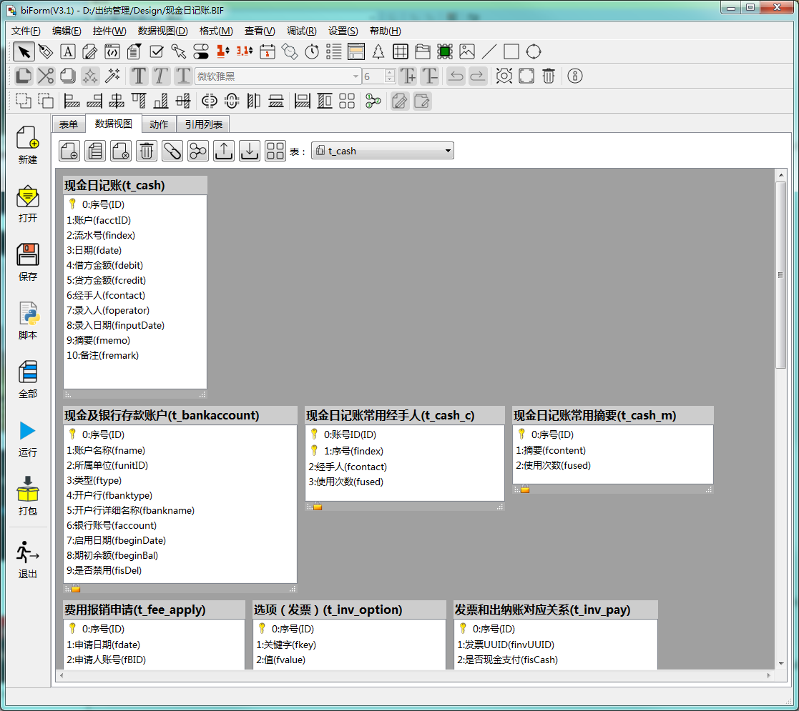

# 第三章 表单设计 - 数据视图

用  biForm 开发的表单，如果需要使用数据库存储数据，或者需要从数据库里读取数据，就需要用到“数据视图”的功能。

如果不需要使用数据库，或者只访问外部数据源，不需要使用 PFF 运行时的数据库，就可以不使用“数据视图”功能。

数据视图的功能用于设计表结构、表间关系、外键，有些地方需要使用脚本编辑器编写一些脚本，比如字段的绑定值、某个表保存的记录数等。

下图是一个数据视图的设计界面示例：



---

<h2 id=category>目录</h2>

- [表](#表)
- [基础表](#基础表)
- [非基础表](#非基础表)
- [表名](#表名)
- [字段](#字段)
- [表间关系](#表间关系)
- [外键](#外键)
- [索引](#索引)
- [视图和存储过程](#视图和存储过程)
- [导入和导出表结构](#导入和导出表结构)
- [事务处理](#事务处理)
- [多个数据源](#多个数据源)
- [表的创建、删除和修改](#表的创建、删除和修改)
- [表单间数据共享](#表单间数据共享) 

---

## 表

biForm 中有两类表，一类叫“基础表”，一类叫“非基础表”。

这两类在PFF运行时引擎创建实体表时，并无差别。但在表单运行过程中，这两类表的处理是有很大差别的。

## 基础表

“基础表”指PFF运行时引擎会自动往里添加和删除记录的那些表。PFF表单运行时的查询、过滤、导出等操作，也都是基于“基础表”的数据视图设计来自动完成的。因此“基础表”的设计非常重要。

1. 如果有使用“基础表”，必须为表单指定一个“主表”，修改表单的“主表”属性就可以了
2. 所有“基础表”表都需要有主关键字，但“主表”的主关键字只能是一个字段，其它表可以使用多个字段构成主关键字
3. 其它不是“主表”的“基础表”必须要和“主表”有一定的关系关联着，这个关系也许不是直接的，但必须要能通过多个关系连接到“主表”。通常是关联到“主表”的主关键字，如果是关联到其它字段，需要考虑这个字段的值是否是全表唯一的
4. “主表”一次只能保存一条记录（指点击表单的缺省工具条上的“保存”按钮时），其它“基础表”要对应几条记录，可以由脚本返回值进行设置
5. 其它不是“主表”的“基础表”如果和主表的关联字段是这个表的唯一主关键字，会被认为是“主表”的扩展表，在表单的查询、列表、过滤条件的字段等地方，这个表的字段也会被列出来。不符合这种情况的“基础表”的字段，不会被列出来
6. 一个表单的“基础表”可以被设置成为另一个表单的“非基础表”，这种设定是“表单级”的，而不是“应用程序级”的

## 非基础表

1. PFF运行时引擎是不会主动往“非基础表”里写添加记录或删除记录的；
2. 在某个表单上的“非基础表”可以被设置为另一个表单的“基础表”，这种设定是“表单级”的，而不是“应用程序级”的；
3. PFF运行时引擎认为一个表单的“非基础表”是只读的，但开发者还是可以使用SQL语句添加或删除记录；

不管是基础表，还是非基础表，在表单的数据视图的设计中都很重要。虽然我们可以不设计“非基础表”，直接使用SQL使用固定的表名访问数据表，但这样在可扩展性、可移植性、兼容性、易于集成等各个方面都不如使用“非基础表”。所以建议开发者新遵循 biForm 的应用框架，尽量使用“非基础表”对需要读取的数据表进行定义。

## 表名

biForm 中设计阶段的表名，并不等于实际在数据库中创建的表名。需要使用```this.form.database().getRealTableName(设计时表名)```来取得其在运行阶段的实体表名。

这样是为了不同的开发者开发的PFF都能无冲突地在同一个数据库中运行，同时还为了允许在同一个数据库中需要以隔离的方式使用同一个PFF表单而设计的。

也有一些API中可以直接使用设计时表名 ，具体请参考相关章节中的API接口说明。

## 字段

目前发布的 biReader 支持 sqlite、MSSQL、postgreSQL三种RDBMS。

biForm 中有以下几种字段类型，在创建数据表时，对应的数据类型如下表：

| biForm中的字段类型 |                 数据库中的字段类型                 |
| ----------------- | ------------------------------------------------- |
| 文本              | postgreSQL用nvarchar，其它用nvarchar               |
| 整数              | int                                               |
| 小数              | decimal                                           |
| 是/否             | sqlite和postgreSQL用int,MSSQL用bit，缺省值为0      |
| 日期              | varchar                                           |
| 时间              | varchar                                           |
| 日期时间           | varchar                                           |
| 二进制             | varbinary                                         |
| 大二进制数据       | sqlite使用BLOB，MSSQL使用NTEXT，postgreSQL使用TEXT |

如果是主关键字中的字段，都会设置为“not null”。

## 表间关系

biForm 中只需要在“基础表”之间设置表间关系。

1. 添加新记录时，如果两表之间设置了对应关系，其中只要有一个字段有绑定值，关联字段的值就会自动使用与之关联的字段的值。判断方式是从“主表”开始一级一级关联判断。因此有关联关系的字段，不用每个字段都写“绑定值”脚本
2. 删除记录时，却并不使用“表间关系”来进行删除，而是使用UUID的值进行删除，因为所有“非基础表”的UUID都与主表的对应记录的UUID的值相同
3. biForm中的表间关系并不会在RDBMS中创建相关的对象或设置，因此也不具备数据库级的完整性和一致性约束
4. 如果同时有多个“非基础表”，biForm 并不强制要求必须设置表间关系，但建议最好设置好清晰的表间关系，以便更好地使用PFF运行时引擎的自动处理能力
5. 如果表B与主表A关联，表C与表B关联，如果表C的关联字段能递延到关联到主表A，就不需要再特意设置表C和主表A之间的关系

## 外键

外键指某一个表的某个字段与其它表的某个字段的关联关系。但在 biForm 中外键的概念与通常我们在RDBMS中的概念略有不同。

1. biForm中设置外键，除取设置关联的字段（称为索引字段），还需要设置“显示字段”。比如 table_emp(职员) 的 fdeptID 的外键是 table_dept(部门) 的主关键字ID，将索引字段设置为“ID”之外，还需要将 table_dept 的字段 fname(部门名称) 设置为“显示字段”，这样在显示职员的查询结果列表时，能自动带出对应的部门名称
2. biForm中设置外键，还有一个选项“这个字段在查询结果列表中可见”，也使用上面的例子，如果选中这一项，在查询结果列表中，会同时显示 fdeptID 和 table_dept.fname 这两列，如果不选中这一项，查询结果列表中只显示 table_dept.fname 这一列
3. biForm中可以将外键设置为连接为同一个表中的某个字段。比如某个字段 ftype 的值可以为“文学“、”技术“、”音乐“，将外键设置为同一个表的同一个字段，在对记录进行过滤查询时，会显示下拉列表，让用户可以在这个字段的已有的值的范围内进行选择，否则会显示为一个文本输入框只能手工输入查询的内容
4. PFF运行时引擎不会通过外键的设置创建任何数据库中的实体对象或级联设置
5. 外键在 biForm 中只用于查询、过滤、显示等，不会用于判断数据的有效性、不会进行级联更新和删除，也就是说，它没有任何“约束性”

## 索引

目前的PFF运行时引擎只创建为在数据视图中定义了的主关键字创建索引（随主关键字的定义创建的），除此之外，不会主动创建其它索引。

如果开发者或数据库管理员希望增加索引，可以有两种方式：

1. 在表单的“加载后”或其它合适的地方，使用脚本来创建索引。需要注意判断是否已经有同样的索引存在，否则可能每次都重复创建（创建不成功报错）。而且也需要考虑数据较多的情况下，可能创建索引的时间较长的情况
2. 使用数据库管理工具自行创建索引

## 视图和存储过程

出于跨数据库的设计要求，PFF运行时引擎不会创建和管理视图和存储过程。

如果开发者必须要使用视图和存储过程，可以有以下几种方法：

1. 在表单的“加载后”或其它合适的地方，使用脚本来创建视图和存储过程。但需要注意创建前判断一下是否已创建过了，否则可能每次打开这个表单都会重新创建一次
2. 使用数据库管理工具自行创建视图和存储过程

视图和存储过程都可以通过我们的数据库连接对象提供的 API 中使用SQL语句加以调用。

因为不同RDBMS的存储过程的语法差别较大，通常不容易跨数据库兼容。一般存储过程也不容易进行版本管理，在升级时需要额外的维护工作。另外，存储过程中通常要将表名“写死”，即使有些RDBMS支持在存储过程中执行动态SQL语句，但执行效率通常不如使用固定的SQL语句。所以，在这一点上，会失去PFF易于与其它开发者开发的应用进行集成的特性。所以，综合多个方面的因素，建议开发者多考虑采用其它方式取代存储过程，不要过于依赖存储过程。

## 导入和导出表结构

用 biForm 开发数据库应用程序，通常会需要由多个表单共同访问一些数据表。通过导入导出表结构可以快速完成数据视图的设计。

导出的文件保存为 xml 文件格式。在某个表上点鼠标右键，就是只导出这个表的表结构，如果是在空白处点鼠标右键，可以选择导出多个表的表结构。

导入也可以一次导入多个表。

## 事务处理

在 Python 脚本中可以调用数据库连接对象的 ```transaction() commit() rollback()``` 等函数进行事务处理。

需要注意的是，这几个函数的效果是“ 应用程序级”的，而不是“表单级”的。也即：在一个表单上调用 transaction ，是可以在另一个表单上调用 commit 进行提交的，虽然通常不建议这样做。

## 多个数据源

PFF 的运行时环境（如biReader）目前对所有PFF表单的管理，都是针对同一个数据源，目前还不支持跨多个数据源进行管理。

也就是说，PFF的运行时引擎在运行时创建数据表、往表里写记录、对相关表进行关联查询、管理表单间的数据共享，这些操作都只在一个数据源里进行处理，不会跨数据库进行。

具体点讲，我们在 biReader 中运行的所有PFF表单，它们的数据视图中所有的表，biReader都只在当前连接的数据源中进行创建，不可能创建到外部的数据库中去，读取时也是一样。

但 biReader 是允许访问多个数据源的，在 Python 脚本中通过我们开放的API或者 Qt 和 Python 的库，是可以通过脚本连接其它外部数据源，并且通过SQL语句存取外部数据的。

但我们也可以有一些小技巧，让 PFF 可以跨数据库访问数据。

比如使用 MSSQL Server ，假设 biReader 使用的数据库名为 dbtest，另外同一台服务器上还有一个数据库 dbhr 是公司的HR系统。假如我们需要集成HR中的数据做一些扩展应用，通过以下步骤，我们可以让PFF表单直接使用 dbhr..t_emp 这个表。

1. 在 biForm 中按 t_emp 的表结构添加一个基础表 t_emp
2. 表单打包后，在biReader中打开PFF文件，这时 biReader 会自动创建一个实体表（比如名为 rt_t_emp_0_s ）
3. 使用 SQL Server Management Studio 删除掉 dbtest..rt_t_emp_0_s 这个表，再在  dbtest 这个库中创建一个视图，名为 rt_t_emp_0_s，但其内容是 select * from dbhr..t_emp。当然 PFF 中的表都会有额外的 UUID 和  lastUpdated 字段，在创建视图的 SQL 语句中也要记得补上这两个字段。当然这一步也可以写在 PFF 的“加载后”等处的脚本中，通过判断 rt_t_emp_0_s 是表还是视图来判断是否要自动完在这个过程，dbhr 可以设置成系统选项以便生成合适的SQL语句
4. 再使用刚才的PFF表单，它的表 t_emp 实际上访问的就是 dbhr..t_emp 中的记录了

当然这种用法在使用其它RDBMS时未必用得上，而且有些视图或有些RDBMS并不支持进行写操作，所以开发者需要视情况决定是否要这样操作。

如果要访问不在同一台服务器上的其它数据源，或者所用的RDBMS不支持跨数据库的SQL语句，就可以使用我们开放的数据API连接其它数据源后进行处理。具体用法请参考[数据库连接对象](1-8-database)中的内容。

## 表的创建、删除和修改

通常我们在开发使用数据库的应用程序时，需要事先对数据库进行初始化，运行事先准备好的SQL脚本创建所有的数据表、视图、索引、存储过程等对象。但这种处理方式，扩展性不太好，升级时还需要分别准备升级用的脚本，开发过程比较繁琐且容易出错。

PFF运行时引擎提供了很自动化的处理算法，会在第一次打开一个PFF表单、或对之进行升级时，自动创建数据表和必要的索引。如果新版本有旧版本中没有的表，升级时会自动创建新表。初始化和升级过程都更简单，不需要准备SQL脚本。

但在开发过程中，我们也有可能会遇到需要修改表结构的情况，我们建议分以下几种情况分别处理：

1. 如果不需要保留旧表中的数据，可以直接在数据库中删除旧表，再打开新版本的PFF表单让它重新建表和索引
2. 如果旧表的数据需要保留，可以先将之改名，再打开新版本的PFF表单让它重新建表，再使用SQL语句将原来的记录导入进来，之后删除掉改名后的旧表就可以了

当然，如果能够不修改表结构是最好的。建议在设计时充分考虑兼容性和扩展性，减少修改表结构的可能性。如果必须要添加新的字段，尽量添加新表进行扩展，而不是修改原来的表结构。

目前已经投入的PFF运行时引擎没有提供移除已经注册过的PFF表单的方法，但未来也许会提供。如果原来的PFF中有一个表在新版本中决定不再使用了，PFF运行时引擎在升级时也不会删除旧表。所以，不管是什么情况，PFF运行时引擎是不会删除数据表的，除非在脚本中调用API进行删除。如果确定需要删除某个表或其中的数据，需要自行处理。

## 表单间数据共享

用 biForm 开发应用的一个特点，就是虽然每个表单都是单独开发、单独发布、单独运行，但它们之间又可以共享数据。共享的方法只需要了解以下的规律就可以了：

1. 在不同的表单上，使用相同UUID的表会被认为是同一个表，在运行时，会使用相同的表名，因此不同的表单就能访问同一个数据表
2. 如果两个UUID相同的表，在不同的表单上表结构不同，运行时可能会出现各种不符合预期的问题。需要确保它们表结构相同，最保险可靠的方式就是就是导入数据结构，并且被其它表单导入的表的表结构最好不要再修改。如果要修改表结构，所有使用了这个数据表的表单也都需要进行修改才行
3. 同一个数据表在一个表单上可以做为“非基础表”，在另一个表单上做为“基础表”，不影响它们共用同一个实体表
4. 可以有多个表单将同一个数据表做为“非基础表”，这样它们都可以用于录入同一个数据表的数据

遵循以上的规则设计和开发PFF，能够允许不在同一个团队中的成员，在最少的共享信息和沟通的前提下（只需要共享数据表的结构），就可以开发出易于集成（不会冲突、又能共享数据）的应用程序。这是PFF的应用框架带来的一个重要的特性。开发者可以尽量利用这个特性，这样你开发出的程序能更容易与其他人的程序进行集成，从而通过平台的易于扩展、易于集成的特性更容易获得更多用户的支持。
