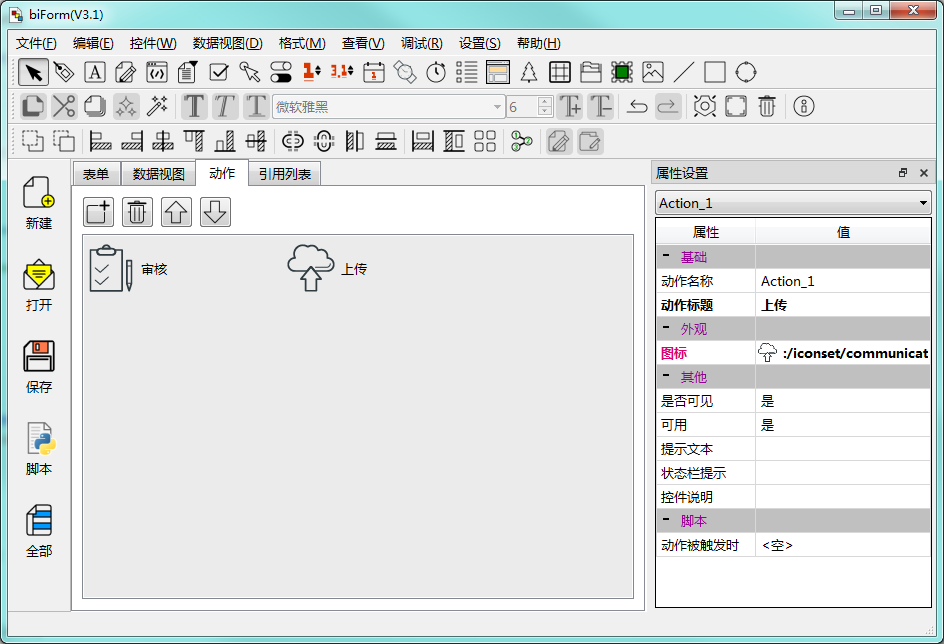
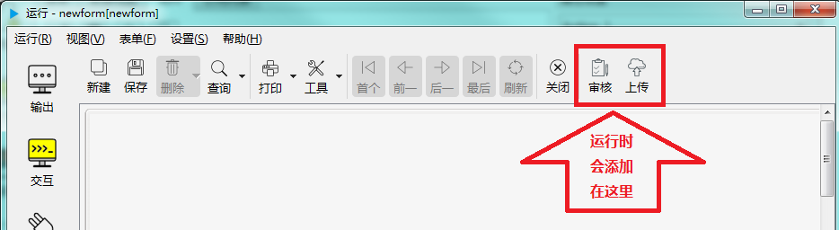
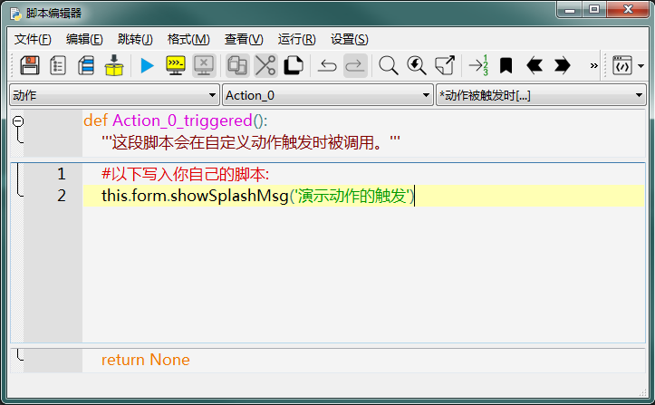

# 第三章 表单设计 - 动作

用  biForm 开发的表单，一般会有缺省的工具栏，上面会有一组常用的工具按钮，但有时我们需要添加一些额外的工具按钮来完成一些操作，这些在 biForm 的设计界面通过“动作”这个功能来实现。

下图是一个动作的设计界面示例：



在运行状态下，这些运作会被添加到表单的工具栏上，如下图：



动作对象只能在 biForm 中添加，目前不支持用脚本动态添加，也不允许在脚本中删除。如果需要实现不同状态下工具栏显示不同的动作，可以在 biForm 中预先添加一些预留的动作对象，在程序中按不同的情况隐藏和显示来实现想要的效果。

动作对象在工具栏中的显示是有顺序的，在 biForm 中可以调整它们的顺序。

---

<h2 id=category>目录</h2>

- [如何调用动作对象](#如何调用动作对象)
- [动作的属性](#动作的属性)
- [成员函数/槽函数](#成员函数槽函数)
- [信号](#信号)
- [可编程函数](#可编程函数)

---

## 如何调用动作对象

[返回目录](#category)

在表单的 Python 脚本中，直接使用动作名称引用这个动作，也可以用 ```this.动作名称```来引用。

比如：

``` Python 

>>> this.Action_0
actionDelegate (actionDelegate at: 0x0599F778)

>>> Action_0
actionDelegate (actionDelegate at: 0x0599F778)

>>> Action_0.text
'审核'

```

## 动作的属性

[返回目录](#category)

这些属性可以在脚本中调用，比如：

``` Python

>>> Action_0.text
'审核'

>>> Action_0.visible
True

>>> Action_0.enabled
True

>>> Action_0.enabled=False
>>> Action_0.enabled
False

>>> Action_0.setEnabled(True)
>>> Action_0.enabled
True

```

|    属性    |  值类型  | 读写类型  |         说明          |
| ---------- | -------- | -------- | --------------------- |
| objectName | QString  | 可读 可写 | 存储需要临时存储的值   |
| tag        | QVariant | 可读 可写 | 存储需要临时存储的值   |
| text       | 	QString | 可读 可写 | 显示的文本            |
| toolTip    | 	QString | 可读 可写 | 工具栏提示文本         |
| statusTip  | 	QString | 可读 可写 | 状态栏提示文本         |
| whatsThis  | 	QString | 可读 可写 | “这是什么？”显示的文本 |
| icon       | 	QIcon   | 可读 可写 | 图标                  |
| visible    | 	bool    | 可读 可写 | 是否可见              |
| enabled    | 	bool    | 可读 可写 | 是否可用              |

## 成员函数/槽函数

[返回目录](#category)

|     函数     |             调用接口             |         参数          |           说明            |
| ------------ | ------------------------------- | --------------------- | ------------------------ |
| help         | QString help()                  | 无                    | 显示帮助文本              |
| className    | QString className()             | 无                    | 对象类型名称              |
| deleteLater  | deleteLater() -> void           | 无                    | 之后删除掉                |
| trigger      | trigger() -> void               | 无                    | 触发这个动作              |
| setTag       | setTag(QVariant v) -> void      | 需要存储的值          | 设置需要存储的值          |
| setVisible   | setVisible(bool v) -> void      | 是否可见              | 设置是否可见              |
| setEnabled   | setEnabled(bool v) -> void      | 是否可用              | 设置是否可用              |
| setIcon      | setIcon(QIcon icon) -> void     | 图标对象              | 设置图标                  |
| setIcon      | setIcon(QPixmap pixmap) -> void | 图标图像              | 设置图标图像              |
| setText      | setText(QString v) -> void      | 显示的标题            | 设置显示的标题文本         |
| setToolTip   | setToolTip(QString v) -> void   | 显示的工具栏提示文本   | 设置工具栏提示文本         |
| setStatusTip | setStatusTip(QString v) -> void | 显示的状态栏提示文本   | 设置状态栏提示文本         |
| setWhatsThis | setWhatsThis(QString v) -> void | 显示的“这是什么？”文本 | 设置“这是什么？”显示的文本 |

## 信号

[返回目录](#category)

|            信号            |                说明                 |
| -------------------------- | ---------------------------------- |
| destroyed(QObject*)        | 对象销毁时发出,参数是对象指针        |
| destroyed()                | 对象销毁时发出                      |
| objectNameChanged(QString) | 对象名称发生变化时,参数是新的对象名称 |

## 可编程函数

[返回目录](#category)

动作对象只有一个可编程函数：“动作被触发时”。开发者在这里写的脚本，会在这个动作对象在工具栏上显示的按钮被点击时，或者用脚本调用“trigger()”函数时被执行。

函数名为“动作名称_triggered”，如下示例：



