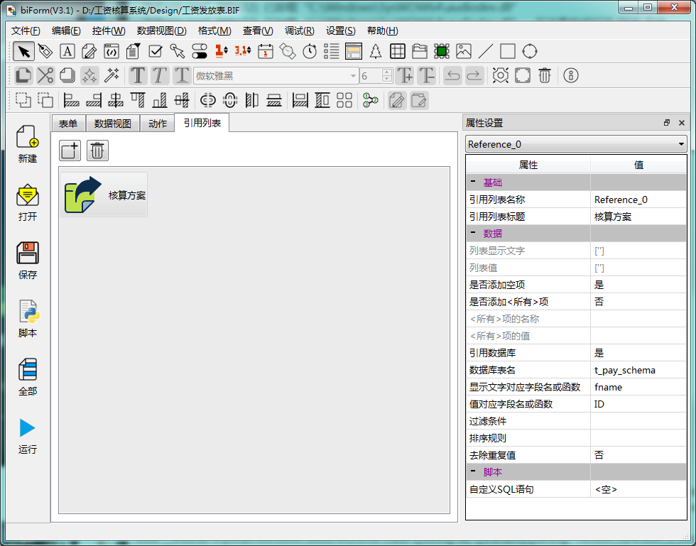
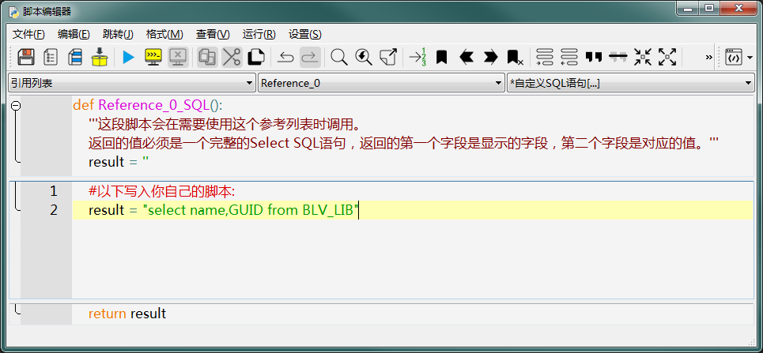

# 第三章 表单设计 - 引用列表

引用列表用来维护一组“文件-值”的数据对，以便可以在下拉列表框中使用。

下图是一个引用列表的设计界面示例：



引用列表用于设置下拉列表框中显示的文本和值。下拉列表框是可以直接设置文本和值的，但如果有多个下拉列表框使用相同的设置，用引用列表就可以为多个下拉列表框设置同样的内容，并且只需要在一处进行维护。另外引用列表也可以通过脚本或通过设置SQL语句动态生成内容，比设置固定的内容更灵活。

---

<h2 id=category>目录</h2>

- [如何使用引用列表](#如何使用引用列表)
- [属性](#属性)
- [可编程函数](#可编程函数)

---

## 如何使用引用列表

[返回目录](#category)

在表单的 Python 脚本中并不能直接使用引用列表对象，只在 this.form 和下接列表框控件的接口中可以通过将引用列表的名称做为参数调用这些接口。

比如：

``` Python

>>> this.cbSchema.reference
'Reference_0'

>>> this.cbSchema.reference="Reference_0"
>>> this.form.getReferenceCount('Reference_0')
1

>>> this.form.getReferenceText('Reference_0',0)
'（所有）'

```

## 属性

[返回目录](#category)

这些属性是设计阶段的属性，在 Python 脚本中因为并没有引用列表对象可以访问，所以也不能在脚本中读取或修改这些属性。

|          属性           |                                                  说明                                                   |
| ---------------------- | ------------------------------------------------------------------------------------------------------- |
| 引有列表名称            | 名称，API中都使用这个名称代表这个引用列表                                                                  |
| 引用列表标题            | 显示的文字，只是方便在下拉列表框的属性设置里显示                                                           |
| 列表显示文字            | 双击“引用列表”，可以修改显示的文字和值的内容，修改后的文字清单会显示在这里                                   |
| 列表值                  | 双击“引用列表”，可以修改显示的文字和值的内容，修改后的值清单会显示在这里                                     |
| 是否添加空项            | 是否在列表的第一项添加一个空项，即显示的文字为空字符串，值也为空字符串                                       |
| 是否添加<所有>项        | 是否在列表最上方添加“<所有>”项，如果同时也要添加空项，“<所有>”项会被添加为第二项                             |
| <所有>项的名称          | 自定义“<所有>”项的文字                                                                                   |
| <所有>项的值            | 自定义“<所有>”项的值  ，缺省的值为“<all>”                                                                 |
| 引用数据库              | 是否从数据库的某个表中获取文字和值的列表                                                                   |
| 数据库表名              | 需要查询的数据库表名，从数据视图中定义了的表中选择                                                         |
| 显示文字对应字段名或函数 | 选择显示文字对应的字段，也可以使用函数，比如 “substr(fname,1,2)”                                           |
| 值对应字段名或函数       | 选择项目的值对应的字段，也可以使用函数                                                                     |
| 过滤条件                | 设置 select 语句中的 where 子句的内容，不用带上 where 关键字。比如“ftype='A'”                              |
| 排序规则                | 设置 select 语句查询结果的排序方式，不用带上 order by 关键字，可以对多个字段进行排序。比如“ftype desc,fname” |
| 去除重复值              | 是否去掉重复值                                                                                           |

如果将“引用数据库”设为“是”，PFF运行时引擎会按下面几个属性的设置生成一个SQL查询语句，比如按以下设置：

|          属性           |        值         |
| ---------------------- | ---------------- |
| 数据库表名              | t_emp            |
| 显示文字对应字段名或函数 | fname            |
| 值对应字段名或函数       | fidcard          |
| 过滤条件                | ftype='A'        |
| 排序规则                | ftype desc,fname |
| 去除重复值              | 否               |

生成的SQL语句会是：

``` SQL 
select fname,fidcard
from rt_t_emp_0_s //使用t_emp的实体表名，并不是固定为这个内容
where ftype='A'
order by ftype desc,fname
```

如果“去除重复值”设为“是”，则生成的SQL语句会是：

``` SQL 
select distinct fname,fidcard
from rt_t_emp_0_s //使用t_emp的实体表名，并不是固定为这个内容
where ftype='A'
order by ftype desc,fname
```

## 可编程函数

[返回目录](#category)

引用列表有一个“自定义SQL语句”的可编程函数。

比如以下示例：



其中的脚本运行后返回的值必须是一个完整的Select SQL语句，返回的第一个字段是显示的字段，第二个字段是对应的值。

使用这个脚本的话，就不会再使用固定的列表设置，也不会再使用“引用数据库”这些属性的设置。但属性“是否添加空项”和“是否添加<所有>项”还是会有效的。
