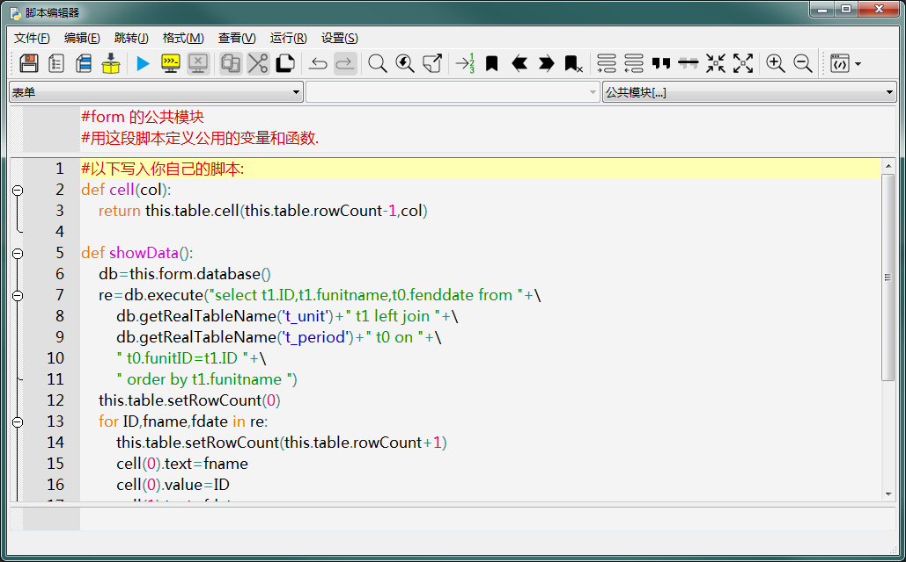
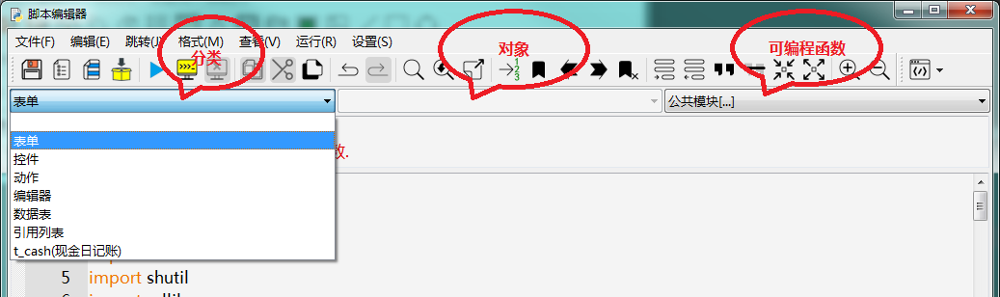
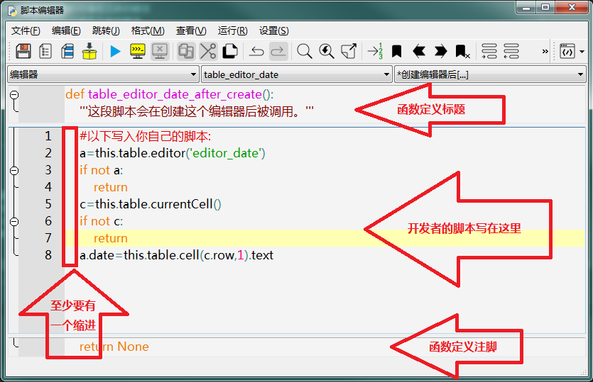
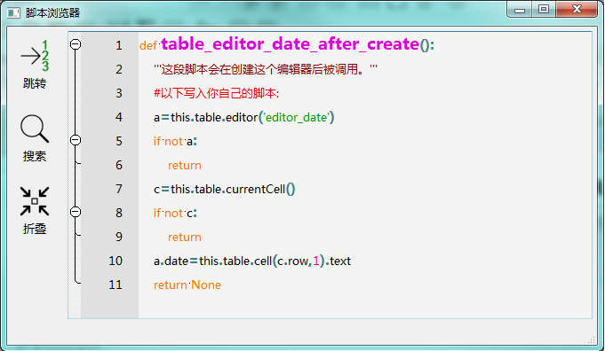
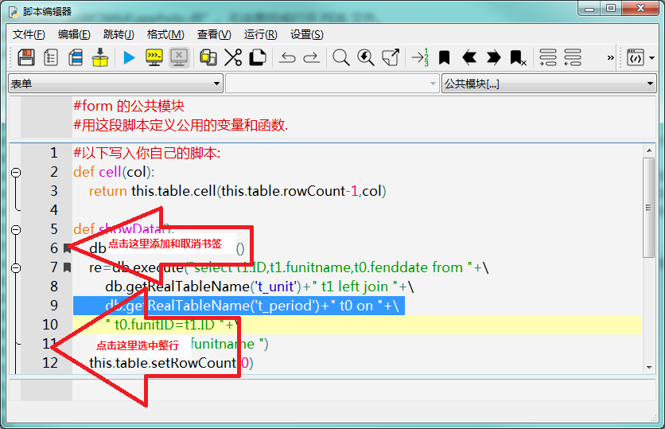
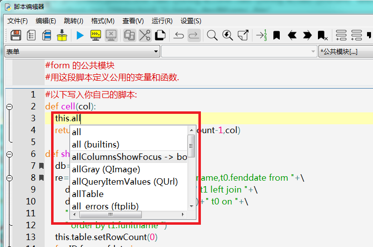
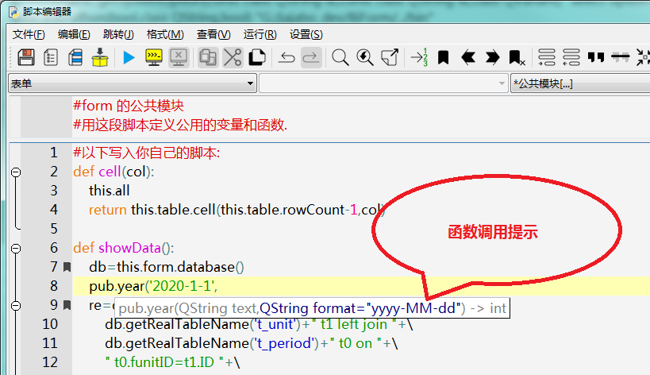
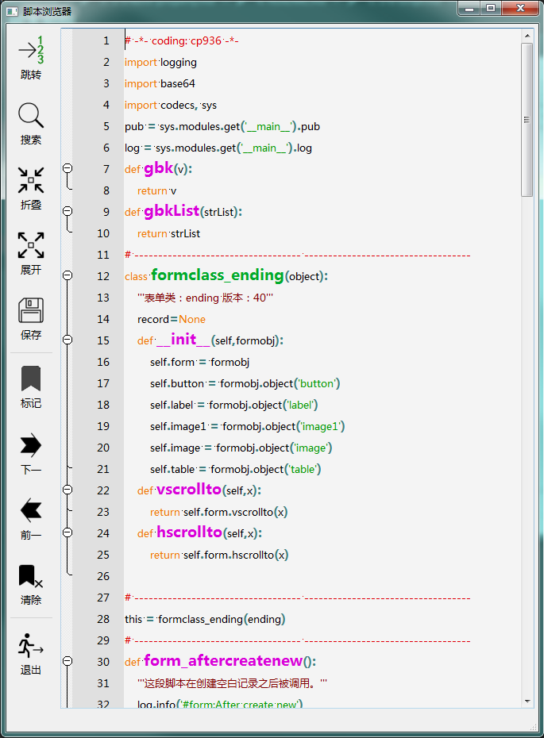

# 第三章 表单设计 - 脚本编辑

biForm 中编辑 Python 脚本，有一个单独的窗口“脚本编辑器”，如下图所示：

开发者在这里可以修改当前表单所有脚本。脚本以其所属的对象进行了分组和分类，开发者在脚本编辑器中选择分类、对象、和可编程函数，就可以找到对应的代码。

---

<h2 id=category>目录</h2>

- [脚本编辑器](#脚本编辑器)
- [查看所有脚本](#查看所有脚本)

---

## 脚本编辑器

biForm 的脚本编辑器中对表单上各个对象的可编程对象做了分类，如下图：

工具栏下有三个下拉列表框，第一个是“分类”，包括以下几种：

|    分类     |                                                            说明                                                            |
| ----------- | -------------------------------------------------------------------------------------------------------------------------- |
| 表单        | 这个分类用于编辑表单对象本身的可编程函数的脚本                                                                                |
| 控件        | 这个分类用于编辑表单上所有控件的可编程函数的脚本                                                                              |
| 动作        | 这个分类用于编辑自定义的动作的可编程函数的脚本                                                                                |
| 编辑器       | 这个分类用于编辑表格控件的编辑器控件的可编程函数的脚本                                                                         |
| 数据表       | 这个分类用于编辑各个“非基础表”的“添加记录的个数”脚本，只有设置为“由脚本设定添加记录的个数”的非基础表，才会用到这个分类             |
| 引用列表     | 这个分类用于编辑“引用列表”的可编程函数                                                                                       |
| 各个非基础表 | 如上图中的“t_cash(现金日记账)”。这种分类只有在表单的数据视图中有“非基础表”时，才会列出来，用于编加这些数据表每个字段的“绑写值”脚本 |

选择分类之后，“对象”这个下拉列表框会按“分类”显示不同的内容：

|    分类     |                     对象                      |                  说明                  |
| ----------- | --------------------------------------------- | ------------------------------------- |
| 表单        | 空                                            | 表单只有一个对象，所以“对象”中列表是空的 |
| 控件        | 表单上每个控件                                 | 一个控件一个条目，不包括表格控件的编辑器 |
| 动作        | 每个自定义动作                                 | 一个动作一个条目                       |
| 编辑器       | 除了“只读”编辑器，每个表格控件的编辑器都会列出来 | 编辑器名称为“表格控件名_编辑器”名       |
| 数据表       | 需要以脚本设定添加记录的个数的那些非基础表       | 一个数据表一个条目                      |
| 引用列表     | 表单上每个自定义的引用列表                      | 一个引用列表一个条目                    |
| 各个非基础表 | 选择的数据表的每个字段                         | 一个字段一个条目                       |

选择了“分类”和“对象”之后，第三个下拉列表框就会显示所选对象的所有可编程函数。选择其中一个，脚本编辑器中会显示这个函数定义的标题和注脚，其实就是这个函数的模板，开发者只需要写函数内部的脚本就可以了。需要注意的是，因为这些都是在函数体内的，所以开发者写的脚本至少都会有一个缩进，在 biForm 中统一使用 tab 进行缩进，不建议使用空格进行缩进，如下图所示：

可以使用菜单“文件”-“查看完整的函数脚本”，会显示这个函数的完整脚本，可更利于理解可编程函数的结构。如下图：

脚本编辑器中左侧有行号，点击时可以选中整行。行号右边是书签栏，点击可以为某行添加书签或取消书签，如下图所示：

脚本编辑器有自动完成功能。在输入一些字符时，会按输入的内容弹出列表进行提示，按下“tab”键可自动按列表中的第一项自动完成输入，也可以按上下方向键选择想要使用的文本后按回车键完成辅助输入，如下图所示：

一些函数接口，也会弹出调用提示，如下图所示：

其它辅助功能可通过菜单调用，本文就不一一详细介绍了。

## 查看所有脚本

在 biForm 的主窗口或脚本编辑器窗口，使用菜单“查看当前表单的所有脚本”，可以在一个窗口中看到当前表单的所有脚本代码，如下图所示：

1. 这个窗口中的脚本可以导出为 .py 文件，但它并不是可以直接用来执行的，PFF运行时引擎也不支持直接执行这种 .py 文件。可以将这类文件用于申请软件著作权等场合。
2. 这个窗口中的脚本只供查看，不允许修改。
3. 在调试时如果有 Python 报错信息提示出错的行号，也可以通过这个窗口提供的“跳转到行”的功能定位出错的语句，方便进行调试。
4. 这个窗口打开后，如果在“脚本编辑器”中修改了代码，这里显示的代码不会自动更新，需要重新再打开才会显示最新的内容。
