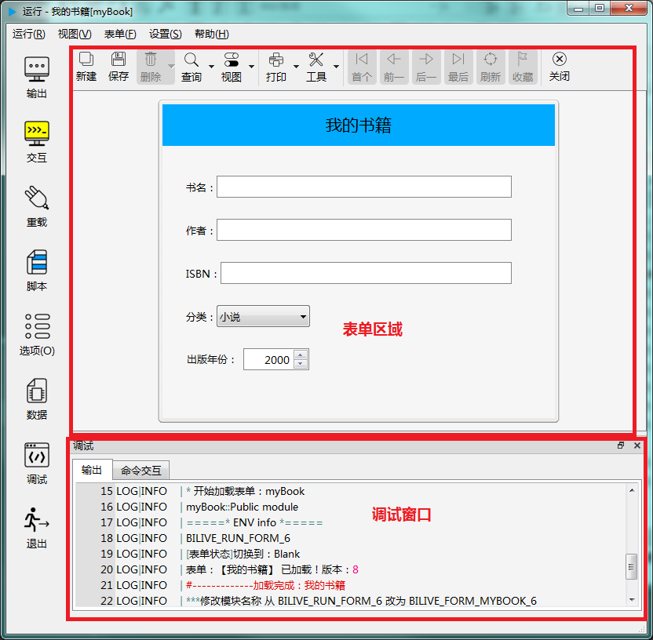
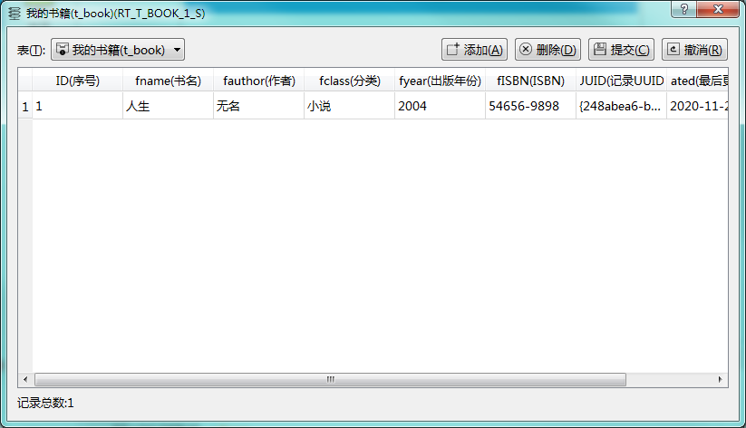
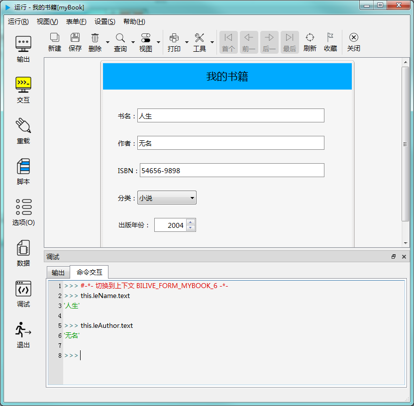
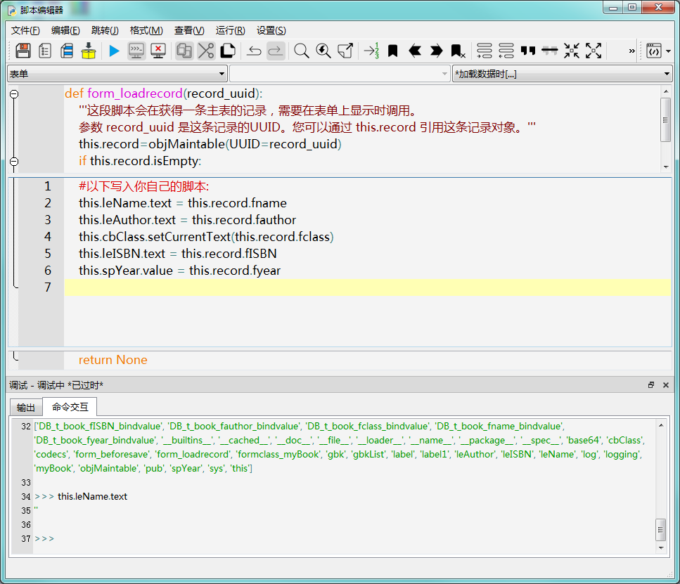
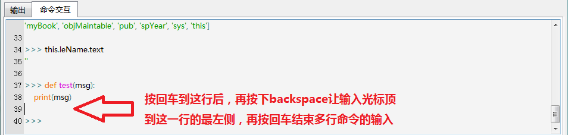

# 第四章 测试和调试 - 试运行和调试

biForm 中开发的表单，可以先在 biForm 中试运行一下，这样可以解决大部分语法错误，并且可以使用 Python 命令交互的方式进行程序运行的跟踪调试。

---

<h2 id=category>目录</h2>

- 试运行窗口
- Python命令交互调试
- 正式的测试和调试

---

## 试运行窗口

[返回目录](#category)

在主窗口按下 F5 或调用菜单“调试-运行”，就可以开始试运行。试运行窗口如下图示例：



其中“表单区域”与PFF运行时环境（如 biReader）中是一样的，但也不一定完全一模一样，具体显示的外观样式，不同的PFF运行时环境可能会有所区别，但一般只会是外观上的差别，不会有影响操作和程序运行的差异。

“表单区域”下方的“调试窗口”包括“命令交互窗口”和“输出”两个分页。“命令交互窗口”可输入  Python 命令进行程序调试，“输出”则显示系统日志和 Python 命令结果的输出内容。

左侧工具栏上“数据”按钮，或使用菜单“表单”-“查看所有数据”，可以弹出以下窗口：



对于设置了数据视图的表单，这个窗口会显示所有数据表的记录，供测试和调试使用。在试运行状态下，有些相关的表没有数据，程序运行可能出不来结果，可以在这里手工添加记录，添加完点“提交”就可以生效。

在结束试运行之后，这些临时录入的数据都会被删除掉。

如果希望在每次试运行时，数据库里已经有一些数据可供测试，可以在表单的“加载后”等合适的地方写脚本往数据表里添加一些测试数据，甚至也可以从外部导入测试数据。一般需要事先使用 ```this.form.isDebug()``` 判断一下当前是否是在试运行状态，这样这些脚本就只在 biForm 中试运行时才会被执行，不会影响真实的业务数据。

在开始运行表单时，如果脚本有错，如果 Python 的错误信息中包含出错的代码所在的行，脚本编辑器会自动定位到出错的代码所在行。如果在试运行过程中，发生错误，有出错信息时则不会再自动定位，这时可以使用主窗口的“查看所有脚本”按错误提示使用跳转到指定行，来查看报错的代码。

## Python命令交互调试

[返回目录](#category)

biForm 中有两处可以进行 Python 命令交互。一处是上一节所说的试运行窗口，如下图所示：



一处是在脚本编辑器中，调用菜单“运行”-“调试”，或按下F6也可以打开调试窗口，如下图所示：



注意第二处命令交互调试时，是看不到表单界面，也无法使用数据窗口修改和添加数据的，功能相对少一点。适合在写代码的过程中试验一些 Python 语句，或查看各对象的接口。正式的调试，使用试运行窗口的命令交互会更方便。

在 Python 命令交互窗口可以输入任何 Python 命令。如果是单行命令，输入完命令后按下回车就立即执行。如果是多行命令，比如下面的例子：



输入多行命令时，交互窗口会自动缩进，在需要结束多行命令时，需要按下 backspace 删除这一行前的 tab 符，让输入光标顶到这一行的最左端，即保证这是一个完全的空行，再按下回车键就可以结束这一组多行命令的输入。

在输入命令的提示符“>>>”之后，按上下方向键，可以调出之前执行过的命令，调用后可以直接按回车键执行，或者修改后再执行。

也可以使用菜单“查看命令历史”调出所有目前执行过的命令的历史记录。

在命令交互窗口也是有自动补全、调用提示和语法着色的功能的。按住 CTRL 键， 滚动鼠标中间的滚轮，还可以缩放字体大小 。

## 正式的测试和调试

[返回目录](#category)

以上是在 biForm 中的试运行，程序中的语法错误等一般在这个阶段都可以被解决。但有些程序运行依赖于特定的环境，或需要更复杂的基础数据，在 biForm 中就没有相应的环境好进行测试和调试。所以，正式的测试和调试一般都直接使用 PFF 的运行时环境（如 biReader ）来进行。

使用 biReader 测试，只需要打开打包好的PFF文件就可以。PFF文件打包时，会自动将版本号加一，所以每次打包，都会生成新的版本号。重新用 biReader 打开同一个PFF文件，就能升级到新版本。

需要注意的是，PFF 的运行时引擎判断两个PFF文件是否是同一个表单，一是用文件来判断的，而是用表单属性“UUID”来判断的。所以打包时重新指定文件名，并不能创建一个新的表单。如果需要从现有的表单复制出一个UUID不同的新表单，需要使用“另存为”的功能，并指定“创建新的UUID”。
