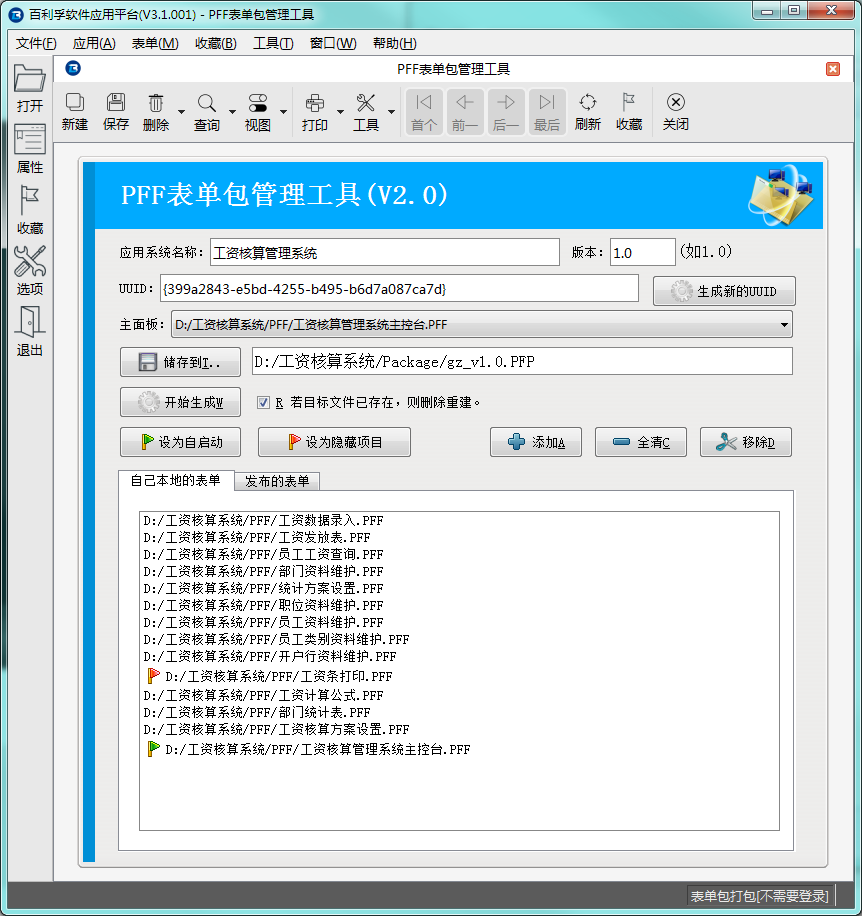

# 第五章 发布 - 表单包发布和升级

PFF是单个表单打包生成的文件。我们如果将很多个PFF文件给最终用户，肯定不太方便。所以有时需要将多个PFF文件打包成一个PFP文件后再发布。

PFP文件是多个PFF压缩成的，本质上也是一个压缩文件。但文件内需要有关于包的一些设置，因此需要使用我们提供的专用的打包工具。

---

<h2 id="category">目录</h2>

- [打包工具](#打包工具)
- [表单包的升级](#表单包的升级)

---

## 打包工具

[返回目录](#category)

PFP的打包工具也是一个PFF文件，在 biReader 中打开就可以使用。可以访问我们官网下载“PFF表单包管理工具”。

运行时界面如下图所示：

这个PFF不只是用于单个应用程序的打包，也是一个PFP包的管理器。应用程序的设置可以保存下来，供下次使用，并且可以管理多个应用程序包的打包信息。

表单包中有以下几项信息需要注意进行设置：

1. 应用系统名称请使用方便用户了解的可读性较好的写法，因为这个名称会显示在PFF运行时引擎的菜单上
2. 版本号统一格式为类似“1.0”这样的格式
3. UUID可以使用右边的“生成新的UUID”按钮自动生成。如果是对已有的表单包进行升级，需要注意UUID需要与原来的表单包使用的UUID一致，否则在PFF运行时引擎中会被认为是两个不同的应用程序
4. 使用“添加”按钮，将这个表单包需要包含的PFF文件都添加进来
5. 一般复杂一点的应用程序，会有一介“主面板”用于统一调用各个模块的功能。使用 biForm 开发应用程序，主面板也会是一个PFF文件，在“主面板”下拉列表中选择一个PFF就可以了。这个“主面板”会由PFF运行时引擎进行特别的处理，比如在菜单中显示在最顶端
6. 我们可以设置某个表单随PFF运行时引擎自动启动，在PFF列表中选择需要自启动的那一项，点击“设为自启动”就可以了
7. 有些表单并不需要用户看到表单界面，比如用于格式化打印界面设计的表单，如例中的“工资条打印”，这一个PFF可以将之设置为“隐藏项目”，这样它可以被调用，但不会出现在PFF运行时引擎的菜单中　
8. “发布的表单”是为分布式PFF运行时引擎准备的，目前发布的V3.1暂时还不支持这项，可以暂不使用
9. “储存到”指定生成的PFP文件的路径和文件名

设置好以上信息后，点击“开始生成”就会生成指定的PFP文件。

点击“保存”。以后再使用这个表单，就可以使用“查询”按钮，查询出这条记录，就不需要再重新输入各项信息了。如果需要创建新版本，可以新添加一条记录，也可以直接修改这条记录。

## 表单包的升级

[返回目录](#category)

PFP也有版本管理。

每次打开新的PFP文件，PFF运行时引擎会判断版本号是否比现有的版本更新，来决定是否要升级。

需要注意的是：
1. 如果新的表单包中有新添加的PFF文件，会在系统中增加新的表单
2. 如果新的表单包中删除掉了以前的表单包中的某个PFF，只会在主菜单的应用程序模块中去掉相应的菜单，并不会真正这个表单及它管理的数据
3. 如果在新的表单包中重新选择了“自启动表单”，会覆盖原来的“自启动表单”的设置
4. 如果两个PFP都使用了同一个PFF，只会以其中最新的版本覆盖旧的同一个表单，而不是在应用程序中注册一个PFF的两个版本。但这一点依赖于PFF运行时引擎的处理，目前的 biReader 是基于这样的处理逻辑，但也许会有定制的版本使用其它的处理逻辑
