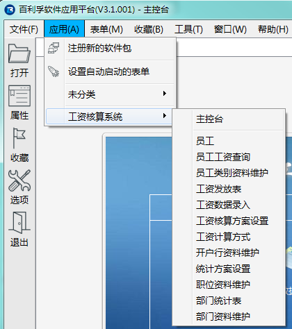

# 第五章 发布 - 应用包发布和升级

PFF是单个表单打包生成的文件。我们如果将很多个PFF文件给最终用户，肯定不太方便。所以有时需要将多个PFF文件打包成一个PFP文件后再发布。

PFP文件是多个PFF压缩成的，本质上也是一个压缩文件。但文件内需要有关于这个应用包的一些设置，因此需要使用我们提供的专用的打包工具。

---

<h2 id="category">目录</h2>

- [打包工具](#打包工具)

- [应用包的使用](#应用包的使用)

- [应用包的升级](#应用包的升级)

- [可扩展性](#可扩展性)

---

## 打包工具

[返回目录](#category)

PFP的打包工具也是一个PFF程序，在 biReader 或智应软件中心中使用。

具体操作步骤和下载链接，参考文档：[PFP打包工具](https://docs.bilive.com/#/pfp/tools)。

## 应用包的使用

[返回目录](#category)

应用包PFP文件发布给最终用户之后，用户在PFF运行时环境中打开这个文件就可以批量注册其中的PFF文件，但不同的PFF运行时环境也许有不同的操作步骤和外在表现。

以下以 biReader 为例，其它的PFF运行时环境参考各自的文档。

在 biReader 主菜单中选择“应用”-“注册新的软件包”，就可以完成应用包的注册。注册完之后，再使用菜单“应用”，就可以看到“工资核算系统”的菜单项，下级子菜单会列出其中包括的那些PFF的名称，如下图。

最终用户可以通过这些菜单调用相应的功能，也可以使用“主控台”提供的导航菜单来调用。

## 应用包的升级

[返回目录](#category)

PFP也有版本管理。

每次打开新的PFP文件，PFF运行时引擎会判断版本号是否比现有的版本更新，来决定是否要升级。

需要注意的是：

1. 如果新的应用包中有新添加的PFF文件，会在系统中增加新的PFF程序

2. 如果新的应用包中删除掉了以前的应用包中的某个PFF程序，只会在主菜单的应用程序模块中去掉相应的菜单，并不会真正删除这个表单及它管理的数据

3. 如果在新的应用包中重新选择了“自启动表单”，会覆盖原来的“自启动表单”的设置

4. 如果两个PFP都使用了同一个PFF，只会以其中最新的版本覆盖旧的同一个程序，而不是在应用程序中注册一个PFF的两个版本。但这一点依赖于PFF运行时引擎的处理，目前的 biReader 是基于这样的处理逻辑，但也许会有定制的版本使用其它的处理逻辑

## 扩展性

[返回目录](#category)

PFP应用包对PFF程序的管理是松散的、可扩展性很强的。体现在以下几个方面：

1）即使去掉注册的应用包的信息，PFF程序在运行时环境中也还是可以继续使用的；

2）用户随时都可以使用其它PFF程序来扩展与此应用包相关的功能。比如以“出纳管理系统”为例，用户可以在应用包之外，另外再注册一个“资金日报.PFF”的程序，读取“出纳管理系统”中的数据来生成报表。只是“资金日报.PFF”不会出现在“出纳管理系统”这个应用包相关的菜单中，但并不影响它的使用。这样任何开发者都能很方便地对原来的系统进行扩展和二次开发；

3）要扩展和升级PFP应用包的已有功能，可以在应用包信息中添加或修改PFF清单后，重新打包。也可以单独发布其中某个PFF程序的新版本文件给用户，而不必每次都要完整地打包发布完整的PFP应用包；

4）PFP应用包可以很方便地为不同用户提供个性化的发行版。在很多情况下，不同的用户对同一个系统有不同的需求，比如需要定制个性化的主控台、个性化报表、套打等。基于biLive独特的应用框架，开发者可以为不同用户开发满足他们个性化需求的PFF程序，与满足共性需求的PFF一起，方便地组合出不同的应用包分别发布给不同的用户。这样既能满足不同用户对系统的个性化需求，也能充分复用通用的功能。
