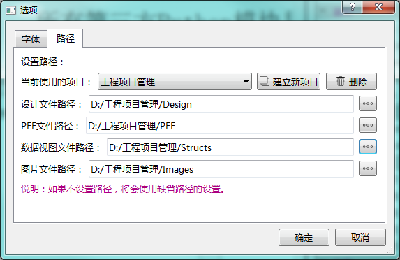

# 第五章 发布 - 项目管理和团队协作

因为 biForm 开发的特性，对于项目管理和团队协作，与其它开发工具也有些不尽相同的地方。本文只是一些建议，开发者可以根据自己的经验和开发习惯，选择自己觉得最合适的管理方案。

---

<h2 id="category">目录</h2>

- [项目管理](#项目管理)
- [源码管理](#源码管理)
- [团队协作](#团队协作)

---

## 项目管理

[返回目录](#category)

在 biForm 中开发是针对每个表单的，并没有提供常见的“项目资源管理器”、“文件浏览器”这类工具。

实际开发中，肯定有些项目是需要由多个表单组合而成的，所以肯定需要对整个项目进行管理。

我们一般建议开发者在硬盘上，为每个项目建立一个工作目录，并在其下设置多个子目录，分别对应项目所需要的各类文件。

我们在“选项”中提供了“项目路径”的设置项。如下图：

开发者可以在这里对多个项目进行管理，可以为每个项目设置各类文件对应的路径。在 biForm 打开BIF文件、打包生成PFF文件、添加图片、导入导出数据视图时，会使用这些设置做为缺省路径。开发者需要开发另外一个项目的时候，在这里选择或添加其它项目，就可以了。当然这个功能不用也不影响开发。

我们一般建议，在工作目录下设置以下几种子目录，但目录名没有强制规定，可以按自己的喜好来设置：

|  目录   |     存放的文件类型      |
| ------- | ---------------------- |
| design  | 设计阶段的BIF源码文件    |
| PFF     | 打包生成的PFF文件       |
| structs | 导出的数据视图文件       |
| image   | 表单上需要用到的图片文件 |
| doc     | 开发需要的一些文档资料   |
| package | 打包生成的PFP文件       |

## 源码管理

[返回目录](#category)

使用 biForm 开发，需要管理的源码主要是 BIF 文件和需要用到的图片文件，以及PFP表单包文件。

PFF文件因为是由BIF打包生成的，所以不纳入源码管理也问题不大，虽然一般我们建议也将之纳入源程序管理。

同理，导出的数据视图文件，也是可以从BIF文件中重新导出的，但纳入源程序管理会更方便。

生成的PFP文件，需要纳入源程序管理，因为其中会有应用程序的设置信息，丢失后重新找回也不方便。所以建议这部分也纳入源码管理。

开发者可以自己选择合适的源码管理的工具。biForm V3.1 暂时还没有与SVN、Git等进行集成的功能，但以后的升级版本可能会提供。

## 团队协作

[返回目录](#category)

基于 biForm 开发应用程序有一个很重要的特性是，很利于团队协作进行开发。甚至是并不在一个团队里工作的开发人员，在沟通极少的情况下，也可以进行协作开发，而并不会影响开发效率和质量。

这种协作方式不同与我们常见的团队协作方式，比如团队一起使用统一的开发环境、使用共同的协作工具、充分沟通、协调进度等等。

使用 biForm 的团队协作是以应用的功能点为单位的。也即，不同的开发者，各自负责自己的功能点。因为 PFF 应用框架的高内聚低耦合的特性，他们集中于自己的功能点（表单）的内聚特性，以表单为单位发布应用就可以了。而表单的组合是在PFF的运行时环境中完成的。因此，团队之间需要内部协调统一的过程都变得简化。这里的团队的队员之间甚至可以互相不认识，互不交流。

比如我们之前举的一个“工资核算管理系统”的例子。如果有一个开发团队之外的第三方开发者，想要开发与之相关的功能。只需要在他的表单中导入工资核算相关的数据表的数据视图，能理解这些表中的数据的规则，在不与原开发团队进行交流的情况下，就可以进行开发。发布后生成的PFF，在最终用户处，自然能与原来的“工资核算管理系统”集成在一起，中间也并不需要与原团队协调统一测试或统一发布。当然，如果他开发的功能，需要原来的系统进行一些修改，那就肯定需要沟通一下了，这属于必要的沟通，并非是因流程或开发工具特性决定的。

团队成员开发的机器所用的操作系统、CPU架构、开发环境等等，在使用其它很多开发工具和开发方式时，都是必须要进行协调的事情。因为 biForm 跨平台的特性，PFF在最终用户处的发布与开发者使用什么开发环境几乎无关。biForm 和 biReader 都是向下兼容的，只需要最终用户处所用的版本是兼容的就可以了。除非开发者都需要使用某个特定的未在 biForm 中打包的 Python 第三方库或在程序中依赖于特定的外部环境，或者是针对特定的CPU和OS底层开发的应用，否则在开发阶段，这方面需要协调的事情也被减到几乎不需要。

PFF的跨数据库的特性，以及在运行时才创建数据表的特性，也使得进行数据库应用的开发和测试时，不需要有专门的人员去初始化一套数据库环境，也不需要花费很大精力去根据版本的变化维持数据库环境的协调和统一。

PFF是即插即用的，每个PFF都可以独立运行。这也意味着，同一团队不同人员开发的表单，可以各自进行测试和发布，而不必等同组的其它成员一起同步发布。减少了因为等待其它人的进度而浪费的时间，项目管理上更容易。面向最终用户时，可以在最短的时间内就能发布一个可以运行的原型，尽快获得用户反馈，加速迭代过程。这一点也很有利于团队成员分散办公，以及互不认识的开发者一起协作开发。

当然，在实际的项目开发中，比如有一些应用需要保持数据的一致性和完整性，或者表单之间必须要互相调用，也还是有很多场合是需要必要的团队沟通和协调的。但基于 biForm 和 PFF应用框架的开发模式，能在很大程度上减少和简化一些不必要的过程，对于快速开发、快速发布、协作开发，都有很大的好处。
